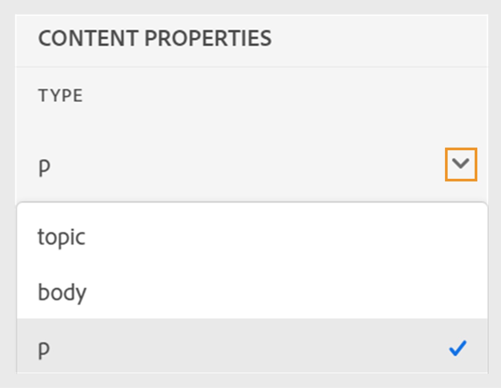

# Nieuwe functies in de release 2024.4.0

Dit artikel behandelt de nieuwe en verbeterde functies van de release 2024.4.0 van Adobe Experience Manager Guides.

Voor de lijst met problemen die in deze release zijn opgelost, raadpleegt u [Opgeloste problemen in de release 2024.4.0](fixed-issues-2024-04-0.md).

Meer informatie over [instructies voor de upgrade van 2024.4.0](upgrade-instructions-2024-04-0.md).

## Mogelijkheid om inhoud in meerdere talen te vertalen met behulp van vooraf geconfigureerde taalgroepen

Met de hulplijnen voor Experience Managers kunt u nu taalgroepen maken en uw inhoud eenvoudig in meerdere talen vertalen. Met deze functie kunt u vertalingen volgens de behoeften van uw organisatie ordenen en beheren.

Als u bijvoorbeeld uw inhoud voor bepaalde landen in Europa wilt vertalen, kunt u een taalgroep voor Europese talen maken, zoals Engels (EN), Frans (FR), Duits (DE), Spaans (ES) en Italiaans (IT).

{width="300" align="left"}

*Selecteer de taalgroepen of talen die u uw documenten wilt vertalen.*

>[!NOTE]
>
>Als de doelmap van een taal ontbreekt of als de doeltaal gelijk is aan de bron, wordt deze grijs weergegeven en wordt een waarschuwingsteken weergegeven.

Als beheerder kunt u taalgroepen maken en deze configureren naar meerdere mapprofielen. Als auteur kunt u de taalgroepen weergeven die zijn geconfigureerd in uw mapprofiel.

Het maken van taalgroepen verbetert over het algemeen de efficiëntie en productiviteit van vertaalprojecten en verbetert uiteindelijk het lokalisatieproces in meerdere talen.

Leer hoe u [documenten vertalen vanuit de webeditor](../user-guide/translate-documents-web-editor.md).

## Het vertaalproject na de vertaling automatisch verwijderen of uitschakelen

Nu, als beheerder, kunt u de vertaalprojecten vormen om na de voltooiing van de vertaling worden onbruikbaar gemaakt of automatisch worden geschrapt. Met deze functie kunt u efficiënt bronnen gebruiken en bestanden beheren nadat de vertaling is voltooid.

Als u een project verwijdert, worden alle bestanden en mappen in het project permanent verwijderd. Het schrappen van de vertaalprojecten laat u ook toe om de bezette schijfruimte vrij te maken.

U kunt de vertaalprojecten onbruikbaar maken als u hen later wilt gebruiken.

{width="550" align="left"}

*Vorm taalgroepen en de schoonmaakmontages voor vertaalprojecten.*

Meer informatie over hoe [het vertaalproject automatisch verwijderen of uitschakelen](../user-guide/translate-documents-web-editor.md#automatically-delete-or-disable-a-completed-translation-project).

## De uitvoer voor uw kaarten in bulkactiveringsverzameling activeren op Voorvertoning-instantie

Nu, naast het activeren van de output voor uw bulkactiveringsinzameling op het publicatiegeval, verstrekt de Gidsen van de Experience Manager als Cloud Servicen de eigenschap om het op te activeren **Voorvertoning** -instantie.

Met deze functie kunt u de inhoud activeren naar een voorvertoningsinstantie, zodat u kunt controleren hoe de inhoud eruitziet en werkt voordat u de inhoud activeert naar de **Publiceren** -instantie.

{width="800" align="left"}

*Bekijk de informatie over de geactiveerde kaartuitvoer in het dialoogvenster **Controlegeschiedenis**tab.*

Meer informatie over  [bulkactivering](../user-guide/conf-bulk-activation-publish-map-collection.md).

## Verbeteringen in de gegevensbronconnectors

De volgende verbeteringen zijn aangebracht in de gegevensbronconnectors voor de release 2024.4.0:

### Verbind met Salsify, Akeneo, en Microsoft Azure DevOps Boards (ADO) gegevensbronnen

Naast de bestaande out-of-the-box schakelaars, verstrekt de Gidsen van de Experience Manager ook schakelaars voor Salsify, Akeneo, en Microsoft Azure DevOps Boards (ADO) gegevensbronnen. Als beheerder kunt u deze connectors downloaden en installeren. Dan, vorm de geïnstalleerde schakelaars.

### Kopieer en plak de voorbeeldquery om een inhoudsfragment of onderwerp te maken

U kunt een vraag van steekproefgegevens in de generator gemakkelijk kopiëren en kleven om een inhoudsfragment of een onderwerp tot stand te brengen. Met deze eigenschap, moet u niet de syntaxis herinneren of een vraag manueel creëren. In plaats van de vraag manueel te typen, kunt u een steekproefvraag kopiëren en kleven, het uitgeven, en het gebruiken om de gegevens volgens uw vereisten te halen.

{width="800" align="left"}

*Kopieer en bewerk een voorbeeldquery om het inhoudsfragment te maken.*

### Verbinding maken met JSON-gegevensbestanden via een bestandsconnector

Nu, als beheerder, kunt u een JSON dossierschakelaar vormen om JSON- gegevensdossiers als gegevensbron te gebruiken. Gebruik de connector om de JSON-bestanden van uw computer of de Adobe Experience Manager Assets te importeren. Vervolgens kunt u als auteur met behulp van de generatoren inhoudsfragmenten of onderwerpen maken.

Met deze functie kunt u de gegevens die in uw JSON-bestanden zijn opgeslagen, gebruiken en opnieuw gebruiken in verschillende fragmenten. De inhoud wordt ook dynamisch bijgewerkt wanneer u de JSON-bestanden bijwerkt.

### Vorm veelvoudige middel URLs voor een schakelaar om inhoudsfragmenten of onderwerpen te creëren

Als beheerder, kunt u veelvoudige middel URLs voor sommige schakelaars zoals de Generische Cliënt van de REST, Salsify, Akeneo, en Microsoft Azure DevOps Boards (ADO) vormen.

Dan, als auteur, verbind met de gegevensbronnen om inhoudsfragmenten of onderwerpen tot stand te brengen gebruikend de generators. Deze functie is handig omdat u geen gegevensbron hoeft te maken voor elke URL. Het helpt u om gegevens van om het even welke middelen voor een bepaalde gegevensbron in één enkel inhoudsfragment of onderwerp snel te halen.

Meer details over de gegevensbronschakelaars en hoe te bekijken [vormt een gegevensbronschakelaar van het gebruikersinterface](../cs-install-guide/conf-data-source-connector-tools.md).

Leer hoe u [gegevens uit uw gegevensbron gebruiken](../user-guide/web-editor-content-snippet.md).

## Pas uw ervaring van de Redacteur van het Web met nieuwe UI van gebruikersvoorkeur aan

De **Gebruikersvoorkeuren** bevat nu een nieuw dialoogvenster in de webeditor **Weergave** tab. Dit nieuwe lusje staat u toe om de gemeenschappelijkste blik-en-voelen voorkeur in de interface van de Redacteur van het Web gemakkelijk te vormen.

U kunt configureren om de bestanden op titel of bestandsnaam weer te geven en het thema van de toepassing en de bronweergave te wijzigen. Het helpt u ook de montages vormen om van een open dossier in de bewaarplaatmening de plaats te bepalen en de vaste ruimten te behandelen.

{width="550" align="left"}

*Pas de weergave aan volgens uw voorkeuren.*

Meer informatie over de **Gebruikersvoorkeuren** functiebeschrijving in het dialoogvenster [Linkerdeelvenster](../user-guide/web-editor-features.md#id2051EA0M0HS) sectie.

## Een geopend bestand zoeken in de dataweergave van de webeditor

Selecteer de **Bestanden altijd zoeken in de opslagplaats** in de **Gebruikersvoorkeuren** om snel door het bestand te navigeren en het te zoeken in de weergave in de repository. Je hoeft er niet handmatig naar te zoeken.

Met deze functie kunt u tijdens het bewerken de locatie van het bestand gemakkelijk weergeven in de hiërarchie van opslagruimten.

Voor meer informatie, bekijkt u [een geopend bestand zoeken in de dataweergave](../user-guide/web-editor-edit-topics.md#locate-an-open-file-in-the-repository-view).

## Verbeterde verwerking van vaste spaties in de webeditor

Met de hulplijnen voor Experience Managers kunt u een vaste-spatie-indicator weergeven terwijl u documenten bewerkt in de webeditor. Het verbetert ook de behandeling van vaste ruimten.
Het zet veelvoudige opeenvolgende witte ruimten in één enkele ruimte om om de mening WYSIWYG van het document in de Redacteur van het Web te bewaren. Deze functie draagt ook bij tot een betere algemene vormgeving en professionaliteit van het document.

Voor meer informatie bekijkt u de [andere functies van de webeditor](../user-guide/web-editor-other-features.md).

## Nabewerking voor selectieve mappen op Adobe Experience Manager Assets uitschakelen

Als beheerder kunt u de nabewerking en het genereren van UUID&#39;s voor selectieve mappen op Experience Manager Assets nu uitschakelen. Deze configuratie kan handig zijn, vooral wanneer u werkt met veel elementen of complexe mapstructuren. Bovendien kunnen meerdere gebruikers de elementen snel tegelijk uploaden zonder elkaar te storen.  

Als naverwerking voor een map wordt uitgeschakeld, heeft dit ook invloed op alle onderliggende mappen. Met de hulplijnen voor Experience Managers kunt u nu echter selectief naverwerken inschakelen voor afzonderlijke onderliggende mappen in de genegeerde map.

Leer hoe u [naverwerking voor een map uitschakelen](../cs-install-guide/conf-folder-post-processing.md).

## Nieuwe ervaring voor het zoeken en filteren van bestanden in de dataweergave

Nu hebt u een verbeterde ervaring bij het filteren van bestanden. De vernieuwde functionaliteit voor het filteren van bestanden biedt een verbeterde manier om bestanden moeiteloos te doorzoeken en door te bladeren.

{width="300" align="left"}

*Zoeken naar de bestanden met de tekst`general purpose.`*

Geniet van voordelen zoals snellere toegang tot relevante bestanden en een intuïtievere gebruikersinterface, waardoor uw zoekervaring vloeiender en efficiënter wordt.

 {width="300" align="left"}

*Gebruik de snelle filters om naar DITA en niet-DITA dossiers te zoeken.*

Meer informatie over de **Filter Zoeken** in de [Linkerdeelvenster](../user-guide/web-editor-features.md#id2051EA0M0HS) sectie.

## Gesegregeerde lijst om geldige elementen weer te geven en in te voegen volgens hun positie

Terwijl het uitgeven van een document in de Redacteur van het Web, kunt u een gescheiden lijst van elementen nu bekijken die bij de huidige plaats en buiten de huidige plaats geldig zijn. Op basis van uw vereisten kiest u een element uit de volgende opties:

* **Geldige elementen op de huidige locatie** die u kunt invoegen op de huidige cursorlocatie zelf.
* **Geldige elementen buiten de huidige locatie** die u na om het even welke ouders voor het huidige element binnen de elementenhiërarchie kunt opnemen.

{width="300" align="left"}

*Bekijk de gescheiden lijsten met geldige elementen om een element in te voegen op de huidige locatie.*

Deze gesplitste lijst met geldige elementen helpt u de inhoudsstructuur te behouden en de DITA-standaarden te volgen.

Meer informatie over de **Element invoegen** in de [Secundaire werkbalk](../user-guide/web-editor-features.md#2051ea0j0y4) sectie.

## Inhoudseigenschappen Type wordt weergegeven als een vervolgkeuzemenu

De eigenschappen van de inhoud **Type** wordt weergegeven als een vervolgkeuzemenu. In het vervolgkeuzemenu kunt u de tags van de volledige hiërarchie voor de huidige tag weergeven en selecteren.

Met dit vervolgkeuzemenu hebt u snel toegang tot de relevante tags binnen de hiërarchische structuur.

{width="300" align="left"}

*Selecteer een tag in de hiërarchie voor de huidige tag.*

Meer informatie over de **Eigenschappen van inhoud** in de [Rechterdeelvenster](../user-guide/web-editor-features.md#id2051eb003yk) sectie.

## Verbeterde prestaties tijdens het bulksgewijs controleren van bestanden in de Kaarteditor

De Gidsen van de Experience Manager verbetert de prestaties en de ervaring van de bulkdossiers controlefunctie van de Redacteur van de Kaart. Deze verbetering helpt u de dossiers in bulk sneller controleren.
U kunt ook de voortgang van het inchecken van de bestanden bekijken via de **Opslaan als nieuwe versie en ontgrendelen** in. Tot slot verschijnt het succesbericht nadat de bewerking is voltooid en zijn alle geselecteerde uitgecheckte bestanden ingecheckt.

{width="300" align="left"}

*De lijst en status weergeven van de bestanden die in grote hoeveelheden zijn gecontroleerd in de Kaarteditor.*

Leer hoe u [werken met de Geavanceerde Kaarteditor](../user-guide/map-editor-advanced-map-editor.md)

## Download het tijdelijke bestand terwijl u de uitvoer genereert via DITA-OT

U kunt de tijdelijke bestanden ook downloaden die zijn gegenereerd wanneer u de uitvoer van de AEM Site, HTML, Aangepast, JSON of PDF publiceert via DITA-OT. Met deze functie kunt u eventuele problemen analyseren die zich tijdens het genereren van de uitvoer kunnen voordoen en effectief problemen oplossen.  
U kunt het bestand metadata.xml ook downloaden als u eigenschappen van metagegevens hebt geselecteerd die zijn doorgegeven aan de uitvoer die is gegenereerd met DITA-OT. 

Voor meer informatie over de voorinstellingen raadpleegt u [Uitvoervoorinstellingen](../user-guide/generate-output-understand-presets.md).

## IMS JWT-referenties vervangen door IMS OAuth-referenties voor op microservice gebaseerde publicaties

De JWT-gegevens (Service Account) zijn vervangen door de **OAuth Server-to-Server** referenties. Uw toepassingen die gebruikmaken van de JWT-referenties (Service Account) werken niet meer na 1 januari 2025. U moet vóór 1 januari 2025 naar de nieuwe referentie migreren om ervoor te zorgen dat uw toepassing blijft werken.

De service voor het publiceren van wolken voor hulplijnen voor Experience Managers wordt nu beveiligd door verificatie op basis van een handleiding van Adobe IMS. Leer hoe u [op microservice gebaseerde publicaties configureren met OAuth-verificatie](../knowledge-base/publishing/configure-microservices-imt-config.md).

