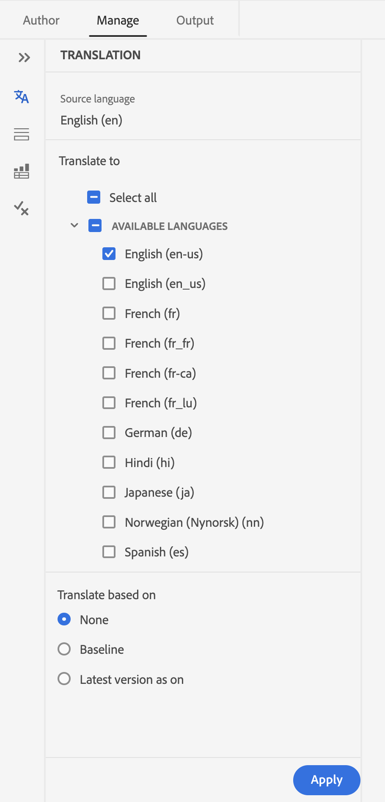

# Nieuwe functies in de release 2024.2.0

Dit artikel behandelt de nieuwe en verbeterde functies van de release 2024.2.0 van Adobe Experience Manager Guides.

Voor de lijst van kwesties die in deze versie worden bevestigd, mening [&#x200B; Vaste kwesties in de 2024.2.0 versie &#x200B;](fixed-issues-2024-2-0.md).

Leer over [&#x200B; verbeteringsinstructies voor de versie 2024.2.0 &#x200B;](upgrade-instructions-2024-2-0.md).

## Slimme suggesties voor AI om inhoudsverwijzingen toe te voegen tijdens het ontwerpen van inhoud

Nu, kunt u uw auteursreis met Slimme Suggesties, een nieuwe op AI-Gebaseerde eigenschap in de Redacteur van het Web verbeteren. Terwijl u uw inhoud ontwerpt, biedt deze intelligente functie real-time suggesties voor inhoudsverwijzingen, die uw werkschema verbeteren, nauwkeurigheid toevoegen en ongekende efficiency verzekeren.

Om de inhoud correct en consistent te houden, blijven de zoekopdracht en de suggesties beperkt tot de inhoud die eigendom is van uw organisatie en komen ze veel overeen met de trefwoorden die u zoekt.

 {width="800" align="left"}

*Mening Slimme Suggesties om passende inhoudverwijzingen van uw inhoudsbewaarplaats te vinden en toe te voegen.*

U kunt de huidige inhoud ook vergelijken met vergelijkbare inhoud in de andere onderwerpen. Dan, kunt u de stukken van inhoud uit diverse onderwerpen gemakkelijk selecteren en hen toevoegen als inhoudsverwijzingen in uw huidige onderwerp. Door de inhoudsverwijzingen toe te voegen, worden updates beter beheerbaar, vooral in grotere documentatieprojecten. U maakt bijvoorbeeld een brochure over de nieuwste functies van uw product. In dat geval kunt u de bijgewerkte specificaties snel toevoegen als inhoudsverwijzingen uit de verwante functiedocumenten.

Met deze intelligente functie vermindert u het handmatig doorzoeken van gerelateerde inhoud en helpt u zich te richten op het maken van nieuwe inhoud.  Het helpt ook consistentie te handhaven en bevordert betere teamsamenwerking.

Leer meer over [&#x200B; AI-Aangedreven Slimme suggesties aan auteursinhoud &#x200B;](../user-guide/authoring-ai-based-smart-suggestions.md).

## De omgezette eigenschap van de versiegeschiedenis in de Redacteur van het Web

Experience Manager Guides beschikt nu over een verbeterde functie voor versiehistorie waarmee u de wijzigingen die in een document zijn aangebracht, kunt vergelijken. In de nieuwe weergave Naast elkaar kunt u de inhoud en de metagegevens van de huidige versie eenvoudig vergelijken met een eerdere versie van hetzelfde document. U kunt ook de labels en opmerkingen voor de vergeleken versies weergeven. Als beheerder, kunt u de versiemetagegevens van het onderwerp en hun waarden controleren die in het **de dialoogvakje van de Geschiedenis van de Versie** worden getoond.

{width="800" align="left"}
*Voorproef de veranderingen in de verschillende versies van een onderwerp.*

Leer meer over de **eigenschapbeschrijving van de Geschiedenis van de Versie 0&rbrace; &lbrace;in de [&#x200B; Linkerpaneel &#x200B;](../user-guide/web-editor-features.md#id2051EA0M0HS) sectie.**

## Verbeterde gebruikerservaring in het deelvenster Vertaling

Het **paneel van de Vertaling** is verbeterd.  U kunt de **Beschikbare Talen** lijst bekijken en snel de scène selecteren waarin u uw project wilt vertalen. Met één enkele selectie, kunt u **selecteren allen** ook kiezen om uw project in alle beschikbare talen te vertalen.

{width="300" align="left"}

*selecteer de scènes waarin u uw project wilt vertalen. Kies het gebrek, de basislijn, of de recentste versie van dossiers voor vertaling.*

Leer meer over hoe te [&#x200B; inhoud &#x200B;](../user-guide/translation.md) vertalen.

## Verbeterde zoeklogica in het dialoogvenster Element invoegen

U kunt de elementen nu gemakkelijk vinden in het dialoogvenster Element invoegen.  U kunt een tekenreeks typen in het zoekvak en een lijst ophalen met alle geldige elementen die beginnen met de ingevoerde tekenreeks.

Als u bijvoorbeeld een alinea bewerkt en een element wilt invoegen, kunt u een teken &#39;t&#39; zoeken om het element op te halen
alle geldige elementen die met &quot;t&quot; beginnen.

{width="300" align="left"}

*Type een karakter om naar alle geldige elementen te zoeken die met het karakter beginnen.*

Voor meer details, bekijk de **eigenschapbeschrijving van het Element van het 0&rbrace; Tussenvoegsel &lbrace;in de [&#x200B; Linkerpaneel &#x200B;](../user-guide/web-editor-features.md#id2051EA0M0HS) sectie.**

## Mogelijkheid om de huidige lijst te splitsen en te beginnen met een nieuw lijstitem op hetzelfde niveau

Nu, kunt u uw lijst in de Redacteur van het Web gemakkelijk verdelen. Selecteer de **Gesplitste optie van de Lijst** van het contextmenu van een lijstitem om de huidige lijst te verdelen. Er wordt een nieuwe lijst gemaakt op hetzelfde niveau, te beginnen met het lijstitem dat u hebt geselecteerd voor de splitsing.

{width="300" align="left"}

*selecteer de optie om de huidige lijst te verdelen.*

Voor meer details, bekijk de **eigenschapbeschrijving van de Lijst van het 0&rbrace; Tussenvoegsel &lbrace;in de [&#x200B; Linkerpaneel &#x200B;](../user-guide/web-editor-features.md#id2051EA0M0HS) sectie.**

## Bestandseigenschappen openen in de bronmodus van het ontwerp

Nu, kunt u tot de eigenschap van het Dossier van het juiste paneel **toegang hebben** op alle vier wijzen of meningen: Lay-out, Auteur, Source, en Voorproef.  Hierdoor kunt u de eigenschappen van uw bestand bekijken, zelfs als u tussen de verschillende modi schakelt.

Voor meer details, bekijk de **eigenschapbeschrijving van de Eigenschappen van het 0&rbrace; Dossier {in de [&#x200B; Juiste 3} sectie van het Comité.**](../user-guide/web-editor-features.md#id2051EB003YK)

## Mogelijkheid om meerdere uitvoervoorinstellingen met dynamische basislijnen parallel te publiceren

Experience Manager biedt de functie om basislijnen te maken door de onderwerpen automatisch te kiezen op basis van het label dat op hen is toegepast. Nu kunt u ook naadloos meerdere uitvoervoorinstellingen publiceren met automatische basislijnen van dezelfde DITA-kaart. U hoeft niet slechts één voorinstelling tegelijk te publiceren, maar u kunt gemakkelijk meerdere uitvoervoorinstellingen tegelijk publiceren.

## Native PDF-verbeteringen

De volgende Native PDF-verbeteringen zijn uitgevoerd in de release 2024.2.0:

### Metagegevens van elementen doorgeven aan de uitvoer van de PDF

Experience Manager biedt nu de mogelijkheid om de metagegevenseigenschappen van de elementen door te geven van de DITA-kaart naar de PDF-uitvoer.
In de uitvoervoorinstelling Eigen PDF kunt u de metagegevens kiezen die u wilt doorgeven aan het publicatieproces van de PDF. U kunt zowel de aangepaste als de standaardeigenschappen selecteren.  De geselecteerde eigenschappen van metagegevens worden doorgegeven aan het PDF-bestand dat wordt gegenereerd met Native PDF.

Deze functie is handig omdat u de eigenschappen van elementen, zoals auteur, aanmaakdatum of documenttitel, consistent kunt houden. Hierdoor kunt u uw documenten gemakkelijker organiseren, doorzoeken en indelen.

Voor meer details, bekijk de **Geavanceerde** montages in de [&#x200B; output van de PDF van Publish &#x200B;](../web-editor/native-pdf-web-editor.md).

### Metagegevens gebruiken die zijn toegevoegd in het element `topicmeta` voor de uitvoer van de PDF

De functie Metagegevens in publicaties in Native PDF helpt bij inhoudsbeheer en helpt bij het zoeken naar bestanden op internet.

*selecteer een optie om meta-gegevensopties toe te voegen en aan te passen.*

Nu biedt Experience Manager Guides de optie om de metagegevens te gebruiken die u hebt toegevoegd in het element `topicmeta` van de DITA-kaart om de metagegevensvelden van de PDF-uitvoer te vullen. Deze optie is standaard ingeschakeld.

Met deze functie kunt u documenten beter beheren, zorgen voor consistentie en kunt u uw documenten doorzoeken.

Om meer te weten, bekijk het **Meta-gegevens** lusje in de [&#x200B; output van de PDF van Publish &#x200B;](../web-editor/native-pdf-web-editor.md).
