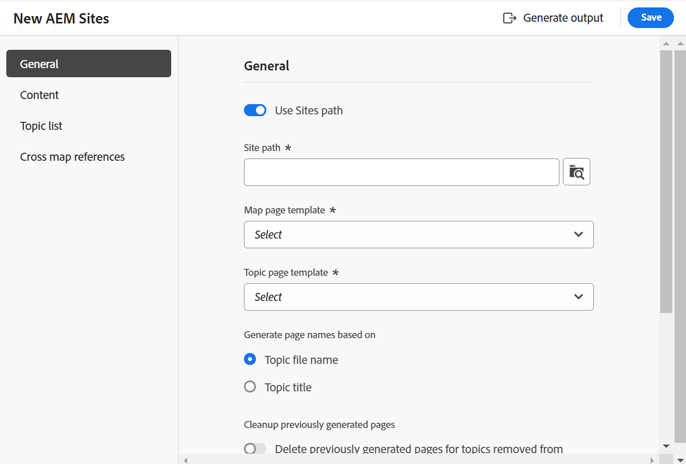

# Nieuwe functies in de release 2025.02.0 (februari 2025)

Dit artikel behandelt de nieuwe en verbeterde functies die zijn geïntroduceerd met de release 2025.02.0 van Adobe Experience Manager Guides as a Cloud Service.

## Nieuwe Experience Manager Guides-gebruikersinterface voor verbeterde productiviteit en ervaring

Adobe Experience Manager Guides beschikt nu over een vernieuwd ontwerp en verbeterde functies om u te helpen sneller en efficiënter dan ooit te werken. De nieuwe UI brengt een intuïtieve en verbeterde gebruikerservaring, met een volledig-nieuwe homepage, een schonere en meer georganiseerde redacteurstoolbar, specifieke kaartconsole, en verbeterde eigenschappen.

De belangrijkste hooglichten zijn:

- **Introducerend de pagina van het Huis**: Experience Manager Guides kenmerkt nu een Homepage die een intuïtieve welkome het schermervaring, met inbegrip van een snelle mening van de dossiers aanbiedt die u onlangs, inzamelingen, en meer betreedde.

  Voor meer details, mening [ ervaring van de homepage van Adobe Experience Manager Guides ](../user-guide/intro-home-page.md).

  {width="800" align="left"}

- **Nieuwe ervaring van de Redacteur**: Nu, ervaart de Redacteur in een nieuw blik en voelt. De vernieuwde interface voor editors is voorzien van een schonere en meer georganiseerde werkbalk, naadloze navigatie en een algemene intuïtieve ervaring waarmee u documenten sneller en efficiënter kunt ontwerpen.

  Krijg aan [ de eigenschappen van de Redacteur ](../user-guide/web-editor-features.md) kennen.

  {width="800" align="left"}

- **Speciale console van de Kaart**: Introducerend de console van de Kaart, een specifieke console waar alle kaartbeheer en het publiceren eigenschappen worden omvat. Nu krijgt u opties om uitvoer te genereren, inhoud te vertalen, rapporten te maken en meer - allemaal binnen één interface.

  Leer meer over [ kaartbeheer en het publiceren ](../user-guide/map-console-overview.md).

  {width="800" align="left"}

## Integratie met Adobe Workfront voor robuuste mogelijkheden voor werkbeheer

Experience Manager Guides is nu naadloos geïntegreerd met Adobe Workfront, waardoor u toegang hebt tot robuuste functies voor projectbeheer, bovenop de Experience Manager Guides core CCMS-mogelijkheden.

Met deze integratie kunt u rechtstreeks vanuit Experience Manager Guides Adobe Workfront-taken maken en beheren. Als auteur kunt u bijvoorbeeld rechtstreeks in de Experience Manager Guides-interface een revisietaak maken (met een of meer toegevoegde DITA-onderwerpen of -kaarten) en deze toewijzen aan een revisor. Als controleur kunt u werken aan toegewezen taken in de gebruikersinterface van Experience Manager Guides Review en deze terugsturen naar de auteur met opmerkingen. Op dezelfde manier kunt u een publicatie- en vertaaltaak maken en deze vervolgens toewijzen aan de gebruikers die eraan moeten werken.

De integratie voorziet u ook van de capaciteit om uw het werkrijen te controleren, die u ervoor zorgen georganiseerd en bovenop al uw taken (toegewezen taken) blijven. Ook kunnen projectmanagers de kracht van Adobe Workfront benutten voor diepgaand projectbeheer in Experience Manager Guides.

Voor meer details, verwijs naar [ integratie van Workfront ](../user-guide/workfront-integration.md).

{width="800" align="left"}

## AI Assistant (Beta) met intelligente ontwerpfuncties en Help-functies voor verbeterde productiviteit

Ervaar nu verbeterde productiviteit met intelligente authoring en Help-functies van AI in Experience Manager Guides. Met AI Assistant verbetert u de efficiëntie met intelligente ontwerpfuncties en slimme suggesties voor het hergebruik van inhoud uit de bestaande opslagplaats. Gebruik de slimme hulp om snel relevante antwoorden op uw vragen te vinden met betrekking tot de eigenschappen van Experience Manager Guides, zijn werkschema&#39;s, en meer.

Voor meer details, mening [ AI Medewerker in Experience Manager Guides ](../user-guide/ai-assistant.md).

{width="300" align="left"}

## Snellere en schaalbare nieuwe AEM Sites-publicatieengine

Ervaar sneller en schaalbaar publiceren naar AEM Sites met de geheel nieuwe publicatieengine, geoptimaliseerd met samengestelde componenttoewijzing voor sneller pagina&#39;s maken en renderen. Deze is beschikbaar met nieuwe, bewerkbare, out-of-the-box sjablonen die naar wens kunnen worden aangepast met de AEM Template Editor. De sjablonen gebruiken een combinatie van WCM-kerncomponenten en gespecialiseerde hulplijnen om ervoor te zorgen dat eindgebruikers de beste ervaring op uw AEM Sites-pagina&#39;s hebben. U kunt uw bestaande sjablonen ook aanpassen om de kracht van deze nieuwe publicatieengine te benutten.

Leer meer over [ het publiceren van AEM Sites ](../user-guide/generate-output-aem-site-web-editor.md).

{width="500" align="left"}

## Zelfstandige inhoud naadloos publiceren naar AEM Sites met publicatie van één onderwerp

Introducerend één onderwerp het publiceren aan de pagina&#39;s van AEM Sites die u toestaat om individuele onderwerpen aan de pagina&#39;s van AEM Sites direct te publiceren zonder het moeten een volledige kaart publiceren.  Hierdoor wordt het publicatieproces gestroomlijnd, waardoor het efficiënter wordt om met zelfstandige inhoud te werken, zoals marketinginhoud, technische bulletins of andere zelfstandige inhoud. Het vereenvoudigt ook inhoudsonderhoud door de behoefte te elimineren om kaarten voor het publiceren van enige onderwerpen tot stand te brengen.

Voor meer details, publiceer de mening [ pagina&#39;s van AEM Sites ](../user-guide/publish-aem-sites.md).

{width="500" align="left"}

## De geheel nieuwe redacteur van de Prijsverhoging voor rijke auteurservaring

Ervaar nu een schonere, efficiëntere, en krachtige manier aan de onderwerpen van de auteursprijsverlaging. Experience Manager Guides introduceert een nieuwe de redacteursinterface van de Prijsverlaging met een goed georganiseerde toolbar en geavanceerde eigenschappen, met inbegrip van a **zij aan zij** mening aan auteur en voorproef inhoud tezelfdertijd. Het laat ook naadloze publicatie van de onderwerpen van de Prijsverhoging toe die een deel van een kaart, aan veelvoudige kanalen zijn.

Voor meer details, verwijs naar [ Markdown authoring ](../user-guide/web-editor-markdown-topic.md).

{width="800" align="left"}

## Verbeteringen in de Editor

De volgende Editor-verbeteringen zijn doorgevoerd in de nieuwe versie:

**Verbeteringen aan de toevoeging van de Lijst**

- Mogelijkheid om de standaardwaarden te configureren voor koptekstrijen, tekstrijen en kolommen in de tabel of het dialoogvenster voor eenvoudig invoegen.
- Mogelijkheid om de tabelinstellingen te configureren voor het plakken van tabellen die uit externe bronnen zijn gekopieerd, als eenvoudig of als een tabel.

  Voor meer details, bekijk de sectie van Lijsten in [ ken de eigenschappen van de Redacteur ](../user-guide/web-editor-features.md#content-insertion-options).

**verbeterde de vriendschappelijke naameigenschap voor elementen DITA**

De vriendschappelijke naameigenschap voor elementen DITA is verbeterd. Nu, worden de gebrek opgesomde waarden behouden wanneer een vriendschappelijke naam aan een element wordt toegewezen, en de bijgewerkte naam wordt weerspiegeld in broodkruimels, de eigenschappen van de Inhoud, het Herbruikbare inhoudspaneel, het paneel van de Verklarende woordenlijst, en andere relevante plaatsen.

**Verbeterde ervaring voor gefilterde onderzoeken**

De weergavelimiet voor gefilterde zoekresultaten in de Adobe Experience Manager Guides Repository is verhoogd. De zoekresultaten retourneren nu alle relevante elementen of bestanden die voldoen aan de zoekcriteria. U kunt door de lijst scrollen om meer resultaten te laden, eliminerend de behoefte om herhaalde onderzoeken uit te voeren om van de vereiste activa de plaats te bepalen.

**Afwisselende tekst voor beelden nu toegevoegd als element**

Afbeeldingen gebruiken nu het element `<alt>` voor alternatieve tekst, volgens de meest recente DITA-standaarden. Het gebruik van het kenmerk `@alt` voor alternatieve tekst is afgekeurd, maar wordt wel ondersteund in eerdere DITA-versies.

**het Aanpassen van Kruisverwijzing in de redacteurstoolbar**

Nu, creeer een knoop van de douanetoolbar voor **Kruisverwijzing** om tot één van de menuopties direct toegang te hebben. U kunt deze optie bijvoorbeeld zodanig configureren dat direct naar een webkoppeling, e-mailkoppeling, bestandsverwijzing of een andere beschikbare optie wordt gegaan, afhankelijk van de vereiste.

Voor meer details, mening [ aanpassend de hoogste bar en de toolbar ](../guides-ui-extensions/customisations/toolbar-topbar.md).

## Verbeteringen voor revisie

De volgende Revisieverbeteringen zijn uitgevoerd in de release 2025.02.0:

- Nu, wanneer het creëren van een overzichtstaak, kunt u in een projectnaam typen om van het in de drop-down lijst van het Project snel de plaats te bepalen en te selecteren. Deze verbetering verwijdert de behoefte om door lange projectlijsten te scrollen, die het sneller en efficiënter maken om overzichtstaken toe te wijzen, vooral wanneer het leiden van veelvoudige projecten.

- In de Redacteur en het Overzicht UI, de doos van het overzicht **Antwoord** steunt nu multi-line ingangen. U kunt **Verschuiving** gebruiken + **gaat** binnen om naar de volgende lijn te gaan. U kunt het commentaarvakje ook uitbreiden terwijl het schrijven van de commentaar.

  Voor meer details, mening [ onderwerpen van het Overzicht ](../user-guide/review-topics.md).

- Auteurs hebben nu toegang tot de revisieopmerkingen in de Editor, zelfs als de revisietaak is gemarkeerd als afgesloten. Met de recentste verhogingen, kenmerkt het paneel van het Overzicht zowel actieve als gesloten overzichtstaken voor elk project in de Redacteur. Wanneer u een taak voor een gesloten revisie selecteert, worden de bijbehorende opmerkingen weergegeven in het venster Opmerkingen aan de rechterkant. Zo hebt u altijd toegang tot belangrijke revisieopmerkingen, zelfs nadat een taak is gesloten.

  Voor meer details, bekijk de sectie van het Overzicht van [ ken de eigenschappen van de Redacteur ](../user-guide/web-editor-features.md).

## Verbeteringen voor publiceren

De volgende publicatieverbeteringen zijn doorgevoerd in de nieuwe release:

**Verbeteringen aan Inheemse PDF**

- Mogelijkheid om de metagegevens van het element `prolog` van een onderwerp, zoals copyright, auteur en andere gegevens, op te nemen in de paginalay-outs wanneer native PDF-uitvoer wordt gegenereerd. Op deze manier weet u zeker dat de gegenereerde PDF&#39;s gedetailleerder zijn en een essentiële context bieden, waardoor ze informatiever zijn voor de lezer.

  Voor meer details, mening [ voegt gebieden en meta-gegevens in paginalay-out ](../native-pdf/design-page-layout.md#add-fields-and-metadata-add-fields-metadata) toe.

  {width="300" align="left"}

- Introduceerde een optie om de DITA-OT-voorbewerking in of uit te schakelen voor native PDF-uitvoer. Schakel deze optie in als de inhoud tijdens de verwerking op DITA-OT gebaseerde normalisatie of aangepaste DITA-OT-plug-ins vereist. Hierdoor hebt u meer controle over de manier waarop inhoud wordt verwerkt voor PDF-generatie. Door gebrek, wordt het plaatsen geplaatst aan **Toegelaten**.

  Voor meer details, mening [ Werkend met de output van PDF vooraf ingesteld ](../user-guide/generate-output-pdf.md)

  {width="500" align="left"}

- De montages van de Druk voor Inheemse de outputgeneratie van PDF zijn bewogen van **Malplaatjes** het plaatsen aan **Inheemse vooraf ingestelde Output van PDF** voor betere bruikbaarheid. U kunt nu dezelfde sjabloon gebruiken voor online PDF&#39;s en PDF&#39;s afdrukken met verschillende afdrukinstellingen, zoals het kleurprofiel.

  Voor meer details, bekijk [ Inheemse vooraf ingestelde output van PDF ](../web-editor/native-pdf-web-editor.md)

- Mogelijkheid om een bladwijzer voor de inhoudsopgavepagina toe te voegen in de native PDF-uitvoer voor naadloze paginanavigatie, vooral in lange PDF&#39;s.

  Voor meer details, voegt de mening [ een douanereferentie in de output van PDF ](../native-pdf/add-custom-bookmark.md) toe.

## Verbeteringen voor inhoudsbeheer

De volgende verbeteringen op het gebied van inhoudsbeheer zijn doorgevoerd in de nieuwe versie:

**de meta-gegevensgebieden van de Douane in rapporten**

Deze eigenschap staat u toe om de gebieden van douanemetagegevens voor rapporten door **Montages** te vormen. Zodra gevormd, kunt u deze gebieden onder **Kolommen** in het paneel van de Filter van de Rapporten bekijken, waar u of deselecteert hen kunt selecteren om hun zicht te controleren.

Voor meer details, verwijs het [ DITA kaartrapport van de Console van de Kaart ](../user-guide/reports-web-editor.md).

**verfrist knoop in de Vertaling UI**

Introductie van een knop Vernieuwen in de vertaalgebruikersinterface waarmee u het vertaaldashboard kunt vernieuwen met bijgewerkte bestanden en status.

**Verbetering aan Activa na-verwerkingswerkschema**

De ondersteuning voor de naverwerking van bedrijfsmiddelen is zowel via de REST API als via de API-SDK verleend. De gebeurtenis Asset Processing wordt nu geactiveerd en er kan naar worden geluisterd om de verdere workflow te definiëren.

Voor meer details, mening [ post-verwerkende gebeurtenismanager ](../api-reference/post-process-event.md).

## Verouderde functies

**Snel produceren**

Experience Manager Guides steunt niet meer **Snel** eigenschap produceert om output van de mening van de Bewaarplaats of de mening van de Kaart direct te produceren.

Deze functie is verwijderd uit zowel de weergavedeelvensters Opslagplaats als Kaart. Het wordt geadviseerd om de **console van de Kaart** voor al kaartbeheer en het publiceren van verwante acties te gebruiken.

Voor meer details, mening [ het beheer van de Kaart en het publiceren ](../user-guide/map-console-overview.md).

**de meta-gegevensargumenten van de wortelkaart van de pas aan DITA-OT bevellijn**

De capaciteit om de meta-gegevensargumenten van de wortelkaart door DITA-OT bevellijn over te gaan is afgekeurd als deel van de versie. Nu, wordt het geadviseerd om het **bezit van het Dossier** of **Meta-gegevens** gebied in vooraf ingesteld te gebruiken om de vereiste meta-gegevens over te gaan DITA-OT.

Als u door wilt gaan met het doorgeven van de metagegevens in de DITA-OT-opdrachtregel, moet u de `pass.metadata.args.cmd.line` in de `Config.Manager` bijwerken.

Voor meer details, vormt de mening [ montages van de outputgeneratie ](../cs-install-guide/conf-output-generation.md#configure-the-dita-ot-command-line-argument-field-to-accept-root-map-metadata).

