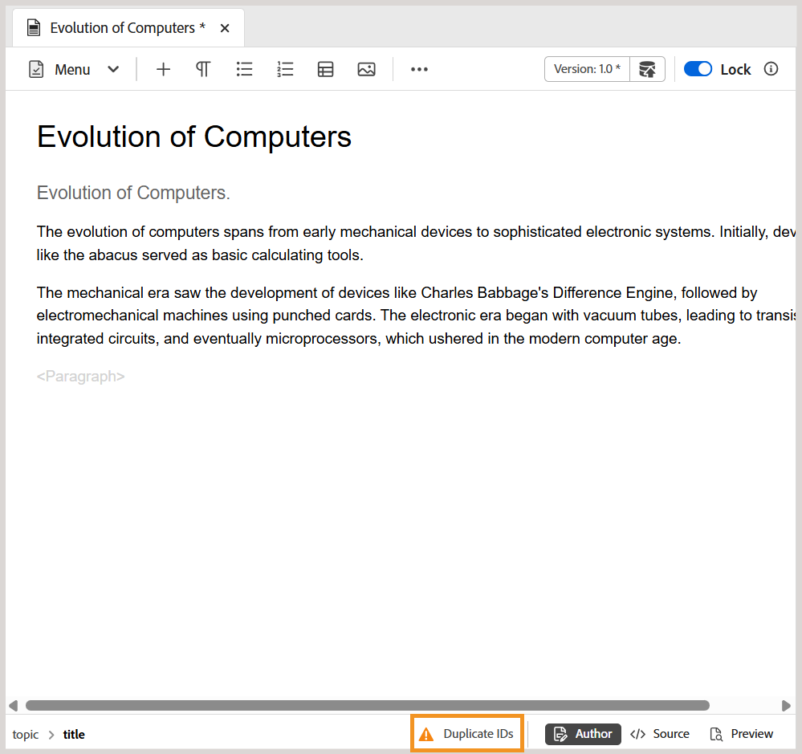

# Nieuwe functies in de release van 2025.10.0 (oktober 2025)

Dit artikel behandelt de nieuwe en verbeterde functies die zijn geïntroduceerd met de release van 2025.10.0 van Adobe Experience Manager Guides as a Cloud Service.

Voor de lijst van kwesties die in deze versie worden bevestigd, mening [&#x200B; Vaste kwesties in de versie 2025.10.0 &#x200B;](fixed-issues-2025-10-0.md).

Leer over [&#x200B; verbeteringsinstructies voor de versie 2025.10.0 &#x200B;](../release-info/upgrade-instructions-2025-10-0.md).

## Editor-instellingen worden nu hernoemd naar Workspace-instellingen en zijn toegankelijk via de startpagina

Om navigatie en bruikbaarheid te verbeteren, zijn de volgende verhogingen geïntroduceerd:

- **de montages van de Redacteur** in Experience Manager Guides zijn anders genoemd aan **montages van Workspace**.
- Het **Meer acties** menu (het drie-punt menu), eerder beschikbaar slechts in de de consoleinterface van de Redacteur en van de Kaart, is nu toegankelijk van de [&#x200B; Homepage &#x200B;](../user-guide/intro-home-page.md).

  

## Identificeer en verbeter gemakkelijk dubbele IDs in onderwerpen en kaarten in de mening van de Auteur

Experience Manager Guides omvat nu a **Dubbele IDs** knoop in de Redacteur om u te helpen dubbel IDs snel identificeren en bevestigen aanwezig binnen één enkel onderwerp of kaart. Wanneer dubbele IDs wordt ontdekt, verschijnt deze knoop bij de bodem-linkerhoek van de interface van de Redacteur in de **Auteur** mening. Nadat u de knop hebt geselecteerd, wordt een lijst met alle instanties met dubbele id&#39;s weergegeven in een pop-up. Wanneer u een instantie selecteert, wordt de bijbehorende inhoud in het onderwerp of de kaart gemarkeerd, zodat u de dubbele id&#39;s in het rechterdeelvenster kunt zoeken en corrigeren.

Voor meer details, mening [&#x200B; Extra eigenschappen in de Redacteur &#x200B;](../user-guide/web-editor-other-features.md).

{width="350" align="left"}

## Verbeteringen voor de filters Opslagplaats en Rapporten

**die door** filter onder de Geavanceerde filters in de Bewaarplaats en **wordt vergrendeld de filter van de Auteur** in de DITA kaartRapporten laadt nu gebruikerslijsten geleidelijk aangezien u, in plaats van allen tegelijkertijd scrolt. Deze gepagineerde lading verbetert snelheid en maakt het werken met grote gebruikersdatasets efficiënter en naadloos.

## De status van de revisietaken rechtstreeks openen vanuit het deelvenster Revisie

Als aanvrager van een revisietaak kunt u nu de status van de revisietaak rechtstreeks controleren via het deelvenster Revisie. Met de recentste verhogingen, omvat de **dialoog van de taak van de 0&rbrace; Update binnen het paneel van het Overzicht een nieuwe** de revisiestatus van de Controle **optie.** Als u deze optie selecteert, gaat u rechtstreeks naar het revisiedashboard, waar u de taakstatus voor elke revisor kunt bekijken, zodat u sneller toegang hebt tot de taakvoortgang zonder dat u naar een andere context hoeft te schakelen.

Voor meer details, verzoek de mening [&#x200B; om een herbeoordeling of sluit een overzichtstaak als Auteur &#x200B;](../user-guide/review-close-review-task.md).

{width="350" align="left"}

## API om de status van naverwerking voor mappen of elementen bij te houden

Er is nu een nieuwe API beschikbaar voor het bijhouden van de status van afzonderlijke elementen en mappen na de verwerking. Dit is vooral handig voor teams die geautomatiseerde workflows gebruiken, waarbij het publiceren pas moet plaatsvinden nadat de inhoud volledig is verwerkt. De API biedt een betrouwbare manier om gereedheid te bevestigen, waardoor het risico van publicatiefouten als gevolg van onvolledige verwerking wordt verminderd.

Met de introductie van deze API worden de gebeurtenissen voor de verwerking van middelen na de verwerking ook niet automatisch geactiveerd. In plaats daarvan kunnen beheerders deze gebeurtenis nu inschakelen via een instelling in `fmdita config manager` .

Zie voor meer informatie:

- [API om de status van afzonderlijke elementen en mappen na verwerking bij te houden](../api-reference/track-post-processing-status.md)
- [Gebeurtenishandler voor nabewerking die in fmdita config-beheer wordt ingesteld](../api-reference/post-process-event.md)

