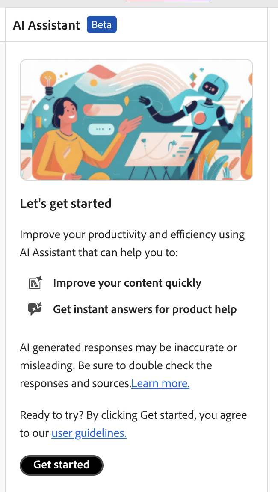

# AI Assistant (Beta)

De **Medewerker AI** in Adobe Experience Manager Guides is een krachtig, AI-gedreven hulpmiddel dat wordt ontworpen om uw productiviteit door slimme hulp en auteurseigenschappen te verbeteren. Het verenigt twee robuuste eigenschappen AI - **Authoring** en **Hulp** - in de interface van Experience Manager Guides, toelatend u aan auteursinhoud en toegangsinformatie van de documentatie van Experience Manager Guides sneller en efficiënter.

>[!NOTE]
>
> De functie AI Assistant is momenteel beschikbaar voor Adobe Experience Manager Guides as a Cloud Service.

De **Authoring** eigenschap in AI Medewerker maakt uw auteursproces slimmer en sneller. Het biedt mogelijkheden zoals het produceren van intelligente suggesties voor inhoudshergebruik, het vertalen van inhoud, het verbeteren van inhoudskwaliteit, en meer, allen die op uw geselecteerde inhoud worden gebaseerd. Deze functie verbetert de algemene ontwerpervaring en de productiviteit van auteurs.

Voor meer details, mening [&#x200B; Authoring &#x200B;](./ai-assistant-right-panel.md).

{align="left"}

De **eigenschap van de Hulp** in AI Medewerker is een intuïtief, op praatje-gebaseerd hulpmiddel dat wordt ontworpen om u beter te helpen Experience Manager Guides begrijpen, problemen oplossen, en door informatie binnen de Documentatie van Adobe Experience Manager Guides zoeken. In plaats van het zoeken door gebruikersgidsen en verwijzingsdocumenten, kunt u de **eigenschap van de Hulp** gebruiken om relevante antwoorden aan uw vragen snel te vinden. Hierdoor bespaart u tijd en kunt u zich richten op het maken van inhoud, wat resulteert in hogere productiviteit en efficiëntie.

Voor meer details, mening [&#x200B; Hulp &#x200B;](./ai-based-smart-help.md).

{align="left"}

## Aan de slag met AI Assistant

Wanneer u de **Hulpstof AI** voor het eerst gebruikt, wordt u ertoe aangezet om uw toestemming voor te leggen alvorens u de Generatieve AI eigenschappen van Experience Manager Guides gebruikt.

Voer de volgende stappen uit om AI Assistant te starten:

1. Aanmelden bij Experience Manager Guides
1. Voor de Homepage, uitgezochte **Medewerker AI** van de bovenkant.   Controleer of de functie AI Assistant is ingeschakeld door de beheerder.

   De AI Hulp pagina wordt getoond die zijn zeer belangrijke eigenschappen, verbinding van gebruikersrichtlijnen, en a **benadrukt begonnen** knoop.

   {align="left"}

1. Lees zorgvuldig de gebruikersrichtlijnen en selecteer dan **begonnen worden** om de AI Medewerker te lanceren.

**Verwante onderwerpen**

[Veelgestelde vragen over beveiliging van AI-assistent](./ai-assistant-faq.md)

[Adobe Experience Manager Guides Generation AI-informatie](./adobe-generative-ai-disclosures.md)

[AI-assistent configureren voor slimme hulp en ontwerpen](../cs-install-guide/conf-smart-suggestions.md)
