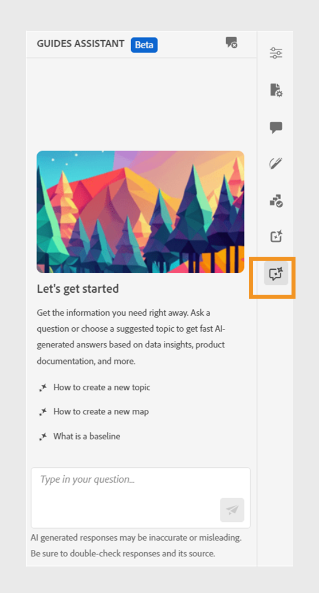

# AI-assistent voor hulplijnen om inhoud te zoeken

Tijdens het ontwerpen van uw documenten in de webeditor kunt u de op GenAI gebaseerde Guides Assistant gebruiken. Met deze zoekfunctie kunt u relevante inhoud zoeken in het dialoogvenster [Documentatie voor Adobe Experience Manager-hulplijnen](https://experienceleague.adobe.com/en/docs/experience-manager-guides/using/overview).
U kunt uw vragen stellen en op een informatieve manier antwoorden krijgen. Het antwoord op uw vraag is gebaseerd op de inhoud van de productdocumentatie. Deze zoekopdracht is volledig conversatief. U kunt vragen stellen, en dan, gebaseerd op het antwoord, kunt u ook verdere vragen stellen. Het antwoord bevat ook koppelingen naar brondocumenten, waarnaar u voor meer informatie kunt verwijzen.

Bijvoorbeeld, kunt u een onderwerp in de Gidsen van de Experience Manager voor uw documentatie willen tot stand brengen. U kunt het volgende vragen: *Hoe maakt u een onderwerp?* U krijgt een antwoord en de koppelingen voor de verwante artikelen. Als u vervolgens wilt leren hoe u de PDF-uitvoer voor het document kunt genereren, kunt u er vragen over stellen. Bijvoorbeeld: *Hoe te om een onderwerp aan een PDF te publiceren?* of *Hoe te om de output van PDF voor een onderwerp te produceren?*

Als u de webeditor opent, **Hulplijnen, assistent** wordt aan de rechterkant weergegeven.

>[!NOTE]
>
> Uw beheerder moet de **Hulplijnen, assistent** gebruiken. Voor meer informatie bekijkt u de [De assistent voor AI-hulplijnen configureren om inhoud te zoeken](../cs-install-guide/conf-guides-assistant.md) in de Installatie- en configuratiehandleiding voor Cloud Servicen.

{width="300" align="left"}

*De weergave **Hulplijnen, assistent**deelvenster.*

Voer de volgende stappen uit om het gespreksonderzoek te gebruiken om aangewezen inhoud te vinden en uw vragen op te lossen:

1. Selecteren **Hulplijnen, assistent**  om het deelvenster te openen.

   >[!NOTE]
   >
   > In de [algemene profielen of mapprofielen](../cs-install-guide/conf-folder-level.md#conf-ai-guides-assistant)moet uw beheerder de standaardvragen definiëren die in het deelvenster worden weergegeven.

1. Typ de vraag om de verwante inhoud in de documentatie van de Gidsen van de Experience Manager te vinden. U kunt de standaardvraag selecteren in het deelvenster of de vraag typen in het tekstvak.

1. Selecteren **Verzenden**    of drukken **Enter**  om het antwoord op uw vragen te bekijken.

   Afhankelijk van uw vraag kunt u de inhoud, de toepasselijke afbeeldingen en de koppelingen naar de artikelen weergeven.

   {width="300" align="left"}

   *Selecteer de voorbeeldvraag en bekijk de inhoud en afbeeldingen als reactie.*

1. Selecteer aan het einde de koppelingen naar de artikelen en bekijk gedetailleerde informatie over uw vraag.

1. Selecteren **Gesprek wissen**  om de gespreksgeschiedenis uit het paneel te verwijderen. U kunt dan een nieuw gesprek beginnen en relevante inhoud vinden.

Deze slimme functie helpt u snel oplossingen te vinden en laat u zich op uw documentatie concentreren en efficiënt uw taken voltooien.