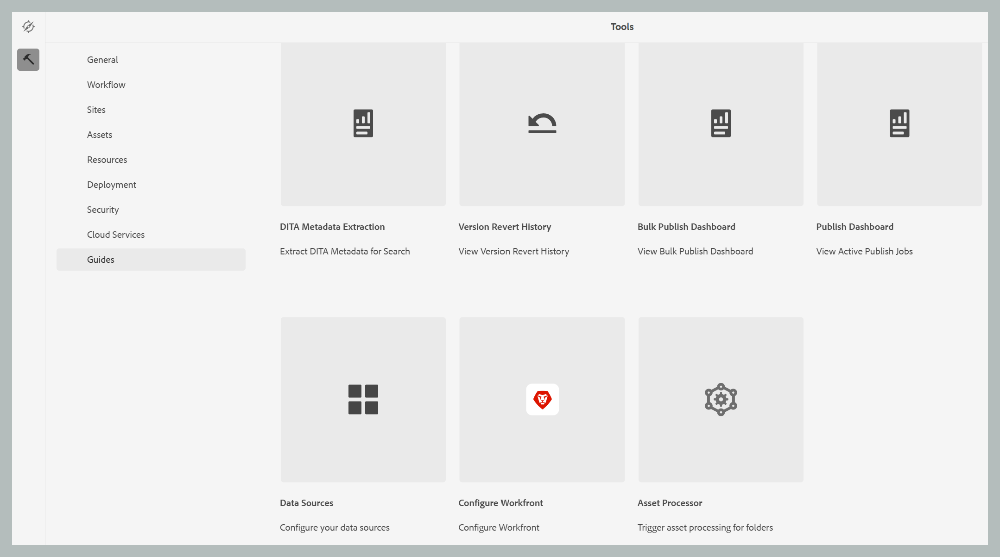

# Verwerking of opwerking van activa

In gegevensintensieve workflows, zoals publicaties, is efficiënt beheer van bedrijfsmiddelen van cruciaal belang voor het behoud van prestaties en betrouwbaarheid. Het proces van het verwerken of opwerken van elementen is specifiek ontworpen voor het verwerken van gebruikersspecifieke elementen die intensieve gegevensbewerkingen vereisen. Deze benadering heeft betrekking op twee primaire scenario&#39;s: wanneer bij de eerste verwerking van elementen fouten optreden of wanneer bestanden helemaal niet zijn verwerkt omdat er geen trigger voor de naverwerking is. Door gerichte verwerking op mapniveau in te schakelen, kunnen gebruikers alleen de benodigde middelen isoleren en verwerken, waardoor onnodige berekeningen overbodig worden. Deze selectieve aanpak verbetert de prestaties aanzienlijk, waardoor de vereiste tijd voor kritieke bewerkingen, zoals het publiceren en genereren van rapporten, wordt verkort. In het algemeen draagt het bij aan een efficiëntere en snellere verwerking van complexe gegevenstaken.

>[!NOTE]
>
> Voor grote datasets, is het best om verwerking tijdens off-piek uren in werking te stellen om beïnvloedende systeemprestaties te vermijden. Nadat de verwerkingstaak is voltooid, kunt u de details controleren om de resultaten te analyseren.

## De elementen verwerken

Voer de onderstaande stappen uit om de elementen te verwerken of opnieuw te verwerken:

1. Selecteer het embleem van Adobe Experience Manager bij de bovenkant en kies **Hulpmiddelen**.
1. In het **paneel van Hulpmiddelen** uitgezocht **Gidsen**.
1. Selecteer de **Tegel van de Bewerker van 0&rbrace; Activa.**

   {width="550" align="left"}

1. Het venster van de Bewerker van de Activa van Hulplijnen opent met de hieronder getoonde details. Bovendien worden alleen de gegevens over de laatste vijf migraties weergegeven in dit venster.

   - **identiteitskaart van de Uitvoering**: Het is unieke identiteitskaart voor elke opwerkingstaak die u uitvoert.

   - **Omslag**: Toont de omslag die voor opwerking wordt geselecteerd.

   - **Uitgesloten Omslagen**: Punten aan de omslag die van herverwerking wordt uitgesloten.

   - **tijd van het Begin:** toont de datum en de tijd het opwerkingsproces in werking wordt gesteld.

   - **Eind Tijd**: Toont de datum en de tijd het opwerkingsproces beëindigt.

   - **Status**: Punten aan het statuut van opwerking zoals Bezig, Voltooid of Geannuleerd.

   {width="550" align="left"}

1. Selecteer **Nieuw Proces** lusje op de hoogste juiste hoek van het venster om een nieuwe verwerkingstaak te beginnen.

   {width="550" align="left"}

1. Selecteer de map die u wilt verwerken of opnieuw wilt verwerken. U kunt ook de mappen selecteren (in de bovenliggende geselecteerde map) die u wilt uitsluiten of negeren.

   >[!NOTE]
   >
   >Er kan slechts één map tegelijk worden geselecteerd voor verwerking. Voor specifieke bewerkingen kunt u meerdere mappen uitsluiten.

1. Selecteer **Maken**. U krijgt pop-up die **Succes tonen en het Proces met succes** zoals aangetoond in het fragment teweeggebracht. Dit wordt ook in de lijst weergegeven. U kunt de status van de opverwerkingstaak in het venster zien.

   {width="550" align="left"}

## Aanvullende opties voor de verwerkingstaken

Er zijn extra opties beschikbaar voor de verwerkingstaak nadat deze is gestart. U hebt toegang tot deze opties door de muis boven de uitvoerings-id van uw taak te houden. Hieronder vindt u nadere informatie over deze opties:

- **Begin** opnieuw: Herstart de eerder succesvolle taak van de activaverwerking.

  {width="550" align="left"}

- **hervatten**: Hervat de eerder geannuleerde of ontbroken taak van de activaverwerking.

  {width="550" align="left"}

- **annuleert**: Annuleert de momenteel lopende taak van de activaverwerking.

  {width="550" align="left"}

- **Logboeken van de Mening**: Toont de logboeken voor de taak van de activaverwerking. Voor lopende taken, toont het logboek gedetailleerde verwerkingsinformatie, met inbegrip van geschatte resterende tijd en activastatus. In deze logbestandlijst worden maximaal de laatste 500 berichten weergegeven. Het volledige logboek kan worden gedownload.

  {width="550" align="left"}

