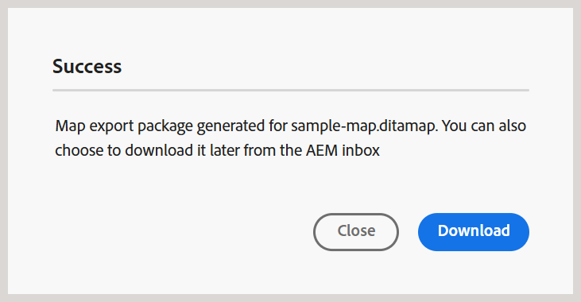

# Bestanden downloaden {#id216MC0H0BE8}

U kunt elementen downloaden, zoals DITA- en niet-DITA-bestanden. Er zijn meerdere manieren waarop u elementen kunt downloaden. Sommige methoden zijn native voor Adobe Experience Manager en andere worden ondersteund door Adobe Experience Manager Guides. Voor inheemse Adobe Experience Manager activa downloadinformatie, mening [ de activa van de Download van Adobe Experience Manager ](https://experienceleague.adobe.com/docs/experience-manager-cloud-service/assets/manage/download-assets-from-aem.html) in de documentatie van Adobe Experience Manager. In de volgende sectie wordt uitgelegd hoe u bestanden downloadt in Experience Manager Guides.

## Download een DITA-kaartbestand uit de Editor

Voer de volgende stappen uit om een DITA kaartdossier van de Redacteur te downloaden:

1. Navigeer naar de DITA-kaart die u wilt downloaden.
1. Selecteer de kaart DITA om het in de Redacteur te openen.

1. In de mening van de Kaart, selecteer het **pictogram van Opties** en kies **kaart van de Download** van de lijst.

   

   Het **kaartvenster van de Download** dialoog wordt getoond.

   {width="300" align="left"}

1. In het dialoogvenster Kaart downloaden kunt u de volgende opties kiezen:

   - **basislijn van het Gebruik**: Selecteer deze optie om een lijst van Basislijnen te krijgen die voor de kaart DITA worden gecreeerd. Als u het kaartbestand en de inhoud ervan wilt downloaden op basis van een specifieke basislijn, selecteert u de basislijn in de vervolgkeuzelijst. Voor meer details over het werken met Basislijnen, mening [ Werk met Basislijn ](generate-output-use-baseline-for-publishing.md#).

   - **de hiërarchieopties van het Dossier**: U kunt het drop-down van de dossierhiërarchie ook gebruiken om te kiezen hoe de omslagstructuur voor uw gedownloade kaartdossiers wordt behandeld. De beschikbare opties zijn:

      - **behoud dossierhiërarchie**: Selecteer deze optie van dropdown om de bestaande omslagstructuur voor de gedownloade dossiers te behouden.

        Deze methode biedt de volgende opties:

         - **het dossiernaam van het Gebruik GUID** - downloadt het kaartdossier met GUID als dossiernaam.

         - **Echte het dossiernaam van het Gebruik** - downloadt het kaartdossier met zijn originele dossier - naam.

      - **afvlakte dossierhiërarchie**: Selecteer deze optie van dropdown om alle referenced onderwerpen en media dossiers in één enkele omslag te downloaden. Slechts is de **optie van het Dossier van het Gebruik GUID** beschikbaar voor kaartdossiers wanneer het gebruiken van deze methode.

   >[!NOTE]
   >
   > U kunt het kaartbestand ook downloaden zonder een optie te selecteren. In dat geval wordt de laatste voortgezette versie van de onderwerpen waarnaar wordt verwezen en de mediabestanden gedownload.

1. Selecteer **Download**.

   De aanvraag voor het downloaden van de kaart wordt in de wachtrij geplaatst.

   

   U ontvangt het volgende bericht zodra de kaart kan worden gedownload.

   {width="550" align="left"}

1. Selecteer **Download** om het kaartdossier in `.zip` formaat te downloaden. Of download deze later via het Postvak IN van AEM.

   >[!NOTE]
   >
   > Standaard blijven de gedownloade kaarten vijf dagen in het Adobe Experience Manager-berichtvenster Inbox staan.

## Download een DITA-toewijzingsbestand van het kaartdashboard

Als u het DITA-kaartbestand eenmaal in de Adobe Experience Manager-opslagplaats hebt, kunt u het kaartbestand samen met de afhankelijke bestanden downloaden. Dit geeft u de flexibiliteit om het volledige kaartdossier voor off-line het uitgeven, bevestiging, overzicht, of eenvoudig het creëren van een steun te delen.

Voer de volgende stappen uit om een DITA kaartdossier samen met zijn afhankelijke dossiers te downloaden:

1. Navigeer in de gebruikersinterface van Assets naar de DITA-kaart die u wilt downloaden.

1. Selecteer de kaart DITA om het in DITA kaartconsole te openen.

1. Selecteer het **lusje van Onderwerpen** om de lijst van onderwerpen te bekijken beschikbaar in de kaart DITA.

1. In de belangrijkste toolbar, uitgezochte **Kaart van de Download**.

   Het dialoogvenster Kaart downloaden wordt geopend.

   {width="300" align="left"}

1. Selecteer **Download**. In het dialoogvenster Kaart downloaden kunt u de volgende opties kiezen:

   - **Basislijn van het Gebruik**: Selecteer deze optie om een lijst van Basislijnen te krijgen die voor de kaart DITA worden gecreeerd. Als u het kaartbestand en de inhoud ervan wilt downloaden op basis van een specifieke basislijn, selecteert u de basislijn in de vervolgkeuzelijst. Voor meer details over het werken met Basislijnen, mening [ Werk met Basislijn ](generate-output-use-baseline-for-publishing.md#).

   - **de Hiërarchie van het Dossier van de Afvlakking**: Selecteer deze optie om alle referenced onderwerpen en media dossiers in één enkele omslag te bewaren.

   >[!NOTE]
   >
   > U kunt het kaartbestand ook downloaden zonder een optie te selecteren. In dat geval wordt de laatste voortgezette versie van de onderwerpen waarnaar wordt verwezen en de mediabestanden gedownload.

1. Nadat u de **knoop van de Download** selecteert, wordt het verzoek van de kaartdownload een rij gevormd. U ontvangt het volgende bericht zodra de kaart kan worden gedownload.

   {width="550" align="left"}

   - Selecteer **Download** om het kaartdossier in.zip formaat te downloaden.

   - Selecteer **Later Download** om het kaartdossier in een recentere tijd te downloaden. U kunt de downloadkoppeling openen via het Adobe Experience Manager-meldingsvak. Selecteer het gegenereerde kaartbericht in het Postvak In als u de kaart in de ZIP-indeling wilt downloaden.

   >[!NOTE]
   >
   > Standaard blijven de gedownloade kaarten vijf dagen in het Adobe Experience Manager-berichtvenster Inbox staan.

{width="300" align="left"}

Nadat de kaart is gedownload, kunt u de kaart selecteren en het pictogram Openen bovenaan gebruiken om het geselecteerde rapport te openen.

**Bovenliggend onderwerp:**&#x200B;[ beheert inhoud ](authoring.md)
