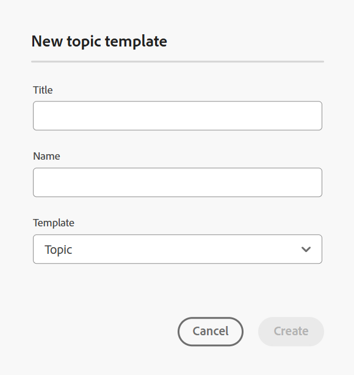

# Kaarten maken op basis van aangepaste sjablonen {#id225VF0808MP}

U kunt aangepaste kaartmalplaatjes tot stand brengen en hen gebruiken om kaarten DITA samen met de onderwerpmalplaatjes en kaartmalplaatjes tot stand te brengen die in het kaartmalplaatje van verwijzingen worden voorzien

U kunt naar andere kaartmalplaatjes en onderwerpmalplaatjes van het aangepaste kaartmalplaatje verwijzen. De genoemde kaartmalplaatjes kunnen naar diverse kaartmalplaatjes, onderwerpmalplaatjes, onderwerpen, kaarten, beelden, video&#39;s, en andere activa verwijzen. Het aangepaste kaartsjabloon kan u zeer gemakkelijk helpen de kaartsjablonen en de volledige doorverwezen omslagstructuur te herhalen. Deze aangepaste sjablonen zijn vooral handig voor het maken en opnieuw maken van meerdere kaarten met recursieve structuren en verwijzingen.

>[!NOTE]
>
> Onderwerpsjablonen worden niet recursief gemaakt. Slechts onderwerpmalplaatjes die direct binnen het kaartmalplaatje zijn worden geproduceerd en om het even welk onderwerpmalplaatje binnen een onderwerpmalplaatje wordt eenvoudig bedoeld in de ouder direct.

## Aangepaste sjablonen maken

Met Adobe Experience Manager Guides kunt u aangepaste mappen en onderwerpen maken in de map dita-templates. U kunt deze aangepaste malplaatjes gebruiken om uw kaart en onderwerp tot stand te brengen. U kunt deze sjablonen ook met uw auteurs delen en deze gebruiken om hun bestanden te maken. Met behulp van deze sjablonen kunt u de auteurs toestaan afzonderlijke kopieën te maken van bepaalde bronnen die zich in de sjabloonmap bevinden.

>[!NOTE]
>
> Bronnen die alleen worden doorverwezen naar en behouden over, moeten zich buiten de sjabloonmap bevinden.


U kunt kaart en onderwerpmalplaatjes op de volgende manieren tot stand brengen:
- [Aangepaste sjablonen maken vanuit de Editor](#create-customized-templates-from-the-editor)
- [Aangepaste sjablonen maken via de gebruikersinterface van Assets](#create-customized-templates-from-the-assets-ui)


### Aangepaste sjablonen maken vanuit de Editor

De **eigenschap van Malplaatjes** is aanwezig in het [ Linkerpaneel van de interface van de Redacteur ](./web-editor-features.md#left-panel), en is slechts beschikbaar voor beheerders. Met dit deelvenster kunnen beheerders eenvoudig sjablonen maken en beheren die vervolgens door de auteurs kunnen worden gebruikt. Door gebrek, zijn de malplaatjes gecategoriseerd onder *kaart* en *onderwerp* typesjablonen.

{width="300" align="left"}

Standaard kunt u de bestanden op titels weergeven. Terwijl u de cursor op een sjabloon plaatst, kunt u de bestandstitel en de bestandsnaam als knopinfo weergeven.

>[!NOTE]
>
> Als beheerder kunt u de lijst met bestanden ook weergeven in de Editor. Selecteer de **optie van de Naam van het 0} Dossier {van de** 3} sectie van de de vertoningsconfiguratie van de dossiers van de Redacteur in **voorkeur van de Gebruiker**.****

Voer de volgende stappen uit om een onderwerp of kaartmalplaatje van de Redacteur tot stand te brengen:

1. Open het **paneel van Malplaatjes** in de Redacteur en selecteer **creeer DITA malplaatje** pictogram.

   {width="500" align="left"}

1. Kies **malplaatje van het Onderwerp** of **malplaatje van de Kaart** van het dropdown menu dat op het type van malplaatje wordt gebaseerd u wilt tot stand brengen.
1. Als u **malplaatje van het Onderwerp** selecteert, dan wordt het **Nieuwe onderwerpmalplaatje** dialoogvakje getoond.

   {width="300" align="left"}

   Als u **malplaatje van de Kaart** selecteert, dan wordt het **Nieuwe de dialoogvakje van het kaartmalplaatje** getoond.

   {width="300" align="left"}

   U kunt **Omslag** van de dropdown lijst ook selecteren als u een omslag binnen het **onderwerp** of **kaart** omslag eerst wilt creëren.

1. In het **Nieuwe onderwerpmalplaatje**/ **Nieuwe kaartmalplaatje** dialoog, verstrek de **Titel**, die in het **paneel van Malplaatjes** verschijnt. De **Naam** van het malplaatje wordt auto gesuggereerd gebaseerd op de titel, nochtans, kunt u een verschillende dossiernaam verstrekken.
Ook, kies het type van malplaatje dat u van de **Malplaatje** drop-down lijst wilt tot stand brengen.

   >[!NOTE]
   >
   > Als de beheerder automatische bestandsnamen heeft ingeschakeld op basis van de UUID-instelling, wordt het veld Naam niet weergegeven.

1. Selecteer **creeer**.

Nadat u de sjabloon hebt gemaakt, moet u deze toevoegen aan uw algemene profiel of mapprofiel. Nadat het malplaatje wordt toegevoegd, zullen uw auteurs beginnen het nieuwe malplaatje in het onderwerp/kaartcreatieproces te bekijken.

Gebruikend het **menu van Opties** op een bestaand malplaatje, kunt u verkiezen om **uit te geven** of **** het dupliceren. In geval van duplicatie blijven de structuur en het type \(van document\) van de sjabloon behouden en kunt u deze opnieuw gebruiken om er een andere sjabloon van te maken.

{width="500" align="left"}

### Aangepaste sjablonen maken via de gebruikersinterface van Assets

Voer de volgende stappen uit om een kaart of onderwerpmalplaatje van Assets UI tot stand te brengen:

1. In **Assets UI**, navigeer aan de dita-malplaatjemap.

   {align="left"}

1. Open de **onderwerpen** omslag als u a **Onderwerp** malplaatje wilt tot stand brengen. Open de **kaarten** omslag als u a **Kaart** malplaatje wilt tot stand brengen.
1. Selecteer **creeer \> Sjabloon DITA**.

   {width="300" align="left"}
1. Voor de pagina van de Vervaging, uitgezochte **Onderwerp \> daarna** om een onderwerpmalplaatje tot stand te brengen. Anders, uitgezochte **Kaart \> daarna** om een kaartmalplaatje tot stand te brengen.
1. Voor de pagina van Eigenschappen, specificeer de malplaatje **Titel**.
1. Specificeer het dossier **Naam**.

   >[!NOTE]
   >
   > De bestandsnaam moet de extensie .dita hebben.

1. \(Optioneel\) Voeg een beschrijving toe.
1. Selecteer **creeer**.

   Het onderwerpmalplaatje creeerde bericht verschijnt. Vervolgens kunt u de sjabloon openen en bewerken. Voor een kaartmalplaatje, kunt u de verwijzingen voor de onderwerpmalplaatjes, kaartmalplaatjes, en ook andere activa in het kaartmalplaatje ook toevoegen.


**menu van Opties in Assets UI**

Voer de volgende stappen uit om een kaart- of onderwerpsjabloon te maken met het menu Opties in de gebruikersinterface van Assets:

1. Selecteer de **omslag van de Kaart** of **Onderwerp** in de huidige malplaatjemap. Bijvoorbeeld de map `dita-templates`.
1. Van het **menu van Opties**, creeer **het Malplaatje van de Kaart** of **creeer het Malplaatje van het Onderwerp**.

   **creeer Nieuw Malplaatje van de Kaart** of **creeer Nieuw Malplaatje van het Onderwerp** dialoog opent.
1. Voer de titel en de naam van de nieuwe sjabloon in.
1. Kies het type van malplaatje dat u van de **drop-down lijst van het Malplaatje** wilt tot stand brengen.

Het bericht voor het maken van de kaartsjabloon wordt weergegeven. U kunt de sjabloon toevoegen aan uw algemene profiel of mapprofiel. Het nieuwe malplaatje verschijnt dan in het onderwerp of kaartverwezenlijking proces, en u kunt kaarten of onderwerpen tot stand brengen gebruikend het.

Uw beheerder kan ook een map maken en deze zo configureren dat deze de map is waarin u de sjablonen kunt maken en opslaan.

Gebaseerd op uw opstelling leert hoe te om de weg van de malplaatjeomslag van douaneDITA te vormen:
<details>
    <summary> Cloud Services </summary>

Leer hoe te [ om de weg van de malplaatjeomslag van douaneDITA ](../install-guide/conf-template-tags-custom-dita-topic-template.md#configure-custom-dita-template-folder-path-id191lcf0095z) in de Gids van de Installatie en van de Configuratie van de Diensten van de Wolk te vormen.
</details>

<details>
    <summary> Software op locatie</summary>

Leer hoe te om [ de weg van de malplaatjeomslag van douaneDITA ](../cs-install-guide/conf-template-tags-custom-dita-topic-template.md#configure-custom-dita-template-folder-path-id191lcf0095z) in de Gids van de Installatie en van de Configuratie op locatie te vormen.
</details>

## De titel doorgeven die is gedefinieerd in de sjablonen

Als u de titel van het onderwerp of de kaart wilt doorgeven die binnen uw malplaatje wordt gebruikt aan de kaarten DITA die gebruikend dat malplaatje worden gecreeerd, gebruiks gekrulde steunen rond de titel.

Voorbeeld

```XML
<pubtitle>
   <mainpubtitle outputclass="booktitle">
   {title}
   </mainpubtitle>
   <subtitle>Subtitle</subtitle>
</pubtitle>

The resultant DITA map with title "Rootmap1" will look like as follows:
<pubtitle>
   <mainpubtitle outputclass="booktitle">Rootmap1
   </mainpubtitle>
   <subtitle>Subtitle</subtitle>
</pubtitle>
```

>[!NOTE]
> Alleen het eerste exemplaar van de accolade wordt vervangen door een titel.

Als u geen krullende haakjes rond de titel gebruikt zal de resulterende kaart DITA slechts het eerste element worden gekozen en het nesten van de titel zal niet van het malplaatje worden gekozen en het zal als volgt kijken:

```XML
<pubtitle> Rootmap1 </pubtitle>
```

>[!NOTE]
> U kunt ook de accolades rondom de tekst gebruiken om de geneste structuur van de aangepaste sjablonen door te geven aan uw DITA-kaarten.

Voorbeeld

```XML
<title>    
    <sub>        
        <b>{title}</b>    
    </sub>
</title>
```

## De kaartsjabloon gebruiken om nieuwe kaarten te maken

>[!NOTE]
>
> Het kaartmalplaatje moet voor creatie door uw beheerder worden gevormd en ter beschikking gesteld. Voor meer details, vorm de mening *auteursmalplaatjes* sectie in installeer en vorm Adobe Experience Manager Guides as a Cloud Service.

In de **Redacteur**, voer de volgende stappen uit om een kaart tot stand te brengen gebruikend het malplaatje van de douanekaart:

1. In de **Redacteur**, navigeer aan de omslag waar u de kaart wilt tot stand brengen.
1. Van het menu van Opties van de omslag, uitgezochte **Nieuwe \> Kaart DITA**.

   {width="500" align="left"}
1. De **Nieuwe kaart** dialoog wordt getoond.
1. In de **Nieuwe kaart** dialoog, specificeer de kaart **Titel**, dossier **Naam**, en selecteer het kaartmalplaatje u wilt gebruiken.

   Als u bijvoorbeeld een kaartsjabloon &#39;test-template&#39; hebt gemaakt, selecteert u deze.

1. Selecteer **creeer**.

   Het bericht dat de kaart heeft gemaakt, wordt weergegeven.

In **Assets UI**, voer de volgende stappen uit om een kaart tot stand te brengen die het malplaatje van de douanekaart gebruikt:

1. In **Assets UI,** navigeer aan de omslag waar u de kaart wilt tot stand brengen.
1. Selecteer **creeer \> Kaart DITA**.
1. Voor de pagina van de Vervaging, selecteer het kaartmalplaatje u **daarna** gebruiken en wilt selecteren. Als u bijvoorbeeld een kaartsjabloon &#39;test-template&#39; hebt gemaakt, selecteert u deze.
1. Voor de pagina van Eigenschappen, specificeer de kaart **Titel**.
1. Specificeer het dossier **Naam**.

   >[!NOTE]
   >
   > De bestandsnaam moet de extensie .ditamap hebben.

1. Selecteer **Maken**. Het bericht dat de kaart heeft gemaakt, wordt weergegeven.

## Aanvullende notities voor DITA-kaarten die zijn gemaakt met aangepaste sjablonen


De kaart genereert alle elementen waarnaar in de sjabloonmap wordt verwezen. Sommige soorten activa die in een kaart worden bedoeld kunnen als volgt zijn:

- Als de kaart de verwijzing naar een onderwerpmalplaatje bevat, wordt een exemplaar van het gecreeerd binnen de omslag, in de zelfde hiërarchie zoals in de onderwerpenomslag in de `dita-templates` omslag.
- Als de kaart de verwijzing naar een kaartmalplaatje bevat, wordt een exemplaar van het gecreeerd binnen de omslag, in de zelfde hiërarchie zoals in de kaartomslag in de `dita-templates` omslag.
- Als de kaart de algemene verwijzing naar een onderwerp of kaart buiten de `dita-templates/topics` of `dita-templates/maps` omslag bevat, wordt het zelfde slechts bedoeld, en geen exemplaar wordt gecreeerd.

  >[!NOTE]
  >
  > `dita-templates/topics` en `dita-templates/maps` zijn de standaardpaden in hulplijnen en kunnen worden geconfigureerd.


  Als er een zeer belangrijke definitie van het onderwerpmalplaatje binnen het kaartmalplaatje is, wordt een nieuwe sleutel \ (daarom nieuw onderwerp \) gecreeerd en in de kaart bedoeld.

- Als een andere kaart of een onderwerp op het zelfde niveau in de omslag wordt gecreeerd, dan worden de namen van de pas gecreëerde activa toegevoegd met 0.1.2, etc. U kunt ervoor kiezen de kaart te openen om het kaartbestand te bewerken of op te slaan in de opslagplaats.

**Bovenliggend onderwerp:**[ Inleiding aan de Redacteur van de Kaart ](map-editor.md)
