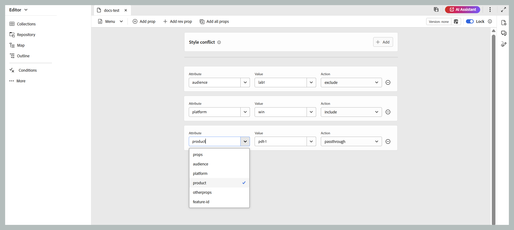
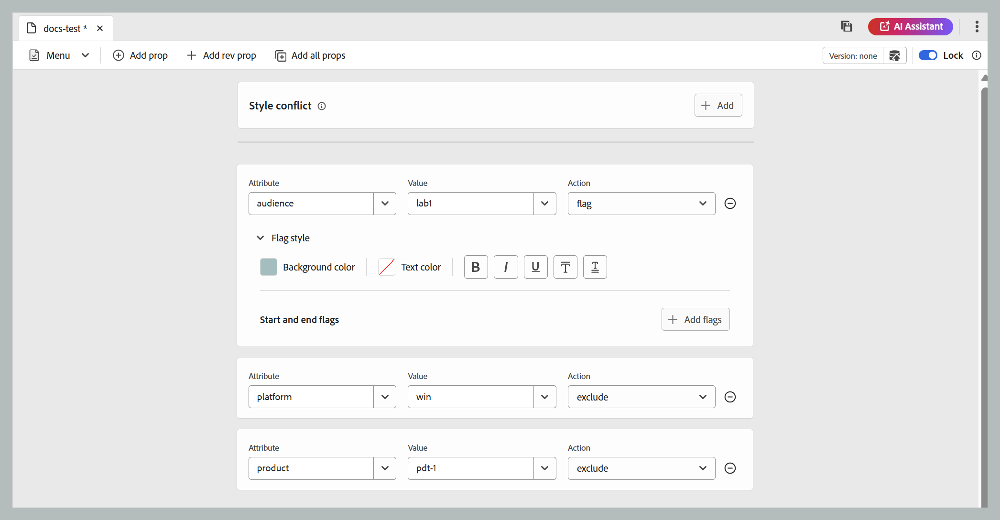

# DITAVAL-editor {#ditaval-editor}

DITAVAL-bestanden worden gebruikt om voorwaardelijke uitvoer te genereren. In één onderwerp, kunt u voorwaarden toevoegen gebruikend elementenattributen om inhoud te conditionaliseren. Vervolgens maakt u een DITAVAL-bestand waarin u de voorwaarden opgeeft die moeten worden opgepakt om inhoud te genereren en welke voorwaarde niet in de uiteindelijke uitvoer moet worden opgenomen.

Met Adobe Experience Manager Guides kunt u eenvoudig DITAVAL-bestanden maken en bewerken met de DITAVAL-editor. De DITAVAL-editor haalt de kenmerken op (die kunnen worden gebruikt als voorwaarden) die in uw systeem zijn gedefinieerd en u kunt deze gebruiken om DITAVAL-bestanden te maken of te bewerken. Voor meer details over het creëren van en het beheren van voorwaarden in Adobe Experience Manager, mening [ het Beheer de sectie van Markeringen ](https://experienceleague.adobe.com/docs/experience-manager-cloud-service/sites/authoring/features/tags.html?lang=en) in de documentatie van Adobe Experience Manager.

In de volgende secties vindt u de opties die beschikbaar zijn voor een DITAVAL-bestand in Experience Manager Guides.

- [DITAVAL-bestand maken](#create-ditaval-file)
- [DITAVAL-bestand bewerken](#edit-ditaval-file)
- [Weergaven van DITAVAl-bestandseditor](#ditaval-editor-views)
- [Werken met DITAVAL-bestand in de gebruikersinterface van Assets](#working-with-ditaval-files-in-the-assets-ui)

## DITAVAL-bestand maken

Voer de volgende stappen uit om een DITAVAL-bestand te maken:

1. In het paneel van de Bewaarplaats, selecteer het **Nieuwe dossier** pictogram en selecteer dan **Onderwerp** van het dropdown menu.

   {width="300" align="left"}

   U kunt tot deze optie van de [ Homepage van Experience Manager Guides ](./intro-home-page.md) en tot het optiesmenu van een omslag in de mening van de Bewaarplaats ook toegang hebben.

2. Het **Nieuwe onderwerp** dialoogvakje wordt getoond.

3. In het **Nieuwe onderwerp** dialoogvakje, verstrek de volgende details:
   - Een titel voor het onderwerp.
   - \(Optioneel\)* De bestandsnaam voor het onderwerp. De bestandsnaam wordt automatisch voorgesteld op basis van de titel van het onderwerp. Als de beheerder automatische bestandsnamen heeft ingeschakeld op basis van de UUID-instelling, wordt het veld Naam niet weergegeven.
   - Een malplaatje waarop het onderwerp zal worden gebaseerd. Voor een DITAVAL dossier, uitgezochte **Ditaval** van de dropdown lijst.
   - Pad waar u het onderwerpbestand wilt opslaan. Standaard wordt het pad van de geselecteerde map in de opslagplaats weergegeven in het veld Pad.

   {width="300" align="left"}

4. Selecteer **creeer**.

Het onderwerp wordt gecreeerd bij de gespecificeerde weg. Het onderwerp wordt ook geopend in de Editor voor bewerking.

{align="left"}

## DITAVAL-bestand bewerken

Als u een DITAVAL-onderwerp maakt, wordt dit geopend in de Editor en bewerkt. Om een bestaand DITAVAL onderwerp uit te geven, navigeer aan de omslag of de kaart waar het DITAVAL onderwerp wordt gevestigd, en selecteer dan **uitgeven** van het **** menu van Opties.

Met de DITAVAL-editor kunt u meerdere taken uitvoeren zoals hieronder worden weergegeven met de opties op de werkbalk van de Editor.

### Editor, werkbalkopties

#### Vervolgkeuzelijst Menu

Het vervolgkeuzemenu Menu biedt toegang tot de bewerkingsacties, Zoeken en vervangen, Versiegeschiedenis, Versielabel, Samenvoegen, Revisietaak maken, Wijzigingen bijhouden en de functie Codes.
Voor meer details, mening [ dropdown opties van het Menu ](./web-editor-toolbar.md#menu-dropdown)

#### Prop toevoegen

Voeg één eigenschap toe aan uw DITAVAL-bestand.

{width="650" align="left"}

De eerste vervolgkeuzelijst bevat de toegestane DITA-kenmerken die u kunt gebruiken in het DITAVAL-bestand.

De tweede drop-down lijst toont de waarden die voor de geselecteerde attributen worden gevormd. Dan, toont de volgende drop-down lijst de acties die u op de geselecteerde attributen kunt vormen. De toegestane waarden in de vervolgkeuzelijst voor handelingen zijn - `include` , `exclude` , `passthrough` en `flag` . Voor meer informatie over deze waarden, bekijk de definitie van [ prop ](http://docs.oasis-open.org/dita/dita/v1.3/errata01/os/complete/part3-all-inclusive/langRef/ditaval/ditaval-prop.html#ditaval-prop) element in OASIS DITA documentatie. Voor details van de actie van de eigenschappen die in de attributen worden toegevoegd, mening [ Acties voor bezit ](#actions-for-property).

#### Revisie-profiel toevoegen

Als u een specifiek revisienummer wilt toevoegen aan een tag in XML, kunt u de optie Nieuwe rev toevoegen gebruiken. Hiermee wordt een rev-kenmerk aan de tag toegevoegd, waarbij de waarde in het veld Waarde samen met de geselecteerde actie voor de eigenschap wordt gedefinieerd. Deze revisieeigenschap kan later worden gebruikt om relevante XML-inhoud te filteren op basis van het opgegeven revisienummer wanneer de uitvoer wordt gegenereerd.

{width="650" align="left"}

#### Alle profielen toevoegen

Als u met één klik alle voorwaardelijke eigenschappen of kenmerken wilt toevoegen die in uw systeem zijn gedefinieerd, gebruikt u de functie Alle eigenschappen toevoegen. De toegestane waarden in de vervolgkeuzelijst voor handelingen zijn - `include` , `exclude` , `passthrough` en `flag` . De details van deze acties worden hieronder vermeld.

>[!NOTE]
>
> Als het DITAVAL-bestand al alle gedefinieerde voorwaardelijke eigenschappen bevat, kunt u geen eigenschappen meer toevoegen. Er verschijnt een foutbericht in dit scenario.

{width="650" align="left"}

##### Handelingen voor eigenschap

Er zijn voor een bepaalde eigenschap grofweg vier acties beschikbaar die als volgt kunnen worden gebruikt:

**omvatten:** omvat de inhoud in output. Dit is het standaardgedrag tenzij anders ingesteld.

**sluit uit:** sluit de inhoud van output (als alle waarden in de bijzondere attributen worden uitgesloten) uit.

**Passthrough:** omvat de inhoud in output, en bewaart de attributenwaarde als deel van de outputstroom voor verdere verwerking door een runtime motor, bijvoorbeeld runtime het filtreren gebaseerd op individuele gebruikersmontages.

**voegt Vlaggen toe:** aan vlaginhoud in de output, kunt u vlag als actie voor de gewenste attributen in het dossier plaatsen. U kunt verschillende vlagstijlen ook toepassen door de **stijl van de Vlag** dropdown zoals aangetoond in het hieronder fragment te gebruiken.

{width="650" align="left"}

- **Achtergrondkleur**: Selecteer de tint, de verzadiging, het contrast van de Achtergrondkleur. De corresponderende HEX-waarde wordt automatisch bijgewerkt op basis van uw selectie. U kunt de indeling van de kleurruimte ook wijzigen met het vervolgkeuzemenu en kiezen tussen HEX, RGB en HSB.

{width="650" align="left"}

- **Kleur van de Tekst**: Selecteer de tint, de verzadiging, het contrast van de kleur van de Tekst. De corresponderende HEX-waarde wordt automatisch bijgewerkt op basis van uw selectie. U kunt de indeling van de kleurruimte ook wijzigen met het vervolgkeuzemenu en kiezen tussen HEX, RGB en HSB.

{width="650" align="left"}

- **het stileren opties**: U kunt sommige het stileren opties evenals Vet toevoegen, Cursief, Onderstrepen, Overlijn, dubbel onderstrepen.

{width="650" align="left"}

- **Vlaggen van het Begin en van het Eind**: U kunt beelden als begin en eindvlaggen opnemen gebruikend **voeg Vlag** knoop toe. Om beelden te kiezen, of gebruik **doorbladert Assets** om van de bewaarplaats van Gidsen te selecteren of **voeg Dossier** toe om van uw lokaal systeem te uploaden. Daarnaast kunt u alternatieve tekst voor de afbeeldingen opgeven.

{width="650" align="left"}

- **conflict van de Stijl**: Het lost de conflicten op die voorkomen wanneer één enkel element veelvoudige eigenschappen met verschillende stijlen van de Vlag bevat. In dergelijke gevallen wordt de waarde die is gedefinieerd in de eigenschappen van het stijlconflict geselecteerd. Deze waarde fungeert in feite als een standaardwaardekiezer voor achtergrond- en tekstkleuren.

{width="650" align="left"}

#### Versiegegevens en Opslaan als nieuwe versie

Met de functie Versiegegevens en opslaan als nieuwe versie worden het bijhouden van versies en het opslaan van inhoud gecombineerd tot één functie.
Voor meer details, mening [ sparen als nieuwe versie ](./web-editor-toolbar.md#version-information-and-save-as-new-version)

#### Vergrendelen/ontgrendelen

Hiermee vergrendelt of ontgrendelt u het huidige bestand. Door een bestand te vergrendelen hebt u exclusief schrijftoegang tot het bestand.
Voor meer details, ontgrendel de mening [ Slot het dossier ](./web-editor-toolbar.md#lockunlock)

### De inhoud opslaan

Zodra u klaar bent met het uitgeven van uw DITAVAL dossier, uitgezocht **sparen** op de bar van het Lusje.

>[!NOTE]
>
> Als u het bestand sluit zonder op te slaan, gaan de wijzigingen verloren. Als u niet wenst om veranderingen in de bewaarplaats van Adobe Experience Manager vast te leggen, selecteer **dicht**, en selecteer dan **Sluiten zonder** op te slaan in de **Unsaved dialoog van Veranderingen**.

## Weergaven DITAVAL-editor

De DITAVAL-editor van Adobe Experience Manager Guides ondersteunt het weergeven van DITAVAL-bestanden in twee verschillende modi of weergaven:

**Auteur**:   Dit is een typisch wat u ziet is wat u \ (WYSISYG \) mening van de redacteur van DITAVAL krijgt. U kunt eigenschappen toevoegen of verwijderen met behulp van de eenvoudige gebruikersinterface, die de eigenschappen, waarden en handelingen in de vervolgkeuzelijst weergeeft. In de weergave Auteur kunt u een afzonderlijke eigenschap invoegen en alle eigenschappen met één klik invoegen.

U kunt ook de versie van het DITAVAL-bestand vinden waaraan u momenteel werkt door de aanwijzer op de bestandsnaam te plaatsen.

**Source**:   In de Source-weergave wordt de onderliggende XML weergegeven waaruit het DITAVAL-bestand bestaat. Naast het uitvoeren van regelmatige tekstbewerkingen in deze weergave, kan een auteur ook eigenschappen toevoegen of bewerken met de slimme catalogus.

Om de Slimme Catalogus aan te halen, plaats de curseur aan het eind van om het even welke bezitsdefinitie en ga &quot;&lt;&quot; in. De redacteur zal een lijst van alle geldige elementen van XML tonen die u bij die plaats kunt opnemen.

## Werken met DITAVAL-bestanden in de gebruikersinterface van Assets

U kunt ook een DITAVAL-bestand maken via de gebruikersinterface van Assets. De stappen om een nieuw onderwerp te creëren DITAVAL zijn als volgt:

1. Navigeer in de gebruikersinterface van Assets naar de locatie waar u het DITAVAL-bestand wilt maken.

1. Selecteer **creeer** \> **Onderwerp DITA**.

1. Voor de pagina van de Vervaging, uitgezochte DITAVAL dossiermalplaatje en selecteer **daarna**.

1. Voor de pagina van Eigenschappen, specificeer de **Titel** en **Naam** voor het DITAVAL dossier.

   >[!NOTE]
   >
   > De naam wordt automatisch voorgesteld gebaseerd op de Titel van uw dossier. Als u de bestandsnaam handmatig wilt opgeven, moet u ervoor zorgen dat de naam geen spaties, apostrof of accolades bevat en eindigt met .ditaval.

1. Selecteer **creeer**.

   Het bericht Gemaakt onderwerp wordt weergegeven.

U kunt het DITAVAL-bestand openen om te bewerken in de DITAVAL-editor of het onderwerpbestand opslaan in de Adobe Experience Manager-opslagplaats.

Voer de volgende stappen uit om een bestaand DITAVAL-bestand te bewerken:

1. Navigeer in de gebruikersinterface van Assets naar het DITAVAL-bestand dat u wilt bewerken.

1. Om een exclusieve slot op het dossier te krijgen, selecteer het dossier en selecteer **Controle uit**.

1. Selecteer het dossier en selecteer **uitgeven** om het dossier in de redacteur van Adobe Experience Manager Guides te openen DITAVAL.

