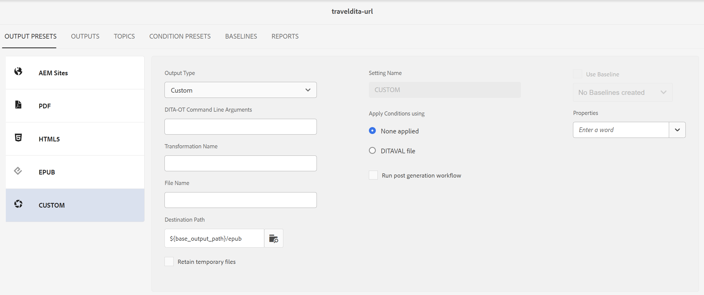

# Aangepast {#id205BEF00PX0}

De voorinstellingen voor aangepaste uitvoer zijn beschikbaar voor aangepaste DITA-OT-plug-ins. U kunt een aangepaste DITA-OT-uitvoervoorinstelling maken om uitvoer te publiceren met behulp van uw aangepaste DITA-OT-plug-in.

U kunt de aangepaste voorinstelling op twee manieren maken:

- [De aangepaste voorinstelling maken vanaf de kaartconsole](#create-the-custom-preset-from-the-map-console)
- [&#x200B; creeer vooraf ingesteld van de Douane van het dashboard van de Kaart &#x200B;](#create-the-custom-preset-from-the-map-dashboard)

## De aangepaste voorinstelling maken vanaf de kaartconsole

Voer de volgende stappen uit om de aangepaste voorinstelling te maken vanaf de kaartconsole:

1. [&#x200B; open een DITA kaartdossier in de console van de Kaart &#x200B;](./open-files-map-console.md).

   U kunt tot het kaartdossier van de **Recente dossiers** widget in de [&#x200B; sectie van het Overzicht &#x200B;](./intro-home-page.md#overview) ook toegang hebben. Het geselecteerde kaartbestand wordt geopend in de kaartconsole.
1. In **vooraf instelt van de Output** lusje, selecteer + pictogram om tot een output vooraf ingesteld te leiden.
1. Selecteer **Douane** van het drop-down Type in de **Nieuwe output vooraf ingestelde** dialoogdoos.
1. Op het **gebied van de Naam**, verstrek een naam aan dit vooraf ingesteld.
1. Selecteer **toevoegen aan huidige omslagprofiel** optie om een output tot stand te brengen die binnen het huidige omslagprofiel vooraf in wordt gesteld. Het  wijst op een omslag-profiel-niveau vooraf ingesteld.

   Leer meer over [&#x200B; beheer Globale en de profieloutput van de Omslag vooraf instelt &#x200B;](./web-editor-manage-output-presets.md).

1. Selecteer **toevoegen**.

   De aangepaste voorinstelling wordt gemaakt.

   {width="300" align="left"}

In de console van de Kaart, worden de vooraf ingestelde configuratieopties georganiseerd onder de **Algemene** en **Geavanceerde** lusjes.

{align="left"}

Het **Algemene** lusje bevat de volgende configuratieopties:

- DITA-OT opdrachtregelargumenten
- Transformatienaam
- Bestandsnaam
- Uitvoerpad
- Voorwaardelijk filteren \(als de voorwaarden voor een kaart zijn gedefinieerd\)
- Basislijn gebruiken \(als een basislijn is gemaakt voor een kaart\)
- Workflow na generatie

**Geavanceerd**

Het tabblad Geavanceerd bevat de volgende configuratieopties:

- Tijdelijke bestanden behouden
- Bestandseigenschappen

Voor details op vooraf ingestelde configuratieopties, verwijs naar de [&#x200B; vooraf ingestelde configuratie van de Douane &#x200B;](#custom-preset-configuration) sectie.

## De aangepaste voorinstelling maken van het dashboard Kaart

Voer de volgende stappen uit om de aangepaste voorinstelling te maken van het dashboard Kaart:

1. In Assets UI, navigeer aan en selecteer de kaart DITA om het in het dashboard van de Kaart te openen.
1. Zorg ervoor dat de **Output vooraf instelt** tabel wordt geselecteerd.
1. Selecteer **creeer** in de toolbar.

   Er wordt een nieuw, vooraf ingesteld formulier voor het maken van uitvoerbestanden weergegeven.

   {width="650" align="left"}

1. Voer de vereiste configuratiegegevens voor de aangepaste voorinstelling in.
1. Selecteer **Gedaan** om de vooraf ingestelde montages te bewaren.

Voor details op vooraf ingestelde configuratieopties, verwijs naar de [&#x200B; vooraf ingestelde configuratie van de Douane &#x200B;](#custom-preset-configuration) sectie.

## Aangepaste vooraf ingestelde configuratie

De configuratieopties variëren enigszins, afhankelijk van of u de voorinstelling configureert via de kaartconsole of het kaartdashboard. Sommige opties zijn alleen van toepassing op het dashboard Kaart, andere op beide.

Wanneer dezelfde configuratie twee verschillende veldlabels heeft, scheidt a **/** deze in de onderstaande tabel. Het eerste vertegenwoordigt het label in de kaartconsole en het tweede vertegenwoordigt het label in het kaartdashboard.

Bijvoorbeeld, **weg van de Output/Bestemming** - hier, **weg van de Output** is het etiket dat in de console van de Kaart wordt gebruikt, terwijl **Weg van de Bestemming** het etiket is dat in het dashboard van de Kaart voor de zelfde configuratie wordt gebruikt.

| Aangepaste uitvoeropties | Beschrijving |
| --- | --- |
| Het Type van output (*Toepasselijk voor het dashboard van de Kaart slechts*) | Het type uitvoer dat u wilt genereren. Als u uitvoer wilt genereren met een aangepaste DITA-OT-plug-in, kiest u de optie Aangepast. |
| Plaatsende Naam (*Toepasselijk voor het dashboard van de Kaart slechts*) | Geef een beschrijvende naam voor de uitvoerinstellingen die u maakt. Bijvoorbeeld, kunt u _Interne klantenoutput_ of _eind-gebruikers output_ specificeren. |
| DITA-OT opdrachtregelargumenten | Geef de aanvullende argumenten op die u tijdens het genereren van uitvoer wilt laten verwerken door DITA-OT. Voor details over de bevel-lijn argumenten die in DITA-OT worden gesteund, mening [&#x200B; DITA-OT documentatie &#x200B;](https://www.dita-ot.org/). |
| Transformatienaam | Geef het type uitvoer op dat u wilt genereren. Dit is vereist als u uitvoer wilt genereren met uw eigen aangepaste plug-in, die is geïntegreerd in de DITA-OT-plug-in. Als u bijvoorbeeld XHTML-uitvoer wilt genereren, geeft u `xhtml` op. Voor een lijst van transformaties beschikbaar in DITA-OT, mening [&#x200B; DITA-OT transformaties (outputformaten) &#x200B;](http://www.dita-ot.org/2.3/user-guide/AvailableTransforms.html) in de Gids van de Gebruiker van OASIS DITA-OT. |
| Bestandsnaam | Geef de bestandsnaam op waarmee u de uitvoer wilt opslaan.  **Nota**: Als u geen dossier verstrekt - noem, dan wordt de titel van de kaart DITA gebruikt om de definitieve naam van het outputdossier te produceren. Als de kaart geen titel heeft, dan wordt de het dossiernaam van de kaart DITA gebruikt om de definitieve output te noemen. De bestandsnaam wordt ontsmet volgens de regels die in het systeem zijn geconfigureerd voor het verwerken van elk ongeldig teken. |
| Voorwaardelijk filteren/Voorwaarden toepassen met | Selecteer één van de volgende opties:  * **toegepaste niets**: Selecteer deze optie als u geen voorwaarde op de gepubliceerde output wilt toepassen. * **DITAVAL dossier**: Selecteer DITAVAL dossier(s) om gepersonaliseerde inhoud te produceren. U kunt meerdere DITAVAL-bestanden selecteren via het dialoogvenster Bladeren of door een bestandspad te typen. Gebruik het kruispictogram bij de bestandsnaam om het te verwijderen. DITAVAL-bestanden worden in de opgegeven volgorde geëvalueerd, zodat de voorwaarden die in het eerste bestand zijn opgegeven voorrang hebben op de voorwaarden die in latere bestanden worden vermeld. U kunt de bestandsvolgorde behouden door bestanden toe te voegen of te verwijderen. Als het DITAVAL-bestand naar een andere locatie wordt verplaatst of wordt verwijderd, wordt het niet automatisch verwijderd van het kaartdashboard. U moet de locatie bijwerken als bestanden worden verplaatst of verwijderd. U kunt de muisaanwijzer boven de bestandsnaam plaatsen om het pad weer te geven in de AEM-opslagplaats waar het bestand is opgeslagen. U kunt alleen DITAVAL-bestanden selecteren en er wordt een fout weergegeven als u een ander bestandstype hebt geselecteerd. * **Vooraf ingestelde Voorwaarde**: Selecteer een voorwaarde vooraf ingesteld van drop-down om een voorwaarde toe te passen terwijl het publiceren van de output. De optie is zichtbaar als u een voorwaarde hebt toegevoegd op het tabblad Voorinstellingen voorwaarde van de DITA-kaartconsole. Meer over voorwaarde vooraf ingesteld, mening [&#x200B; vooraf instelt van het Gebruik van de voorwaarde &#x200B;](generate-output-use-condition-presets.md#id1825FL004PN). |
| Uitvoerpad/bestemmingspad | Het pad in uw AEM-opslagplaats waar de EPUB-uitvoer wordt opgeslagen. Het uitvoerpad wordt ingesteld via de variabele `${base_output_path}` , die wordt geconfigureerd door de beheerder. Om de weg van de Output te vormen, vormt de mening [&#x200B; de Plaats van de Output van de Basis voor de diensten van de Wolk &#x200B;](../native-pdf/configure-base-location-cs.md) of [&#x200B; vormt de Plaats van de Output van de Basis voor de diensten On-Prem &#x200B;](../native-pdf/configure-base-output-location.md) die op de diensten worden gebaseerd u gebruikt. |
| Tijdelijke bestanden behouden | Selecteer deze optie om de tijdelijke bestanden te behouden die door DITA-OT worden gegenereerd. Als er fouten optreden bij het genereren van uitvoer via DITA-OT, selecteert u deze optie om de tijdelijke bestanden te behouden. U kunt die dossiers dan gebruiken om de fouten van de outputgeneratie problemen op te lossen.    Na het produceren van de output, selecteer het **tijdelijke dossiers van de Download**  om de omslag te downloaden van het PIT die de tijdelijke dossiers bevat.    **Nota**: Als de dossiereigenschappen tijdens generatie worden toegevoegd, omvatten de output tijdelijke dossiers ook a *metadata.xml* dossier die die eigenschappen bevatten. |
| Workflow voor na de generatie uitvoeren | Als u deze optie kiest, wordt een nieuwe vervolgkeuzelijst Werkstroom na generatie weergegeven met alle werkstromen die in AEM zijn geconfigureerd. U moet een werkstroom selecteren die u wilt uitvoeren nadat de werkstroom van de outputgeneratie is voltooid.  **Nota**: Voor meer informatie over het creëren van een douane post-output het werkschema van de productiegeneratie, mening _aanpassen post-output werkschema_ in installeer en vorm Adobe Experience Manager Guides as a Cloud Service. |
| Basislijn gebruiken | Als u een basislijn voor de geselecteerde kaart hebt gecreeerd DITA, selecteer deze optie om de versie te specificeren die u wilt publiceren.   het Werk van de Mening [&#x200B; met Basislijn &#x200B;](generate-output-use-baseline-for-publishing.md#id1825FI0J0PF) voor meer detail. |
| Bestandseigenschappen/eigenschappen | Selecteer de eigenschappen die u als metagegevens wilt verwerken. Deze eigenschappen worden ingesteld op de pagina Eigenschappen van de DITA-kaart of het bladwijzerbestand. De eigenschappen u van de dropdown lijst selecteert verschijnen onder het **gebied van de Eigenschappen van het Dossier 0&rbrace; &lbrace;.** Selecteer het kruispictogram naast de eigenschap om deze te verwijderen.   **Nota**: U kunt de meta-gegevens tot de output ook overgaan gebruikend DITA-OT het publiceren. Voor meer detailmening, [&#x200B; pas op de meta-gegevens aan de output over gebruikend DITA-OT &#x200B;](pass-metadata-dita-ot.md#id21BJ00QD0XA). |

**Bovenliggend onderwerp:**&#x200B;[&#x200B; Begrijpend de output stelt &#x200B;](generate-output-understand-presets.md) vooraf in

