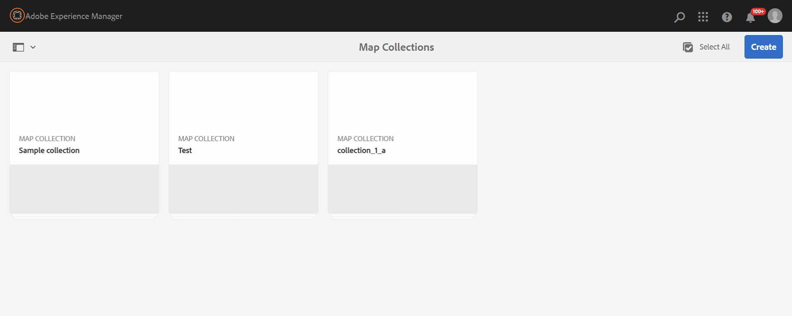

# Kaartverzameling gebruiken voor het genereren van uitvoer {#id1723F20G0HS}

In elke organisatie kan een product meerdere typen documentatie hebben. Als uitgeverspecialist, zou u willen controleren welke output u voor welk document wilt produceren. Ook moet u een manier hebben om meerdere documenten in één keer in batches te publiceren.

Adobe Experience Manager Guides biedt u de mogelijkheid om uw inhoud te ordenen voor publicatie met behulp van een dashboard met de naam Kaartverzameling. Met een kaartverzameling kunt u alle verschillende typen documenten in één eenheid samenstellen. U kunt kiezen welk type van output u voor elk document in uw Inzameling van de Kaart wilt produceren. Bovendien kunt u output ook produceren en de vooruitgang van de outputgeneratie van het het publiceren dashboard bekijken.

De Inzameling van de kaart geeft u een optie om te bekijken als er om het even welke verandering in om het even welke kaart van de laatst gepubliceerde output is. U kunt de details op het lusje van Kaarten en van Voorinstellingen van uw Inzameling van de Kaart bekijken en dan de output indien nodig opnieuw publiceren.

## Een kaartverzameling maken en DITA-kaarten toevoegen

Voer de volgende stappen uit om een Kaartverzameling te maken en DITA-kaarten toe te voegen aan de verzameling:

1. Open de [ startpagina van Experience Manager Guides ](./intro-home-page.md#map-collections) en selecteer **inzamelingen van de Kaart**.

   De **pagina van de Verzamelingen van de Kaart** opent in een nieuw lusje.

   {width="350" align="left"}

   >[!NOTE]
   >
   > U kunt Assets UI ook openen en **Verzamelingen van de Kaart selecteren**. Als de pagina van de Verzamelingen van de Kaart niet beschikbaar is, dan selecteer de **optie van de Navigatie** in het linkerspoor, en selecteer dan **Verzamelingen van de Kaart**.

1. Op de **pagina van de Verzamelingen van de Kaart**, creeer **** op het hoogste recht, en verstrek a **Titel van de Inzameling** voor uw kaartinzameling.
1. Selecteer **creeer**.

   Een bericht van het Succes wordt getoond bij verwezenlijking van de kaartinzameling.

1. Selecteer **Sluiten** op het bericht van het Succes.

   Het nieuwe kaartbestand wordt weergegeven op de pagina Kaartweerzamelingen.

1. Selecteer het grijze vak in de tegel van de verzameling die u wilt bewerken.
1. De geselecteerde kaartinzameling opent in het dashboard van de kaartinzameling.
1. Selecteer **uitgeven** en selecteer dan **Kaarten** toevoegen.
1. Zoek en voeg de DITA-kaarten toe die u aan de verzameling Kaarten wilt toevoegen.

   Standaard worden alle voorinstellingen en landinstellingen die aan de kaart zijn gekoppeld, automatisch toegevoegd.

1. Selecteer de gewenste uitvoer door de schuifknop in of uit te schakelen.
1. Selecteer **Gereed**.

   De DITA kaartdossiers worden toegevoegd aan uw Inzameling van de Kaart.

   {width="800" align="left"}

**het Filtreren opties**

De volgende filteropties en kaartdetails worden getoond op de inzamelingspagina:

- **Filter:** De linkerspoorstaaf toont de volgende filters:
   - **Gewijzigd**: U kunt ja of Nr selecteren. Als u ja selecteert, slechts zullen de gewijzigde kaarten DITA in de Kaarten en de Vooraf ingestelde lijst worden getoond.
   - **vooraf ingesteld**: Selecteer vooraf ingesteld waarvoor u de kaartdossiers wilt uit filtreren. Bijvoorbeeld, als u *vooraf ingesteld van de Plaats van 0} AEM kiest, dan slechts worden die kaarten getoond die de* vooraf ingestelde 3} output van de Plaats van AEM hebben die op hen wordt gevormd.**
   - **Taal**: U kunt om het even welke beschikbare taalcodes selecteren en slechts de geselecteerde taal in de Kaarten en vooraf instelt lijst tonen.
- **Kaarten en stelt** lijst vooraf in: De Kaarten en stellen lijst vooraf in stelt informatie in de volgende kolommen voor:
   - **Kaart**: Toont de titel van het DITA kaartdossier.
   - **Filename**: Toont filename van de kaart DITA.
   - **Taal**: Toont de taal van de kaart DITA.
   - **vooraf ingesteld**: Toont het vooraf ingestelde type van output dat op het kaartdossier wordt gevormd.
   - **Basislijn**: Toont de basislijn die door output vooraf ingesteld wordt gebruikt.  Als er geen basislijn wordt gebruikt, wordt er een afbreekstreepje &#39;-&#39; weergegeven
   - **Gewijzigd**: Wijst op als de kaart DITA na laatste publicatie wordt bijgewerkt. Gebaseerd op deze informatie, kunt u besluiten als u de output voor deze kaart wilt opnieuw publiceren DITA of niet.
   - **laatst Gegenereerde**: Toont de datum en de tijd van de laatste geproduceerde output.

## Vorm en produceer de output gebruikend een Inzameling van de Kaart

Om de output te vormen en te produceren gebruikend een Inzameling van de Kaart, voer de volgende stappen uit:

1. Open de kaartverzameling. U kunt de verschillende uitvoervoorinstellingen weergeven, zoals de voorinstellingen AEM Sites, PDF (inclusief Native PDF), HTML5, EPUB en Aangepast. U kunt ook de voorinstellingen voor het algemene profiel en het mapprofiel weergeven die door de beheerder zijn gemaakt.

   Met het pictogram  wordt een voorinstelling voor het mapprofielniveau aangegeven.
1. \(Optioneel\) Voer naar wens een van de volgende handelingen uit:
   - Pas filters van de linkerspoorstaaf toe om de gewijzigde kaarten, de outputvooraf ingestelde, of de taal te filtreren.
   - Indien vereist, uitgezocht **geef** uit en verander de gewenste output door de het glijden knoop of weg te draaien.

   >[!NOTE]
   >  
   > Nieuwe voorinstellingen worden standaard uitgeschakeld.

1. U kunt de voorinstellingen voor een DITA-kaart op de volgende manieren inschakelen:

   - Een afzonderlijke voorinstelling inschakelen.
   - Laat **Alle vooraf instelt** voor een kaart DITA toe om alle vooraf instelt in één te selecteren gaat. Deze optie is standaard uitgeschakeld.
   - Laat **het profielvoorinstellingen van de Omslag** voor een kaart DITA toe om alle voorinstellingen van het omslagprofiel voor het te selecteren. Deze optie is standaard uitgeschakeld.

{width="800" align="left"}

1. Voer een van de volgende handelingen uit:

   - Om output van geselecteerde kaarten te produceren, selecteer de kaartdossiers en selecteer **Geselecteerde** produceren.
   - Om output van alle kaarten te produceren DITA met hun gevormde voorinstellingen, uitgezochte **produceert allen**.

   >[!IMPORTANT]
   >
   > Als een proces voor het genereren van uitvoer voor een voorinstelling of een DITA-kaart zich in de wachtrij of in uitvoering bevindt, kunt u geen andere uitvoergeneratietaak voor dezelfde voorinstelling of dezelfde kaart starten.

## De eigenschappen van metagegevens configureren

In de kaartinzameling, kunt u de meta-gegevenseigenschappen voor de kaarten vormen DITA. Selecteer **vormen Meta-gegevens** om de **pagina van Meta-gegevens van Activa** te openen. Op de **pagina van Metagegevens van Activa**, zijn alle kaarten huidig in de inzameling vermeld op de linkerzijde.

{width="800" align="left"}

Voer de volgende stappen uit om de eigenschappen van metagegevens te configureren:

1. U kunt kiezen voor welke kaarten u de metagegevens wilt bijwerken. Standaard zijn alle aanwezige DITA-kaarten geselecteerd.

1. Zodra u de kaarten DITA selecteert, kunt u eigenschappen zoals meta-gegevens, programma (de)activering, verwijzingen, documentstaat, en meer bekijken.

1. Werk de eigenschappen van de metagegevens bij.

1. Selecteer **sparen &amp; dicht** op de bovenkant om de updates te bewaren.
1. (Optioneel) Wanneer u de tags bijwerkt, kunt u ook Toevoegen in het vervolgkeuzemenu **Opslaan en sluiten** selecteren om de nieuwe tags aan de bestaande lijst toe te voegen.
1. Selecteer **voorleggen** van **sparen &amp; sluit** dropdown.
De eigenschappen van metagegevens worden bijgewerkt voor de DITA-kaarten die u bulksgewijs in de kaartverzameling selecteert.

>[!NOTE]
> 
>Voor de **drop-down Staat van het Document**, kunt u slechts die documentstaten selecteren die in gemeenschappelijk voor alle geselecteerde kaarten DITA worden toegestaan. Om meer te leren, bekijk [**de Staat van het Document**](./web-editor-document-states.md).

De eigenschappen van de metagegevens zijn synchroon met de bestandseigenschappen. Zodra u hen bijwerkt, kunt u hen van het **paneel van de Eigenschappen van het Dossier** in de Redacteur bekijken.

## Schrap een inzameling van de Kaart of een kaart DITA van de Inzameling van de Kaart

- Om een kaartinzameling te schrappen, selecteer een inzameling in de pagina van de Inzameling van de Kaart, en selecteer **Schrapping**.
- Om een kaart DITA van een kaartinzameling te schrappen, open de Inzameling van de Kaart op Edit wijze, selecteer het DITA kaartdossier, en selecteer **verwijderen uit Inzameling**.

Hierdoor worden ook eventuele voorinstellingen of landinstellingen die aan de DITA-kaart zijn gekoppeld, verwijderd uit de Map Collection.

## Annuleer een taak van de outputgeneratie van een Inzameling van de Kaart

Gelijkaardig aan de manier om een taak van de outputgeneratie van de [ DITA kaartconsole ](generate-output-for-a-dita-map.md#id2061H100T5Z) of [ te annuleren publiceer Dashboard ](generate-output-publish-dashboard.md#), kunt u een taak van de outputgeneratie van een Inzameling van de Kaart annuleren. Heb toegang tot het lusje van Output van een Inzameling van de Kaart, en ga naar publiceren taak die u wilt annuleren, en selecteren **annuleert dit Taakpictogram** om publicatietaak te annuleren.

{width="800" align="left"}

**Bovenliggend onderwerp:**[ Productie van de Output ](generate-output.md)
