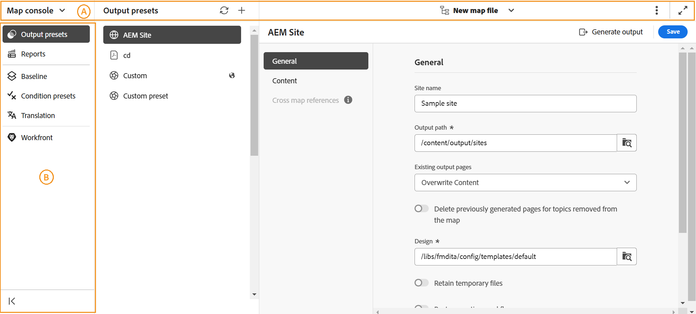

# Overzicht van kaartconsole

Adobe Experience Manager Guides biedt een specifieke console aan, die als **wordt bekend console van de Kaart**, om al uw kaartbeheer en het publiceren taken te stroomlijnen. Deze gecentraliseerde interface verbetert productiviteit en nauwkeurigheid in uw op kaart betrekking hebbende activiteiten door u opties te verstrekken om output te produceren, inhoud, toegangsrapporten, en meer te vertalen - allen bij één plaats.

{width="800" align="left"}

De de consoleinterface van de Kaart is hoofdzakelijk verdeeld in twee secties - **de bar van de Navigatie** en **Linkerpaneel**.

{width="800" align="left"}

- (**A**) **de bar van de Navigatie**: De hulpmiddelen van de navigatiebalkoppervlakten om navigatie te schakelen, de paginamening aan te passen, en de naam van het geselecteerde kaartdossier te tonen.

  De functies in de navigatiebalk worden als volgt uitgelegd:

   - **schakelaar van de Navigatie**: Staat naadloze navigatie aan andere pagina&#39;s - de Redacteur of de pagina van het Huis toe:
   - **Geselecteerd kaartdossier**: Toont de naam van het momenteel geselecteerde kaartdossier. U kunt het in de Redacteur openen of een verschillend kaartdossier voor de console van de Kaart kiezen.
   - **Meer acties**: Verstrekt opties om aan **Assets te navigeren UI** en **Montages**. Voor details, verwijs naar **Meer acties** sectie van [ ken het de eigenschappen van de Redacteur ](./web-editor-features.md#tab-bar) document.
   - **breid mening** uit: Staat u toe om de paginamening uit te breiden gebruikend **breid** pictogram uit. In deze weergave is de kopbalk verborgen en wordt de ruimte van de inhoud gemaximaliseerd. Om aan de standaardmening terug te keren, gebruik **Uitgang het uitgebreide meningspictogram**.

  >[!NOTE]
  >
  > Als het gebruiken van Adobe Experience Manager Guides as a Cloud Service, wordt een extra eigenschap [ AI Medewerker ](./ai-assistant.md) getoond in de navigatiebar.

- (**B**) **Linkerpaneel**: Het linkerpaneel geeft u snelle toegang tot de generatie van de Output, de verwezenlijking en het beheer van het Rapport, Basislijn, Vooraf ingestelde Voorwaarde, de vertaling van de Inhoud, en (slechts indien gevormd) eigenschappen Workfront.

  Voor meer details, verwijs naar de [ consoleeigenschappen van de Kaart hieronder ](#map-console-features) sectie.

## Functies voor kaartconsole

De volgende eigenschappen zijn beschikbaar in het Linkerpaneel wanneer u [ een DITA kaartdossier in de console van de Kaart ](./open-files-map-console.md) opent.

**Productie van de Output**

Met de console van de Kaart, kunt u output in diverse formaten, met inbegrip van AEM Sites, PDF, HTML5, EPUB, JSON, en douaneoutput efficiënt produceren door DITA-OT, de Inheemse publicatie van PDF, en FMPS. U kunt output voor een volledige kaart DITA produceren of u kunt selectief slechts een paar onderwerpen publiceren die u hebt bijgewerkt. U kunt de het publiceren eigenschap van de Basislijn ook gebruiken om een specifieke versie van uw kaart DITA of onderwerp selectief te publiceren.

Voor meer details, de generatie van de menings[ Output ](./generate-output.md).

**de verwezenlijking en het beheer van het Rapport**

In een organisatorische opstelling, wilt u de algemene volledigheid van uw technische documentatie verifiëren alvorens u aan het begint te werken of de documenten levend te duwen. Een dergelijke behoefte wordt zelfs nog belangrijker in omgevingen met meerdere gebruikers en op grote schaal. Met de Kaartenconsole krijgt u toegang tot Experience Manager Guides-rapporten die een nuttig inzicht geven in de algemene status van de inhoud in uw opslagplaats en hoe inhoud wordt gebruikt in het documentatieproces.

Voor meer details, mening [ Rapporten in Experience Manager Guides ](./reports-intro.md).

**Basislijn**

Experience Manager Guides biedt de functie Basislijn waarmee u een versie van uw onderwerpen en elementen kunt maken die u vervolgens kunt gebruiken voor publiceren of omzetten. U kunt ook meerdere uitvoervoorinstellingen van dezelfde DITA-kaart parallel publiceren.

Leer hoe te om [ basislijnen in Experience Manager Guides ](./web-editor-baseline.md) tot stand te brengen en te beheren.

**Voorinstellingen van de Voorwaarde**

Met Experience Manager Guides kunt u kenmerken definiëren in uw DITA-onderwerpen en met de voorinstelling voor voorwaarden opgeven wat er met het kenmerk in de uiteindelijke uitvoer gebeurt. U kunt bijvoorbeeld kenmerken als versie 1.0 en versie 2.0 toevoegen aan uw inhoud en een voorinstelling voor voorwaarden gebruiken om versie 1.0 op te nemen voor versie 1.0 en versie 2.0 uit te sluiten. Op dezelfde manier kunt u kenmerken als OS Windows en OS Linux aan uw inhoud toevoegen en vervolgens de relevante inhoud voor uw definitieve uitvoer opnemen of uitsluiten volgens het besturingssysteem.

Leer meer over [ Voorinstellingen van de Voorwaarde ](./generate-output-use-condition-presets.md).

**de vertaling van de Inhoud**

Experience Manager Guides wordt geleverd met krachtige functies waarmee u uw inhoud in meerdere talen kunt vertalen. Workflows voor het vertalen van mensen en machines worden ondersteund door Experience Manager Guides.

In de console van de Kaart, krijgt u toegang tot alle opties die worden vereist om met vertaalwerkschema&#39;s begonnen te worden. Voor meer details, mening [ vertaal inhoud ](./translation.md).

**Workfront**

De Workfront-functie is ook aanwezig in de Kaartenconsole waarmee u direct vanuit Experience Manager Guides kunt werken met Adobe Workfront-taken.

Leer over [ integratie van Adobe Workfront in Experience Manager Guides ](./workfront-integration.md).

U kunt tot deze eigenschap toegang hebben slechts als uw beheerder **de integratie van Adobe Workfront** in uw instantie van Experience Manager Guides heeft gevormd.