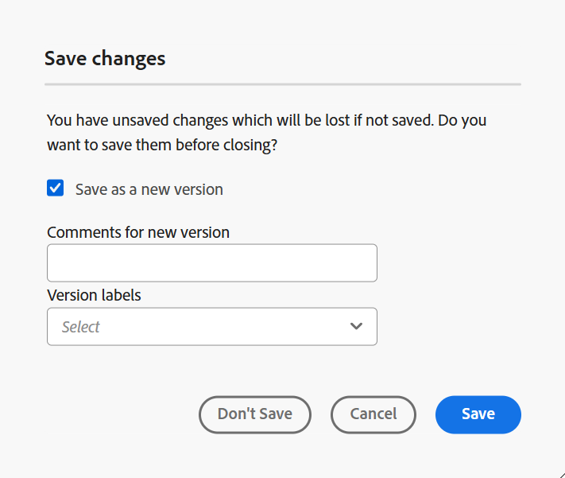
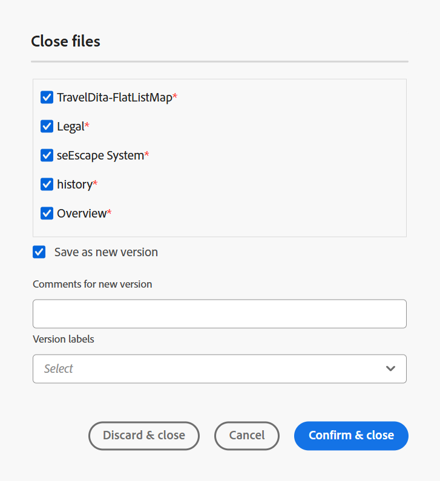

# Eigenschappen van Kaart-editor {#id1942D0S0IHS}

De toolbar in de Redacteur van de Kaart is gelijkaardig aan de onderwerpredacteur. De basisbewerkingen zoals het in- en uitschakelen van het linkerdeelvenster, het opslaan van een kaart, het maken van een nieuwe versie van de kaart, het ongedaan maken/opnieuw uitvoeren van de laatste bewerking en het verwijderen van de geselecteerde elementen komen in beide editors veel voor. Voor detail over hoe deze verrichtingen werken, mening [ ken de eigenschappen van de Redacteur ](web-editor-features.md#) sectie.

De opties die u in de redacteurstoolbar bekijkt zijn gebaseerd op de mening van de Redacteur van de Kaart. Er zijn vier weergaven beschikbaar in de Kaarteditor:

- [Layout](#layout-view)
- [Auteur](#author-view)
- [Source](#source-view)
- [Voorvertoning](#preview)

In de volgende secties worden de werkbalkopties beschreven die beschikbaar zijn in de verschillende weergaven van de Kaarteditor:

## Layoutweergave

Wanneer u een kaart opent om te bewerken, wordt de layoutweergave van de Kaarteditor geopend. In de layoutweergave wordt de kaarthiërarchie in een boomstructuurweergave weergegeven en kunt u de onderwerpen in een kaart ordenen.

>[!NOTE]
>
> In de layoutweergave worden alleen de verwijzingen weergegeven die zich in een kaart bevinden. Als verwijzingen worden verbroken, wordt links van de verwijzing een klein kruissymbool weergegeven

De werkbalk in de layoutweergave bevat de volgende opties:

**Verwijzing van het Onderwerp** - 

Toont de dialoog van het onderwerponderzoek. Navigeer aan het onderwerp/kaartdossier dat u **Uitgezocht** wilt opnemen en kiezen om het aan de kaart toe te voegen.

{align="left"}

**de groep van het Onderwerp** - 

Voeg het element `topicgroup` in. Voor meer informatie over het groeperen van onderwerpen, bekijk de [ documentatie 0} topicgroup {in de Specificatie van de Taal van OASIS DITA.](https://docs.oasis-open.org/dita/v1.0/langspec/topicgroup.html)

**Zeer belangrijke definitie** - 

Hiermee wordt het dialoogvenster Keydef invoegen weergegeven. In dit dialoogvenster kunt u een sleuteldefinitie definiëren die u wilt gebruiken in de kaart.

{width="300" align="left"}

**Tussenvoegsel vóór/Tussenvoegsel na** -  / 

Hiermee geeft u het dialoogvenster Element invoegen weer. Selecteer het element dat u op de kaart wilt invoegen. Afhankelijk van de bewerking wordt het nieuwe element ingevoegd voor of na het huidige element op de kaart.

**Voorste kwestie van het Tussenvoegsel** - 

Dit pictogram wordt weergegeven wanneer u een bladwijzer opent voor bewerking. U kunt componenten aan het begin van het boek invoegen, zoals een inhoudsopgave, een index en een lijst met tabellen.

**Tussenvoegsel Achtergrond** - 

Dit pictogram wordt weergegeven wanneer u een bladwijzer opent voor bewerking. U kunt componenten voor aan het eind van het boek als een Index, een Verklarende woordenlijst, en een Lijst van Cijfers opnemen.

**Beweeg het geselecteerde punt links/juist** -  / 

Selecteer de linkerpijl om het onderwerp naar de linkerkant in de hiërarchie te verplaatsen. Dit bevordert hoofdzakelijk het respectieve onderwerp één niveau omhoog in de hiërarchie. Als u bijvoorbeeld de pijl naar links selecteert terwijl een onderliggend onderwerp is geselecteerd, kunt u dit instellen als vergelijkbaar onderwerp erboven. Op dezelfde manier als u de juiste pijl selecteert, wordt het onderwerp geduwd in de richting van de juiste kant die het het kind van het onderwerp boven het maken.

**Beweeg omhoog/omlaag het geselecteerde punt**  - / 

Selecteer de pijl-omhoog of pijl-omlaag om het onderwerp omhoog of omlaag in de hiërarchie te verplaatsen.

>[!NOTE]
>
> U kunt de verwijzingen ook slepen en neerzetten om ze in een kaart te verplaatsen.

**Vergrendelen/Ontgrendelen**

Hiermee wordt een vergrendeling op het kaartbestand opgehaald en wordt de vergrendeling opgeheven. Als uw kaartbestand niet-opgeslagen wijzigingen bevat en u het vergrendelingsbestand vervolgens loslaat, wordt u gevraagd het kaartbestand op te slaan. De wijzigingen worden opgeslagen in de huidige versie van het kaartbestand.

**Fusie** - 

Voor meer details over het samenvoegen van inhoud van een verschillende versie van het zelfde of een verschillend dossier, mening [ samenvoegen ](web-editor-features.md#menu-dropdown) in de Redacteur.

**de geschiedenis van de Versie** - 

Controleer de beschikbare versies en de etiketten op uw actieve onderwerp, en keer aan om het even welke versie van de redacteur zelf terug.

**het etiket van de Versie** - 

Hiermee geeft u het dialoogvenster voor versielabel weer. Selecteer een versie in de vervolgkeuzelijst. Kies het etiket u op de geselecteerde versie wilt toepassen en **selecteren voeg etiket** toe om het toe te voegen.

**toon filename**

Toont filename van de titels van de onderwerpen.

>[!NOTE]
>
> Wanneer u de aanwijzer boven de titel van een onderwerp plaatst, wordt het bestandspad weergegeven.

**toon lijnaantallen**

Hiermee toont of verbergt u het regelnummer voor elk onderwerp. De regelnummers worden weergegeven, afhankelijk van het niveau in de hiërarchie.

**tonen checkbox**

Toont of verbergt checkbox voor elk onderwerp. U kunt het selectievakje gebruiken om het onderwerp te selecteren en verschillende taken uit te voeren via het menu Opties.

**menu van Opties in de lay-outweergave**

Naast het organiseren van onderwerpen in het kaartdossier, kunt u de volgende acties ook uitvoeren gebruikend het menu van Opties dat verschijnt wanneer het hangen over een dossier of het met de rechtermuisknop klikken binnen de redacteur in de lay-outweergave:

{width="650" align="left"}

- **voegt** toe: U kunt verkiezen om een nieuw onderwerp of een lege verwijzing van de Redacteur van de Kaart toe te voegen:
   - **Lege verwijzing**: Deze optie staat u toe om een lege verwijzing in uw kaart toe te voegen DITA. U kunt de opgenomen lege verwijzing later tweemaal klikken en de details van het Onderwerp toevoegen.
   - **Nieuw onderwerp**: Wanneer u verkiest om een nieuw onderwerp van het menu tot stand te brengen, krijgt u het **Nieuwe onderwerp** dialoogvakje. In het **Nieuwe onderwerp** dialoogvakje, verstrek de vereiste details en selecteer **creeer**.
- **Beweging**: U kunt verkiezen om een onderwerp naar boven/naar onder/naar rechts/naar links in de hiërarchie te bewegen. U kunt ook een onderwerp of een kaart van het paneel van de bewaarplaats aan de kaart slepen en neerzetten die in de Redacteur van de Kaart wordt geopend.
- **maak** ongedaan: maak de laatste verrichting in de mening van de Lay-out ongedaan.
- **opnieuw**: Opnieuw de laatste verrichting in de mening van de Lay-out.
- **Exemplaar**: Kopieer de geselecteerde verwijzing van het kaartdossier.

  >[!NOTE]
  >
  > U kunt de selectievakjes weergeven en vervolgens selecteren om meerdere verwijzingen te kopiëren.

- **Deeg**: Plak de gekopieerde verwijzingen bij de huidige plaats in de hiërarchie.
- **Schrapping**: Schrap de geselecteerde verwijzingen van het kaartdossier.

  >[!NOTE]
  >
  > U kunt de selectievakjes weergeven en vervolgens selecteren om meerdere verwijzingen te verwijderen.

**onderwerpen van de Mening die op voorwaardelijke filters** worden gebaseerd

Als u om het even welke voorwaarden op een onderwerp hebt toegepast, wordt een filterpictogram getoond op het recht van het onderwerp. Wanneer u de aanwijzer boven een filterpictogram houdt, ziet u de toegepaste voorwaarde en de kenmerkwaarde.

## Auteursweergave

De **mening van de Auteur** staat u toe om uw kaart DITA in de Redacteur uit te geven. Dit toont de WYSIWYG-weergave van de Kaarteditor en sommige pictogrammen die in de weergave Auteur worden weergegeven, zijn gelijk aan de layoutweergave.

{align="left"}

Bovendien kunt u de volgende pictogrammen weergeven en de verwante taken uitvoeren vanuit de weergave Auteur:

**Tussenvoegsel vóór/Tussenvoegsel na** -  / 

Geeft het element **Invoegen voor of **Element invoegen na dialoogvenster weer. Selecteer het element dat u op de kaart wilt invoegen. Afhankelijk van de bewerking wordt het nieuwe element ingevoegd voor of na het huidige element op de kaart.

**Element** - 

Toont het **element van het Tussenvoegsel** dialoogvakje. Selecteer het element dat u wilt invoegen. U kunt het toetsenbord gebruiken om door de lijst van elementen te scrollen en te drukken binnengaan om het vereiste element op te nemen. U kunt ook het element selecteren dat u in de kaart wilt invoegen.

<!-----------------------------------------------------------

**Relationship table** - 

Inserts a relationship table in the map.

Perform the following steps to work with relationship tables in the Basic Map Editor:

1.  In the Assets UI, navigate to the DITA map in which you want to create the relationship table.

1.  Select the DITA map to open it in DITA map console.

1.  Select the **Topics** tab to view a list of topics available in the DITA map.

    >[!TIP]
    >
    > The Topics tab gives you an option to download the map file with its dependents. For more details, view [Export a DITA map file](authoring-download-assets.md#id218UBA00IXA).

1.  In the main toolbar, select **Edit**.

    The map file is opened in the Advanced Map Editor.

1.  Select **Reltable** from the toolbar.

    {width="650" align="left"}

1.  Drag-and-drop topics from the topic list to the Reltable editor.

    >[!NOTE]
    >
    > You can add topics from any folder in the References rail.

    {width="550" align="left"}

1.  To add a header to your relationship table, click **Add Relheader**.

1.  To add a column to your relationship table, click **Add a Column**.

    {width="550" align="left"}

1.  Click **Save**.

You can also perform the following actions from the relationship table editor:

**Delete rows or columns**

If you want to delete a column from your table, select the checkbox in the column header and click Delete. If you want to remove a row from table, select the checkbox in the first column of the respective row and click Delete.

**Delete a topic**

If you want to delete a topic from your table, click the cross icon next to the topic.

**Delete the relationship table**

If you want to delete the relationship table, click anywhere outside the relationship table and click Delete. For details, view [Work with relationship tables in the Map Editor](map-editor-basic-map-editor.md).
----->

**Herbruikbare inhoud** - 

Toont het **Reuse de dialoogvakje van de inhoud**. In dit dialoogvenster kunt u de inhoud invoegen die u opnieuw wilt gebruiken op de kaart.

**verfrist de attributen van de navigatitel** - 

Hiermee kunt u het kenmerk `@navtitle` en het element `title` van een bestand waarnaar wordt verwezen, synchroon houden. U kunt verschillende typen bestanden toevoegen aan een kaart, zoals onderwerpen, taken, verwijzingen of submaps. De meeste hiervan ondersteunen het kenmerk `@navtitle` , dat bepaalt hoe de bestandsnaam op de kaart of in de inhoudsopgave wordt weergegeven. Als een bestand het kenmerk `@navtitle` bevat, wordt het kenmerk `@navtitle` voor hetzelfde bestand op de kaart bijgewerkt. Als het kenmerk `@navtitle` niet aanwezig is, wordt het kenmerk `@navtitle` toegevoegd aan dat referentiebestand en wordt de eigenschap `title` ook bijgewerkt om de eigenschap `@navtitle` weer te geven.

>[!NOTE]
>
> Uw beheerder kan verkiezen om deze knoop in de toolbar van de Redacteur van de Kaart te tonen of te verbergen gebruikend een configuratiebezit. Ze kunnen ook automatische toevoeging van het kenmerk `@navtitle` inschakelen wanneer bestanden aan een kaart worden toegevoegd. Voor meer details, omvat de mening [ attributen @navtitle door gebrek ](../cs-install-guide/auto-add-navtitle.md)* in installeer en vorm Adobe Experience Manager Guides as a Cloud Service.

**Markeringen**

Hiermee toont of verbergt u de XML-labels. De tags dienen als visuele aanwijzingen die de grens van een element aangeven. Als u in deze modus een onderwerp-/kaartverwijzing wilt invoegen, sleept u het gewenste bestand voor of na de tag. De horizontale balk wordt niet weergegeven in de modus Codes weergeven.

**de veranderingen van het Spoor** - 

U kunt alle in het kaartbestand aangebrachte updates bijhouden door de modus Wijzigingen bijhouden in te schakelen. Nadat u wijzigingen in de track hebt ingeschakeld, worden alle invoegingen en verwijderingen vastgelegd in het document. Voor meer details, de veranderingen van het overzicht [ Spoor ](web-editor-features.md#track-changes) in de Redacteur.

**creeer overzichtstaak** - 

U kunt een overzichtstaak van het huidige onderwerp of kaartdossier direct van de Redacteur tot stand brengen. Open het dossier waarvoor u de overzichtstaak wilt tot stand brengen en **selecteren creeer overzichtstaak** om het proces van de overzichtsverwezenlijking in werking te stellen. Volg de instructies die in de [ Inleiding worden gegeven om ](review.md#) voor meer details te herzien.

## Source-weergave

In deze weergave kunt u inhoud bewerken in de Raw-indeling, zodat u volledige controle hebt over de structuur en opmaak.

{align="left"}

In deze mening, verstrekt de toolbar basisinhoud het uitgeven en toevoegingsopties beschikbaar onder het **drop-down van het Menu** met inbegrip van Besnoeiing, Exemplaar, ongedaan maken, Opnieuw, Schrapping, Vondst en vervang, het etiket van de Versie, Samenvoegen, sparen als nieuwe versie, Slot en Ontgrendelen.

## Voorvertoning

In de modus Voorvertoning wordt de inhoud weergegeven zoals deze in de uiteindelijke uitvoer wordt weergegeven, zodat u de indeling en opmaak kunt bekijken voordat u deze publiceert.

Naast het kunnen de positie van elk onderwerpdossier binnen een kaart bekijken, is het wenselijk om de kaartinhoud in één opeenvolgende stroom te bekijken. Met de functie Kaart voorvertonen kunt u de volledige inhoud van het kaartbestand met één klik bekijken. U moet geen output van het kaartdossier produceren om te bekijken hoe de volledige kaart zal kijken als zodra gepubliceerd. U hebt eenvoudig toegang tot de voorvertoning van de kaart en alle onderwerpen en submaps worden weergegeven in de vorm van een boek.

{align="left"}

>[!NOTE]
>
> Er zijn geen opties voor het bewerken of invoegen van inhoud beschikbaar op de werkbalk in de modus Voorbeeld. U kunt de inhoud in deze weergave niet bewerken. Nochtans, kunt u **gebruiken sparen als nieuwe versie** en **Slot** of **ontgrendelen** eigenschappen.

In de voorvertoningsmodus kunt u de volgende aanvullende taken uitvoeren:

- Klik op een onderwerp met de rechtermuisknop aan, en selecteer **uitgeven** om het onderwerp voor het uitgeven in een nieuw lusje te openen.

  >[!NOTE]
  >
  > Als u geen bewerkingsrechten hebt, wordt het onderwerp geopend in de modus Alleen-lezen.

- Springen naar het gewenste onderwerp door de onderwerptitel te selecteren in de boomstructuur \(in linkerpaneel \).

- Het huidige onderwerp in kaartvoorproef wordt ook benadrukt in de kaartboom.

**Andere manieren aan voorproef een kaartdossier**

U kunt de voorvertoning van een kaart openen via:

- **Assets UI**: In Assets UI, navigeer aan de kaartplaats, selecteer het kaartdossier, en kies **de Kaart van de Voorproef** in Toolbar. De voorvertoning van de kaart wordt weergegeven op een nieuw tabblad. U kunt de inhoud van alle onderwerpen bekijken in de voorvertoningsmodus. In deze weergave kunt u geen onderwerp bewerken.

  >[!NOTE]
  >
  > Als de *optie van de Kaart van de Voorproef* niet zichtbaar in de belangrijkste toolbar is, zou het onder het **Meer** toolbarmenu kunnen bewogen zijn.

- **de Redacteur van de Kaart**: In de Redacteur van de Kaart, uitgezochte **Voorproef** van het optiemenu om de voorproef van de huidige kaart te bekijken.

  {width="650" align="left"}

  De voorvertoning van de kaart wordt weergegeven in een pop-upvenster.

  {width="500" align="left"}

**eigenschappen van de Kaart**

Hiermee geeft u het dialoogvenster Kaarteigenschappen weer waarin u de kenmerken en metagegevens voor de kaart kunt instellen.

## Onderwerpen bewerken via de DITA-kaart {#id17ACJ0F0FHS}

Het uitgeven van een individueel onderwerp geeft niet de volledige context aan de auteur. Een auteur zou geen informatie over waar een onderwerp in een kaart DITA wordt geplaatst hebben. Zonder deze contextuele informatie wordt het voor auteurs een beetje moeilijk om inhoud te creëren.

Experience Manager Guides staat auteurs toe om een kaart DITA in de Redacteur te openen en de plaatsing van onderwerpen binnen de kaart te bekijken. Dit helpt auteurs om precies te weten waar het onderwerp binnen de kaart wordt geplaatst en relevantere inhoud tot stand te brengen. Ook, als er veelvoudige auteurs zijn die aan een project werken, kunnen zij weten welke alle onderwerpen in de kaart beschikbaar zijn en inhoud hergebruiken, waar nodig.

Ga als volgt te werk om onderwerpen te bewerken via een DITA-kaart:

1. Navigeer in het deelvenster Opslagplaats naar het DITA-toewijzingsbestand dat u wilt bewerken en open het.

   Het kaartbestand wordt geopend in de Kaartweergave.

>[!NOTE]
>
> U kunt de gebruikersinterface van Assets ook gebruiken om een DITA-kaartbestand te openen. Navigeer aan het DITA kaartdossier dat de onderwerpen bevat u **uitgeven en wilt selecteren geeft Onderwerpen** in de belangrijkste toolbar uit om de Redacteur te lanceren.

1. Selecteer een onderwerpkoppeling om deze te openen in de Editor voor bewerking.

   U kunt veelvoudige onderwerpen in de redacteur openen en elk onderwerp wordt geopend in een nieuw lusje in de redacteur. Zelfs als uw kaart DITA submaps bevat, worden de onderwerpen van sub-maps ook geopend in een nieuw lusje voor het uitgeven. Als u de onderwerpen onder een submap wilt bekijken, kunt u submap selecteren en uitbreiden.

   {align="left"}

   Als u een kaartbestand selecteert, wordt de kaart geopend op een nieuw tabblad van de Editor.

1. Als u klaar bent met het bewerken van de onderwerpen, kunt u het volgende doen:

   - U kunt deze afzonderlijk opslaan. Als u sluit zonder uw onderwerpen op te slaan, zult u een dialoogdoos bekijken die u ertoe aanzet om de niet bewaarde onderwerpen te bewaren:

     {width="300" align="left"}

     U kunt alle geselecteerde onderwerpen opslaan of de onderwerpen deselecteren die u niet wilt opslaan.

   - U kunt het onderwerp ontgrendelen gebruikend **sparen als nieuwe versie** optie. Wanneer u sparen een versie van het onderwerp, wordt een nieuwe versie gecreeerd en het slot wordt ook vrijgegeven.

     Sla uw wijzigingen op voordat u de bestanden ontgrendelt.  Wanneer u de wijzigingen opslaat, wordt het XML-bestand gevalideerd.

   - U kunt de vooruitgang van de onderwerpen van **ook bekijken sparen als nieuwe versie** dialoogdoos. Er wordt een succesbericht weergegeven wanneer de bestanden worden ontgrendeld.

   - Als uw beheerder de optie voor het ontgrendelen van bestanden bij het sluiten heeft ingeschakeld, wordt u gevraagd om bestanden op te slaan wanneer de vergrendelde bestanden worden gesloten. Als deze optie is ingeschakeld en u de editor sluit met gewijzigde bestanden, wordt een lijst weergegeven met vergrendelde bestanden die moeten worden opgeslagen. De vergrendelde bestanden worden weergegeven met een vergrendelingspictogram:

     {width="350" align="left"}

## Rechterdeelvenster in de Kaarteditor

In het rechterdeelvenster worden de eigenschappen Inhoud en Kaart weergegeven in de layoutweergave van de Kaarteditor.

**eigenschappen van de Inhoud**

Het deelvenster Eigenschappen voor inhoud bevat informatie over het type onderwerp dat op dat moment in de kaart is geselecteerd, de koppeling-URL en de bijbehorende kenmerken. Voor meer details, mening [ Eigenschappen van de Inhoud ](web-editor-features.md#right-panel) in de Redacteur.

- **Andere Attributen** als uw beheerder een profiel voor attributen heeft gecreeerd, dan zult u die attributen samen met hun gevormde waarden krijgen. Gebruikend het paneel van inhoudseigenschappen, kunt u die attributen kiezen en hen toewijzen aan relevante inhoud in uw onderwerp. U kunt attributen ook toewijzen die door uw beheerder onder het **worden gevormd attributen van de Vertoning** lusje in de redacteursmontages. De kenmerken die voor een element zijn gedefinieerd, worden weergegeven in de layoutweergave en in de contourweergave. Dit helpt u om een snelle blik bij alle onderwerpen in een kaart te hebben waarvoor een bepaald attribuut wordt bepaald. Alle onderwerpen met het kenmerk `audience` worden bijvoorbeeld gedefinieerd als `US` .

  {width="650" align="left"}

  Voor meer details, bekijk de *attributen van de Vertoning* binnen de *3} eigenschapbeschrijving van Montages {in de* Redacteur [.](web-editor-features.md#main-toolbar)

- **Meta-gegevens** Gebruikend de meta-gegevens, kunt u de meta-gegevensinformatie plaatsen. U kunt de NAV-titel, Tekst koppelen, Korte beschrijving en Trefwoorden definiëren.

Voor meer informatie over de standaardonderwerpattributen en meta-gegevens, bekijk de [ topicref ](https://docs.oasis-open.org/dita/v1.2/os/spec/langref/topicref.html) documentatie in de Specificatie van de Taal OASIS DITA.

**Bovenliggend onderwerp:** [ Inleiding aan de Redacteur van de Kaart ](map-editor.md)
