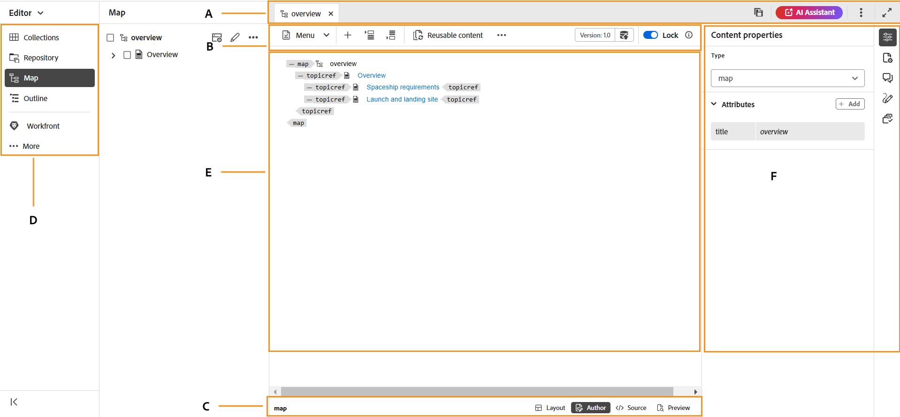
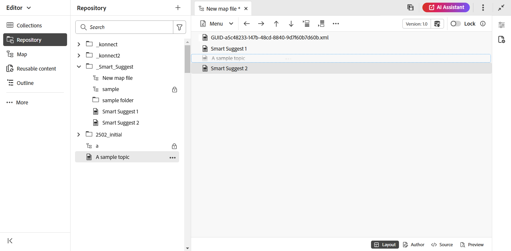

# Een kaart maken {#id176FEN0D05Z}

Adobe Experience Manager Guides biedt twee out-of-the-box kaartsjablonen: DITA-kaart en Bookmap. U kunt ook uw eigen kaartsjablonen maken en deze delen met uw auteurs om kaartbestanden te maken.

Voer de volgende stappen uit om een kaart te maken:

1. In het paneel van de Bewaarplaats, selecteer het **Nieuwe dossier** pictogram en selecteer dan **Kaart DITA** van dropdown menu.

   {align="left"}

   U kunt tot deze optie van de [&#x200B; Homepage van Experience Manager Guides &#x200B;](./intro-home-page.md) en tot het optiesmenu van een omslag in de mening van de Bewaarplaats ook toegang hebben.

2. De **Nieuwe kaart** dialoogdoos wordt getoond.

3. In het **Nieuwe kaart** dialoogvakje, verstrek de volgende details:
   - Een titel voor de kaart.
   - \(Optioneel\)* De bestandsnaam voor de kaart. De bestandsnaam wordt automatisch voorgesteld op basis van de titel van het onderwerp. Als de beheerder automatische bestandsnamen heeft ingeschakeld op basis van de UUID-instelling, wordt het veld Naam niet weergegeven.
   - Een malplaatje waarop het onderwerp zal worden gebaseerd. Voor een kaartdossier, zijn de beschikbare opties **Bookmap**, **Kaart**, en **Onderwerpregeling**.
   - Pad waarin u het kaartbestand wilt opslaan. Standaard wordt het pad van de geselecteerde map in de opslagplaats weergegeven in het veld Pad.

   {width="300" align="left"}

4. Selecteer **creeer**.

De kaart wordt gemaakt op het opgegeven pad. De kaart wordt ook geopend in de Kaarteditor voor bewerking.

{align="left"}

## Onderwerpen toevoegen aan een kaartbestand

Naast het rechtstreeks bewerken van kaartbestanden vanuit de Editor kunt u ook onderwerpbestanden openen in een kaart voor het bewerken van de Editor. U kunt onderwerpen toevoegen aan een kaartbestand.

Voer de volgende stappen uit om onderwerpen aan een kaartdossier van de console van de Kaart toe te voegen:

1. Navigeer in de weergave Opslagplaats naar het kaartbestand dat u wilt bewerken en open het.
1. Selecteer **uitgeven** pictogram.

   {width="450" align="left"}

1. Het kaartbestand wordt geopend in de Kaarteditor. Als u een nieuw kaartdossier hebt geopend, dan slechts wordt de titel van de kaart getoond in de redacteur.

   {align="left"}

   - **A** - \ (*bar van het Lusje* \): Dit is gelijkaardig aan de het tabbar van de Redacteur. De bar van het lusje van de mening [&#128279;](./web-editor-features.md#tab-bar) in de Redacteur voor meer details.

   - **B** - \ (*Toolbar* \) dit is de toolbar die u toestaat om met kaartdossiers te werken. Voor meer informatie over de functies beschikbaar door de toolbar, mening [&#x200B; Eigenschappen beschikbaar in de toolbar van de Redacteur van de Kaart &#x200B;](#features-available-in-the-map-editors-toolbar).

   - **C** - \ (*de meningen van de Kaart* \): Staat u toe om de Redacteur van de Kaart tussen de Lay-out, de Auteur, Source en de Voorproef te schakelen. De **mening van de Lay-out** staat u toe om de onderwerpen in een kaart te organiseren DITA. Dit geeft de boom of de hiërarchische mening van de kaart. De **mening van de Auteur** staat u toe om de onderwerpen in de Redacteur van de Kaart uit te geven. Dit geeft ook de WYSIWYG-weergave van het kaartbestand. De **mening van Source** staat u toe om met onderliggende XML van het kaartdossier te werken. De Voorproef geeft u een geconsolideerde mening van al onderwerp en submaps binnen het kaartdossier.

   - **D** - \ (*Linkerpaneel* \): Verleent toegang tot het linkerpaneel dat u toegang tot de Inzamelingen, Bewaarplaats, Kaart, Overzicht en andere eigenschappen geeft. U kunt het uit- of samenvouwen door het pictogram Uitvouwen/Samenvouwen te selecteren. Voor meer details over de eigenschappen beschikbaar in het linkerpaneel, mening [&#x200B; Linkerpaneel &#x200B;](./web-editor-features.md#left-panel) in de Redacteur.

   - **E** - \ (*Midden Gebied* \): De inhoud van de kaart het uitgeven gebied.

   - **F** - \ (*Juiste Comité* \): verleent toegang tot het paneel van Eigenschappen. U kunt de inhoudseigenschappen en de kaarteigenschappen van het geselecteerde onderwerp of de kaart bekijken. Voor meer details over de functionaliteit beschikbaar in dit paneel, mening [&#x200B; Juiste paneel &#x200B;](web-editor-features.md#right-panel) in de Redacteur.

1. In het LinkerComité, schakelaar aan de **1&rbrace; mening van de Bewaarplaats &lbrace;.**

1. Navigeer in de Adobe Experience Manager-opslagplaats naar de map met de onderwerpen of submaps die u wilt toevoegen.

1. Selecteer het onderwerp of kaartdossier in de **1&rbrace; mening van de Bewaarplaats &lbrace;en belemmering-en-daling het in het \ (midden \) gebied van de kaartinhoud het uitgeven.**

   Het onderwerp wordt toegevoegd in de kaart.

   {align="left"} toe

1. Als u volgende onderwerpen of een submap wilt toevoegen, sleept u het onderwerp of de submap naar de gewenste locatie in de kaart en zet u deze neer.

   Houd rekening met de volgende punten bij het samenstellen van uw kaartbestand:

   - Het bestand wordt toegevoegd op een locatie waar de onderbroken rechthoekbalk in het kaartbewerkingsgebied wordt weergegeven. In het volgende schermafbeelding, zal het *onderwerp van het de steekproefonderwerp van A* binnen tussen *Slimme Voorstellen 1* en *Slimme Voorstellen 2* onderwerpen worden toegevoegd.

     {align="left"}

   - Als u een onderwerp wilt vervangen, sleept u het nieuwe onderwerp naar het onderwerp dat u wilt vervangen. en laat vallen het erop wijst dat het zal worden vervangen met het onderwerp dat op het wordt gelaten vallen.

   - Als u een sub-kaart aan uw kaart DITA toevoegt, wordt submap getoond als verbinding in de kaart DITA. Houd Ctrl ingedrukt en klik op de submapkoppeling om alle onderwerpen van de submap weer te geven. De inhoud van de submap wordt weergegeven op een nieuw tabblad. Op dezelfde manier om een onderwerp van de kaart te openen DITA, CTRL+Klik de onderwerpverbinding en het opent omhoog in het nieuwe lusje.

   - U kunt de sneltoetsen CTRL+Z en CTRL+Y of de respectieve pictogrammen in de werkbalk gebruiken om wijzigingen in de kaart ongedaan te maken of opnieuw uit te voeren.

   - Om de positie van een onderwerp te veranderen, selecteer het onderwerp \ (door het onderwerppictogram te selecteren \), dan belemmering-en-daling het bij de gewenste plaats in het kaartdossier. In het volgende screenshot, stelt het onderwerp *Slimme 1* voor wordt bewogen na het *onderwerp van de Steekproef van A*.

     {align="left"}

   - Om de eigenschappen van uw kaartdossier te controleren, klik overal in de kaart het uitgeven gebied met de rechtermuisknop aan en kies **Eigenschappen** van het contextmenu. Op basis van uw Adobe Experience Manager-versie kunt u eigenschappen weergeven zoals metagegevens, \(de\)activering, verwijzingen, documentstatus en meer plannen.

1. Selecteer **sparen**.

## Een kaart maken met de gebruikersinterface van Assets

U kunt ook een kaartbestand maken via de gebruikersinterface van Assets en dit openen in de Kaarteditor voor bewerking.

Voer de volgende stappen uit om een kaart te maken van de gebruikersinterface van Assets:

1. Navigeer in de gebruikersinterface van Assets naar de locatie waar u het kaartbestand wilt maken.

1. Selecteer **creeer** \> **Kaart DITA**.

1. Voor de pagina van de Vervaging, selecteer het type van kaartmalplaatjes u **daarna** gebruiken en wilt selecteren.

   >[!NOTE]
   >
   > De manier waarop de onderwerpen in een kaartdossier worden bedoeld hangt van het kaartmalplaatje af. Bijvoorbeeld, als u het malplaatje van de Kaart selecteert, dan worden de onderwerpverwijzingen \ (`topicref` \) gebruikt om naar onderwerpen te verwijzen. In het geval van een Bookmap, worden de onderwerpverwijzingen gecreeerd gebruikend het `chapter` element in DITA.

   {align="left"}

1. Voor de pagina van Eigenschappen, specificeer de kaart **Titel**.

1. \ (Facultatief \) specificeer het dossier **Naam**.

   Als uw beheerder automatische bestandsnaam heeft geconfigureerd op basis van de UUID-instelling, wordt de optie voor het opgeven van de bestandsnaam niet weergegeven. Er wordt automatisch een op UUID gebaseerde bestandsnaam toegewezen aan het bestand.

   Als de optie voor het benoemen van bestanden beschikbaar is, wordt ook de naam automatisch voorgesteld op basis van de titel van uw kaart. Als u de naam van het kaartbestand handmatig wilt opgeven, moet u ervoor zorgen dat de bestandsnaam geen spaties, apostrof of accolades bevat en eindigt met `.ditamap` .

1. Selecteer **creeer**.

   Het bericht Kaart gemaakt wordt weergegeven.

   Aan elk nieuw kaartbestand dat u maakt via de gebruikersinterface van Assets of de Editor, wordt een unieke kaart-id toegewezen. Bovendien wordt de nieuwe kaart opgeslagen als de meest recente werkkopie in DAM. Totdat u een revisie van een pas gemaakte kaart opslaat, ziet u geen versienummer in de Versiegeschiedenis. Als u de kaart opent om te bewerken, wordt de versie-informatie weergegeven in de rechterbovenhoek van het tabblad van het kaartbestand:

   {align="left"}

   De versieinformatie voor een pas gecreëerde kaart wordt getoond als *niets*. Wanneer u een nieuwe versie opslaat, krijgt deze een versienummer toegewezen als 1.0. Voor meer informatie over het bewaren van een nieuwe versie, mening [&#x200B; sparen als nieuwe versie &#x200B;](web-editor-features.md#save-as-new-version).

   U kunt de kaart openen om te bewerken in de geconfigureerde kaarteditor, of het kaartbestand opslaan in de Adobe Experience Manager-opslagplaats.

   >[!NOTE]
   >
   > Als u de Geavanceerde Kaarteditor wilt gebruiken, opent u het kaartbestand in de Editor. Als uw beheerder de Geavanceerde Redacteur van de Kaart als standaardredacteur in de kaartdossiers heeft gevormd, dan wordt het kaartdossier geopend direct in de Geavanceerde Redacteur van de Kaart voor het uitgeven. De mening *plaatst de Geavanceerde Redacteur van de Kaart als standaard* sectie in installeer en vorm Adobe Experience Manager Guides as a Cloud Service.

### Onderwerpen vanuit de gebruikersinterface van Assets toevoegen aan een kaartbestand

Voer de volgende stappen uit om onderwerpen aan een kaartdossier van Assets UI toe te voegen:

1. Navigeer in de gebruikersinterface van Assets naar het kaartbestand dat u wilt bewerken.

   >[!NOTE]
   >
   > Zorg ervoor dat de modus voor het selecteren van elementen niet is ingeschakeld.

1. Om een exclusief slot op het kaartdossier te krijgen, selecteer het kaartdossier en selecteer dan de **Uitchecken** optie op de bovenkant.

   >[!NOTE]
   >
   > Als u eenmaal een exclusief kaartbestand hebt vergrendeld, kunnen andere gebruikers de kaart niet meer bewerken. Ze kunnen echter wel aan de onderwerpen in het kaartbestand werken. Als uw beheerder de Editor zodanig heeft geconfigureerd dat bestanden worden vergrendeld voordat ze worden bewerkt, kunt u een bestand pas bewerken als u het vergrendelt.

1. Met het geselecteerde kaartdossier, uitgezocht **geeft Onderwerpen** uit.

   {align="left"}

   Of, kunt u de **Edit optie van Onderwerpen** van het actiemenu op het kaartdossier ook selecteren:

   {align="left"}

   Het kaartbestand wordt geopend voor bewerking in de Editor. Om onderwerpen aan het kaartdossier toe te voegen, volg de stappen (4-8) in [&#x200B; onderwerpen aan een kaartdossier &#x200B;](#add-topics-to-a-map-file) toevoegen.

**Bovenliggend onderwerp: [&#x200B; Inleiding aan de Redacteur van de Kaart &#x200B;](map-editor.md)
