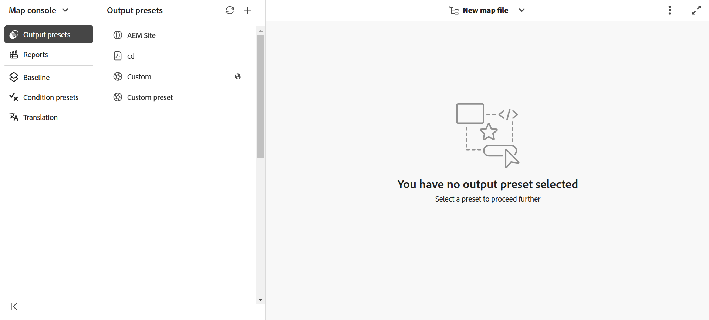

# Bestanden openen in kaartconsole

Voer de volgende stappen uit om een DITA kaartdossier in de console van de Kaart te openen:

1. Open **console van de Kaart** van de Homepage.

   {width="800"align="left"}

2. Aangezien er geen toewijzingsbestand is geselecteerd, wordt u gevraagd een kaartbestand te selecteren om de functies voor kaartbeheer en publicatie te gebruiken.

   

3. Kies **Uitgezochte kaart**, en selecteer een weg waar uw DITA kaartdossier wordt gevestigd.

   Het kaartbestand wordt geopend in de kaartconsole. Door gebrek, wordt de **Output vooraf instelt** tabel geselecteerd.

   {width="800"align="left"}

   >[!NOTE]
   >
   >  De kaart die in de console van de Kaart wordt geopend wordt gesynchroniseerd met de mening van de Kaart beschikbaar op de Redacteur.

## Kaartbestanden openen vanuit de Editor

U kunt een bestaand kaartdossier in de console van de Kaart van de Redacteur ook openen.

1. Navigeer naar het DITA-kaartbestand en selecteer dit in de weergave Opslagplaats.

   Het kaartbestand wordt geopend in de Kaartweergave.

2. Selecteer **Open in kaartconsole** pictogram.

   Het kaartbestand wordt geopend in de kaartconsole.

   {width="800" align="left"}

