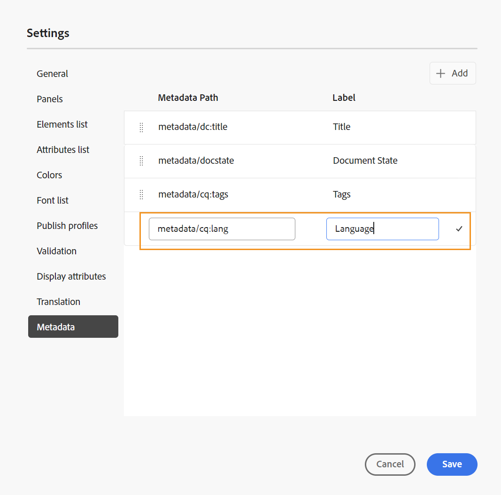

# DITA-kaartrapport van de kaartconsole {#id231HF0Z0NXA}

Adobe Experience Manager Guides wordt geleverd met een functie in de kaartconsole waarmee u de algehele integriteit van uw kaart kunt controleren en rapporten voor de kaart kunt genereren.

U kunt de onderwerpenlijst bekijken, de meta-gegevens van alle verwijzingen beheren, de lijst van verschillende media bekijken en alle gebroken verbindingen voor de huidige kaart van het **lusje van Rapporten** in de Console van de Kaart bevestigen die u als volgt kunt toegang hebben:

1. In het **paneel van de Bewaarplaats**, open het DITA kaartdossier in de mening van de Kaart.

   >[!NOTE]
   >
   > U kunt een kaart DITA direct in de **console van de Kaart** tabel van drop-down op de linkerbovenkant van de homepage ook openen.

1. Selecteer **Open in kaartconsole** pictogram.

   {width="600" align="left"}

1. Selecteer **Rapporten** van het linkerpaneel.

U kunt van alle vier rapporten van het **paneel van Rapporten** de plaats bepalen. Op basis van uw vereiste kunt u de rapporten selecteren die u hier ziet.

{align="left"}

Via het venster Rapporten hebt u toegang tot vier verschillende typen rapporten. Elk rapport, samen met zijn toegankelijkheid en eigenschappen, wordt hieronder in detail besproken.

## Rapport Onderwerplijst

Het **rapport van de Lijst van het Onderwerp** verstrekt gedetailleerde informatie over uw onderwerpen, zoals het verwijzingstype, documentstaat, en auteur.

U kunt het rapport van de onderwerpenlijst van een kaart bekijken door de volgende stappen uit te voeren:

1. Selecteer **Lijst van het Onderwerp** van het paneel van Rapporten. De lijst van onderwerpen aanwezig in de kaart DITA wordt getoond.

   {align="left"}

1. Van het **paneel van Filters** kunt u uw onderwerpen filtreren die op het **type van Verwijzing** \ (direct of indirect \), **de Staat van het Document** \ (bijvoorbeeld als uw onderwerpen in Edit, In-Overzicht, of Gereviseerde staat zijn, zijn deze vermeld \) of **Auteur** van het onderwerp.

   >[!NOTE]
   >
   > Alle filters bevatten een uitgebreide lijst met opties in het systeem.

1. U kunt ook de volgende opties voor het filteren van onderwerpen gebruiken om de volgende kolommen in de lijst weer te geven:

   - **Titel** De titel van het onderwerp wordt gespecificeerd in de kaart DITA. U kunt het onderwerp selecteren om het uit te geven.
   - **Naam van het Dossier** Naam van het dossier.
   - **UUID** het universeel unieke herkenningsteken \ (UUID \) van het dossier.
   - **Plaats van het Dossier** De volledige weg van het onderwerp.
   - **Type van Verwijzing** het type van verwijzing - direct of indirect.
   - **de Staat van het Document** De staat van het onderwerp.
   - **Auteur** De gebruiker die het laatst aan het onderwerp werkte. De lijst wordt gepagineerd en wordt asynchroon geladen, waarbij een beperkte set gebruikers tegelijk wordt weergegeven en meer wordt opgehaald terwijl u schuift of navigeert. Hierdoor worden de laadsnelheid en algemene prestaties verbeterd, vooral wanneer u met een groot aantal gebruikers werkt.
   - **Bovenliggende Kaart** De lijst van alle kaarten waar het onderwerp direct van verwijzingen wordt voorzien.
   >[!NOTE]
   >
   > Selecteer **verfrissen zich** om een nieuwe lijst van onderwerpen te krijgen en om het even welke verandering in uw kaartdossier te bekijken of als om het even welke verwijzing binnen uw onderwerpdossier wordt bijgewerkt.

1. Selecteer **Download** om de momentopname van alle onderwerpen in de kaart te downloaden DITA. Het excel blad bevat de geselecteerde kolommen en de onderwerpen die in de **1} mening van de Lijst van het Onderwerp {worden gefiltreerd.**

## Metagegevensrapport

Het **rapport van Meta-gegevens** verstrekt een gedetailleerd rapport van uw verwijzingen in de huidige kaart DITA zoals het verwijzingstype, documentstaat, markeringen, dossierplaats etc.

U kunt het meta-gegevensrapport van een kaart bekijken door de volgende stappen uit te voeren:

1. Selecteer **Meta-gegevens** van het paneel van Rapporten. De lijst met alle referenties van een kaart wordt samen met de metagegevens van de kaart weergegeven, zoals codes, documentstatus en aangepaste metagegevens. Om een nieuwe kolom van douanemetagegevens toe te voegen, verwijs naar [ kolommen van douanemetagegevens ](#add-custom-metadata-columns) sectie toevoegen.

   {align="left"}

1. Van het **paneel van Filters** kunt u uw onderwerpen filtreren die op de **Staat van het Document** \ (bijvoorbeeld als uw onderwerpen in Edit, In-Overzicht, of Gereviseerde staat zijn, zijn deze vermeld \), **Verwijzingen** \ (direct of indirect \), **het Type van Dossier** \ (Kaart, Onderwerp, Document, Beeld, Video en anderen \) van de verwijzing.

   >[!NOTE]
   >
   > Alle filters bevatten een uitgebreide lijst met opties in het systeem.

1. U kunt ook verkiezen om slechts de **Dossiers zonder markeringen** te bekijken of ook specifieke markeringen van de **3} filter van Markeringen te kiezen {om de dossiers te bekijken verbonden aan hen.**
1. U kunt ook de volgende opties voor het filteren van onderwerpen gebruiken om de volgende kolommen in de lijst met metagegevens weer te geven:
   - **Titel** \ (die door gebrek wordt geselecteerd \) De titel van het referenced dossier wordt gespecificeerd in de kaart DITA. U kunt het bestand selecteren om het te bewerken.

     >[!NOTE]
     >
     > Er verschijnt ook een uitcheckpictogram naast de titel van een uitgecheckt bestand. U kunt de muisaanwijzer boven het pictogram plaatsen om de naam van de gebruiker weer te geven.

   - **Naam van het Dossier** De naam van het dossier.
   - **Plaats van het Dossier** De volledige weg van het dossier.
   - **UUID** het universeel unieke herkenningsteken \ (UUID \) van het dossier.
   - **Markeringen** \ (die door gebrek worden geselecteerd \) die markeringen op het dossier worden toegepast.

     >[!NOTE]
     >
     > Standaard kunt u twee tags voor een bestand weergeven. Om meer markeringen te bekijken, selecteer **tonen Meer**. Selecteer **tonen Minder** om de lijst opnieuw aan te gaan.

   - **de Staat van het Document** \ (die door gebrek wordt geselecteerd \) de huidige staat van het verwijzingsdossier.
   - **Type van Verwijzing** het type van verwijzing - direct of indirect
   - **Type van Dossier** \ (geselecteerd door gebrek \) Type van het brondossier. De beschikbare opties zijn Kaart, Onderwerp, en Beeld.
   - **Vergrendeld door** de gebruiker die het dossier heeft gesloten.

1. Selecteer **Download** om de momentopname van alle verwijzingen in de kaart te downloaden DITA. Het excel blad bevat de geselecteerde kolommen en de verwijzingen die in de **worden gefiltreerd Meta-gegevens** mening.

### Metagegevens bulksgewijs beheren vanuit het metagegevensrapport

U kunt markeringen op een individueel onderwerp toepassen of de bulketiketterende eigenschap gebruiken om veelvoudige markeringen op veelvoudige onderwerpen, een kaart DITA, of op een sub-kaart toe te passen. U kunt de documentstatus van alle geselecteerde onderwerpen ook wijzigen in de volgende mogelijke algemene documentstatus.

### Metagegevens bijwerken

Voer de volgende stappen uit om metagegevens bij te werken:

1. Als u metagegevens wilt bijwerken, selecteert u het bestand of de bestanden waarvan u de metagegevens wilt bijwerken. U kunt de dossiers selecteren die in het paneel van Meta-gegevens verschijnen, door in de controledoos te controleren die naast **Titel** verschijnt.

   Als u alle verslagen wilt selecteren, gebruik **Uitgezocht allen** lusje boven de bar van de Titel. Aangezien de verslagen progressief laden aangezien u scrolt, zorg ervoor u aan het eind van de lijst scrolt alvorens **te gebruiken selecteer allen**. Dit zorgt ervoor dat bewerkingsmachtigingen en vergrendelingsstatus worden geëvalueerd voor alle bestanden, en niet alleen voor de records die momenteel zichtbaar zijn.

   >[!NOTE]
   >
   > Als een bestand is vergrendeld door een andere gebruiker, kan het niet worden geselecteerd voor het bijwerken van metagegevens. Er wordt ook een slotpictogram weergegeven bij de titel van een vergrendeld bestand. U kunt de muisaanwijzer boven het pictogram plaatsen om de naam van de gebruiker weer te geven.

   {align="left"}

1. Selecteer **leiden** van de bovenkant.

   {width="350" align="left"}

1. Als u nieuwe tags wilt toevoegen, selecteert u nieuwe tags in de vervolgkeuzelijst om deze toe te passen op alle geselecteerde onderwerpen. U kunt ook elke tag verwijderen door het kruispictogram bij de tag te selecteren.

1. Selecteer een nieuwe documentstatus als u de documentstatus van alle geselecteerde verwijzingen wilt wijzigen. De drop-down vertoningen de gemeenschappelijke mogelijke staat voor alle geselecteerde onderwerpen. Als de huidige status van uw onderwerpen bijvoorbeeld In-Review is, kunt u de status Concept, Goedgekeurd of Herzien weergeven.
1. Selecteer **Update** om de meta-gegevens bij te werken. Er wordt een bevestigingsbericht weergegeven voor de metagegevens, ongeacht of deze zijn bijgewerkt of dat de updates zijn mislukt. U selecteert ook **Rapport van de Download** om de momentopname van het rapport te downloaden. Deze momentopname bevat de details van de bijgewerkte status voor de geselecteerde verwijzingen.

### Aangepaste kolommen voor metagegevens toevoegen

Met deze functie kunt u naar behoefte aangepaste kolommen voor metagegevens toevoegen. Deze worden vervolgens weergegeven in de metagegevensrapporten. Het biedt ook meer flexibiliteit bij het rapporteren van metagegevens. Voer de volgende stappen uit als u een nieuwe kolom met aangepaste metagegevens wilt toevoegen:

1. Om een kolom van douanemetagegevens toe te voegen, de uitgezochte **montages van Workspace** (die als **Montages** voor **op-Prem** verschijnen) van de drie punten op de top-juiste hoek van de meta-gegevenspagina.

   {width="600" align="left"}

1. Selecteer **Meta-gegevens** op het linkerpaneel van pop-up die verschijnt.
1. Voeg een nieuw gebied van douanemetagegevens zoals per het vereiste toe gebruikend **** tabel toevoegt.

   {width="600" align="left"}

1. Geef een specifiek metagegevenspad en een relevante titel op voor het pad dat u in het rapport met metagegevens wilt toevoegen. Er worden bijvoorbeeld aangepaste metagegevens met de titeltaal en een specifiek pad toegevoegd.

   >[!NOTE]
   >
   > Als u een bepaalde kolom met metagegevens wilt verwijderen, kunt u deze verwijderen uit de weergegeven lijst. Bovendien, kunt u het **Etiket** uitgeven om de vertoningstitel van kolom te veranderen.

   {width="600" align="left"}

1. Selecteer **sparen** en **verfrissen** de mening van Meta-gegevens. Een nieuwe douanekolom **Taal** wordt toegevoegd in de lijst van Kolommen in het paneel van de Filter.

   >[!NOTE]
   >
   > Het toevoegen van een nieuwe meta-gegevenskolom wordt ook weerspiegeld in het **paneel van de Geschiedenis van de Versie** in de Redacteur. Voor meer informatie, mening **[Meta-gegevens](web-editor-features.md)**.

   {width="600" align="left"}

Op dezelfde manier kunt u de bovenstaande stappen volgen om nieuwe aangepaste metagegevensvelden toe te voegen op basis van uw vereisten die nodig zijn in de metagegevensrapporten.

## Multimedia-rapport

Het **Multimedia** rapport verstrekt gedetailleerde informatie over de multimedia die in uw kaart, zoals de titel wordt gebruikt, type \ (audio, video, en beelden \), dossiers waarin multimedia wordt gebruikt, en het verwijzingstype van de dossiers, waarin zij zijn gebruikt. U kunt ook de UUID en de locatie van de multimedia in de opslagplaats bekijken. U kunt een rapport van de multimedia bekijken door de volgende stappen uit te voeren:

1. Selecteer **Multimedia** van het paneel van het Rapport. De lijst met multimedia in de DITA-kaart wordt weergegeven.
1. Van het **paneel van Filters** u kunt tot de lijst door multimedia of door de namen van gebruikt in verwijzingen opdracht geven.

   - Wanneer u door **Multimedia** opdracht geeft, wordt de naam van multimedia getoond in de eerste kolom en dan de namen van alle verwijzingen waarin zij zijn gebruikt, in een andere kolom op de zelfde rij getoond. De volgende schermafbeelding toont bijvoorbeeld de multimediatestSong.mp3 in de eerste kolom en twee verwijzingen waarin deze wordt gebruikt, worden weergegeven in de derde kolom op dezelfde rij.

     {width="650" align="left"}

   - Als u door **in** kolom opdracht geeft die wordt gebruikt, zult u de omgezette mening bekijken waar de namen van de verwijzingen waarin multimedia zijn gebruikt in de eerste kolom zijn vermeld terwijl de namen van multimedia in een andere kolom op afzonderlijke rijen worden vermeld. De volgende schermafbeelding toont bijvoorbeeld de namen van twee verwijzingen naar \(testing_indirecte and Video content Topic\) in de eerste kolom en de multimediatestSong.mp3 wordt weergegeven in de derde kolom op twee aparte rijen.

     {width="650" align="left"}

1. U kunt uw multimedia filtreren die op het **wordt gebaseerd Type Multimedia**, en **Type van Verwijzing**. De lijst met multimediabestanden wordt weergegeven op basis van uw selectie in de vervolgkeuzelijst. U kunt er bijvoorbeeld voor kiezen om alleen de audioreferenties in uw DITA-kaart weer te geven en een bestand toont alleen de audioreferenties die in de kaart worden gebruikt.

1. U kunt ook de volgende filteropties gebruiken om de volgende kolommen in de lijst weer te geven:

   - **Multimedia** \ (die door gebrek wordt geselecteerd \) de titel van multimedia wordt gespecificeerd in de kaart DITA. U kunt de multimedia selecteren om deze te bewerken.
   - **Multimedia Plaats** de volledige weg van multimedia.
   - **Multimedia UUID** het universeel unieke herkenningsteken \ (UUID \) van het dossier.
   - **Type Multimedia** \ (die door gebrek wordt geselecteerd \) Type van multimedia. De beschikbare opties zijn Audio, Video of Afbeelding.
   - **gebruikt binnen** \ (die door gebrek wordt geselecteerd \) de verwijzingen waarin multimedia is gebruikt. U kunt de verwijzing selecteren om deze te bewerken.
   - **Type van Verwijzing** \ (die door gebrek wordt geselecteerd \) het type van verwijzing - direct of indirect.
   >[!NOTE]
   >
   > Selecteer **verfrissen zich** om een nieuwe lijst van multimedia te krijgen en om het even welke verandering in uw kaartdossier te bekijken of als om het even welke multimedia binnen uw kaart DITA wordt bijgewerkt.

1. Selecteer **Download** om de momentopname van alle multimedia in de kaart te downloaden DITA. Het excel blad bevat de geselecteerde kolommen en multimedia die in de **wordt gefiltreerd Multimedia** mening.

## Verbroken koppelingenrapport

De **Verbroken verbindingen** is een nuttig rapport dat u van de details van de gebroken verbindingen voorziet die in uw huidige kaart aanwezig zijn. U kunt de verbroken koppelingen weergeven, bijvoorbeeld voor DITA-onderwerpen, verwijzingen naar multimediabestanden, verwijzingen naar inhoudssleutels enzovoort. Je hebt ook de mogelijkheid om ze hier zelf op te lossen.
Het rapport bevat gedetailleerde informatie, zoals de verbroken koppeling, het type koppeling, de bestanden waarin de verwijzing wordt gebruikt en het type bestanden waarin deze is gebruikt.
U kunt het rapport voor verbroken koppelingen weergeven door de volgende stappen uit te voeren:

1. Selecteer **Verbroken verbindingen** van het paneel van Rapporten. De lijst met verbroken koppelingen of verwijzingen in de DITA-kaart wordt weergegeven.
1. Van het **paneel van Filters** u kunt tot de lijst door verbindingen of door de namen van gebruikt in verwijzingen opdracht geven.

   - Wanneer u door **Gebroken verbinding** opdracht geeft, worden de wegen van de gebroken verbindingen getoond in de eerste kolom en dan de namen van alle verwijzingen waarin zij zijn gebruikt, in een andere kolom op afzonderlijke rijen getoond. Als dezelfde verbroken koppeling in meerdere bestanden wordt gebruikt, worden deze op één rij weergegeven en worden ze als gegroepeerde of subrijen weergegeven. In de volgende schermafbeelding ziet u bijvoorbeeld twee verbroken koppelingen in de eerste kolom en de verwijzing waarin deze zijn gebruikt. `m_ElectricalSpecs_900.ditamap` wordt in de derde kolom op twee aparte rijen weergegeven.

   {align="left"}

   - Als u door **opdracht geeft die in** wordt gebruikt, zult u de omgezette mening bekijken waar de namen van de verwijzingen waarin de gebroken verbindingen zijn gebruikt in de eerste kolom vermeld zijn terwijl de gebroken verbindingen in een andere kolom op de zelfde rij worden vermeld. De volgende schermafbeelding toont bijvoorbeeld de verwijzing (waarin de verbroken koppeling wordt gebruikt) `m_ElectricalSpecs_900.ditamap` in de eerste kolom en de verbroken koppelingen worden weergegeven in de derde kolom op dezelfde rij.

   {align="left"}

1. U kunt uw gebroken verbindingen filtreren die op het **Type van Dossier** en **het Type van Verbinding** worden gebaseerd. De lijst met verbroken koppelingen wordt weergegeven op basis van uw selectie in de vervolgkeuzelijst. U kunt er bijvoorbeeld voor kiezen alleen de inhoudsverwijzingen in uw DITA-kaart weer te geven en een bestand toont alleen de verbroken inhoudsverwijzingen die erin worden gebruikt.

   Het Onderwerp DITA, Kaart DITA, de Verwijzing van het Dossier, Zeer belangrijke verwijzing, de Verwijzing van de Inhoud, de Verwijzing van het Beeld, de Verwijzing van het Multimedia- Dossier, en Zeer belangrijke Verwijzing zijn beschikbare waarden voor **Type van Verbinding** drop-down, en Onderwerp, Kaart, Document, Beeld, Video, Audio, en anderen zijn beschikbare waarden voor **het type van het type van het Dossier** drop-down.
1. U kunt ook de volgende filteropties gebruiken om de volgende kolommen in de lijst weer te geven:

   - **Gebroken Verbinding** (die door gebrek wordt geselecteerd) De weg van de gebroken verbinding wordt gespecificeerd in de kaart DITA.

   - **Type van Verbinding** (die door gebrek wordt geselecteerd) het type van de verbindingen. De beschikbare opties zijn Onderwerp, Kaart, Referentie van het Dossier, Zeer belangrijke verwijzing, Verwijzing van de Inhoud, Belangrijkste Verwijzing van de Inhoud, Verwijzing van het Beeld, Verwijzing van het Multimedia- Dossier, en Zeer belangrijke Verwijzing Multimedia.

   - **binnen gebruikt** (die door gebrek wordt geselecteerd) de verwijzingen waarin de gebroken verbinding is gebruikt. U kunt de verwijzing selecteren om deze weer te geven in de modus Schrijver.

   - **Type van Dossier** (die door gebrek wordt geselecteerd) het type van verwijzing - Onderwerp, Kaart, Document, Beeld, Video, Audio, en anderen.

   Selecteer **verfrissen zich** om een nieuwe lijst van gebroken verbindingen te krijgen en om het even welke verandering in uw kaartdossier te bekijken of als om het even welke gebroken verbinding binnen uw kaart DITA wordt bijgewerkt.
1. U kunt op het **verbindingspictogram van de Reparatie** () selecteren om de gebroken verbinding te bevestigen.

   >[!NOTE]
   >
   > Houd de muisaanwijzer boven het verbroken koppelingspad onder de kolom Verbroken koppeling om het pictogram Koppeling herstellen () weer te geven.

   U kunt een verbinding in beide meningen bevestigen - wanneer u door **Gebroken Verbindingen** of door **binnen Gebruikt** hebt bevolen.

   >[!NOTE]
   >
   > Wanneer u een verbroken koppeling corrigeert terwijl u de opdracht Verbroken koppelingen hebt gekregen, wordt de koppeling hersteld in alle bestanden waar deze wordt gebruikt (die in één rij zijn gegroepeerd).

1. U moet de vereiste verwijzingsdetails in de **dialoog van de Verbinding van de Update** bijwerken. De details die in **worden vereist zouden de dialoog van de Verbinding van de Update** van het type van verwijzing afhangen.\
   Als u een koppeling hebt hersteld, wordt deze niet weergegeven onder de lijst met verbroken koppelingen. In plaats daarvan kunt u deze weergeven onder Onderwerplijst of Metagegevens.

1. Selecteer **Download** om de momentopname van alle gebroken verbindingen in de kaart te downloaden DITA. Het Excel-bestand bevat de geselecteerde kolommen en de verbroken koppelingen die zijn gefilterd in de weergave Verbroken koppelingen.

**Bovenliggend onderwerp:**[ Inleiding aan rapporten ](reports-intro.md)
