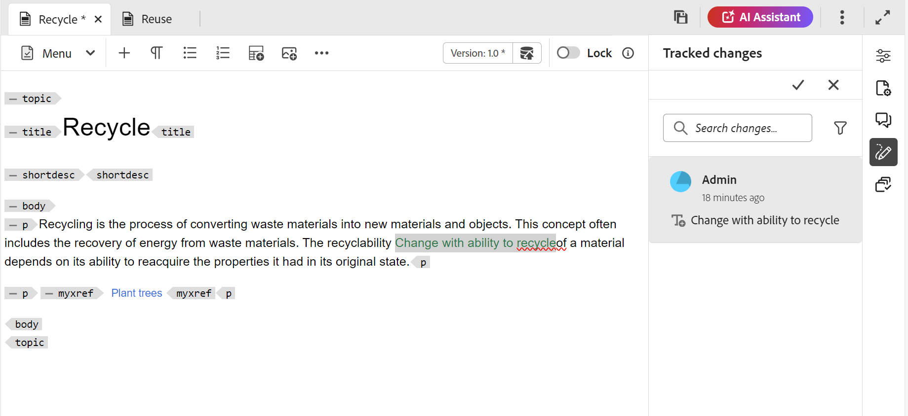

# Opmerkingen voor revisie van adres {#id2056B0X0KBI}

Als auteur, kunt u commentaren in een onderwerp richten gebruikend de Redacteur. De opmerkingen worden geladen op basis van de revisietaak die is geselecteerd in het deelvenster Revisie. Voor meer details, bekijk de **paneel** eigenschapbeschrijving van het Overzicht  {in de [ Linkerpaneel ](../user-guide/web-editor-features.md#id2051EA0M0HS) sectie.

De volgende secties beschrijven manieren om commentaren in de Redacteur te richten.

Een auteur kan opmerkingen in een document adresseren vanuit de Editor. Visuele indicatoren die erop wijzen of de commentaren die \ (tekst \) werden opgenomen, werden geschrapt of werden benadrukt. Het type opmerking wordt ook boven aan elke opmerking vermeld.

>[!NOTE]
>
> Zorg tijdens het richten van overzichtscommentaren \ (voor een actief overzichtsdocument \), ervoor dat u niet het onderwerp in-overzicht in veelvoudige lusjes met volledig toegelaten markeringsmening opent, niet tussen de Auteur en de meningswijzen van Source schakelt.

{align="left"}

In de Editor bevat het rechterdeelvenster de pictogrammen Revisie en Wijzigingen bijhouden. In het deelvenster Revisie worden alle opmerkingen weergegeven die door revisoren in uw document zijn gemaakt. Het **paneel van de veranderingen van het Spoor** toont de status van alle opgenomen en geschrapte commentaren in uw document.

- **A**: Selecteer een overzichtstaak om overzichtscommentaren te bekijken. Als uw onderwerp voor overzicht in veelvoudige overzichtstaken is gedeeld, zult u die taken bekijken die in deze drop-down worden vermeld.

  Wanneer u een revisietaak in de lijst selecteert, kunt u de opmerkingen bekijken die door de revisoren in die taak zijn gemaakt. U kunt de revisieopmerkingen in taken onafhankelijk verwerken. Dit betekent dat een update van een opmerking alleen zichtbaar is voor revisoren van die taak.

- **B:** selecteer **details van het Overzicht**  in het **paneel van Commentaren** om meer informatie over de overzichtstaak te bekijken:

   - **Naam**: Naam van de overzichtstaak.
   - **Versie van het Overzicht**: Toont de versie verbonden aan de geselecteerde overzichtstaak. Zo kunt u de versie bijhouden die u hebt gedeeld voor revisie
   - **Status**: Huidige status van de overzichtstaak.

  >[!NOTE]
  >
  > Als de wortelkaart van uw overzichtstaak van de auteurswortelkaart verschillend is, toont het de informatie over het om erop te wijzen dat de creatie en de kaart van de overzichtswortel niet aanpassen.

- **C**: Als u uw onderwerp na het in werking stellen van het overzicht hebt bijgewerkt, dan terugkeert het selecteren van **Onderwerp aan het pictogram van de Versie van het Overzicht** uw het werk exemplaar terug naar de versie die voor overzicht werd gedeeld. Hierdoor kunt u de revisie-feedback rechtstreeks opnemen in de versie die ter controle is gedeeld. Na het opnemen van terugkoppelt, kunt u veranderingen in de omgekeerde versie bewaren of een nieuwe revisie van uw onderwerp tot stand brengen. Als u verkiest om een nieuwe revisie van uw onderwerp tot stand te brengen, dan wordt een nieuwe tak gecreeerd van de onderwerpversie die voor overzicht werd gedeeld. Als u bijvoorbeeld versie `1.2` van een onderwerp hebt gedeeld voor revisie terwijl de huidige ontwerpversie `1.3` is, kunt u dit pictogram gebruiken om terug te gaan naar versie `1.2` voor het opnemen van revisieopmerkingen. Als u een nieuwe revisie maakt nadat u wijzigingen in versie `1.2` hebt ingevoegd, wordt een nieuwe vertakking met versie `1.2.0` gemaakt voor het onderwerp.

  Typisch, na het opnemen van overzicht terugkoppelt, zou u veranderingen van de recentste versie van het onderwerp willen samenvoegen. Om dit te doen, gebruik de [ eigenschap van de Fusie ](web-editor-features.md#id205DF04E0HS) om alle die updates te krijgen nadat het onderwerp voor overzicht werd gedeeld.

- **D**: Open de zij-aan-zij mening om de gecommentarieerde versie van het onderwerp te tonen. Zoals in het bovenstaande schermafbeelding te zien is, is de meest linkse sectie de nieuwste versie van het onderwerp waarin u wijzigingen kunt aanbrengen. De volgende sectie is de gecommenteerde versie van het onderwerp. Aangezien u tussen commentaren in het onderwerp navigeert, verandert de zijmening en toont die versie van het onderwerp waarop de commentaar werd gemaakt. Elke opmerking in het opmerkingenvenster is gekoppeld aan de corresponderende tekst in deze sectie. Hiermee kunt u de tekst met opmerkingen herkennen. De opmerkingen worden weergegeven in de volgorde van de tekst met opmerkingen in het document.

  U kunt het versienummer boven aan de zijweergave bekijken. Als u dit pictogram selecteert, wordt de versie met opmerkingen van het onderwerp weer verborgen.

- E: Importeer de ingevoegde en verwijderde \(of Doorhalen\) opmerkingen rechtstreeks in het onderwerp. Na het selecteren van het pictogram van de Invoer, worden alle teksttoevoegingen en schrappingen getoond in het werkende exemplaar van het onderwerp. Er zijn nu twee manieren om opmerkingen te accepteren of te verwerpen.

  Als u de voorgestelde wijziging één voor één wilt opnemen, klikt u gewoon met de rechtermuisknop op de opmerking in de inhoud en selecteert u Wijziging accepteren of Wijziging negeren. Afhankelijk van uw selectie wordt de opmerking geaccepteerd of afgewezen. In het geval van een geaccepteerde opmerking wordt de inhoud toegevoegd aan de inhoud en in het geval van afwijzing wordt deze uit de inhoud verwijderd. De status van de opmerking wordt ook gewijzigd in het deelvenster Revisie.

  {align="left"}

  U kunt ook het deelvenster Wijzigingen bijhouden gebruiken om opmerkingen te accepteren of af te wijzen. Als u een opmerking selecteert, wordt de opmerking in het document gemarkeerd.

  {align="left"}

  >[!IMPORTANT]
  >
  > De functie Opmerkingen importeren werkt alleen voor de documenten die niet zijn gewijzigd sinds ze zijn gedeeld voor revisie. Als u om het even welke verandering na het verzenden van het document voor overzicht hebt aangebracht, zult u een alarm aan **krijgen van de Invoer van de Kracht** commentaren in uw document. Dit leidt echter tot het verlies van alle updates die u in uw document hebt gemaakt. Het **alarm van de Invoer van 0} Kracht wordt ook getoond als het document buiten wordt gecreeerd en dan voor overzicht wordt gedeeld.** U kunt de opmerkingen importeren.

  Als en wanneer u een opmerking accepteert of afwijst, wordt deze verwijderd uit de lijst Bijgehouden wijzigingen. Dit is ook een indicator voor het aantal opmerkingen dat in het document moet worden behandeld.

- **F**: Van het Meer menu van Opties, Download alle gehechtheid beschikbaar in het overzichtsonderwerp.
- **G**: Onderzoek naar een tekst binnen commentaren.
- **H**: Accepteer of verwerp een commentaar.

- **I**: Pas een filter op de commentaren toe. U kunt filteren om opmerkingen weer te geven op basis van het revisietype \(alle, gemarkeerde, verwijderde, ingevoegde of notitie\), de revisiestatus \(alle, geaccepteerde, geweigerde of geen\), de revisoren \(alle of specifieke revisoren\(s\)\) of de versies van het onderwerp.

**Antwoord aan een commentaar door andere gebruikers te etiketteren**

Als auteur en initiator van de revisietaak kunt u reageren op revisieopmerkingen en andere gebruikers die bij dezelfde revisietaak zijn betrokken, een tag toewijzen om hun aandacht te richten of follow-ups toe te wijzen. Deze functionaliteit is alleen beschikbaar voor actieve revisietaken.

>[!NOTE]
>
> Om de lijst van gebruikers te bekijken die aan een overzichtstaak worden toegewezen en hen in een commentaar etiketteren, moet u *Gelezen toegang* op `/home/users and /home/groups` knopen hebben. Voor details, mening [ gebruikersbeleid en veiligheid ](../cs-install-guide/user-admin-sec.md#additional-notes-on-user-groups).   Als er na het bevestigen van de toegang nog steeds geen codes beschikbaar zijn, moet uw beheerder mogelijk een `user-admin` -licentie toewijzen om deze functionaliteit in te schakelen.

{width="350" align="left"}
*de gebruikers van de Titel :Tag als initiatiefnemer/Auteur*

Gecodeerde gebruikers ontvangen zowel een e-mail als een AEM-melding, zodat ze deze snel kunnen informeren. Voor meer details op hoe de heroverwegingsberichten teweegbrengen, mening [ het Begrip van heroverwegingsberichten ](./review-understanding-review-notifications.md).

**de revisiecommentaren van de Toegang gebruikend het Overzicht UI**

Als u de initiatiefnemer of Auteur van een overzichtstaak bent en het van de **console van Projecten** opent, zal het onderwerp in het Overzicht UI lanceren. Aangezien deze taak niet aan u is toegewezen, kunt u opmerkingen weergeven en hierop reageren, maar kunt u geen revisiehandelingen uitvoeren. De werkbalk Opmerkingen blijft uitgeschakeld voor gebruikers die niet aan de taak zijn toegewezen.

{width="350" align="left"}

**Bovenliggend onderwerp:**[ Inleiding aan overzicht ](review.md)
