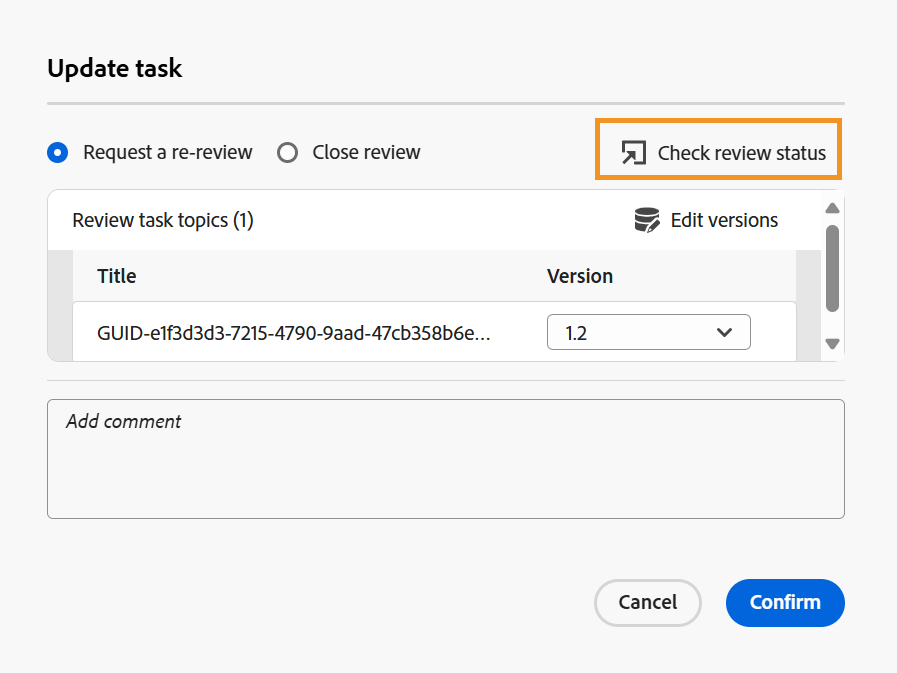

# Nieuwe revisie aanvragen of een revisietaak als auteur sluiten

>[!IMPORTANT]
>
> De nieuwe functies die in dit artikel worden beschreven, zijn standaard ingeschakeld met de release 2508 van Experience Manager Guides as a Cloud Service. Revisies die vóór de migratie zijn gemaakt, worden niet beïnvloed en blijven gebruikmaken van de eerdere workflow. Als u de bestaande functies zonder deze updates wilt blijven gebruiken, neemt u contact op met het team voor succes van de klant om de nieuwe functies uit te schakelen.

Wanneer een overzichtstaak wordt duidelijk zoals voltooid door een Recensent, wordt een bericht teweeggebracht aan de taakinitiatiefnemer, toelatend hen om tot de taak en verwante commentaren op taakniveau toegang te hebben en te herzien.

Als initiatiefnemer van de overzichtstaak, kunt u dan beslissen hoe te te te werk te gaan gebaseerd op terugkoppelt. De beschikbare opties zijn:

- Nieuwe beoordeling aanvragen
- De revisietaak sluiten

## Nieuwe revisie aanvragen of een revisietaak sluiten

Voer de volgende stappen uit om een revisie aan te vragen of een revisietaak te sluiten:

1. Open het **paneel van het Overzicht** van het linkerpaneel van de Redacteur.
2. Selecteer de overzichtstaak u voor overzicht van de **Actieve taken** lijst wilt sluiten of opnieuw voorleggen.

   >[!NOTE]
   >
   > U kunt tot de **pagina van de Details van de Taak** toegang hebben om de overzichtstaak te beheren. Om dit te doen, selecteer **Open taakdetails** van het menu van Opties van om het even welke actieve overzichtstaak. Dit opent taakdetails in de console van Projecten.

   
3. Selecteer het **pictogram van de commentaren van de Taak** om tot de commentaren van het taakniveau toegang te hebben en te herzien die door de Recensent worden toegevoegd.

   .

   De **commentaren van de Taak** dialoog wordt getoond op het recht.

   {width="350" align="left"}.
4. Selecteer **de taak van de Update** om verdere actie op de geselecteerde overzichtstaak te voeren.
5. In de **taak van de Update** dialoog, kies één van de volgende acties:

   - **verzoek een herbeoordeling**: Initieert een andere ronde van overzicht. U kunt een andere versie van het onderwerp voor overzicht selecteren. Door gebrek, wordt de recentste (of laatste-uitgegeven) versie van het onderwerp of kaartdossier die voor overzicht wordt verzonden geselecteerd. U kunt **ook gebruiken uitgeeft versies** optie om de versie van geselecteerde onderwerpen aan **Latest versie** of **Basislijn** te plaatsen zoals per de behoefte.  Revisoren die de vorige revisie hebben voltooid, ontvangen een melding om feedback te geven over de bijgewerkte versie. Andere controleurs, die de overzichtstaak niet als volledig hebben gemerkt, worden op de hoogte gebracht over de onderwerpupdate.

   - **dicht overzicht**: Sluit de overzichtstaak. De **taak van de Update** knoop aanwezig bij de bodem van het paneel van het Overzicht verandert in **Gesloten** en een bericht wordt verzonden naar alle gebruikers betrokken bij de overzichtstaak die op zijn sluiting wijzen.

   Voor details op hoe de heroverwegingsberichten teweegbrengen, mening [ het Begrip van heroverwegingsberichten ](./review-understanding-review-notifications.md).

   {width="350" align="left"}

   U kunt ook [ de status van uw overzichtstaak ](./review-manage-tasks-review-dashboard.md#check-the-status-of-a-review-task) controleren gebruikend de **de revisiestatus van de Controle** optie huidig in de de taakdialoog van de Update. Als u deze optie selecteert, gaat u naar het revisiedashboard waar het statusrapport van de revisietaak wordt weergegeven.

   {width="650" align="left"}

6. Selecteer **bevestigen**.

Als Auteur of initiatiefnemer van een overzichtstaak, wanneer u de taak sluit, wordt de **taak van de Update** knoop huidig bij de bodem van het paneel van het Overzicht veranderd in **Gesloten**, die op de taak wijzen niet meer actief is.

{width="350" align="left"}

Ook, blijft de **taak van de Update** knoop huidig in het paneel van het Overzicht gehandicapt voor de andere gebruikers van de overzichtstaak. Bijvoorbeeld, als één van de recensenten van een overzichtstaak, als u de taak in de Redacteur opent, zal de de taakknoop van de Update met een bericht **worden onbruikbaar gemaakt u hebt geen toestemming om op deze taak** te handelen. Alleen de aanvrager van een revisietaak heeft toestemming om de taak bij te werken vanuit de Editor.

{width="350" align="left"}

