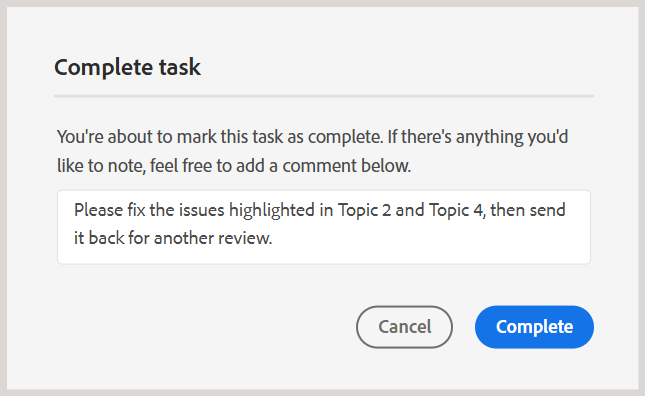
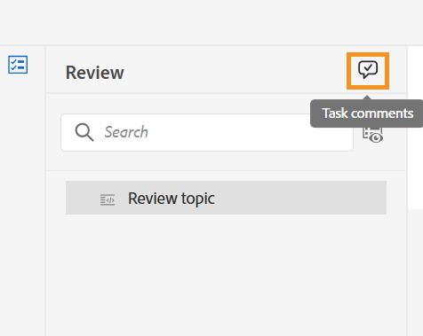
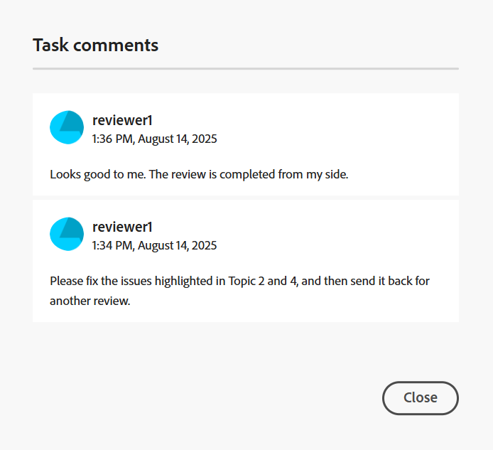

# De revisietaak voltooien als Revisor

>[!IMPORTANT]
>
> De nieuwe functies die in dit artikel worden beschreven, zijn standaard ingeschakeld met de release van 2508 Experience Manager Guides als Cloud Services. Revisies die vóór de migratie zijn gemaakt, worden niet beïnvloed en blijven gebruikmaken van de eerdere workflow. Als u de bestaande functies zonder deze updates wilt blijven gebruiken, neemt u contact op met het team voor succes van de klant om de nieuwe functies uit te schakelen.

Als recensent kunt u een revisietaak markeren als voltooid zodra u alle inhoud hebt gecontroleerd en de auteur op de hoogte wilt stellen. U kunt in dit stadium ook alle definitieve opmerkingen achterlaten.

Voer de volgende stappen uit om een overzichtstaak te voltooien:

1. Open de controletaak die aan u is toegewezen.
2. Selecteer **Teken zoals gedaan** van de bovenkant zoals hieronder getoond:

   {width="350" align="left"}

   Het **Volledige taakdialoog** wordt getoond.
3. In de **Volledige taakdialoog**, voeg definitieve commentaren voor de Auteur toe en selecteer **Volledig**.

   >[!NOTE]
   >
   > De taak-vlakke commentaren dienen als samenvatting of definitieve commentaren, en zijn verschillend van de tekst-vlakke commentaren die tijdens de onderwerprevisie worden toegevoegd. In dit dialoogvenster kunt u vervolgacties schetsen, zoals het verzoek aan de auteur om specifieke opmerkingen te maken en de taak opnieuw te verzenden voor controle, of u kunt aangeven dat de revisie is voltooid.

   Als revisor kunt u bijvoorbeeld een opmerking toevoegen als een vervolgactie voor de auteur:

   {width="350" align="left"}

   U kunt ook een opmerking toevoegen om de voltooiing van de taak aan te geven, zoals hieronder wordt weergegeven:

   {width="350" align="left"}

U hebt met succes de taak zoals voltooid gemerkt, en zijn status wordt nu geplaatst aan **Voltooid**. Er zijn geen verdere acties toegestaan als de taak is gemarkeerd als voltooid. Er wordt een kennisgeving verzonden naar de auteur of aanvrager van de toetsingstaak om hun directe aandacht te vestigen. Voor meer details op hoe de heroverwegingsberichten teweegbrengen, mening [ het Begrip van heroverwegingsberichten ](./review-understanding-review-notifications.md).

{width="350" align="left"}

Gebaseerd op terugkoppelt, als de Auteur of de initiatiefnemer van de taak beslist om [ de overzichtstaak ](./review-close-review-task.md) te sluiten, wordt de taakstatus op het Overzicht UI veranderd in **Gesloten**.

{width="350" align="left"}

## Opmerkingen op taakniveau weergeven

Alle taak-vlakke commentaren worden getoond in de **commentaren van Taken** dialoog, die op de read-only wijze beschikbaar is. Wanneer u een revisietaak voltooit met een laatste opmerking, wordt uw invoer in dit dialoogvenster opgenomen ter referentie.

Om tot taak-vlakke commentaren van het Overzicht UI toegang te hebben, navigeer aan het linkerpaneel en selecteer het **commentaren van de Taak** pictogram.

{width="350" align="left"}

De **commentaren van de Taak** dialoog wordt getoond op het recht.

{width="350" align="left"}

De opmerkingen in het dialoogvenster worden in chronologische volgorde weergegeven, waarbij de recente opmerkingen als eerste worden weergegeven en de oudste opmerkingen als laatste. Deze orde helpt u het gesprek volgen aangezien het in tijd evolueerde.

De **commentaren van de Taak** dialoog is toegankelijk voor alle gebruikers betrokken bij de overzichtstaak, met inbegrip van de Auteur of initiatiefnemer van de overzichtstaak en andere Reviewers. Daarom kunnen de opmerkingen van andere revisoren (indien van toepassing) ook worden weergegeven in het dialoogvenster Taakopmerkingen. Dit helpt duidelijke en traceerbare communicatie door het revisieproces te verzekeren.

Na het controleren van de feedback op taakniveau kan de auteur om een nieuwe beoordeling vragen of de controletaak sluiten. In beide gevallen, blijven alle commentaren die tijdens het overzichtsproces worden gevangen beschikbaar in de **commentaren van de Taak** dialoog voor verwijzing.

