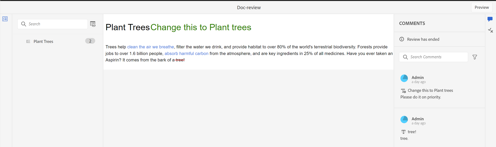

# Een voltooide revisietaak weergeven

U kunt controletaken uitvoeren voor de projecten waarvoor u de auteur (of aanvrager) bent. Als een controletaak is voltooid, kunnen u en alle revisoren deze openen in de modus Alleen-lezen.

## Als recensent

Als revisor kunt u een indicator in het venster Opmerkingen weergeven om aan te geven dat de revisie is beëindigd. De werkbalk Opmerkingen wordt niet weergegeven. U kunt opmerkingen dus niet markeren, doorhalen, invoegen of toevoegen. U kunt een opmerking lezen, maar u kunt geen opmerkingen bewerken of verwijderen. U kunt ook geen reactie toevoegen aan de opmerkingen. U kunt de contextuele werkbalk niet weergeven (als u tekst wilt markeren of doorhalen). Het pictogram Verouderde opmerkingen wordt ook niet weergegeven bij een voltooide revisietaak.

U kunt echter alle opmerkingen doorzoeken of filteren. U kunt er ook voor kiezen om voorwaarden weer te geven of te verbergen en geconditioneerde inhoud dienovereenkomstig weer te geven. U kunt alle bijlagen downloaden, maar u kunt geen bijlagen voor de opmerkingen uploaden of verwijderen.

{align="left"}

## Als auteur

U kunt de voltooide overzichtstaken in het **paneel van het Overzicht** op een projectniveau van de **Gesloten taken** sectie zoals aangetoond in het screenshot bekijken. U kunt overzichtstaken zoeken of filteren die op Projecten worden gebaseerd. Bijvoorbeeld, kunt u specifieke projecten in het **de dialoogvakje van de Filter** selecteren en hen hebben die in het Actieve overzichtspaneel worden getoond. U kunt de resultaten verder filtreren gebruikend de **Taken die door me** worden in werking gesteld en **tonen slechts actieve taken** opties.

{align="left"}

Voor gesloten revisietaken kunt u een opmerking lezen, maar kunt u deze niet accepteren of afwijzen. U kunt opmerkingen niet bewerken of verwijderen. U kunt ook geen antwoord toevoegen voor de opmerking. Het pictogram Verouderde opmerkingen en het pictogram Opmerkingen importeren in weergave Auteur worden niet weergegeven voor een voltooide revisietaak. Het pictogram voor het terugkeren van onderwerpen en het pictogram voor importeren worden uitgeschakeld nadat de revisietaak is voltooid, zoals in de schermafbeelding wordt getoond.

U kunt ook opmerkingen zoeken of filteren die aanwezig zijn in het deelvenster Revisie. U kunt alle bijlagen downloaden, maar u kunt geen bijlagen voor de opmerkingen uploaden of verwijderen.

{align="left"}

Als revisor of auteur kunt u dus de gereviseerde inhoud samen met de opmerkingen weergeven, maar u kunt geen wijzigingen aanbrengen in een voltooide revisietaak.
