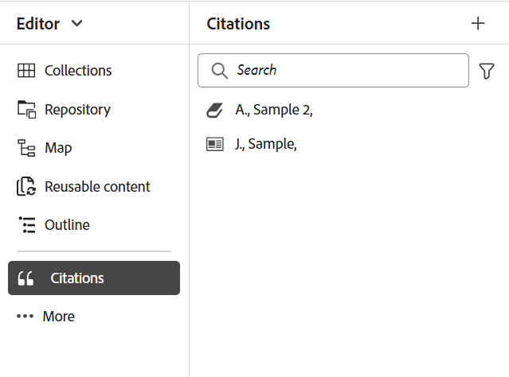

# Citaten in uw inhoud toevoegen en beheren

Bijschriften zijn verwijzingen naar de informatiebron die aan de inhoud is toegevoegd. Met citaties kunt u de auteurs van de broninformatie crediteren en de lezers helpen de broninformatie te volgen. Als u citaten toevoegt, wordt uw inhoud betrouwbaarder en voorkomt u plagiaat. Ze stellen u ook in staat om goed-onderzochte inhoud weer te geven.

In Adobe Experience Manager Guides kunt u citaten toevoegen en importeren en deze op uw inhoud toepassen. U kunt deze citaten toevoegen vanuit elke bron van boeken, websites en tijdschriften.

Met Experience Manager Guides kunt u citaten bewerken, voorvertonen en sorteren. Nadat u de citaten aan de inhoud hebt toegevoegd, kunt u de uitvoer genereren met Native PDF. U kunt ook de bibliografie- of referentiepagina toevoegen in de native PDF-uitvoer.

Experience Manager Guides ondersteunt meerdere aanhalingstekens, zoals de Modern Language Association (MLA), American Psychological Association (APA), Chicago, Institute for Electrical and Electronics Engineers (IEEE) en American Heart Association (AHA). De aanbeveling is ze duidelijk en consequent te gebruiken.

>[!NOTE]
>
>Experience Manager Guides biedt momenteel alleen ondersteuning voor native PDF voor citaten.

## citaten toevoegen

Ga als volgt te werk om citaten toe te voegen:

1. Selecteer het **** pictogram van citaten  Bevelingen {in het linkerpaneel.

   Het **paneel van Bevragingen** opent.

   {width="350" align="left"}

1. In het **paneel van de Bevragingen**, uitgezocht  toe. In het vervolgkeuzemenu kunt u kiezen of u een nieuwe animatie wilt toevoegen of een animatie wilt importeren.

1. Selecteer **Nieuwe citatie** om een nieuwe citatie toe te voegen.

   **voegt de dialoogdoos van de Aanhaling** open.

    {width="300" align="left"}

1. Vul de gebieden in **in toevoegen de dialoogdoos van de Aanhaling**.

   >[!NOTE]
   >
   >U kunt ook de ISBN, DOI of PubMed-id toevoegen. AEM Guides vult de andere velden automatisch in.

   | Boek | Website | Dagboek |
   | --- | ---|---|
   | **Source**   van drop-down, selecteer de bron van de citatie als Boek. | **Source**  van drop-down, selecteer de bron van de citatie als Website. | **Source**   van drop-down, selecteer de bron van de citatie als Dagboek. |
   | **Onderzoek door**   Uitgezochte **ISBN** of **DOI** van drop-down aan onderzoek naar digitale identiteitskaart verbonden aan de citatie.    DOI: Digital Object Identifier   ISBN: unieke numerieke boek-id | **Onderzoek door**   Uitgezocht **DOI** van drop-down aan onderzoek naar digitale identiteitskaart verbonden aan de citatie. | **Onderzoek door**   Uitgezocht **DOI** of identiteitskaart PubMed van drop-down aan onderzoek naar digitale identiteitskaart verbonden aan de citatie.      |
   | **Auteur**   voegt de eerste en familienaam van de auteur van de citatie toe. Selecteer  om meer namen toe te voegen. | **Auteur**   voegt de eerste en familienaam van de auteur van de citatie toe. Selecteer  om meer namen toe te voegen. | **Auteur**   voegt de eerste en familienaam van de auteur van de citatie toe. Selecteer  om meer namen toe te voegen. |
   | **Titel**   voegt de titel van het boek toe. | **Titel**   voegt de titel van de Web-pagina toe. | **Titel**   voegt de titel van het artikel toe. |
   | **Redacteur**   voegt de redacteur van het boek toe. | **de Naam van de Website**   voegt de naam van de website toe. | **Titel van het Dagboek**   voegt de titel van het werk toe waarin het artikel wordt gevonden. |
   | **Uitgave**   voegt de uitgave van het boek toe. | **URL**   voeg de Webverbinding van de website toe om de inhoud te doorbladeren. | **Jaar**   voeg het jaar toe waarin het artikel wordt gepubliceerd. |
   | **Stad**   voegt de stad van de publicatie toe. | **Toegelaten Datum**  voegt de datum toe waarop de inhoud van de website wordt betreden. | **Volume**   voegt het volume van het werk in de reeks toe. |
   | **Uitgever**   voegt de naam van de uitgever van het boek toe. | **Gepubliceerde Datum**   voeg de datum toe waarop de inhoud van de website wordt gepubliceerd. | **Aantal**   voegt het aantal van het volume binnen de reeks toe. |
   | **Jaar**   voeg het jaar toe waarin het boek wordt gepubliceerd. | **bijgewerkte Datum**   voeg de datum toe waarop de inhoud van de website wordt bijgewerkt. | **Pagina&#39;s**   voeg het paginanummer of paginabereik toe waarin het artikel wordt gevonden. |
   | **Versie**   voegt de versie van het boek toe. | **Unieke identiteitskaart**   voegt een unieke identiteitskaart voor de citatie toe. Een unieke id is een unieke id voor die activering. | **URL**   voegt de Webverbinding aan het dagboek toe. |
   | **Reeks**   voegt de reeks van het boek toe. |  | **Unieke identiteitskaart**   voegt een unieke identiteitskaart voor de citatie toe.Een unieke identiteitskaart is een uniek herkenningsteken voor die citatie. |
   | **URL**   voeg de Webverbinding aan het boek toe. |  |  |
   | **Unieke identiteitskaart**   voegt een unieke identiteitskaart voor de citatie toe. Een unieke id is een unieke id voor die activering. |  |  |

1. Selecteer **Gereed**.

   Er wordt een nieuwe vermelding toegevoegd aan het deelvenster Aanhaling.

>[!NOTE]
>
> Het is verplicht een unieke id toe te voegen voor het veld voor aanhalingen.  U kunt de unieke id niet meer wijzigen als de licentie eenmaal is toegevoegd.

## citaten importeren

Voer de volgende stappen uit om citaten te importeren:

1. In het linkerpaneel, uitgezochte **** citationenpictogram van 1} Cites 

   Het **paneel van Bevragingen** opent.

1. In het **paneel van de Bevragingen**, uitgezocht  toe, en selecteer dan **Invoer** van dropdown.
1. Blader naar een .bib-bestand van uw systeem en importeer het.

   >[!TIP]
   >
   > Een bestandsnaamextensie .bib is een BibTeX Bibliogragraphic Database-bestand. Het is een speciaal geformatteerd tekstdossier dat verwijzingen over een bepaalde bron van informatie opsomt.

   Als het bestand eenmaal is geïmporteerd, kunt u de referenties bekijken in het deelvenster citaten.

   >[!NOTE]
   > <ol><li> Experience Manager Guides importeert alleen citaten die uniek zijn en nog niet aanwezig zijn.
    &gt; <li> Experience Manager Guides kan citaten importeren uit een boek, journaal of website. Momenteel ondersteunt het geen citaten uit andere bronnen.

## citaten beheren

De citaten worden alfabetisch gesorteerd in het linkerpaneel. Zoek naar de citaties volgens de bronnen in uw onderwerp te gebruiken.

### Filter

Selecteer het **pictogram van de Filter**  naast de onderzoeksbar en selecteer de bronopties van drop-down om de citaatlijst te filtreren. Er zijn zowel enkelvoudige als meervoudige selecties mogelijk.

* **Alle Bronnen**: Het toont een volledige lijst van citaties, met inbegrip van alle bronnen.

* **Boek**: Het toont de lijst van citaten die uit boeken worden voortgebracht.

* **Website**: Het toont de lijst van citaten die van websites worden aangekocht.

* **Dagboek**: Het toont de lijst van citaties die uit dagboeken worden voortgebracht.

### Zoeken

Zoek in de uitnodiging naar uw inhoud.

1. Selecteer Cites in het linkerdeelvenster.
Het **paneel van Bevragingen** opent.

1. Met de zoekbalk kunt u zoeken naar de juiste vermelding in een lange lijst.

### Aanmaakstijl wijzigen {#change-citation-style}

Uw systeembeheerder kan de stijl van citaties van **Vervolgkeuzelijst van de Bevelen** in het **Algemene** lusje in de **Montages** veranderen.
Deze stijlen bepalen hoe citaten in de voorproefruit of de Inheemse output van PDF verschijnen.

De volgende opties zijn beschikbaar in het vervolgkeuzemenu:

| MLA | APA | Chicago | IEEE | AHA |
|---|---|---|---|---|
| Moderne taalassociatiestijl   | American Psychological Association Style | Handleiding Chicago | Institute for Electrical and Electronics Engineers Style | American Heart Association Style |
| Voorbeeld:  Crawford, Claire, et al. *Emotionele Inhoud van Donkere Herinneringen*.Bewerkt door Geheugen, vol 16, 2010, Amsterdam. | Voorbeeld:   Crawford, C., J., &amp; , C. (2010). *Emotionele Inhoud van Donkere Herinneringen* (505-16 ed.). 10.1080/09658210902067289 | Voorbeeld:   Crawford, Claire, et al. *Emotionele Inhoud van Donkere Herinneringen*. 505-16, 2010. | Voorbeeld:   C. Crawford, J., en C., *Emotionele Inhoud van Donkere Herinneringen*. Amsterdam, 2010. | Voorbeeld:   C. Crawford, J., en C., *Emotionele Inhoud van Donkere Herinneringen*. Amsterdam, 2010. |

## Een citaat bewerken

Voer de volgende stappen uit om de uitnodiging te bewerken:

1. Houd de aanwijzer boven de naam van het visum in de lijst. Selecteer  het **pictogram van Opties**.

1. Selecteer **uitgeven**.

Het **geeft 1} dialoogvakje van de Aanhaling uit opent.**

1. Breng de gewenste wijzigingen aan. Selecteer **Gereed**.
Het geselecteerde citaat wordt uitgegeven.

>[!NOTE]
>
>U kunt de unieke id niet meer wijzigen als de licentie eenmaal is toegevoegd.

## Een voorbeeld van een citaat bekijken

Ga als volgt te werk om een voorbeeld van een citaat te bekijken:

Houd de aanwijzer boven de naam van het visum in de lijst. Selecteren      **het pictogram van Opties**.

1. Selecteer **Voorproef**.
U kunt de inhoud en de indeling van de animatie voorvertonen in het voorvertoningsvenster.

   >[!NOTE]
   >
   >De voorproef is gebaseerd op de citaatstijl die uw beheerder in de **Montages** heeft geselecteerd.

1. Selecteer op het scherm om het voorvertoningsvak te sluiten.

   {width="550" align="left"}

>[!NOTE]
>
> U kunt ook een voorbeeld bekijken van een instructie die in een onderwerp is ingevoegd via de gebruikersinterface van Assets of het tabblad Voorvertoning van de Editor.

## citaten invoegen

Voer de volgende stappen uit om citaties aan een onderwerp op te nemen:
1. Selecteer het onderwerp in het paneel van de bewaarplaats, dan klik tweemaal om het in het het uitgeven venster te openen.
1. Plaats de curseur bij de plaats van het onderwerp waar u de citatie wilt toevoegen.

U kunt citaten aan het onderwerp van de belangrijkste toolbar of het linkerpaneel opnemen.

### Van de hoofdwerkbalk

1. Selecteer het **** pictogram van citaten 1}  Bevelingen {in de belangrijkste toolbar.
1. In het **de dialoogvakje van de Bevelen**, kies de citatie. U kunt ook meerdere citaten selecteren.
   {width="300" align="left"}
1. U kunt citaties filtreren door de eerste paar alfabeten in het onderzoekspaneel van het **de dialoogvakje van de Aanhaling** te typen.

1. Selecteer **Gereed**.
Het geselecteerde citaat wordt toegevoegd bij de cursorplaats in uw onderwerp.

### Vanuit het linkerdeelvenster

>[!NOTE]
> 
>Om het **pictogram van de Bevragingen** van het linkerpaneel te bekijken, moet uw systeembeheerder de **optie van de Bevragingen** in de **Panelen** tabel in **Montages** toelaten.

1. Selecteer **** het pictogram van citaten  Bevelingen {in het linkerpaneel.
1. Sleep de citatie van het **paneel van Cites** en laat vallen het bij de aangewezen plaats in het onderwerp.

   U kunt **Tussenvoegsel** van  **Opties** ook selecteren om een citaat op te nemen.

   
1. Om veelvoudige citaties te selecteren, klik een citaat in het onderwerp met de rechtermuisknop aan en selecteer **Bevestiging** van het kortere wegmenu wijzigen.
1. Selecteer de citaten die u van de **dialoog van de Aanhaling** wilt opnemen.
1. Selecteer **Gedaan** om hen aan het onderwerp toe te voegen.

Zodra u citaties in het onderwerp hebt opgenomen, kunt u voorproef hen in de Redacteur van het Web. U kunt inhoud met citaten ook publiceren gebruikend Inheemse PDF.

## Een citaat verwijderen

U kunt citaten van het paneel van Cites of van een onderwerp schrappen waar u hebt opgenomen.

### Een citatie verwijderen uit het deelvenster Cites

Ga als volgt te werk om een citaat uit het deelvenster Cites te verwijderen:

1. Houd de aanwijzer boven de naam van het visum in de lijst.
1. Selecteer het  **pictogram van Opties**.
1. Selecteer de   **Schrapping** .
Het bevestigingsvenster wordt geopend.
1. Selecteer **ja**.
Het geselecteerde citaat wordt geschrapt van het citaatpaneel.

### Een citaat uit een onderwerp verwijderen

Ga als volgt te werk om een citaat te verwijderen dat al in het onderwerp wordt gebruikt:

In het onderwerp, plaats uw curseur aan het eind van de citatie.

1. Klik een citaat in het onderwerp met de rechtermuisknop aan en selecteer **Bevestiging** van het kortere wegmenu wijzigen. Het dialoogvenster Aanwijzing wordt geopend.
   

1. U kunt de citaten kiezen u in het document wilt opnemen.

   >[!NOTE]
   >
   >De citaten die reeds in het onderwerp worden gebruikt worden vervangen met de acties die u van de dialoog selecteert.

1. Selecteer **Gereed**.

## Resultaat van inhoud met citaten genereren

Nadat u citaten in het onderwerp hebt ingevoegd, kunt u inhoud met citaten publiceren met behulp van Native PDF.

In de native PDF-uitvoer worden de citaten weergegeven binnen de inhoud waarin u ze hebt ingevoegd. U kunt ook een bibliografiepagina maken. Wanneer u een citaat selecteert, wordt u opnieuw gericht aan de bibliografiepagina.

Creeer de paginalay-out van de a **Bevelen** in de malplaatjes van PDF, en neem het in uw document op. Alle citaten die in het boek worden gebruikt, worden weergegeven op één pagina die in de PDF-uitvoer wordt weergegeven. Meer leren over het creëren van een paginalay-out, mening [ creeer een paginalay-out ](../native-pdf/components-pdf-template.md#create-page-layout).

Om de mening en het gevoel van de citaatpagina te veranderen, past de mening [ de malplaatjes van PDF ](../native-pdf/pdf-template.md) aan.

### Inhoudsstijl toepassen op een citaat

Pas het formatteren op de citatie toe wanneer toegevoegd aan het onderwerp.

1. Selecteer **Stijlheets** in het **paneel van Malplaatjes** van een Inheemse de outputpreset van PDF.   Het opent het **STIJLEN** paneel dat alle het stileren opties bevat.

1. Zoek in het deelvenster Zoeken naar `<cite>` .

Om meer over stijlen te leren, mening [ Werk met de gemeenschappelijke inhoudsstijlen ](../native-pdf/stylesheet.md).
