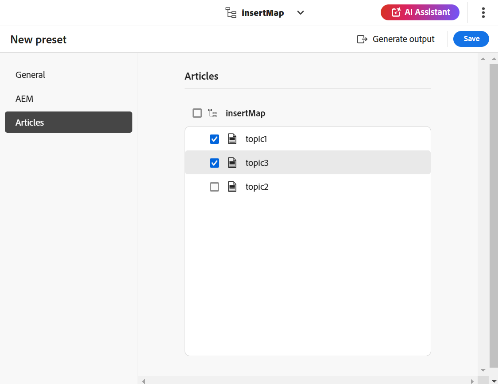

# Knowledge Base-uitvoer genereren {#id218CL05J0M1}

Adobe Experience Manager Guides wordt geleverd met een op artikelen gebaseerde publicatiefunctie waarmee gebruikers een of meer artikelen in de Knowledge Base tegelijk kunnen publiceren.

Deze engine wordt ook geleverd met een sjabloon voor OOTB-inhoud, die is gebaseerd op Adobe Experience Manager-kerncomponenten, waarmee gebruikers een op kennis gebaseerde opslagplaats voor de technische inhoud kunnen maken. Deze sjabloon kan worden aangepast aan de behoeften van de klanten. Met deze engine kunnen de gebruikers de DITA-kaart op een additieve manier bouwen en onderwerpen publiceren wanneer ze klaar zijn.

Als u de inhoud slechts voor een paar onderwerpen in uw kaart DITA hebt bijgewerkt, moet u niet altijd de volledige kaart publiceren. U kunt alleen de bijgewerkte onderwerpen selecteren en publiceren.

Voor op artikel-gebaseerde het publiceren, moet u de output vooraf instellen voor uw kaart DITA van de Kennisbank. Uw kaart moet de onderwerpen omvatten die u wilt publiceren. U kunt ook voorwaarden toepassen en de AEM Sites-details voor de uitvoervoorinstelling opgeven. Dan, kunt u output produceren gebruikend **output** eigenschap produceren.

Voer de volgende stappen uit om op artikel gebaseerde uitvoer te genereren:

1. [ creeer de vooraf ingestelde Kennisbank ](./generate-output-knowledge-base.md) voor op artikel-gebaseerde output.
1. Navigeer aan het **lusje van Artikelen** en selecteer de onderwerpen waarvoor u wenst om de output te produceren.
1. Selecteer **produceren output** bij de bovenkant om de output te produceren.

   {align="left"}

1. In **bevestig dossiers voor het publiceren** herinnering, selecteer de dossiers u wilt publiceren en bevestigen door **te selecteren publiceren**.

   {align="left"}

   U zult de status van het proces van de outputgeneratie bekijken. De **kolom van Onderwerpen** maakt een lijst van de onderwerpen waarvoor de output wordt geproduceerd terwijl de **3&rbrace; kolom van de Status &lbrace;toont de het publiceren status van elk onderwerp.**

   {align="left"}

   Om de output te bekijken, sluit de **Gegenereerde Output** dialoogdoos en selecteert **output van de Mening** op de vooraf ingestelde pagina.

   >[!NOTE]
   >
   > U kunt een bestaande uitvoervoorinstelling ook hernoemen, dupliceren of verwijderen in het menu Opties.

**Bovenliggend onderwerp:**&#x200B;[ Werk met de Redacteur ](web-editor.md)
