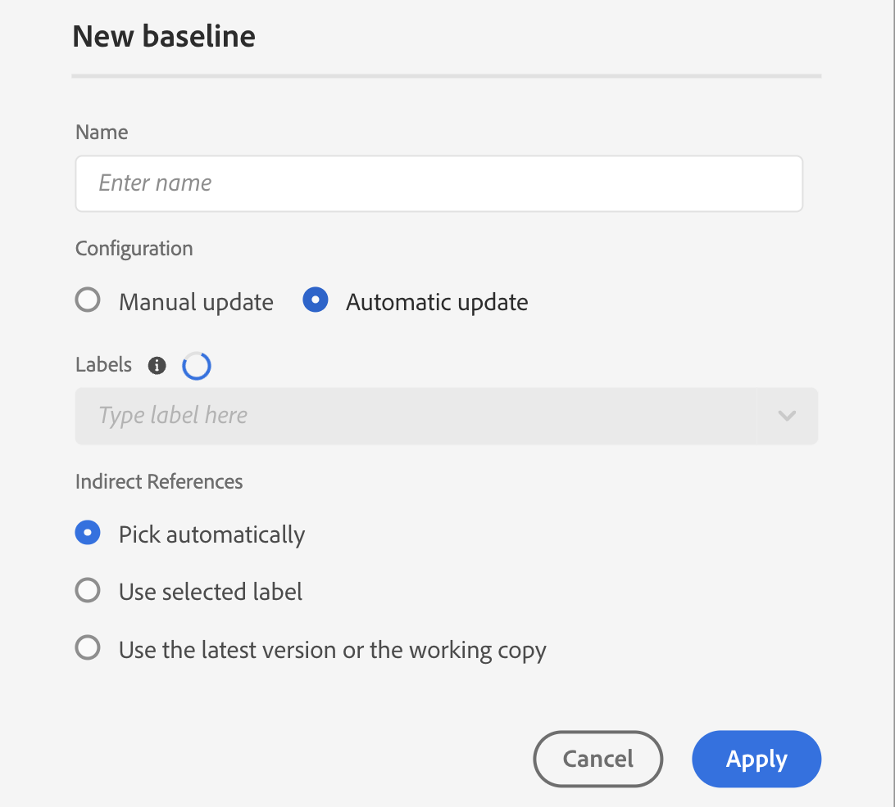

# Basislijnen maken en beheren vanuit de kaartconsole {#id223MB0ZF043}

Met de functie Basislijn kunt u een versie van uw onderwerpen en elementen maken die u vervolgens kunt gebruiken voor publiceren of omzetten. Als uw DITA-kaart bijvoorbeeld `topicA` en `imageA` heeft, kunt u een basislijn maken voor de derde versie van `topicA` , maar de vierde versie van `ImageA` . Zodra u een Basislijn op zijn plaats hebt, kunt u onderwerpen van verschillende versies in één enkele stap publiceren of vertalen.

Het selecteren van een Basislijn is facultatief voor output vooraf instelt en een kaart DITA kan meer dan één Basislijn hebben. Elke uitvoervoorinstelling in een DITA-kaart kan echter maar aan één basislijn worden gekoppeld. Als er geen basislijn is opgegeven op het moment van publicatie, wordt de uitvoer gepubliceerd met de meest recente versie van de inhoud.

Op dezelfde manier is het optioneel om een basislijn te selecteren voor het vertalen van inhoud. Als u inhoud echter wilt vertalen met een basislijn, wordt de inhoud van de basislijn samen met de vertaalde kopieën opgeslagen. Vervolgens kunt u de vertaalde basislijn gebruiken om verdere bewerkingen uit te voeren, zoals deze delen met externe uitgevers of archiveren.

>[!TIP]
>
> Het wordt geadviseerd om deze eigenschap van de Basislijn van de console van de Kaart te gebruiken. Nochtans, kunt u kaartdashboard ook [&#x200B; gebruiken om basislijnen &#x200B;](./generate-output-use-baseline-for-publishing.md) tot stand te brengen en te beheren.

In het **lusje van de Basislijn**, kunt u de volgende acties uitvoeren:

- [Een basislijn maken](#create-a-baseline)
- [Basislijnen beheren](#manage-baselines)

## Een basislijn maken

U kunt een basislijn van de console van de Kaart tot stand brengen door de volgende stappen uit te voeren:

1. [&#x200B; open het DITA kaartdossier in de console van de Kaart &#x200B;](./open-files-map-console.md).
1. Navigeer aan de **Basislijn** tabel, en selecteer + pictogram bij top-right beginnen een basislijn te creëren.
1. In het **Nieuwe basislijn** dialoogvakje, verstrek de volgende details:

   {width="500" align="left"}

   - Ga een naam voor de basislijn op het **gebied van de Naam** in.
   - In **Configuratie**, kies [&#x200B; Handmatige update &#x200B;](#configuring-baseline-for-manual-update) of [&#x200B; Automatische update &#x200B;](#configuring-baseline-for-automatic-update).
   - Selecteer **toepassen**.

De basislijn wordt gemaakt. Het maken van de basislijn gebeurt asynchroon, zodat u aan andere bestanden kunt blijven werken. Zodra de basislijn wordt gecreeerd, wordt een pop-up bericht getoond bevestigend dat de basislijn is gecreeerd, en u ontvangt ook een Inbox- bericht voor het zelfde.

### Basislijn configureren voor handmatige update

U kunt manueel een statische basislijn met een specifieke versie van de onderwerpen en referenced inhoud tot stand brengen beschikbaar op een specifieke datum en een tijd, of met een etiket dat voor een versie van onderwerpen wordt bepaald:

In **selecteer de versie die op wordt gebaseerd,** selecteer één van de volgende opties:

- **Datum**: Kies de versie van de onderwerpen zoals op de gespecificeerde datum en de tijd.
- **Etiket**: Selecteer deze optie om de onderwerpen volgens het etiket te kiezen dat op hen wordt toegepast. Als voor de onderwerpen labels zijn opgegeven, worden de labels vermeld in de vervolgkeuzelijst. U kunt een label in de lijst kiezen. U kunt ook een label toevoegen in het tekstvak.

  >[!NOTE]
  >
  > Wanneer u labels kiest, blijft de lader van labels zichtbaar totdat alle labels zijn opgehaald en volledig zijn geladen. Nadat de labels zijn geladen, worden deze in alfabetische volgorde weergegeven zonder onderscheid tussen hoofdletters en kleine letters. Deze worden opgehaald in batches van 20, waarbij in het vervolgkeuzemenu oneindig schuiven is ingeschakeld om extra batches te laden terwijl u schuift.

  Voor de directe verwijzingen in statische basislijnen, worden de etiketten getrokken van de recentste bewaarde versie van de kaart. Bijvoorbeeld, als u etiketten `Label Release 1.0` en `Label Release 1.1` voor versies 1.0 en 1.1 van Onderwerp A hebt gecreeerd, en dan Onderwerp A aan de kaart toevoegt die als versie 1.0 wordt bewaard. In dit geval kunt u de labels `Label Release 1.0` en `Label Release 1.1` in het vervolgkeuzemenu weergeven voor statische basislijnlabels.

  Wanneer u **Etiket selecteert,** kunt u de directe en indirecte verwijzingen kiezen.
   - Voor directe verwijzingen binnen de kaart DITA, krijgt u een optie om de recentste versie van onderwerpen te gebruiken die niet het gespecificeerde etiket hebben op hen wordt toegepast.

     >[!NOTE]
     >
     > Als u een etiket ingaat dat niet bestaat en de optie **selecteert creeer geen basislijn** dan ontbreekt de basislijnverwezenlijking en geeft een foutenmelding dichtbij de basislijnnaam in het paneel van de Basislijn.

   - Voor indirecte verwijzingen binnen de kaart DITA, krijgt u een extra optie om de recentste versie van onderwerpen te gebruiken die niet het gespecificeerde etiket hebben op hen wordt toegepast. U kunt ook aan **kiezen automatisch** voor de referenced inhoud kiezen, en het systeem plukt automatisch de versie van de referenced inhoud die aan de versie van de inhoud beantwoordt waarin het van verwijzingen wordt voorzien.

Nadat u een label of versie hebt geselecteerd als op datum, worden alle onderwerpen waarnaar wordt verwezen en mediabestanden in de kaart dienovereenkomstig geselecteerd. Deze selectie van onderwerpen wordt niet getoond op het gebruikersinterface, maar het wordt bewaard in het achterste eind.

### Basislijn configureren voor automatische update

Selecteer deze optie voor basislijnverwezenlijking om de onderwerpen volgens het etiket automatisch te kiezen dat op hen wordt toegepast.

Basislijnen die zijn gemaakt met de automatische updateconfiguratie worden dynamisch bijgewerkt. Als u een basislijn genereert, een basislijn downloadt of een vertaalproject maakt met een basislijn, worden de bestanden dynamisch gekozen op basis van de bijgewerkte labels. Bijvoorbeeld, als u versie 1.2 van een onderwerp met Versie 1.0 van het Etiket voor de basislijn en recentere bijgewerkte versie 1.5 met Versie 1.0 van het Etiket hebt gebruikt, zal de basislijn dynamisch worden bijgewerkt, en versie 1.5 zal worden gebruikt.

{width="300" align="left"}

- **Etiketten**: Als de onderwerpen labels hebben voor hen worden gespecificeerd, dan gebruik **Etiketten** dropdown om van de [&#x200B; vermelde etiketten &#x200B;](#labels-list) te kiezen.

  De eerst geselecteerde labels krijgen een hogere prioriteit dan de latere labels.

  >[!NOTE]
  >
  >Terwijl de labels worden gesleept, wordt een lader weergegeven en wordt het vervolgkeuzemenu uitgeschakeld.

  Voor dynamische basislijnen worden de labels opgehaald uit de laatst opgeslagen versie en de huidige werkkopie van de kaart. Als u bijvoorbeeld labels hebt gemaakt   `Label Release A.1.0 ` en `Label Release A.1.1` voor versies 1.0 en 1.1 van Onderwerp A en labels `Label Release B.1.0` en `Label Release B.1.1` voor versies 1.0 en 1.1 van Onderwerp B. Dan kunt u Onderwerp A aan Kaart A in versie 1.0 en Onderwerp B aan Kaart A in 1.0* (het werk exemplaar) toevoegen. In dit geval kunt u `Label Release A.1.0 ` , `Label Release A.1.1` , `Label Release B.1.0` en `Label Release B.1.1` weergeven in het vervolgkeuzemenu met dynamische basislijnlabels.
- **Indirecte Verwijzingen**: Voor indirecte verwijzingen binnen de kaart DITA, wordt u gegeven de volgende opties:

   - **Keuze automatisch**: U kunt kiezen **kiezen automatisch** voor de referenced inhoud, en het systeem plukt automatisch de versie van de referenced inhoud die aan de versie van de inhoud beantwoordt waarin het van verwijzingen wordt voorzien.
   - **Uitgezochte etiket van het Gebruik**: U kunt een basislijn met het geselecteerde die etiket tot stand brengen voor een versie van onderwerpen wordt bepaald.
   - **Gebruik de recentste versie of het het werk exemplaar**: Gebruik de recentste versie van onderwerpen die niet het gespecificeerde etiket hebben dat op hen wordt toegepast, of als geen versie is gecreeerd, dan gebruik het werkende exemplaar van de onderwerpen om de basislijn tot stand te brengen.

## Basislijnen beheren

U kunt uw bestaande basislijnen beheren met de verschillende functies op het basislijndashboard.

- U kunt zoeken naar een bestaande basislijn met het tekstvak in het deelvenster Basislijn. Gebruik **pas het pictogram van de Filter** toe om alle basislijnen te tonen of van de basislijnen met de schepingsstatus als Succes, in uitvoering, of Ontbroken een lijst te maken.
- Gebruik **verfrissen zich** pictogram in het paneel van de Basislijn om voor alle basislijnen opnieuw te controleren en een nieuwe lijst van basislijnen voor de kaart te tonen DITA die in de Mening van de Kaart wordt geopend.
- Selecteer de basislijn om de inhoud van een bestaande statische basislijn in het **paneel van de Basislijn** te bekijken of uit te geven. In het venster voor basislijnbewerking worden het DITA-kaartbestand, de inhoud of onderwerpen van de kaart en de inhoud waarnaar wordt verwezen, weergegeven.

  >[!NOTE]
  >
  >Bewerking voor statische basislijnen wordt alleen aanbevolen voor een klein aantal wijzigingen in de verwijzing. Bewerkingen bewerken wordt niet aangeraden om de versie van de hoofd-DITA-kaart te wijzigen, omdat alle referenties opnieuw moeten worden berekend. Dit kan een fout van de basislijnupdate voor grote kaarten DITA veroorzaken. Voor de grotere DITA kaarten, kunt u een nieuwe basislijn tot stand brengen of de eigenschappen van de basislijn uitgeven.
  >
  >Met de bewerking Bewerken in het geval van een dynamische basislijn kunt u de eigenschappen van de basislijn bewerken terwijl de referenties voor dynamische basislijnen bij uitvoering worden gegenereerd met de labels.

  {align="left"}

### Handelingen beschikbaar voor een bestaande basislijn

U kunt ook de volgende bewerkingen op de basislijn uitvoeren vanuit het menu Opties:

**Dupliceer een basislijn**

U kunt een basislijn dupliceren en deze aanpassen aan uw vereisten.

{width="300" align="left"}
*Dupliceer een basislijn die op een etiket wordt gebaseerd of creeer een nauwkeurige kopie.*

1. Selecteer **Dupliceer** van het menu van Opties van een basislijn. Het **Duplicate basislijn** dialoogvakje opent.
>[!NOTE]
>
>De standaardnaam van de basislijn is `<selected baseline name>` _suffix (zoals sample-baseline_1). U kunt de naam naar wens wijzigen.

   In **selecteer de versie die op** wordt gebaseerd, kunt u of de **Exacte exemplaar** optie of de **optie van het Etiket** kiezen:

   - **Exact exemplaar**: Experience Manager Guides plukt de zelfde versie van alle onderwerpen en leidt tot een nauwkeurige kopie van de gedupliceerde basislijn.
   - **Etiket**: Gebruikend dropdown, kunt u één van de [&#x200B; vermelde etiketten &#x200B;](#labels-list) kiezen. Experience Manager Guides kiest die versies van de onderwerpen met het geselecteerde die etiket voor hen wordt bepaald, terwijl voor de resterende onderwerpen, het de versie van de gedupliceerde basislijn kiest. U selecteert bijvoorbeeld het label `Release 1.0` in het vervolgkeuzemenu en kiest vervolgens de versies van de onderwerpen waarvoor u dit label hebt gedefinieerd. Voor alle andere onderwerpen, kiest het de versie van de gedupliceerde basislijn.
1. Selecteer **Dupliceren**.

- **noem** anders, of **schrap** een bestaande basislijn**.
- **beheer etiketten** die u toestaan om, bestaande etiketten voor statische basislijnen toe te voegen te verwijderen of te maken. Als uw beheerder vooraf gedefinieerde labels heeft geconfigureerd, worden deze labels weergegeven in de vervolgkeuzelijst Label toevoegen. Voor meer informatie over het toevoegen van etiketten, mening [&#x200B; de etiketten van het Gebruik &#x200B;](web-editor-use-label.md#).

  >[!NOTE]
  >
  > Het toevoegen of verwijderen van labels gebeurt asynchroon, zodat u aan andere bestanden kunt blijven werken. Nadat het label is toegevoegd of verwijderd, wordt een pop-upbericht weergegeven met de bevestiging dat het label is toegevoegd of verwijderd. U ontvangt ook een melding in het Postvak IN.

- **geeft eigenschappen** van een bestaande statische basislijn uit die u terwijl het creëren van de basislijn hebt geplaatst.
- **de optie van de Basislijn van de Uitvoer** voert een momentopname van de basislijn in het dossier van Microsoft Excel, met inbegrip van alle essentiële details zoals titel, dossiernaam, dossiertype, versieaantal, documentstaat, en andere relevante informatie uit.

### Lijst met labels {#labels-list}

De labels in de vervolgkeuzelijst zijn gebaseerd op de volgende criteria:
- De etiketten zouden aan één van de versies van de onderwerpen in de kaart moeten worden toegevoegd DITA (waarop de basislijn wordt gecreeerd).
- En alleen de verwijzingen op het eerste niveau (onderwerpen of submaps) van de DITA-kaart worden in overweging genomen bij het kiezen van de labels.

## Basislijnfilters

Gebruikend het pictogram van Filters in het **paneel van de Filters van de Basislijn** kunt u filters op de basislijn toepassen die in het basislijn het uitgeven venster wordt geopend:

{width="300" align="left"}

- De bestanden filteren op bestandsnamen of bestandslocatie.
- Filter de bestanden op basis van de waarden voor verschillende kolommen, zoals Bestandstype, Referentietype, enzovoort.
- Kies de kolommen die u wilt weergeven in het basislijnbewerkingsvenster.

>[!NOTE]
>
> U kunt een kolomkop selecteren en de bestanden sorteren op basis van de kolommen in het basislijnbewerkingsvenster.

**sparen of het Terugstellen een Basislijn**

Zodra u de basislijn hebt uitgegeven, uitgezocht **sparen** om de veranderingen in de basislijn te bewaren. U kunt **Terugstellen** selecteren als u niet de verandering wilt bewaren en de basislijn terugstellen. Wanneer u **het Terugstellen** selecteert, wordt een waarschuwing getoond dat uw niet bewaarde veranderingen zouden worden verloren.

**Bovenliggend onderwerp:**&#x200B;[&#x200B; Productie van de Output &#x200B;](generate-output.md)

