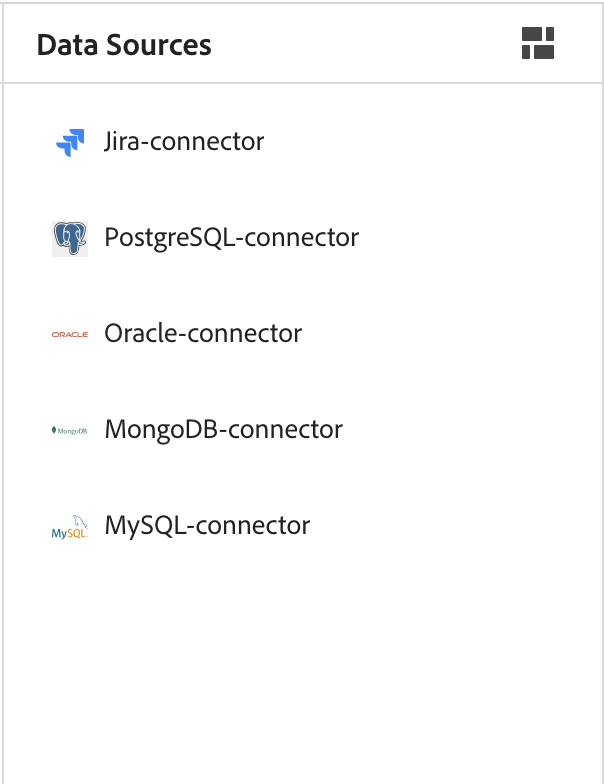
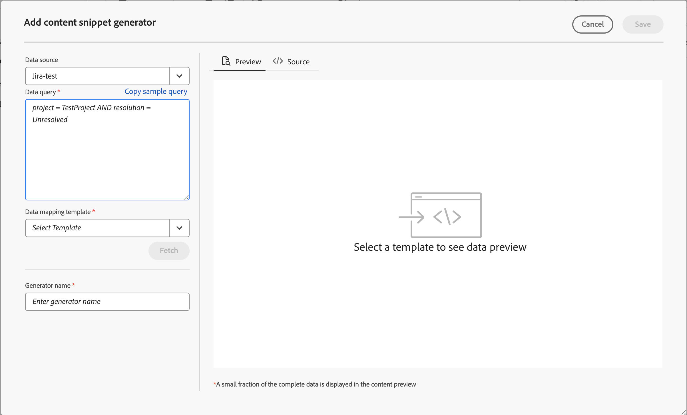

# Gegevens uit uw gegevensbron gebruiken

A **gegevensbron** is een systeem waar u de gegevens voor uw organisatie opslaat en beheert. Dit zijn uw systemen van verslag zoals JIRA, SQL Gegevensbestanden, PIM, of PLM. AEM Guides biedt de functie om verbinding te maken met uw gegevensbron en de gegevens van deze bronnen te gebruiken.

U kunt ook verbinding maken met JSON-gegevensbestanden via een bestandsconnector. Upload het JSON-bestand van uw computer of blader erdoor vanaf de Adobe Experience Manager-elementen. Creëer vervolgens inhoudsfragmenten of -onderwerpen met behulp van de generatoren.

## Deelvenster Gegevensbronnen

Selecteer **Gegevensbronnen**  in het linkerpaneel om de verbonden gegevensbronnen te bekijken. Het paneel van Gegevensbronnen opent en toont alle verbonden gegevensbronnen.

Gebaseerd op uw opstelling kan uw beheerder een gegevensbronschakelaar vormen:

 Cloud Services 

- Als u de versie van Oktober 2023 of recenter gebruikt, leer hoe te [ een gegevensbronschakelaar van het gebruikersinterface ](../cs-install-guide/conf-data-source-connector-tools.md) in de Gids van de Installatie en van de Configuratie van de Diensten van de Wolk vormen.

- Als u de versie van juli 2023 of September 2023 gebruikt, leer hoe te [ een gegevensbronschakelaar ](../cs-install-guide/conf-data-source-connector.md) in de Gids van de Installatie en van de Configuratie van de Diensten van de Wolk vormen.

    

  Software op locatie 

- Als u de versie 4.3.1 of recenter gebruikt, leer hoe te [ een gegevensbronschakelaar van het gebruikersinterface ](../cs-install-guide/conf-data-source-connector-tools.md) in de Gids van de Installatie en van de Configuratie op locatie vormen.

- Als u de versie 4.3 gebruikt, leer hoe te [ een gegevensbronschakelaar ](../cs-install-guide/conf-data-source-connector.md) in de Gids van de Installatie op-gebouw en van de Configuratie vormen.

>[!NOTE]
>
> U zult de gegevensbronnen bekijken waarvoor uw beheerder de schakelaar heeft gevormd.

## Lijstweergave of tegelweergave tonen

U kunt schakelen tussen de lijstweergave of de tegelweergave om de verschillende gegevensbronnen weer te geven in de vorm van een lijst of als tegels.

Selecteer een gegevensbron om de generators van het inhoudsfragment en de onderwerpgenerators te bekijken beschikbaar voor de geselecteerde gegevensbron.

### Lijstweergave

{width="300" align="left"}

*Lijst van verbonden gegevensbronnen.*

### Tegelweergave

{width="300" align="left"}

*Mening de verbonden gegevensbronnen als tegels.*

U kunt de gegevens van gegevensbronnen op twee manieren gebruiken:
- Een inhoudsfragment invoegen
- Een onderwerp maken

## Een inhoudsfragment uit uw gegevensbron invoegen

Adobe Experience Manager Guides biedt de functie om verbinding te maken met uw gegevensbron. U kunt uw gegevens ophalen, het opnemen in uw onderwerpen, en het uitgeven. U kunt een inhoudsfragment gemakkelijk tot stand brengen gebruikend de inhoudsfragmentgenerator en het binnen uw onderwerpen opnieuw gebruiken.

Voer de volgende stappen uit om een inhoudsfragment tot stand te brengen gebruikend de generator van het inhoudsfragment en neem het in uw onderwerp op:

1. Selecteer **Gegevensbronnen**  in het linkerpaneel om de verbonden gegevensbronnen te bekijken.

1. Selecteer een gegevensbron om de inhoudsfragmentgenerators te bekijken beschikbaar voor de geselecteerde gegevensbron.

   {width="300" align="left"}

   *het paneel van Gegevensbronnen maakt een lijst van de beschikbare generators van het inhoudsfragment.*

1. Selecteer **toevoegen** om een nieuwe generator van het inhoudsfragment toe te voegen. Het **voegt de generator van het inhoudsfragment** paneel opent.

   {width="500" align="left"}

1. Ga de vraag in het **tekstvakje van de vraag van 0&rbrace; Gegevens in.**  Selecteer **de steekproefvraag van het Exemplaar** om een gegevensvraag snel te kopiëren. In plaats van manueel het creëren van de vraag, kunt u de steekproefvraag in het **vakje van de de vraagtekst van Gegevens** kopiëren en kleven. Dan, geef eenvoudig de vraag volgens uw gegevensvereisten uit.

   >[!NOTE]
   >
   > Experience Manager verstrekt verschillende steekproefvragen voor alle middelen in de diverse gegevensbronnen. Deze kaart aan de gegevensbron waarvan u de gegevens haalt.

1. Als u een bestandsconnector gebruikt, kunt u het JSON-bestand vanaf uw computer uploaden of door een JSON-bestand bladeren vanuit Adobe Experience Manager-middelen.

   >[!NOTE]
   >
   > Als u een bestandsconnector gebruikt, kunt u de opties voor het uploaden naar bestanden bekijken of door bestanden bladeren in plaats van een gegevensquery.

1. Selecteer het malplaatje dat met uw gegevensbron van het **malplaatje van de afbeelding van Gegevens** dropdown in kaart brengt.
De out-of-the-box malplaatjes voor de geselecteerde gegevensbron worden getoond in drop-down. Bijvoorbeeld, kunt u het &quot;sql-lijst&quot;malplaatje voor datasource bekijken genoemd &quot;PostSQL&quot;gegevensbron.

   >[!NOTE]
   >  
   > Als uw beheerder aangepaste sjablonen heeft geconfigureerd, worden deze sjablonen ook weergegeven in de vervolgkeuzelijst (op basis van de sjabloonpadconfiguraties die de beheerder heeft uitgevoerd).
   >   
   >U kunt ook de gereedschappen Snelheid gebruiken in de sjablonen. Leer meer over hoe te [ de hulpmiddelen van de gebruiksSnelheid ](#use-velocity-tools).

1. Het **dropdown van het Middel 0&rbrace; verschijnt voor sommige schakelaars zoals de Cliënt van het TerugSTEL, Salsify, Akeneo, en Microsoft ADO.**  Selecteer om het even welk middel van dropdown en verbind met het om een inhoudsfragment of een onderwerp tot stand te brengen gebruikend de generator voor het.

   >[!NOTE]
   >
   > Uw beheerder kan standaardmiddelen vormen of middelen voor veelvoudige URLs toevoegen terwijl het vormen van de gegevensbronschakelaars.

1. Selecteer **Vetch** om de gegevens van de gegevensbron te halen en het malplaatje op de gegevens toe te passen die uit de SQL vraag voortvloeien.

1. U kunt de gegevens weergeven in de voorvertoning of in de DITA-bronweergave.

   1. In het voorbeeld ziet u hoe de gegevens worden weergegeven wanneer ze in de inhoud worden ingevoegd. In de voorvertoning wordt een klein deel van de gegevens weergegeven in de indeling van de geselecteerde sjabloon.
Bijvoorbeeld:
      - Als u de sjabloon voor de sql-tabel hebt geselecteerd, kunt u de SQL-gegevens weergeven in een tabelindeling.
      - Als u de sjabloon voor jira-geordende lijsten hebt geselecteerd, kunt u een geordende lijst weergeven voor de Jira-problemen.

   1. De bronweergave toont de gegevens in de DITA-bronweergave.

      {width="500" align="left"}
      *voeg een inhoudsfragmentgenerator toe. Bekijk de gegevens op bron of voorproefwijze.*

1. Om de resultaten van de vraag te bewaren, ga de naam van de generator in en selecteer dan **&#x200B;**&#x200B;toevoegen.   Er wordt een nieuwe inhoudsfragmentgenerator toegevoegd aan de lijst.

   >[!NOTE]
   >
   > U moet de naamgevingsconventie voor bestanden volgen voor de naam van de nieuwe inhoudsgenerator. U kunt geen ruimte hebben in de naam van de inhoudsfragmentgenerator. U kunt ook geen nieuwe inhoudsgenerator opslaan met de naam van een bestaande inhoudsgenerator. Er treedt een fout op.

### Opties voor een inhoudsfragmentgenerator

Klik met de rechtermuisknop op een inhoudsfragmentgenerator om de opties te openen. Met de opties kunt u de volgende bewerkingen uitvoeren:

- **Voorproef**: Gebruik deze optie om een ruit te openen en een kleine fractie van te bekijken hoe het gegeven in de output wordt getoond.
- **Tussenvoegsel**: Gebruik deze optie om het geselecteerde inhoudsfragment in het onderwerp op te nemen dat voor het uitgeven in de Redacteur wordt geopend. Aangezien het gegeven als fragment wordt opgenomen, kunt u de gegevens binnen uw onderwerp in de Redacteur ook uitgeven.

  >[!NOTE]
  > 
  > De optie Invoegen wordt alleen weergegeven als u een onderwerp bewerkt.

- **geeft** uit: Gebruik deze optie om veranderingen in de generator van het inhoudsfragment aan te brengen en het te bewaren.
- **Schrapping**: Gebruik deze optie om de geselecteerde generator van het inhoudsfragment te schrappen.
- **Dupliceer**: Gebruik deze optie om een duplicaat of een exemplaar van de geselecteerde generator van het inhoudsfragment tot stand te brengen. Het duplicaat wordt standaard gemaakt met een achtervoegsel (zoals generator_1).

### Query-gegevens invoegen

U kunt de **gegevens van de Vraag**  van de toolbar ook gebruiken om het gegevensfragment in de onderwerpen op te nemen.  U kunt een generator van dropdown selecteren, uw vraag uitgeven, of het malplaatje veranderen en de gegevens in uw onderwerp opnemen.

{align="left"}

*geef uit en neem een gegevensfragment op.*

## Creeer een onderwerp gebruikend de onderwerpgenerator

Een onderwerpgenerator helpt u onderwerpen tot stand brengen die gegevens van uw bronnen bevatten. U kunt snel een onderwerpgenerator tot stand brengen en dan de onderwerpen produceren gebruikend de generator. Elk onderwerp kan gegevens in diverse formaten, zoals lijsten, lijsten, en paragrafen bevatten.   In een onderwerp kunt u bijvoorbeeld een tabel toevoegen met de details van alle nieuwe producten en een lijst met alle producten die worden afgezet voor verkoop.

De onderwerpgenerator kan de onderwerpen tot stand brengen die de gegevens en een kaart DITA voor alle onderwerpen bevatten. U kunt deze onderwerpen ook in uw inhoud `<conref>` plaatsen. Zo kunt u uw gegevens synchroon houden met de gegevensbron en deze eenvoudig bijwerken.

### Een onderwerp maken

Voer de volgende stappen uit om een onderwerp tot stand te brengen gebruikend de onderwerpgenerator:

1. Selecteer een gegevensbron om de generators van het inhoudsfragment en de onderwerpgenerators te bekijken beschikbaar voor de geselecteerde gegevensbron.

   {width="300" align="left"}

   *voeg een onderwerpgenerator voor een verbonden gegevensbron toe.*

1. Selecteer **toevoegen**  en selecteren **de generator van het Onderwerp** van dropdown om een nieuwe onderwerpgenerator toe te voegen. **voegt onderwerpgenerator** paneel toe opent.

1. Ga de waarden op de gebieden onder de volgende drie lusjes van **in voeg onderwerpgenerator** paneel toe:

   **de Configuratie van de Ophalen**

   {width="300" align="left"}

   *voeg de Vraag van Gegevens, het kaartmalplaatje van Gegevens, en de details van de wortelknoop voor de onderwerpgenerator toe en geef het een unieke naam in het paneel van de Configuratie van de Ophalen.*

   1. Ga de vraag in het **tekstvakje van de vraag van 0&rbrace; Gegevens in.** Selecteer **de steekproefvraag van het Exemplaar** om een gegevensvraag snel te kopiëren. In plaats van manueel het creëren van de vraag, kunt u de steekproefvraag in het **vakje van de de vraagtekst van Gegevens** kopiëren en kleven. Dan, geef eenvoudig de vraag volgens uw gegevensvereisten uit.

      >[!NOTE]
      >
      >Experience Manager verstrekt verschillende steekproefvragen voor alle middelen in de diverse gegevensbronnen. Deze kaart aan de gegevensbron waarvan u de gegevens haalt.

   1. Als u een bestandsconnector gebruikt, kunt u het JSON-bestand vanaf uw computer uploaden of door een JSON-bestand bladeren vanuit Adobe Experience Manager-middelen.

      >[!NOTE]
      >
      > Als u een bestandsconnector gebruikt, kunt u de opties voor het uploaden naar bestanden bekijken of door bestanden bladeren in plaats van een gegevensquery.

   1. Selecteer het malplaatje dat met uw gegevensbron van het **malplaatje van de afbeelding van Gegevens** dropdown in kaart brengt.

      >[!NOTE]
      >
      > Als uw beheerder aangepaste malplaatjes heeft gevormd, dan wordt u ook getoond die malplaatjes in de drop-down lijst (die op de configuraties van de malplaatjeweg door uw beheerder wordt gebaseerd). U kunt bijvoorbeeld een onderwerpsjabloon maken met een geordende lijst, tabellen, alinea&#39;s of andere DITA-elementen.

   1. Ga de **knoop van de Wortel** in. Dit is de knoop waarbij u tot uw gegevens wilt toegang hebben. De onderwerpgenerator leidt dan tot elk onderwerp op het niveau dat in de wortelknoop wordt bepaald. U kunt bijvoorbeeld &quot;issues&quot; toevoegen als het hoofdknooppunt in Jira. Zo, als een vraag 13 kwesties terugkeert, zult u 13 onderwerpen, één onderwerp voor elke kwestie krijgen.

   1. Selecteer **Vetch** om de gegevens van de gegevensbron te halen en het malplaatje op de gegevens toe te passen die uit de SQL vraag voortvloeien. In de voorvertoning wordt een klein gedeelte weergegeven van de manier waarop het onderwerp wordt weergegeven in de indeling van de geselecteerde sjabloon. U kunt bijvoorbeeld één Jira-uitgave weergeven met alle velden die het resultaat zijn van de query.
   1. Ga de naam van de onderwerpgenerator in.

      >[!NOTE]
      > 
      > U moet de dossier noemende overeenkomst voor de naam van de nieuwe onderwerpgenerator volgen. U kunt geen ruimte in de naam van de onderwerpgenerator hebben. Ook, kunt u geen nieuwe onderwerpgenerator met de naam van een bestaande onderwerpgenerator bewaren. Er treedt een fout op.

   **Configuratie van de Output**

   {width="300" align="left"}

   *ga de weg van de Output en de noemende verdragsdetails van het Onderwerp in het paneel van de Configuratie van de Output in. Produceer een kaart DITA en noem het.*

   1. Ga de **weg van de Output** details in waar u uw onderwerpen wilt bewaren.
   1. In de **noemende overeenkomst van het Onderwerp**, kunt u een waarde of een variabele met snelheidsmarkeringen ingaan. De nieuwe onderwerpen volgen de conventie. U kunt bijvoorbeeld `$key` invoeren om onderwerpen te maken op basis van de toetsen van Jira.
   1. Laat de optie **toe produceert een kaart** als u een kaart wilt creëren die alle geproduceerde onderwerpen bevat.
   1. Ga de naam van de nieuwe kaart DITA in.

   >[!NOTE]
   >
   > De generator van het Onderwerp produceert de kaart DITA op de zelfde outputweg zoals de onderwerpen.

   **Metagegevens**

   Selecteer de eigenschappen van meta-gegevens van drop-down om tot de onderwerpen over te gaan. **Naam** dropdown maakt een lijst van zowel de douane als de standaardeigenschappen.

   In de volgende schermafbeelding zijn `dc:description`, `dc:language`, `dc:title` en `docstate` bijvoorbeeld de standaardeigenschappen waarvoor u de waarden kunt definiëren. U kunt een aangepaste eigenschap maken, zoals een auteur, en de waarde ervan definiëren.

   {width="300" align="left"}

   *voeg de meta-gegevenseigenschappen in het paneel van Meta-gegevens toe om tot de onderwerpen over te gaan.*

1. Ga de naam van de generator in en selecteer **sparen** om de vraagresultaten te bewaren. Een nieuwe onderwerpgenerator wordt toegevoegd aan de lijst.

1. Selecteer **sparen en produceer** om de onderwerpgenerator te bewaren en nieuwe onderwerpen van de onderwerpgenerator te produceren.

   {align="left"}

   *produceer nieuwe onderwerpen van een bestaande onderwerpgenerator.*

   >[!NOTE]
   >
   > Als de onderwerpen reeds bestaan, dan werkt de generator de gegevens in de bestaande onderwerpen bij.

### Opties voor een onderwerpgenerator

Klik op een onderwerpgenerator met de rechtermuisknop aan om de **Opties** te openen. Met de opties kunt u de volgende bewerkingen uitvoeren:

- **produceer**: Deze optie produceert de onderwerpen voor de geselecteerde onderwerpgenerator. U kunt deze optie ook gebruiken om de bestaande onderwerpen bij te werken. Het verbindt met de gegevensbron en haalt de bijgewerkte gegevens. Tijdens het genereren van de inhoud is deze optie uitgeschakeld en kunt u een lader weergeven.
  >[!NOTE]
  >
  >Als uw onderwerp reeds bestaat, kunt u of de gegevens in het onderwerp overschrijven of het opslaan als nieuwe versie.

  

  *produceer een onderwerp, en als het dossier reeds bestaat, bewaar het als nieuwe versie of beschrijf het.*
- **Logboek van de Mening**: Selecteer deze optie om het het logboekdossier van de inhoudsgeneratie te bekijken. Het logbestand wordt op een nieuw tabblad geopend. U kunt de fouten, waarschuwingen, informatieberichten, en uitzonderingen in het logboekdossier bekijken. Deze optie wordt toegelaten als u de inhoud voor de geselecteerde onderwerpgenerator hebt geproduceerd.

- **Voorproef**: Gebruik deze optie om een ruit te openen en een kleine fractie van te bekijken hoe het gegeven in de output wordt getoond.

- **geeft** uit: Gebruik deze optie om de onderwerpgenerator te veranderen en te bewaren. Deze optie is uitgeschakeld wanneer u de inhoud genereert.
- **Schrapping**: Gebruik deze optie om de geselecteerde onderwerpgenerator te schrappen. Deze optie is uitgeschakeld wanneer u de inhoud genereert.
- **Dupliceer**: Deze optie leidt tot een duplicaat of een exemplaar van de geselecteerde onderwerpgenerator. Het duplicaat wordt standaard gemaakt met een achtervoegsel (zoals `topic-sample_1` ).

## De hulpmiddelen van de Snelheid van het gebruik in de gegevensbronmalplaatjes {#use-velocity-tools}

Experience Manager-sjablonen ondersteunen ook de snelheidsgereedschappen (versie 2.0). Met deze gereedschappen kunt u verschillende functies toepassen op de gegevens die u ophaalt van de gegevensbronnen. Leer meer over het gebruik van de [ hulpmiddelen van de Snelheid ](https://velocity.apache.org/tools/2.0/generic.html) en de functies die u kunt toepassen.

Voer de volgende stappen uit om een hulpmiddel van de Snelheid in een malplaatje te gebruiken:
1. Bewerk een snelheidssjabloon in de Editor.
1. Voeg een gereedschap en de functie ervan toe in de `<tool.function>` -indeling. Bijvoorbeeld:
   - Gebruik `$mathTool.random` om een willekeurig getal te genereren met het gereedschap Wiskunde.
   - Gebruik `$mathTool.add(num1, num2)` om de som getallen te genereren met het gereedschap Wiskunde.
1. Gebruik de sjabloon om een inhoudsfragment of onderwerp te maken.
1. Nadat u het malplaatje op de gegevens toepast, kunt u de gegevens in de voorproef of de DITA bronmening bekijken.

U kunt de volgende hulpmiddelen binnen de malplaatjes van de Snelheid gebruiken om diverse functies op de gegevens toe te passen u van de schakelaar haalt:
-`$alternatorTool`
- `$classTool`
- `$contextTool`
- `$conversionTool`
- `$dateTool`
- `$comparisonDateTool`
- `$displayTool`
- `$escapeTool`
- `$fieldTool`
- `$loopTool`
- `$linkTool`
- `$listTool`
- `$mathTool`
- `$numberTool`
- `$renderTool`
- `$resourceTool`
- `$sortTool`
