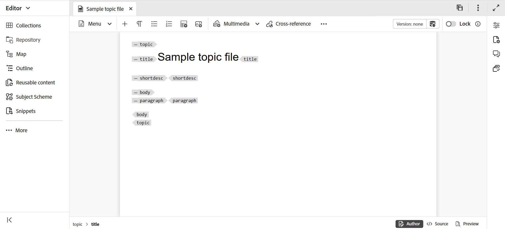

# Onderwerpen maken {#id2056AL00O5Z}

Adobe Experience Manager Guides staat u toe om DITA onderwerpen van type - onderwerp, taak, concept, verwijzing, verklarende woordenlijst, DITAVAL, Markdown en meer tot stand te brengen. Naast het creëren van onderwerpen die op de uit-van-de-doos malplaatjes worden gebaseerd, kunt u uw douanesjablonen ook bepalen. Deze sjablonen moeten aan het mapprofiel worden toegevoegd om weer te geven in de sjabloonselectie, de blauwdruk en de Editor.

>[!NOTE]
>
> De configuratie van het profiel Algemeen en Map is alleen beschikbaar voor beheerders op mapniveau. Voor de details bij vestiging globale en omslag-vlakke profielen, mening *vormen auteursmalplaatjes* in installeer en vorm Adobe Experience Manager Guides voor uw opstelling.

Er zijn twee manieren om onderwerpen te maken in Experience Manager Guides:

- [Onderwerpen maken in de Editor](#create-topics-from-the-editor)
- [Onderwerpen maken met de gebruikersinterface van Assets](#create-topics-from-the-assets-ui)

## Onderwerpen maken in de Editor

Voer de volgende stappen uit om een onderwerp van de Redacteur tot stand te brengen:

1. In het paneel van de Bewaarplaats, selecteer het **Nieuwe dossier** pictogram en selecteer dan **Onderwerp** van het dropdown menu.

   {width="500" align="left"}

   U kunt tot deze optie van de [ Homepage van Experience Manager Guides ](./intro-home-page.md) en tot het optiemenu van een omslag in de mening van de Opslag ook toegang hebben.

2. Het **Nieuwe onderwerp** dialoogvakje wordt getoond.

3. In het **Nieuwe onderwerp** dialoogvakje, verstrek de volgende details:
   - Een titel voor het onderwerp.
   - \(Optioneel\)* De bestandsnaam voor het onderwerp. De bestandsnaam wordt automatisch voorgesteld op basis van de titel van het onderwerp. Als de beheerder automatische bestandsnamen heeft ingeschakeld op basis van de UUID-instelling, wordt het veld Naam niet weergegeven.
   - Een malplaatje waarop het onderwerp zal worden gebaseerd. Bijvoorbeeld, voor een uit-van-de-doos opstelling, kunt u van Lege, Concept, DITAVAL, Verwijzing, Taak, Onderwerp, Markering, Verklarende woordenlijst, en de malplaatjes van het Oplossen van problemen kiezen. Als er in uw map een mapprofiel is geconfigureerd, worden alleen de onderwerpsjablonen weergegeven die in het mapprofiel zijn geconfigureerd.
   - Pad waar u het onderwerpbestand wilt opslaan. Standaard wordt het pad van de geselecteerde map in de opslagplaats weergegeven in het veld Pad.

4. Selecteer **creeer**.

   {width="300" align="left"}

Het onderwerp wordt gecreeerd bij de gespecificeerde weg. Het onderwerp wordt ook geopend in de Editor voor bewerking.

{align="left"}

## Onderwerpen maken met de gebruikersinterface van Assets

Voer de volgende stappen uit om een onderwerp van Assets UI tot stand te brengen:

1. In Assets UI, navigeer aan de plaats waar u het onderwerp wilt tot stand brengen.

1. Om een nieuw onderwerp tot stand te brengen, creeer **&#x200B;**&#x200B;\> **Onderwerp DITA**.

1. Voor de pagina van de Vervaging, selecteer het type van document DITA u **daarna** tot stand brengen en wilt selecteren.

   {align="left"}

   Door gebrek, verstrekt Experience Manager Guides de meest algemeen gebruikte DITA onderwerpmalplaatjes. U kunt meer onderwerpmalplaatjes zoals per uw organisatorische vereisten vormen, de mening *vormt auteursmalplaatjes* in installeert en vormt Adobe Experience Manager Guides voor uw opstelling.

   >[!NOTE]
   >
   > In de lijstmening van Assets UI, wordt het DITA onderwerptype getoond in de kolom van het Type als Onderwerp, Taak, Concept, Verwijzing, Verklarende vermelding, Markering, of DITAVAL. De kaart DITA wordt getoond als Kaart.

1. Voor de pagina van Eigenschappen, specificeer het document **Titel**.

1. \ (Facultatief \) specificeer het dossier **Naam**.

   Als uw beheerder automatische bestandsnaam heeft geconfigureerd op basis van de UUID-instelling, wordt de optie voor het opgeven van de bestandsnaam niet weergegeven. Er wordt automatisch een op UUID gebaseerde bestandsnaam toegewezen aan het bestand.

   Als het dossier het noemen optie beschikbaar is, dan ook wordt de naam automatisch voorgesteld gebaseerd op de **Titel** van uw document. Als u de documentnaam wilt manueel specificeren, dan ervoor zorgen dat de **Naam** geen ruimten, apostrof, of steunen en beëindigt met .xml of.dita bevat. Standaard vervangt Experience Manager Guides alle speciale tekens door afbreekstreepjes. U vindt de sectie Bestandsnamen in de handleiding met aanbevolen procedures voor de aanbevolen procedures voor het benoemen van DITA-bestanden.

1. Selecteer **Maken**. Het bericht Gemaakt onderwerp wordt weergegeven.

   U kunt verkiezen om het onderwerp voor het uitgeven in de Redacteur, of sparen het onderwerpdossier in de bewaarplaats van Adobe Experience Manager te openen.

**Aanvullende informatie**

1. Elk nieuw onderwerp dat u van Assets UI **creeert** \> **Onderwerp DITA** of de Redacteur wordt toegewezen een unieke onderwerpidentiteitskaart De waarde van deze id is de bestandsnaam zelf. Bovendien wordt een nieuw document opgeslagen als de meest recente werkkopie van het onderwerp in DAM. Totdat u een revisie van een pas gecreeerd onderwerp opslaat, zult u geen versieaantal in de Geschiedenis van de Versie bekijken. Als u het onderwerp opent om te bewerken, wordt de versie-informatie weergegeven in de rechterbovenhoek van de werkbalk:

   {width="550" align="left"}

2. De versieinformatie voor een pas gecreeerd onderwerp wordt getoond als *niets*. Wanneer u een nieuwe versie opslaat, krijgt deze een versienummer toegewezen als 1.0.

3. Als uw beheerder de Editor zodanig heeft geconfigureerd dat bestanden worden vergrendeld voordat ze worden bewerkt, kunt u een bestand pas bewerken als u het vergrendelt. Op dezelfde manier, als gevormd, zult u worden gevraagd om het even welk gesloten dossier te ontgrendelen alvorens het te sluiten.

4. Zodra u uw onderwerp DITA hebt gecreeerd, houd sparen de veranderingen in uw het werk exemplaar en creeer een nieuwe versie zodra u de updates aan uw onderwerp hebt voltooid.

**Bovenliggend onderwerp:**&#x200B;[ creeer en voorproef onderwerpen ](create-preview-topics.md)
