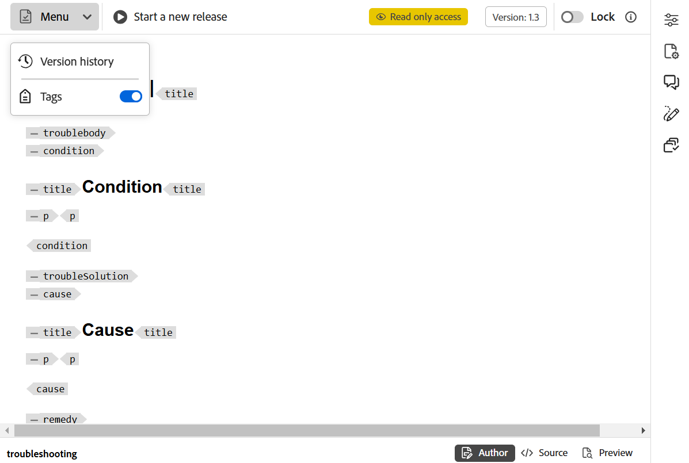

# Documentstatus {#id1821HC00URO}

Om de gereedheid van de documenten te beheren, biedt AEM Guides de eigenschap documentstatus om de huidige status van het document aan te geven. Met documentstatussen kunt u snel nagaan of een document nieuw is, in de revisie of de voltooide status van de revisie.

## Typen documentstatussen

Voor een document kunnen alle documentstatussen zijn gedefinieerd in het profiel Documentstatus. Een document kan bijvoorbeeld een van de volgende documentstatussen hebben:

- Concept - Geeft aan dat het document wordt gemaakt en opgeslagen met nieuwe wijzigingen.
- In-Review - Geeft aan dat een revisiewerkstroom is gestart voor het document.
- Gereviseerd - Geeft aan dat het document is gereviseerd door de bedoelde gebruikers.

Deze statussen worden handmatig of automatisch ingesteld volgens de profielinstellingen van de documentstatussen. Bijvoorbeeld, als het profiel van de Staat van het Document met beginstaat als Ontwerp wordt gevormd, en de staat In-Overzicht wordt bepaald voor documenten onder overzicht. Dan, wanneer u een document creeert, wordt de documentstaat geplaatst aan *Ontwerp*. Als u een revisietaak start, wordt de status van het document gewijzigd in In-Review.

U kunt de documentstatus voor een of meerdere documenten ook handmatig wijzigen. Als u echter de documentstatus voor meerdere documenten wilt wijzigen, wordt de toegestane status bepaald door de algemene staten die zijn toegestaan voor de geselecteerde documenten. Stel dat u de documentstatussen in dezelfde volgorde hebt gedefinieerd als Concept, In-Review, Reviewed en Ready to Publish. Voor document one.dita wordt de staat geplaatst aan *Ontwerp* en op document two.dita, wordt de staat geplaatst aan Gereviseerde. Wanneer u zowel—one.dita als two.dita selecteert, dan zal de toegestane documentstaat *Klaar aan Publish* zijn. Aangezien two.dita in *Gereviseerde* staat is, is de volgende mogelijke staat voor two.dita slechts *Klaar aan Publish*, die wordt getoond wanneer beide documenten worden geselecteerd.

>[!NOTE]
>
> Een document kan slechts in één frame tegelijk bestaan.

## Documentstatus wijzigen

Voer de volgende stappen uit om de status van een document te wijzigen:

1. Selecteer in de gebruikersinterface van Assets een of meer documenten waarvan u de documentstatus wilt wijzigen.
1. In de belangrijkste toolbar, klik **Eigenschappen**.
1. Selecteer de nieuwe staat van de **drop-down Staat van het Document**. U kunt alleen de documentstatussen selecteren die zijn toegestaan in het gedeelte Overgang status van het profiel Documentstatus.

   >[!NOTE]
   >
   >Beheerders kunnen alle documentstatussen weergeven en het document wijzigen in een willekeurige status.

1. Klik **sparen &amp; Sluiten**.

## Documentstatus weergeven

De kaartmening van Assets UI toont de huidige staat samen met de aanmaakdatum en de grootte van het respectieve onderwerp DITA of kaart DITA.

{width="800" align="left"}

## Documentstatussen gebruiken in DDLC

Documentstatussen spelen een belangrijke rol bij het beheer van de levenscyclus van documenten in DDLC. Als uw organisatie strikt de DDLC volgt, dan wordt het hebben van een mechanisme om het uitgeven documenten te controleren die op hun staat worden gebaseerd een essentiële eigenschap. Bijvoorbeeld, kunt u het uitgeven documenten toestaan wanneer zij in *Ontwerp* of *in overzicht* staten zijn. Als een document echter eenmaal is gereviseerd en klaar is om te publiceren, moet er een manier zijn om verdere wijzigingen van documenten te voorkomen.

AEM Guides biedt een workflow voor documentgoedkeuring waarmee u de levenscyclus van het ontwikkelingsproces van uw document kunt bepalen. Als een document gereed is om te publiceren of de voorlaatste status heeft bereikt, kunt u het markeren als goedgekeurd. Nadat een document is goedgekeurd, maakt AEM Guides een nieuwe versie van het document en maakt het alleen-lezen. Vervolgens kunt u het document verplaatsen voor publicatie of een basislijn maken voor verdere verwerking.

Een auteur moet een nieuwe versie starten om een nieuwe versie te starten van de documenten die zijn gemarkeerd als goedgekeurd. De aanvang van een nieuwe versie verandert opnieuw de documentstaat in *Ontwerp*. Door de documentstaat in *Ontwerp* te veranderen, wordt het document opnieuw editable gemaakt en u kunt aan de volgende versie blijven werken.

Voer de volgende stappen uit om de functie voor documentgoedkeuring te gebruiken:

>[!NOTE]
>
> De beheerder moet de functie voor de goedkeuringswerkstroom inschakelen. Voor meer details, zie *goedkeuringswerkschema* sectie van het goedkeuringswerkschema in installeren en vormen as a Cloud Service Adobe Experience Manager Guides.

1. Open in de webeditor het document dat u ter goedkeuring wilt markeren.

1. Klik het **Goedgekeurde Teken** pictogram.

1. Als het document de status heeft die als goedgekeurd moet worden gemarkeerd, wordt het volgende dialoogvenster weergegeven:

   {width="300" align="left"}

   Als uw document niet als goedgekeurd kan worden gemerkt, dan wordt het volgende bericht getoond:

   {width="300" align="left"}

1. Als uw document klaar is om zoals goedgekeurd te worden gemerkt, dan selecteer een etiket van de drop-down lijst en klik **goedkeuren**.

   >[!NOTE]
   >
   > Als uw beheerder geen vooraf gedefinieerde lijst met labels heeft geconfigureerd, wordt u een tekstveld met een vrije vorm getoond waarin u een label kunt invoeren.

1. Zodra het document met succes zoals goedgekeurd wordt gemerkt, dan wordt a **Voorproef** van het document getoond op de read-only wijze.

   {width="650" align="left"}

   >[!NOTE]
   >
   > In de modus Voorbeeld worden alle bewerkingsopties verwijderd van de werkbalk. Bovendien zijn de weergave Auteur en Source van het document ook verwijderd uit de bovenste navigatie.

Als een document is gemarkeerd als goedgekeurd, kan het niet meer worden bewerkt. Als u het document voor de volgende versie wilt gebruiken, dan moet u het terug naar de *staat van het Ontwerp* brengen. Om de documentstaat van een goedgekeurd document terug naar *Laag* wijze te veranderen, voer de volgende stappen uit:

1. In een goedgekeurd document, klik het **Begin een Nieuw pictogram van de Versie** .

   Het bericht Nieuwe release starten wordt weergegeven.

1. Klik **bevestigen**.

   De staat van het document wordt veranderd in Ontwerp en het document wordt geopend in de Redacteur van het Web op uitgeeft wijze.

**Bovenliggend onderwerp:**[ Werk met de Redacteur van het Web ](web-editor.md)
