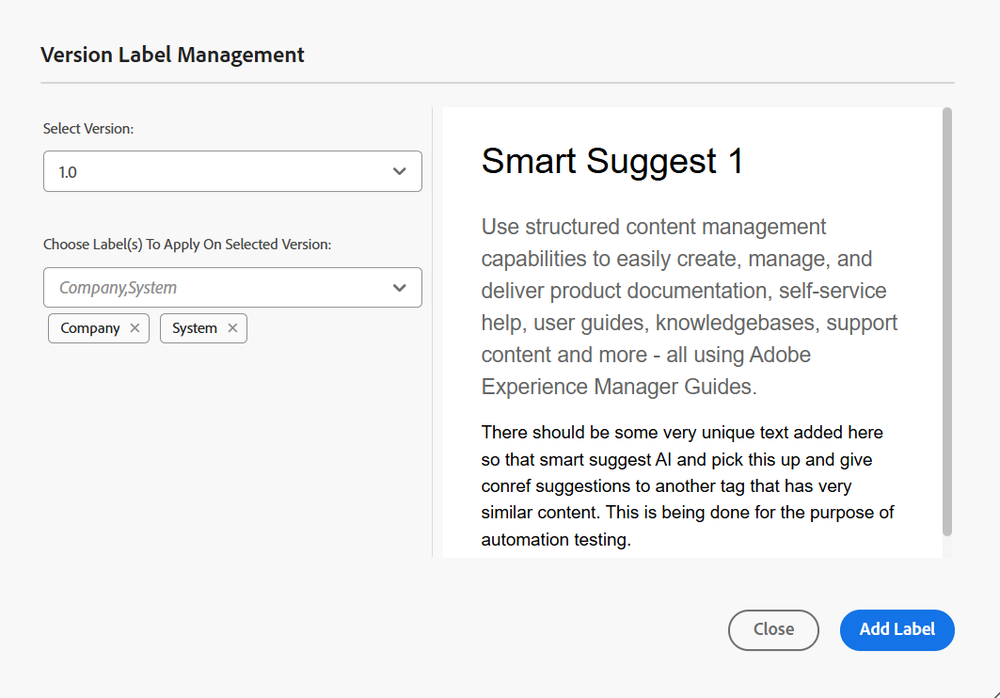
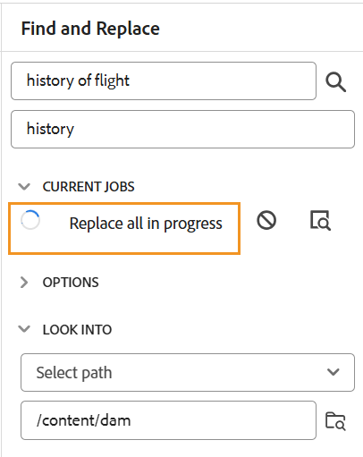
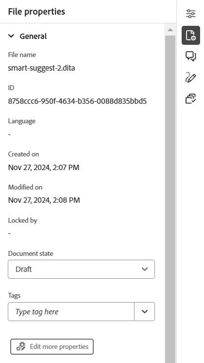

# De functies van de Editor leren kennen {#id176NC500V5Z}

Deze sectie doorloopt u de diverse eigenschappen die in de Redacteur beschikbaar zijn. U kunt de Editor opsplitsen in de volgende secties of gebieden:

- [Kopbalk](#header-bar)
- [Tabbalk](#tab-bar)
- [Werkbalk](#toolbar)
- [Deelvenster Links](#left-panel)
- [Inhoudsbewerkingsgebied](#content-editing-area)
- [Rechterdeelvenster](#right-panel)

In de volgende subsectie worden de verschillende secties van de Editor nader beschreven.

## Kopbalk

De kopbalbar is de hoogste bar van de Redacteur die het embleem van Adobe Experience Manager (of verenigde Shell toont als u Verenigde Shell als uw Experience Manager Guides UI gebruikt). Wanneer u het logo selecteert, wordt u naar de Experience Manager-navigatiepagina geleid.


Gebruik **breid** pictogram in de toolbar uit om de kopbalbar te verbergen en het inhoudsgebied te maximaliseren. Om de standaardmening te herstellen, de uitgezochte **Uitgang de uitgebreide mening**.


## Tabbalk

De bar van het Lusje is bij de bovenkant van de interface van de Redacteur en het verleent toegang tot de volgende eigenschappen:


**Lusjes**

Toont de momenteel geopende onderwerpen in de Redacteur als dossierlusjes. U kunt veelvoudige onderwerpen hebben die tezelfdertijd worden geopend, die in hun respectieve lusjes in de lusjebar worden getoond. Standaard kunt u de bestandstitels op de tabbladen weergeven. Terwijl u de cursor op een bestand plaatst, kunt u de bestandstitel en het bestandspad weergeven als knopinfo.

>[!NOTE]
>
> Als beheerder kunt u de lijst met bestanden ook weergeven op bestandsnamen op de tabbladen. Selecteer de **Filename** optie van de **3} sectie van de de vertoningsconfiguratie van de dossiers van de Redacteur in [ voorkeur van de Gebruiker ](./intro-home-page.md#user-preferences).**

Als u het tabblad Bestand selecteert, wordt een contextmenu geopend met de opties Opslaan als nieuwe versie, Kopiëren, Zoeken in, Toevoegen aan, Eigenschappen, Splitsen, Downloaden als PDF en Sluiten.

**sparen allen**

Hiermee slaat u de wijzigingen op die u in alle geopende onderwerpen hebt aangebracht. Als u veelvoudige onderwerpen hebt die in de Redacteur worden geopend, **selecteren sparen allen** of het gebruiken van **CTRL** + **S** kortere wegsleutels bewaart alle documenten in één klik. U hoeft niet elk document afzonderlijk op te slaan.

>[!NOTE]
>
> **sparen al** verrichting leidt niet tot een nieuwe versie van uw onderwerpen. Om een nieuwe versie tot stand te brengen, gebruik **sparen als nieuwe versie** optie.

**AI Medewerker**

Een krachtig, door AI aangedreven hulpmiddel dat wordt ontworpen om uw productiviteit door slimme hulp en auteurseigenschappen te verbeteren. Het verenigt twee robuuste eigenschappen AI - **Authoring** en **Hulp** - in de interface van Experience Manager Guides, toelatend u aan auteursinhoud en toegangsinformatie van de documentatie van Experience Manager Guides sneller en efficiënter.

>[!NOTE]
>
> De functie AI Assistant is momenteel beschikbaar voor Adobe Experience Manager Guides as a Cloud Service.

**breid mening** uit: Staat u toe om de paginamening uit te breiden gebruikend **breid** pictogram uit. In deze weergave is de kopbalk met het Adobe Experience Manager-logo verborgen. Hierdoor wordt de ruimte voor het bewerken van de inhoud gemaximaliseerd. Om aan de standaardmening terug te keren, gebruik **Uitgang het uitgebreide meningspictogram**.

**Meer acties**: Staat u toe om aan **Assets** en **Montages** te navigeren.

De **optie van Assets** neemt u aan een bestemming die op uw opstelling wordt gebaseerd:

- **de Diensten van de Wolk**: Als u de Diensten van de Wolk gebruikt, die de **Assets** optie selecteren neemt u aan de pagina van de Navigatie van AEM.

- **Op-gebouwSoftware**: Als u Adobe Experience Manager Guides (4.2.1 en later) gebruikt, die de **optie van Assets** selecteert neemt u aan uw huidige dossierweg in Assets UI.


De **optie van Montages** is beschikbaar slechts voor beheerders en de beheerders van het omslagprofiel, en staat het vormen van de volgende montages toe:

>[!NOTE]
>
> Als u standaardinstellingen bijwerkt, moet u documenten opnieuw openen om de wijzigingen van kracht te laten worden.

- **Algemeen**: De Algemene montages staan u toe om het woordenboek te vormen om met de Redacteur te gebruiken. Dit lusje bevat vier secties: **controle van de Spel**, **Voorwaarde**, **Authoring**, en **Bevelingen**.

  {width="650" align="left"}

   - **controle van de Spel**: Er zijn twee opties - **de spellingcontrole van AEM** en **Browser spellingcontrole**. Standaard gebruikt de editor de functie voor spellingcontrole in de browser, waarbij de spellingcontrole wordt uitgevoerd met behulp van het ingebouwde woordenboek van de browser. U kunt overschakelen naar de spellingcontrole van AEM om het Adobe Experience Manager-woordenboek te gebruiken. Dit kan ook worden aangepast om uw aangepaste woordenlijst toe te voegen. Voor meer informatie over het aanpassen van het woordenboek van AEM, de mening [ past de sectie van het standaardwoordenboek van AEM ](../cs-install-guide/customize-aem-custom-dictionary.md) in installeert en vormt Adobe Experience Manager Guides as a Cloud Service aan.

   - **Voorwaarde**

      - **benadruk voorwaardelijke tekst in de mening van de Auteur**: Selecteer dit om de voorwaardelijke tekst in de auteursmening te benadrukken. De voorwaardelijke inhoud wordt gemarkeerd met de kleur die voor de voorwaarde is gedefinieerd.

      - **Valideer met voorwaardenattributen**: Selecteer dit om de bevestiging van de waarden toe te staan die voor de attributen worden bepaald. Hierdoor kunt u geen onjuiste waarde toevoegen.

      - **toon sleutel met de titel in het Onderwerppaneel van het Regeling**: Selecteer dit om de sleutels samen met titels in de onderwerpregeling te tonen. Als u deze optie niet selecteert, worden alleen de titels weergegeven. Hier worden bijvoorbeeld de toetsen &#39;os&#39;, &#39;publiek&#39; en &#39;ander&#39; ook samen met titels weergegeven.

        {width="550" align="left"}

      - **toon onderwerpregeling in het paneel van Voorwaarden**: selecteer dit om een onderwerpregeling in het voorwaardenpaneel te bekijken. Als u deze optie uitschakelt, worden de gedefinieerde voorwaarden weergegeven in het deelvenster Voorwaarden.

   - **Authoring**

      - **laat Vervangen toe allen**: Selecteer dit om **te bekijken vervangen allen** pictogram in **Vondst en vervang** paneel.

   - **Bevelingen**
Wijzig de stijl van de citaten. Kies de citaatstijl van drop-down u in uw project wilt gebruiken. Voor meer details, mening [ de citaatstijlen van de Verandering ](./web-editor-apply-citations.md#change-citation-style).

   - **AI Medewerker**
Selecteer dit om de [ AI Medewerker ](./ai-assistant.md) eigenschap in Experience Manager Guides toe te laten. Hef de selectie op om de functie uit te schakelen.

**Panelen**: Dit het plaatsen controleert de panelen die in de linker en juiste panelen van de Redacteur en de console van de Kaart worden getoond. U kunt de knop in- of uitschakelen om het gewenste deelvenster weer te geven of te verbergen.

{width="650" align="left"}

U kunt ook de volgorde definiëren waarin de functies in deelvensters worden weergegeven. Als u de standaardvolgorde van de beschikbare functies in de deelvensters wilt wijzigen, selecteert u de stippelbalken om de tabbladen met functies naar de gewenste locatie te slepen. Een eigenschap kan ook van de **Meer** sectie aan de belangrijkste sectie van een paneel worden bewogen, en vice versa zoals per het vereiste. Als de functies eenmaal opnieuw zijn geordend, staan deze in dezelfde volgorde in het rechter- en linkerdeelvenster.

{width="650" align="left"}


U kunt maximaal acht deelvensters tegelijk weergeven. Wijzigingen die u aanbrengt in de deelvensterinstellingen worden direct toegepast.


>[!NOTE]
>
> Als er een aangepast deelvenster is geconfigureerd, wordt dit ook weergegeven in de lijst met deelvensters. U kunt schakelen tussen het weergeven of verbergen van het aangepaste deelvenster.

- **lijst van Elementen**: Als beheerder, kunt u de lijst van elementen controleren die een auteur in een dossier kan opnemen en ook de vertoningsnaam voor het element bepalen. Met de instelling voor de Elements-lijst kunt u de naam van het element opgeven volgens de DITA-specificaties en een label dat u wilt gebruiken in plaats van de door DITA gedefinieerde elementnaam:

  {width="650" align="left"}

In de bovenstaande schermafbeelding heeft het element `p` een label Alinea gekregen en krijgt `codeblock` een label Codeblok samen met enkele andere elementen. Als u het **Gebruik slechts boven elementen** optie selecteert, dan slechts zullen de geldige elementen \ (op huidig toevoegingspunt \) van deze lijst in het **het element van het Tussenvoegsel** dialoogvakje worden getoond.

In het volgende schermafbeelding worden slechts 3 van de 4 geconfigureerde elementen van de vorige schermafbeelding in de huidige context getoond:

{width="300" align="left"}

- **lijst van Attributen**: Gelijkaardig aan de elementenlijst, kunt u de lijst van attributen en hun vertoningsnamen controleren die in de attributenlijst van een element moeten worden getoond. In het volgende schermschot, slechts zijn 3 attributen gevormd om in de de attributenlijst van een element te worden getoond:

  {width="650" align="left"}

  Met deze instelling kunt u bij het toevoegen van een kenmerk aan een element alleen de lijst weergeven met kenmerken die in de lijst zijn geconfigureerd.

  {width="300" align="left"}

- **Kleuren**: Toont een lijst van pre-gevormde achtergrondkleuren voor **Voorwaarden**. Gebruikers kunnen een achtergrondkleur selecteren wanneer zij een voorwaarde op een onderwerp toepassen. Als beheerder kunt u ook aangepaste achtergrondkleuren maken en aan de lijst toevoegen. Om een nieuwe kleur toe te voegen, ga de gewenste naam op het **gebied van de Naam van de Kleur** in, kies een douanekleur, en selecteer **+** pictogram. De aangepaste kleur wordt aan het einde van de kleurlijst weergegeven.

- **publiceer profielen**: Dit bevat de Profielen die kunnen worden gebruikt om de **3} output van de Kennisbank {te publiceren.** U kunt een nieuw profiel voor een doelkennisbasis tot stand brengen. Bijvoorbeeld Salesforce of ServiceNow.

   - **creeer een profiel van Salesforce**

     **Eerste vereisten**

      - Maak een verbonden app voor Salesforce. Voor meer details, verwijs naar [ laat OAuth Montages voor API Integratie ](https://help.salesforce.com/s/articleView?id=sf.connected_app_create_api_integration.htm&amp;type=5) toe.

      - Zorg tijdens het configureren van de verbonden app voor het volgende:

         - Geef de callback op.

           `URL: http://<server name>:<port>/bin/dxml/thirdparty/callback/salesforce`

         - Selecteer de volgende OAuth-bereiken:
            - Volledige toegang (volledig)
            - Selecteer Gebruikersgegevens beheren via API&#39;s (api)

     Zodra app wordt gevormd, verstrekt Salesforce a **Consumentensleutel** en **Geheime consument**. Hiermee kunt u het Salesforce-profiel maken.


   - Om een profiel van Salesforce tot stand te brengen, selecteer de **Salesforce** Kennisbank van het **type van Server** dropdown. Voer een profielnaam in. In de **Plaats URL**, ga de consumentenplaats in u zou gebruiken om de output te publiceren en dan de **Consumentensleutel** toe te voegen en **Geheime consument** die door de de consumentenplaats van Salesforce wordt verstrekt. Dan, **bevestigt** en **sparen** het pas gecreëerde profiel.

     {width="550" align="left"}

     >[!NOTE]
     >
     >Gebruik Apache HTTP Components Proxy Configuration in AEM om een proxy voor Salesforce in Experience Manager Guides te configureren. Leer hoe te [ volmacht voor de Controleur van de Verbinding van AEM ](https://helpx.adobe.com/experience-manager/kb/How-to-configure-proxy-for-the-AEM-Link-Checker-AEM.html) vormen.


   - **creeer een profiel ServiceNow**

     **Eerste vereisten**

     Vorm de server ServiceNow om de activa te uploaden.
      - Verbind met de **** server ServiceNow.
      - Navigeer aan **Eigenschappen van het Systeem** > **Veiligheid**.
      - Schakel de volgende optie uit:

        **Dit bezit moet worden geplaatst om MIME type te activeren controlerend voor uploads (Alle versies Eureka en omhoog). Schakelt mime-validatie (true) of uit (false) voor de bestandsbijlagen. De uitbreidingen van het dossier die via glide.gehechtheid.extensions worden gevormd zullen op MIME type tijdens upload worden gecontroleerd.**

      - Selecteer **sparen**.

     Zodra u app hebt gevormd, creeer het **ServiceNow** profiel.
   - Om een profiel tot stand te brengen, selecteer de Kennisbank ServiceNow van het **type van Server** dropdown. Ga een profiel **Naam** in. In **ServiceNow URL**, ga de consumentenplaats in u voor het publiceren van de output zou gebruiken en dan de **Gebruikersnaam** en **Wachtwoord** toevoegde die} door de plaats van de consument ServiceNow wordt verstrekt. Dan, **bevestigt** en **sparen** het pas gecreëerde profiel.

     {width="550" align="left"}

  Nadat u bevestigt, kunt u het Publish Profiel in de outputvoorinstellingen van een Kaart selecteren DITA en het gebruiken om de output aan de **Salesforce** of **** server te produceren ServiceNow die u hebt gekozen.

  Leer meer over de [ vooraf ingestelde output van de Kennisbank ](../user-guide/generate-output-knowledge-base.md).


- **Bevestiging**: Dit lusje bevat opties om de bevestigingen van het Schema in de Redacteur te vormen. U kunt de volgende functies inschakelen:

   - **de bevestigingscontrole van de Looppas alvorens het dossier** op te slaan: Selecteer dit om de bevestigingen in werking te stellen Schematron gebruikend het geselecteerde dossier van het Schema vóór om het even welke sparen verrichting. U kunt een Schematron-bestand toevoegen door het pictogram + te selecteren. De geselecteerde Schematron-bestanden worden weergegeven.

     >[!NOTE]
     >Het geselecteerde schemabestand of de geselecteerde schemabestanden blijven aanwezig voor het geselecteerde mapprofiel.

     {width="550" align="left"}

     Hiermee voorkomt u dat gebruikers een bestand opslaan dat een regel verbreekt die is gedefinieerd in de geselecteerde Schema-bestanden. Als u deze optie niet selecteert, wordt het bestand niet gevalideerd voordat de wijzigingen worden opgeslagen.

   - **staat alle gebruikers toe om schemadossiers in bevestigingspaneel toe te voegen**: Selecteer dit om de gebruikers toe te staan om het even welk dossier van het Schema in het paneel van de Bevestiging van de Redacteur toe te voegen. Dit staat de gebruikers toe om dossiers Schematron toe te voegen en dan de onderwerpen tegen het dossier van Schematron te bevestigen. Als dit niet wordt geselecteerd, is de optie om schematroondossier **toe te voegen Schematroebestand** knoop niet beschikbaar aan de gebruikers in het **paneel van de Bevestiging** van de Redacteur.


- **de attributen van de Vertoning**: Als de lijst van Attributen, kunt u de lijst van attributen controleren die in de attributenlijst van een element moeten worden getoond. Door gebrek, zijn vier **attributen van de Vertoning** — publiek, platform, product, en steunen gevormd om in de attributenlijst van een element worden getoond. U kunt een vertoningsattribuut ook toevoegen gebruikend **** pictogram op de bovenkant toevoegen. U kunt om het even welke vertoningsattributen ook schrappen gebruikend het **pictogram van de Schrapping**.

  De kenmerken die voor een element zijn gedefinieerd, worden weergegeven in de layoutweergave en in de contourweergave.

  {width="550" align="left"}

- **Vertaling**: Dit lusje bevat de opties om taalgroepen tot stand te brengen, de bronetiketten aan de doelversie te verspreiden, en het vertaalproject schoon te maken.

  {width="550" align="left"}

   - **Groepen van de Taal**: Als beheerder, kunt u een groep talen tot stand brengen en hen gebruiken als reeks om de inhoud te vertalen.\
     Voer de volgende stappen uit om een nieuwe taalgroep te maken:
      1. Selecteer **toevoegen**.
      1. Voer de naam van de taalgroep in. Elke taal moet een unieke naam hebben. U kunt een fout weergeven als het naamveld leeg is of als de naam niet uniek is.
      1. Selecteer de talen in het vervolgkeuzemenu. U kunt meerdere talen selecteren.

     Typ de eerste paar tekens van de taal of de taalcode om de gewenste talen te filteren. Typ bijvoorbeeld &#39;en&#39; om alle talen te filteren die &#39;en&#39; bevatten aan het begin van hun naam of code.
      1. Selecteer het pictogram Gereed om de geselecteerde talen aan de groep toe te voegen. De talen worden weergegeven. Wanneer u drie of meer talen toevoegt, **toon meer** optie wordt getoond. U kunt **selecteren toont meer** om alle talen te bekijken huidig in de groep.

         >[!TIP]
         >
         > Knevel **tonen meer** aan **tonen minder** en bekijken slechts een paar talen.

      1. Beweeg over de talen in een groep om  uit of schrap  de taalgroepen schrappen.
      1. Sparen de **Montages**.

         >[!NOTE]
         >
         >Als gebruiker, kunt u de taalgroepen bekijken die aan uw omslagprofiel worden gevormd.

   - **verspreidt bronversielabels aan de doelversie**: Selecteer deze optie om het etiket van de brondossierversie tot het vertaalde dossier over te gaan. Deze optie is standaard uitgeschakeld.
   - **Schoonmaak van het Vertaalproject na voltooiing**: Selecteer deze optie om de vertaalprojecten te vormen om na de vertaling worden onbruikbaar gemaakt of automatisch worden geschrapt. Door gebrek, **niets** wordt geselecteerd, zodat het project na vertaling bestaat.

     U kunt de vertaalprojecten onbruikbaar maken als u hen later wilt gebruiken. Als u een project verwijdert, worden alle bestanden en mappen in het project permanent verwijderd.


- **Meta-gegevens**: U kunt de versiemetagegevens van het onderwerp en hun waarden controleren die in het **de geschiedenisdoos van de Versie** worden getoond.  Geef in het pad naar de metagegevens de locatie op van de knooppunten waaruit u de metagegevens wilt kiezen. U kunt ook een aangepaste naam voor de metagegevens definiëren als label. De standaardeigenschappen zijn Titel, Documentstatus en Labels.

  De metagegevens kunnen worden gekozen uit elke eigenschap onder het knooppunt `/jcr:content` van het element, zodat u het pad van de eigenschap kunt toevoegen als het pad naar metagegevens.


  Er wordt een fout weergegeven als het pad naar de metagegevens leeg is. Als u het label leeg laat, wordt het laatste element als label gekozen.


  {width="550" align="left"}

  *vorm de meta-gegevens voor het **de dialoogvakje van de Geschiedenis van de Versie**.*


  U kunt ook de volgorde definiëren waarin deze metagegevenstags worden weergegeven. Als u de standaardvolgorde van deze tags wilt wijzigen, selecteert u de stippelbalken om de tags naar de gewenste locatie te slepen.
De meta-gegevensetiketten verschijnen in de zelfde opeenvolging in het **de geschiedenisdialoogvakje van de Versie** van de Redacteur.

## Werkbalk

De werkbalk verschijnt wanneer u een onderwerp of kaart opent voor bewerking in de Editor. De werkbalk bevat de volgende functies:

- [Vervolgkeuzelijst Menu](#menu-dropdown)
- [Opties voor het invoegen van inhoud](#content-insertion-options)
- [Versiegegevens en knop Opslaan als nieuwe versie](#save-as-new-version)
- [Vergrendelen/ontgrendelen](#lockunlock)

>[!NOTE]
>
> De bovenstaande functies zijn alleen van toepassing op onderwerpbestanden. Als u met een kaartbestand werkt, worden op basis van de huidige Kaartweergave verschillende opties op de werkbalk weergegeven. Leer over de opties van de de redacteurstoolbar van de Kaart in het [ de redacteurseigenschappen van de Kaart ](./map-editor-advanced-map-editor.md) document.

### Vervolgkeuzelijst Menu

Het vervolgkeuzemenu Menu biedt toegang tot de bewerkingsacties, Zoeken en vervangen, Versiegeschiedenis, Versielabel, Samenvoegen, Revisietaak maken, Wijzigingen bijhouden en de functie Codes.

Hieronder wordt een gedetailleerde uitleg gegeven van deze kenmerken:

**het Uitgeven acties**

Wanneer het uitgeven van een onderwerp in de Redacteur, toegang tot de diverse het uitgeven acties zoals **Besnoeiing** of ***CTRL*** + ***X***, **Exemplaar** of ***CTRL*** + ***C***, **ongedaan maken** of ***CTRL*** + ***Z.***, **opnieuw** of ***CTRL*** + ***Y*** en **Schrapping** aanwezig in het drop-down van het Menu.


**Vondst en vervangt**

De **Vondst en vervangt** eigenschap is beschikbaar in Auteur en de meningswijzen van Source. Als deze optie is ingeschakeld, wordt de tekstbalk Zoeken en vervangen onder aan het bewerkingsgebied voor onderwerpen weergegeven. U kunt de kortere wegsleutels gebruiken **CTRL** + **F** om de Vondst aan te halen en bar te vervangen.

{width="800" align="left"}

Gebruikend het montagespictogram \ ( \), kunt u **negeren geval** en **het Hele woord slechts** onderzoeksopties van een knevel voorzien. Om het case-insensitive onderzoek uit te voeren, zet \ (of selecteer \) **geval** optie negeren. Anders, als u het case-sensitive onderzoek wilt uitvoeren, draai \ (of schrap \) **negeren geval** optie. U kunt ook een heel woord zoeken.

Het onderzoek is onmiddellijk, zo betekent het dat aangezien u de onderzoeksuitdrukking of het woord in het **Vondst** gebied typt, de termijn onmiddellijk wordt gezocht en in het onderwerp geselecteerd. Op dezelfde manier voor het vervangen van een tekst in uw onderwerp, ga de onderzoekstermijn en zijn vervanging op de respectieve gebieden in en selecteer **vervangen** of **vervangen allen** knoop.

In de mening van Source, is de **Vondst en vervangt** eigenschap uiterst nuttig voor het zoeken naar een specifiek element of een attribuut. Als u bijvoorbeeld de waarde van het kenmerk `@product` wilt vervangen, kunt u dit gemakkelijk doen vanuit de Source-weergave. In de weergave Auteur kunt u niet zoeken op basis van een kenmerk of element. Nochtans, moet u voorzichtigheid gebruiken terwijl het gebruiken van **vervangen Al** eigenschap, aangezien het de code van XML zou kunnen beschrijven.

**de geschiedenis van de Versie**

De **geschiedeniseigenschap van de Versie** in de Redacteur staat u toe om de beschikbare versies van uw DITA- dossiers te controleren, hen te vergelijken, en aan om het even welke versie van de Redacteur terug te keren zelf. U kunt de inhoud en metagegevens van de huidige versie (die ook een werkkopie kan zijn) vergelijken met elke vorige versie van hetzelfde bestand. U kunt ook de labels en opmerkingen voor de vergeleken versies weergeven.

>[!NOTE]
>
> De de geschiedenisopties van de Versie verschijnen slechts als er veranderingen worden aangebracht in de eerste versie van het onderwerp of de kaart.

Ga als volgt te werk om de versiegeschiedenis te openen en terug te keren naar een specifieke versie van het onderwerp:

1. Open een onderwerp in de Redacteur.
1. Selecteer **geschiedenis van de Versie** van **** dropdown van het Menu.

   Het **de dialoogvakje van de Geschiedenis van de Versie** verschijnt.

   {width="550" align="left"}

   *Voorproef de veranderingen in de verschillende versies van een onderwerp.*

1. Kies een versie van het onderwerp dat u wilt vergelijken of terugkeren aan in **vergelijken met** dropdown lijst.

   >[!NOTE]
   >
   > Als er op een versie labels zijn toegepast, worden deze ook tussen haakjes en het versienummer weergegeven.

1. Laat de **etiketten en commentaren van de Mening** optie toe om de etiketten en de commentaren te bekijken die op de huidige en de vergeleken versies worden toegepast.
1. U kunt de volgende informatie in het **de geschiedenisdialoog van de Versie** ook bekijken:

   **Voorproef** tabel: De onlangs toegevoegde inhoud is in groene doopvont, en de geschrapte inhoud is in rode doopvont.

   **Meta-gegevens** tabel: De onlangs toegevoegde meta-gegevens is in groene doopvont, en de geschrapte meta-gegevens is in rode doopvont.

   {width="550" align="left"}

   *vergelijk de meta-gegevens van verschillende versies in de geschiedenis van de Versie.*

   >[!NOTE]
   >
   > Uw systeembeheerder kan de meta-gegevens veranderen die van het lusje van Meta-gegevens in de **Montages** moeten worden getoond. Voor details, verwijs naar **Meer acties** sectie van de [ bar van het Lusje ](#tab-bar).

   U kunt ook de gebruikers- en tijdgegevens weergeven van de huidige en de vergeleken versie.

   Zodra u een versie van de drop-down lijst kiest, wordt **terugkeren aan geselecteerde versie** optie ter beschikking gesteld. Het voorproefvenster toont de verschillen tussen de huidige versie en de geselecteerde versie van het onderwerp.

1. Selecteer **terugkeren aan geselecteerde versie** om uw het werk exemplaar met de geselecteerde versie van het onderwerp terug te keren.

   Het dialoogvenster Versie herstellen wordt geopend.

   {width="550" align="left"}

1. \ (*Facultatieve* \) verstrek een reden om aan een vroegere versie terug te keren. U kunt ook een nieuwe versie maken van de actieve werkkopie van het onderwerp.

1. Selecteer **bevestigen.**

   De werkkopie van het bestand wordt teruggezet naar de geselecteerde versie. Als u ervoor kiest een nieuwe versie van de momenteel actieve werkkopie te maken, wordt ook een nieuwe versie van het bestand gemaakt met alle werkwijzigingen.

   Wanneer u terugkeert naar een eerdere versie, wordt een visuele aanwijzing getoond die erop wijst dat de versie u momenteel werkt aan niet de recentste versie is.

   {width="800" align="left"}

**de etiketten van de Versie**

Met labels kunt u het werkgebied identificeren waarin een bepaald onderwerp zich in de DDLC \(Levenscyclus voor documentontwikkeling\) bevindt. Wanneer u bijvoorbeeld aan een onderwerp werkt, kunt u het label &quot;Goedgekeurd&quot; instellen. Zodra een onderwerp wordt gepubliceerd en ter beschikking gesteld aan klanten, kunt u &quot;Vrijgegeven&quot;etiket aan dat onderwerp toewijzen.

Met Experience Manager Guides kunt u labels opgeven in een tekstindeling met vrije vorm of een set vooraf gedefinieerde labels gebruiken. Met het aangepaste label kan elke auteur in het systeem naar keuze een label opgeven. Dit geeft flexibiliteit, maar het introduceert inconsistente labels in het systeem. Om dit probleem te verhelpen, kunnen beheerders een set vooraf gedefinieerde labels configureren. Voor meer informatie over het vormen van vooraf bepaalde etiketten, vormt de mening *en past de Redacteur van het Web van XML* in toe installeert en vormt Adobe Experience Manager Guides as a Cloud Service.

Deze labels worden in de vorm van een vervolgkeuzelijst weergegeven aan auteurs, waar ze een label moeten opgeven. Dit zorgt ervoor dat alleen vooraf gedefinieerde, consistente labels in het systeem worden gebruikt.

Er zijn verschillende methodes waardoor u etiketten op uw onderwerpen kunt toepassen - ](web-editor-use-label.md) paneel van de geschiedenis van de 1} Versie in Assets UI, [ Basislijnen ](/help/product-guide/user-guide/generate-output-use-baseline-for-publishing.md) UI, en de Redacteur. [ Met de functie Versielabel in de Editor kunnen auteurs snel en eenvoudig labels toewijzen aan hun onderwerpen.

Voer de volgende stappen uit om labels aan uw onderwerp toe te voegen vanuit de Editor:

1. Open een onderwerp in de Redacteur.

1. Selecteer **de etiketten van de Versie** van het drop-down Menu.

   Het dialoogvenster Versielabelbeheer wordt weergegeven.

   {width="650" align="left"}

   Het dialoogvenster Versielabelbeheer is opgedeeld in twee delen. Het linkerdeelvenster bevat een lijst met versies die beschikbaar zijn voor het onderwerp, samen met de vervolgkeuzelijst met labels \(of een tekstvak waarin een label\ wordt ingevoerd) en het rechterdeelvenster met een voorvertoning van het onderwerp.

1. Selecteer een versie waarop u labels wilt toepassen.

   Wanneer u een verschillende versie van het onderwerp van de versielijst kiest, dan toont het voorproefpaneel de veranderingen tussen de huidige versie en de geselecteerde versie van het onderwerp

   >[!NOTE]
   >
   > Als een label al op een versie is toegepast, wordt het naast het versienummer weergegeven in de vervolgkeuzelijst en onder de lijst Selecteer versie. U kunt een bestaand etiket verwijderen door \ (**x** te selecteren \) pictogram naast het etiket.

1. Als de beheerder een lijst met labels heeft gedefinieerd, wordt een vervolgkeuzelijst met de labels weergegeven waaruit u de labels kunt kiezen die u wilt toepassen. U kunt meerdere labels selecteren in de vervolgkeuzelijst.

   Anders, wordt u getoond een tekstvakje, waar u de etiketten kunt ingaan die u aan uw onderwerp wilt toevoegen.

   >[!NOTE]
   >
   > U kunt niet het zelfde etiket op veelvoudige versies van een onderwerp toepassen. Als u probeert om een bestaand etiket te associëren, dan krijgt u een optie om het uit de bestaande versie te verwijderen en het op de geselecteerde versie van het onderwerp toe te passen.

1. Selecteer **toevoegen Etiket**.

1. In het Apply de bevestigingsbericht van het Etiket, selecteer het **etiket van de Beweging (indien gebruikt op een andere versie)** optie om etiketten van een bestaande versie aan de geselecteerde versie te bewegen. Als u deze optie niet selecteert en er etiketten zijn die aan een verschillende versie van het onderwerp worden toegewezen, dan worden zij niet verplaatst naar de geselecteerde versie van het onderwerp. Dergelijke labels worden genegeerd in het labeltoepassingsproces.

**Fusie**

Wanneer u in een multi-auteurmilieu werkt, wordt het moeilijk om te volgen welke veranderingen de andere auteurs in een onderwerp of een kaart hebben aangebracht. Met de functie Samenvoegen hebt u meer controle over het weergeven van de wijzigingen, maar ook over de wijzigingen die in de meest recente versie van het document blijven staan.

- **onderwerpdossiers van de Fusie**

  Voer de volgende stappen uit om wijzigingen in een onderwerp samen te voegen:

   1. Open een onderwerp in de Redacteur.

   1. Selecteer **Samenvoegen**.

      Het dialoogvenster Samenvoegen wordt weergegeven.

      {width="550" align="left"}

   1. *\(Optioneel\)* U kunt ook bladeren en een nieuw dossier van één of andere andere plaats in uw bewaarplaats selecteren.

   1. Selecteer een versie van het bestand waarmee u de huidige versie van het bestand wilt vergelijken.

   1. Kies bij Opties de volgende opties:

      - **de veranderingen van het Spoor van geselecteerde versie**: Deze optie toont alle inhoudsupdates in de vorm van bijgehouden veranderingen. Vervolgens kunt u kiezen of u de wijzigingen in het document een voor een wilt accepteren of wilt negeren, of in één keer.

      - **keert aan geselecteerde versie** terug: Deze optie keert de huidige versie van het document aan de geselecteerde versie terug. Met deze optie kunt u niet bepalen welke inhoud wordt geaccepteerd of geweigerd.

   1. Selecteer **Gereed**.

   1. Als u het **Spoor van geselecteerde versie** optie selecteerde, dan worden alle veranderingen van de geselecteerde versie getoond in de Getraceerde veranderingseigenschap van het juiste paneel.

      U kunt ervoor kiezen alle opmerkingen in het deelvenster Bijgehouden wijzigingen te accepteren of te negeren, of afzonderlijke opmerkingen te accepteren of te negeren.


- **de kaartdossiers van de Fusie**

  Voer de volgende stappen uit om wijzigingen in een kaartbestand samen te voegen:

   1. Open een kaart in de Editor.

   1. Selecteer **Samenvoegen**.

      Het dialoogvenster Samenvoegen wordt geopend.

      {width="550" align="left"}

   1. *\(Optioneel\)* U kunt ook bladeren en een nieuw dossier van één of andere andere plaats in uw bewaarplaats selecteren.

   1. Selecteer een versie van het bestand waarmee u de huidige versie van het bestand wilt vergelijken.

   1. Kies bij Opties de volgende opties:

      - **de veranderingen van het Spoor van geselecteerde versie**: Deze optie toont alle inhoudsupdates in de vorm van spoorveranderingen. Vervolgens kunt u kiezen of u de wijzigingen in het document een voor een wilt accepteren of wilt negeren, of in één keer.

      - **keert aan geselecteerde versie** terug: Deze optie keert de huidige versie van het document aan de geselecteerde versie terug. Met deze optie kunt u niet bepalen welke inhoud wordt geaccepteerd of geweigerd.

   1. Selecteer **Gereed**.

   1. Als u de **veranderingen van het Spoor van geselecteerde versie** optie selecteerde, dan worden alle veranderingen van de geselecteerde versie getoond in het Bijgehouden paneel van veranderingen \ (op het recht \).

      U kunt ervoor kiezen om alle wijzigingen te accepteren of te negeren in het deelvenster Bijgehouden wijzigingen of om afzonderlijke wijzigingen in het kaartbestand te accepteren of te negeren.


**creeer overzichtstaak**

U kunt [ een overzichtstaak ](./review-send-topics-for-review.md) van het huidige onderwerp of kaartdossier direct van de Redacteur tot stand brengen. Open het dossier waarvoor u de overzichtstaak wilt tot stand brengen en **selecteren creeert overzichtstaak** van dropdown van het Menu om het proces van de overzichtsverwezenlijking in werking te stellen.

**de veranderingen van het Spoor**

U kunt alle updates die op een document zijn aangebracht bijhouden door de modus Wijzigingen bijhouden in te schakelen. Nadat u wijzigingen in de track hebt ingeschakeld, worden alle invoegingen en verwijderingen vastgelegd in het document. Alle verwijderde inhoud wordt gemarkeerd met Doorhalen en alle invoegingen worden gemarkeerd in groene tekst. Bovendien krijgt u ook de veranderingsbars bij de rand van de onderwerppagina. Ook hier wordt een rode balk weergegeven voor verwijderde inhoud en een groene balk voor toegevoegde inhoud. Als er een toevoeging en schrapping op de zelfde lijn is, dan zowel worden de groene als de rode bars getoond.

In de volgende schermafbeelding wordt de verwijderde en ingevoegde inhoud samen met de wijzigingsbalken gemarkeerd:

{width="650" align="left"}

Doorgaans kunnen wijzigingen in een document worden bijgehouden bij collegiale toetsing. U kunt wijzigingen bijhouden inschakelen en uw document delen voor revisie. De revisor brengt vervolgens wijzigingen aan met de functie Wijzigingen bijhouden ingeschakeld. Wanneer u het document ontvangt, hebt u een mechanisme nodig om de voorgestelde updates samen met een handige manier te bekijken om wijzigingen te accepteren of te negeren.

Experience Manager Guides biedt de functie Bijgehouden wijzigingen die informatie bevat over de updates die in het document zijn aangebracht. De functie Bijgehouden wijzigingen biedt informatie over welke updates zijn uitgevoerd, wie deze heeft gemaakt en op welk moment. Met de functie Bijgehouden wijzigingen kunt u de voorgestelde updates in het document ook gemakkelijk accepteren of negeren.

Om tot de eigenschap toegang te hebben, selecteer het **pictogram van het Spoor verandert** in het juiste paneel.

{width="300" align="left"}

Als u een bijgehouden wijziging selecteert, wordt de gewijzigde inhoud in het document geselecteerd. U kunt een wijziging accepteren door het pictogram Wijziging accepteren te selecteren of deze te negeren door Wijzigen negeren te selecteren.

Als u alle veranderingen met één enkele klik wilt goedkeuren of verwerpen, selecteert **goedkeurt alle veranderingen** of **verwerpt alle veranderingen**.

>[!NOTE]
>
> In de modus Voorvertoning kunt u het document met of zonder de gewijzigde markeringen van de inhoud weergeven. Voor meer details, bekijk de [ wijze van de Voorproef ](web-editor-views.md#preview-mode-id19AAGL00163).

**Markeringen**

De **eigenschap van Markeringen** in de Redacteur is een knevelknoop die de zichtbaarheid van elementen DITA controleert. Als deze optie is ingeschakeld, worden structuurcodes binnen de inhoud weergegeven, zodat u de onderliggende DITA-elementen beter kunt weergeven en beheren. Als deze optie is uitgeschakeld, verbergt de editor deze tags, zodat de ontwerpomgeving schoner en gerichter wordt.

In de volgende schermafbeelding ziet u een document waarvoor de weergave Codes is ingeschakeld:

{width="650" align="left"}

De volgende bewerkingen kunnen worden uitgevoerd in een document met codes:

- **selecteer een element**: Selecteer de het openen of het sluiten markering van een element om zijn inhoud te selecteren.

- **breid of doen ineenstorten markeringen** uit: selecteer + of - teken in een markering om het uit te breiden of samen te vouwen.

- **Gebruik het contextmenu**: Het contextmenu verstrekt opties om, het geselecteerde element te snijden te kopiëren of te kleven. U kunt ook een element voor of na het geselecteerde element invoegen. Met de andere opties kunt u een id genereren of het deelvenster Eigenschappen openen voor het geselecteerde element.

- **belemmering-en-dalingselementen**: Selecteer de markering van een element en belemmering-en-daling het gemakkelijk op uw document. Als de neerzetlocatie een geldige locatie is waar het element is toegestaan, wordt het element op de neergezette locatie geplaatst.


>[!NOTE]
>
> Als een gebruiker de weergave Codes in de Editor inschakelt, blijft deze zelfs tijdens de sessies ingeschakeld. Dit betekent dat u de mening van Markeringen niet moet opnieuw toelaten om tot het later toegang te hebben. De standaardwaarde voor de weergave Codes van een nieuwe gebruikerssessie wordt bepaald door de eigenschap `tagsView` in het `ui\_config.json` -bestand. Voor meer details, bekijk [ standaardwaarde voor de sectie van de Mening van Markeringen ](../cs-install-guide/configure-default-value-tags-view.md) in installeer en vorm Adobe Experience Manager Guides as a Cloud Service.

### Opties voor het invoegen van inhoud

**Element** - 

Hiermee voegt u een geldig element in op de huidige of volgende geldige locatie. U kunt de toetsenbordkortere weg ***ook gebruiken Alt*** + ***gaat*** binnen om de de dialoogdoos van het Element te openen. Bijvoorbeeld, uitgeeft u een paragraaf, dan in het **de dialoogvakje van het Element**, verschijnt een lijst van elementen die in de paragraaf kunnen worden opgenomen. Selecteer het element dat u wilt invoegen. U kunt het toetsenbord gebruiken om door de lijst van elementen te scrollen en ***te drukken gaat*** binnen om het vereiste element op te nemen.

U kunt twee typen geldige elementen weergeven:

- **Geldige elementen bij de huidige plaats**: De lijst toont de elementen die u bij de huidige cursorplaats zelf kunt opnemen.

- **Geldige elementen buiten de huidige plaats**: De lijst toont de elementen die u na om het even welke ouders voor het huidige element binnen de elementenhiërarchie kunt opnemen.

Als u zich bijvoorbeeld binnen het inline `<b>` -element bevindt, kunt u op de huidige locatie elementen zoals `<u>` , `<xref>` en `<i>` invoegen. U kunt daarentegen elementen zoals `<table>` en `<topic>` buiten de huidige locatie invoegen.

U kunt ook een teken of tekenreeks typen in het zoekvak en zoeken naar de elementen die ermee beginnen.

{width="300" align="left"}

*ga &quot;t&quot;aan onderzoek naar alle geldige elementen in die met &quot;t&quot;beginnen.*

Als u in een blokelement werkt zoals een `note` , gebruikt u het pictogram Element invoegen om een nieuw element in te voegen na het `note` -element. In het volgende scherm is een notitie-element ingevoegd in het p \(alinea\)-element:

{width="800" align="left"}

Als u op Enter drukt in het notitie-element, wordt een nieuwe alinea gemaakt in het notitie-element zelf. Om een nieuw element buiten nota op te nemen, selecteer het p element \ (die in het schermafbeelding \) in de elementenbroodkruimel wordt benadrukt en selecteer dan het pictogram van het Element of druk ***Alt*** + ***gaat*** binnen om de het elementendialoogdoos van het Tussenvoegsel te openen. Selecteer vervolgens het gewenste element en druk op Enter om het geselecteerde element in te voegen na het notitie-element.

U kunt ook een element tussen twee elementen toevoegen wanneer er een knipperende blokcursor verschijnt.


{width="300" align="left"}

Als u bijvoorbeeld aan een DITA-onderwerp werkt en de blokcursor knippert tussen de korte beschrijving en de hoofdtekst, kunt u `prolog` -element toevoegen en vervolgens copyright, auteur en andere details toevoegen.

Een andere manier om een nieuw element in te voeren is door het contextmenu te gebruiken. Klik met de rechtermuisknop op een willekeurige plaats in het document om het contextmenu aan te roepen. Van dit menu kies **het Element van het Tussenvoegsel** om het **element van het Tussenvoegsel** dialoogvakje te tonen en het element te kiezen dat u wilt opnemen.

{width="300" align="left"}

**Paragraaf** - 

Voeg alinea-element in op de huidige of volgende geldige locatie.

**Bulleted lijst** - 

Hiermee maakt u een lijst met opsommingstekens op de huidige of volgende geldige locatie. Als u in een lijst met opsommingstekens staat en dit pictogram selecteert, wordt het item omgezet in een normale alinea.

**Genummerde lijst** - 

Hiermee maakt u een genummerde lijst op de huidige of volgende geldige locatie. Als u op een genummerde lijst staat en dit pictogram selecteert, wordt het item omgezet in een normale alinea.

>[!NOTE]
>
>U kunt de **Gesplitste lijst** optie van het contextmenu van een lijstpunt ook selecteren om de huidige lijst te verdelen en met een nieuwe lijst op het zelfde niveau te beginnen.

**Lijst** - 

Hiermee voegt u een tabel in op de huidige of volgende geldige locatie. Selecteer het pictogram Tabel om het dialoogvenster Eenvoudige tabel invoegen te openen.

{width="550" align="left"}

>[!NOTE]
>
> U kunt een lijst van MS Word of Excel ook kopiëren en het kleven in het het onderwerpdossier van Experience Manager Guides. De gekopieerde tabel wordt geplakt als `<simpletable>` of `<tgroup>` , afhankelijk van de instellingen die zijn geconfigureerd in de configuratie van de XML-editor. Voor meer details, vormt de mening [ de vertoning van gekleefde lijsten ](../cs-install-guide/conf-pasted-tables.md).

U kunt opgeven hoeveel rijen en kolommen in de tabel moeten worden opgenomen. Als u de eerste rij als lijstkopbal wilt houden, selecteer de **Reeks eerste rij als kopbal** optie. Als u een titel aan uw tabel wilt toevoegen, voert u deze in het veld Titel in.

Nadat een tabel is ingevoegd, kunt u de tabel wijzigen met het contextmenu.

{width="550" align="left"}


Met behulp van het contextmenu van de tabel kunt u:

- Cellen, rijen of kolommen invoegen

- Cellen samenvoegen in de richtingen naar rechts en omlaag

- Cellen horizontaal of verticaal splitsen

- Cellen, rijen of kolommen verwijderen

- Id&#39;s genereren


U kunt ook kenmerken definiëren voor meerdere cellen, hele rijen of kolommen in een tabel. Als u bijvoorbeeld een tabelcel wilt uitlijnen, sleept u en selecteert u de gewenste cel. In het paneel van Eigenschappen van de Inhoud (op het recht), verandert het bezit **Type** in **ingang**.

1. In de **sectie van Attributen**, uitgezocht **+ voeg** toe.
1. Selecteer het `@valign` attribuut van de **2} dropdown lijst van Attributen {.**
1. Selecteer in de vervolgkeuzelijst Waarde de gewenste tekstuitlijning die u wilt toepassen op de geselecteerde tabelcellen.
1. Selecteer **toevoegen.**

{width="800" align="left"}

**Beeld** - 

Hiermee voegt u een afbeelding in op de huidige of volgende geldige locatie. Selecteer het pictogram Afbeelding om het dialoogvenster Afbeelding invoegen te openen en zoek en selecteer de afbeelding die u wilt invoegen.

>[!NOTE]
>
> U kunt ook een afbeelding toevoegen door deze van uw lokale systeem naar uw artikel te slepen. In dit geval, wordt het beelddossier toegevoegd gebruikend **uploadt Assets** werkschema.  Voor meer details, bekijk **uploadt Assets** werkschema in de [ Linkerpaneel ](#left-panel) sectie.


{width="650" align="left"}

In het dialoogvenster Afbeelding invoegen kunt u een afbeelding/figuurtitel en Alternatieve tekst voor de afbeelding toevoegen.

>
>
> Wanneer u een afbeelding invoegt en een alternatieve tekst voor dezelfde afbeelding opgeeft, wordt deze binnen het element `<alt>` toegevoegd in overeenstemming met de meest recente DITA-standaarden. Het gebruik van het kenmerk `@alt` voor alternatieve tekst is afgekeurd, maar wordt wel ondersteund in eerdere DITA-versies.

Gebruikend de **Uitgezochte optie van het Dossier**, kunt u naar het vereiste beelddossier door dossiernaam zoeken. U kunt de zoekresultaten ook filteren op Pad \(om in te zoeken\), Verzamelingen, Bestandstype en Labels. Zodra u het vereiste beelddossier hebt gevonden, selecteer het dossier en kies **Uitgezocht** om het beeld in uw document op te nemen. U kunt verschillende indelingen van afbeeldingsbestanden invoegen, zoals `.png` , `.svg` , `.gif` , `.jpg` , `.eps` , `.ai` , `.psd` en meer.

Nadat u een afbeelding hebt ingevoegd, kunt u de hoogte, breedte, plaatsing en kenmerken wijzigen in het deelvenster Eigenschappen voor inhoud. Selecteer het afbeeldingsbestand en breng wijzigingen aan in het deelvenster Eigenschappen voor inhoud in het rechterdeelvenster.

{width="800" align="left"}

In het veld Source wordt de UUID van het ingevoegde afbeeldingsbestand weergegeven. U kunt het volledige pad van het ingevoegde afbeeldingsbestand vinden door de muisaanwijzer boven het Source-veld te plaatsen. Het pad wordt weergegeven in de knopinfo.

U kunt het formaat van een afbeelding wijzigen door de waarde Hoogte of Breedte voor het afbeeldingsbestand op te geven. De hoogte-breedteverhouding van de afbeelding wordt automatisch behouden. Desgewenst kunt u ook de hoogte-breedteverhouding van het afbeeldingsbestand niet behouden door het vergrendelingspictogram \(van Hoogte-breedteverhouding behouden\) te selecteren en de waarden voor Hoogte en Breedte in te voeren.

U kunt de instelling Placement voor de afbeelding ook opgeven als Inline of Onderbreking. Als u ervoor kiest om de plaatsingsoptie Onderbreking te gebruiken, kunt u kiezen waar u de afbeelding wilt uitlijnen (Links, Midden of Rechts).

U kunt andere eigenschappen voor een beelddossier ook toevoegen door de vereiste eigenschappen op het **gebied van Attributen** te selecteren.

>[!NOTE]
>
>U kunt ook klikbare gebieden \(afbeelding met hyperlinks\) in uw afbeelding definiëren. Voor meer details, bekijk het **Tussenvoegsel/geef de eigenschapbeschrijving van de Kaart van het Beeld** in de [ Linkerpaneel ](web-editor-features.md#left-panel) sectie uit.

**Contextmenu voor beeld of media dossiers**

U kunt ook bepaalde veelvoorkomende bewerkingen voor afbeeldingen en mediabestanden uitvoeren met het contextmenu. Klik met de rechtermuisknop op een willekeurige plaats in de afbeelding om het contextmenu aan te roepen.

Het contextmenu bevat opties voor het knippen, kopiëren of plakken van de afbeelding of media. U kunt een element invoegen voor of na het geselecteerde element. U kunt een element ook een andere naam geven of de naam ervan opheffen. U kunt de geselecteerde afbeelding of media zoeken in de opslagplaats of de voorvertoning van het bestand bekijken in de gebruikersinterface van Assets.

Met de andere opties in het contextmenu kunt u een pad kopiëren, een afbeelding met hyperlinks bewerken, de naam van het element wijzigen, een fragment maken of id&#39;s voor het geselecteerde element genereren.

**Tussenvoegsel/geef de Kaart van het Beeld uit**

Hiermee voegt u een afbeelding met hyperlinks in de geselecteerde afbeelding. Een afbeelding met klikbare gebieden die aan onderwerpen of webpagina&#39;s zijn gekoppeld, wordt een afbeelding met hyperlinks genoemd.

Selecteer een afbeelding in het huidige onderwerp en selecteer het pictogram Afbeeldingskaart invoegen/bewerken om het dialoogvenster Afbeeldingskaart invoegen te openen.

{width="650" align="left"}

Kies de voorkeursvormrechthoek , Cirkel  of Veelhoek  om een gebied boven een afbeelding te definiëren dat u als koppeling wilt gebruiken. Nadat u een gebied hebt gedefinieerd, wordt het dialoogvenster Referentie weergegeven waarin u de koppeling naar interne of externe inhoud moet opgeven:

{width="650" align="left"}

Als gebieden elkaar overlappen, kunt u de vorm naar voren halen of terugsturen door op het desbetreffende pictogram op de werkbalk te klikken. U kunt een gebied ook verwijderen door het te selecteren en het pictogram van de Schrapping te klikken. Als u dubbelklikt op een gebied, wordt het dialoogvenster Referentie geopend waarin u de doelkoppeling kunt wijzigen. Zodra u de vereiste gebieden op uw beeld hebt duidelijk, sparen de veranderingen door **Gedaan** te selecteren.


**Multimedia**

Hiermee voegt u verschillende typen multimediabestanden in. Selecteer het vervolgkeuzepictogram Multimedia en kies het type bestand dat u wilt invoegen. De ondersteunde multimedia-indelingen zijn:

- Audiobestand
- Videobestand
- YouTube
- Vimeo

Als u de optie Audio- of Video-bestand selecteert, wordt de dataweergave weergegeven waarin u door het gewenste bestand kunt bladeren en dit kunt selecteren. Als u YouTube of Vimeo kiest, wordt het dialoogvenster Multimedia invoegen weergegeven. Plak de koppeling van het videobestand in het veld Webkoppeling en selecteer Invoegen om de video toe te voegen op de huidige of volgende geldige locatie in het document.

>[!NOTE]
>
> Wanneer u een YouTube-videokoppeling toevoegt, moet u de tekenreeks `watch?v=` vervangen door `embed` in de URL. Als u bijvoorbeeld een YouTube-videokoppeling wilt toevoegen: `https://www.youtube.com/**watch?v**=WlIKQOrmZcs` , moet u deze toevoegen als: `https://www.youtube.com/**embed/**WlIKQOrmZcs` . Deze wijziging zorgt ervoor dat de video wordt ingesloten in de AEM-site en PDF-uitvoer.

U kunt het audio- of videobestand ook toevoegen via het dialoogvenster Multimedia invoegen. Selecteer de optie Audio-/videobestand en selecteer vervolgens het bladerpictogram om de weergave in de repository te starten. Selecteer het audio of videodossier van de bewaarplaats en selecteer **Uitgezochte** om de verbinding van het dossier op het Audio/Video gebied van het Dossier toe te voegen. Als u een videobestand kiest, wordt ook een voorvertoning van het bestand weergegeven in het voorvertoningsgebied. U kunt het videobestand afspelen om de voorvertoning weer te geven.

{width="650" align="left"}

**Verwijzing van de Kruisverwijzing**

Referenties van het type invoegen: Content Reference, Content Key Reference, Key Reference, File Reference, Web Link of Email Link.

Selecteer het **Uitgezochte Dossier** pictogram \ (voor de Verwijzing van de Inhoud en de Verwijzing van het Dossier \) of **Uitgezochte het pictogram van de Kaart van de Wortel \ (voor de Belangrijkste Verwijzing van de Inhoud en Zeer belangrijke Verwijzing \) en selecteer het gewenste dossier of de inhoud om met te verbinden.**

{width="650" align="left"}

Er wordt een koppeling van de geselecteerde verwijzing toegevoegd aan het document. In het contextmenu op de koppeling hebt u de volgende opties:

- **het Element van het Tussenvoegsel**: Toont een lijst van geldige elementen die u bij de bepaalde context kunt opnemen.
- **het Exemplaar UUID**: Kopieert UUID van de opgenomen verwijzing.
- **Weg van het Exemplaar**: Kopieert de volledige weg van de opgenomen verwijzing.
- **produceer IDs**: Produceert unieke identiteitskaart voor de opgenomen verwijzing.

U kunt ook zoeken met de UUID van het bestand waarnaar u wilt verwijzen. Voer bij de koppelingen Inhoud en Sleutelverwijzing de UUID in van het bestand waarnaar u een koppeling wilt maken. Het bestand wordt dan automatisch doorzocht en weergegeven in de sectie Voorbeeld. Wanneer u de UUID van het bestand opgeeft, hoeft u niet expliciet de bestandsextensie voor .xml-bestanden te vermelden. De extensie .xml wordt automatisch toegevoegd aan de UUID.

{width="650" align="left"}

Als uw beheerder de optie UUIDs in *XMLEditorConfig* heeft toegelaten, dan zult u UUID van de referenced inhoud in het **3} bezit van de Verbinding {bekijken.**

{width="800" align="left"}

>[!NOTE]
>
> Als **UUIDs** optie toelaat niet wordt toegelaten, dan wordt de relatieve weg van de referenced inhoud getoond.

>[!IMPORTANT]
>
> Alhoewel de relatieve weg van de referenced inhoud in het **bezit van de Verbinding** wordt getoond, intern wordt de verbinding gecreeerd gebruikend UUID van de referenced inhoud.

>[!TIP]
>
> Bekijk de sectie Referenties in de gids met aanbevolen procedures voor beste werkwijzen rond het verwijzen naar inhoud.

**Onderzoek van de Filter**

U kunt zoeken naar tekst in de bestanden die aanwezig zijn op het geselecteerde pad van de AEM-opslagplaats. &#39;Algemeen&#39; wordt bijvoorbeeld gezocht in de onderstaande screenshot. U kunt de zoekopdracht ook verkleinen met behulp van verbeterde filters. U kunt alle DITA- Dossiers zoals Onderwerpen DITA en Kaarten DITA aanwezig op de geselecteerde weg zoeken.

U kunt zoeken naar niet-DITA-bestanden zoals afbeeldingsbestanden, multimedia en documenten in het geselecteerde pad. U kunt ook zoeken naar specifieke waarden in de kenmerken van DITA-elementen. U kunt ook zoeken naar bestanden die door de opgegeven gebruiker zijn uitgecheckt.

{width="650" align="left"}

>[!NOTE]
>
> Uw systeembeheerder kan de tekstfilters ook vormen en andere filters tonen of verbergen. Voor meer details, mening *vorm tekstfilters* sectie in installeer en vorm Adobe Experience Manager Guides as a Cloud Service.

De lijst met gefilterde bestanden die de gezochte tekst bevatten, wordt weergegeven. In het bovenstaande scherm worden bijvoorbeeld de bestanden met de tekst &#39;algemeen&#39; weergegeven. U kunt ook een voorvertoning van de inhoud van het bestand weergeven.


**Herbruikbare Inhoud** - 

Inhoud in andere documenten in uw project opnieuw gebruiken. U kunt inhoud opnemen door rechtstreeks met de inhoud in een dossier te verbinden of door een zeer belangrijke verwijzing te gebruiken, de mening [ lost zeer belangrijke verwijzingen ](map-editor-other-features.md#id176GD01H05Z) op. Wanneer u het pictogram Herbruikbare inhoud selecteert, wordt het dialoogvenster Inhoud opnieuw gebruiken weergegeven:

{width="650" align="left"}

Selecteer in het dialoogvenster Inhoud opnieuw gebruiken het DITA-bestand voor bestandsverwijzingen of het DITA-kaartbestand dat de toetsverwijzingen bevat. Als deze optie is geselecteerd, worden het onderwerp of de belangrijkste verwijzingen weergegeven in het dialoogvenster. U kunt identiteitskaart/sleutel van het onderwerp selecteren dat u **Gedaan** wilt opnemen en selecteren om de inhoud binnen uw onderwerp op te nemen.

Als u Content Reference wilt invoegen, kunt u ook de UUID van het bestand invoeren. De herbruikbare inhoud van dat bestand wordt vermeld in de sectie Voorbeeld.

Op basis van de instelling voor het invoegen van koppelingen kunt u de UUID van de ingevoegde inhoud of het relatieve pad bekijken in het deelvenster Eigenschappen of de codeweergave van Source. De koppeling wordt altijd gemaakt met de UUID van de inhoud waarnaar wordt verwezen. De mening *vormt op UUID-Gebaseerde verbindingen* in installeert en vormt Adobe Experience Manager Guides as a Cloud Service.

>[!NOTE]
>
> Om inhoud vóór of na de waarnaar wordt verwezen inhoud toe te voegen, gebruik *Alt* + *Linker* Pijl of Alt+ *Juiste* sleutels van de Pijl om de curseur naar de gewenste plaats te bewegen.

U kunt de doorverwezen inhoud binnen het onderwerp ook inbedden door op de doorverwezen inhoud met de rechtermuisknop te klikken en **te kiezen vervangt Verwijzing met Inhoud** van het contextmenu.

**Symbool** - 

Hiermee voegt u speciale tekens in het onderwerp in. Selecteer het pictogram Symbool om het dialoogvenster Speciaal teken invoegen te openen.

>[!NOTE]
>
> Experience Manager Guides biedt beweegbare en aanpasbare dialoogvensters. Dialoogvensters met twee kruislijnen in de rechterbenedenhoek kunnen worden vergroot of verkleind. De kruislijnen in het dialoogvenster Speciaal teken worden hieronder weergegeven.

{width="550" align="left"}

In het dialoogvenster Speciaal teken invoegen kunt u zoeken naar een speciaal teken met de naam ervan. Alle speciale tekens worden in verschillende categorieën opgeslagen. Gebruik de Uitgezochte drop-down lijst van de Categorie en selecteer een categorie. De speciale tekens die beschikbaar zijn in de geselecteerde categorie worden weergegeven. U kunt met de pijltoetsen door de lijst met speciale tekens navigeren of het gewenste teken selecteren dat u wilt invoegen. De naam en de hexadecimale code van het geselecteerde speciale teken worden onder de lijst weergegeven. Selecteer **Tussenvoegsel** om het geselecteerde karakter in uw document op te nemen.

**Sleutelwoord** - 

Trefwoord invoegen dat is gedefinieerd in uw DITA-kaart. Selecteer de optie Trefwoord om het dialoogvenster Toetsverwijzing te openen.

{width="550" align="left"}

De trefwoorden worden in alfabetische volgorde weergegeven en u kunt ook naar trefwoorden zoeken door een zoektekenreeks te typen in het vak Zoeken. Het zoekresultaat retourneert de trefwoorden met de tekenreeks in ID of Value. De trefwoorden die in de DITA-kaart zijn gedefinieerd, worden in dit dialoogvenster weergegeven. Kies het sleutelwoord dat u **Tussenvoegsel** wilt opnemen en selecteren.

U kunt de kenmerken van het ingevoegde trefwoord ook wijzigen door met de rechtermuisknop op het trefwoord te klikken en de optie Kenmerken te selecteren. Het dialoogvenster **Kenmerken voor trefwoord wordt geopend:

{width="550" align="left"}

U kunt de kenmerken van het trefwoord wijzigen of een nieuw kenmerk aan het trefwoord toevoegen.

**Fragmenten** - 

Voeg een fragment in op de huidige of volgende geldige locatie. Deze functie werkt alleen als in uw systeem fragmenten zijn gedefinieerd. Voor meer informatie over het toevoegen van een fragment, bekijk de **eigenschapbeschrijving van het Fragment** {in de [ Linkerpaneel ](web-editor-features.md#left-panel) sectie.

Wanneer u de optie Fragmenten selecteert, wordt de catalogus Fragment invoegen weergegeven. De catalogus is contextgevoelig, wat aangeeft dat de fragmenten alleen worden weergegeven als ze op de huidige locatie zijn toegestaan.

In het volgende voorbeeld worden twee vooraf geconfigureerde fragmenten getoond - Waarschuwing en Fout die op de huidige locatie in het document kunnen worden ingevoegd.

{width="300" align="left"}

Wanneer u een fragment in de lijst kiest, wordt het ingevoegd op de huidige of volgende geldige locatie in het document. In de volgende schermafbeelding ziet u het fragment Error dat in het document is ingevoegd:

{width="400" align="left"}

**Bevelingen** - 

Maak uitnodigingen en voeg deze toe aan uw inhoud. Leer hoe te [ aanhalingstekens in uw inhoud ](./web-editor-apply-citations.md) toevoegen en beheren.

**gegevens van de Vraag** - 

Maak verbinding met uw gegevensbron en gebruik de gegevens om inhoud te maken. Leer hoe te [ gegevens van uw gegevensbron ](./web-editor-content-snippet.md) gebruiken.

### Versiegegevens en Opslaan als nieuwe versie

De **informatie van de Versie &amp; sparen als nieuwe versie** eigenschap combineert versie het volgen en inhoud het opslaan in één enkele functionaliteit.

- De informatie van de versie toont de huidige versie van het onderwerp of de kaart. Naast het versienummer wordt een sterretje (*) weergegeven om niet-opgeslagen wijzigingen aan te geven.

  Het versieaantal verandert met elke nieuwe versie die voor het onderwerp of kaartdossier wordt gecreeerd. Als u aan een pas gecreeerd document werkt, wordt de versieinformatie getoond als **niets**.

  {width="800" align="left"}


- **sparen als nieuwe versie** is een knoop die de veranderingen bewaart u in uw onderwerp hebt aangebracht en ook tot een nieuwe versie van uw onderwerp leidt.

  {width="800" align="left"}


Wanneer u verkiest om een onderwerp of kaart te bewaren gebruikend **sparen als nieuwe versie**, verschijnt de volgende dialoogdoos:

{width="300" align="left"}

Ga commentaren en versielabels in om de veranderingen te identificeren en **te selecteren sparen** om een nieuwe versie van uw dossier tot stand te brengen.

Wanneer u **kiest sparen als nieuwe versie** optie, wordt de eerste versie van het onderwerp gecreeerd in DAM, die ook de momenteel actieve versie van uw onderwerp wordt. Later, als u aan een oudere versie van het onderwerp terugkeert, dan wordt dat uw huidige actieve versie van het onderwerp.

Als uw beheerder pre-gevormde versielabels heeft, dan zult u die etiketten in een drop-down lijst bekijken. U kunt een label kiezen in de lijst met beschikbare labels en het document opslaan.

{width="300" align="left"}

Wanneer u een onderwerp opslaat, kunt u een opmerking toevoegen die de wijzigingen opgeeft die u in het onderwerp hebt aangebracht. Deze opmerking wordt getoond in de Geschiedenis van de Versie van het onderwerp.

Als uw onderwerp wordt gecontroleerd, zullen uw recensenten een bericht krijgen die zeggen dat een nieuwere versie van het onderwerp beschikbaar is. Ze hebben eenvoudig toegang tot de nieuwste revisie van uw document en kunnen de nieuwste versie van uw onderwerp blijven bekijken.

Wanneer u de aanwijzer boven de titel van een onderwerp plaatst, ziet u de bestandstitel, het bestandspad en het versienummer.

{width="800" align="left"}

>[!NOTE]
>
> Zodra een versie van uw onderwerp beschikbaar is, kunt u etiketten aan uw onderwerp ook toevoegen. Deze labels kunnen vervolgens worden gebruikt om een basislijn te maken voor het publiceren van een specifieke versie van uw document. Voor meer informatie over het gebruiken van etiketten in uw onderwerpen, mening [ de etiketten van het Gebruik ](web-editor-use-label.md#).

### Vergrendelen/ontgrendelen

Hiermee vergrendelt of ontgrendelt u het huidige bestand. Door een bestand te vergrendelen hebt u exclusief schrijftoegang tot het bestand. Hierdoor kunnen andere gebruikers het bestand niet bewerken. Ontgrendel het bestand als u wilt dat anderen bewerkingstoegang hebben. Wanneer het bestand wordt ontgrendeld, worden de wijzigingen opgeslagen in de huidige versie van het bestand.

{width="800" align="left"}

Als u in de Kaartweergave werkt en de bovenliggende kaart uitvouwt, kunt u met één klik alle bestanden op de kaart vergrendelen. Vouw gewoon het bovenliggende kaartbestand uit en selecteer het bovenliggende bestand. Dit betekent dat u alle bestanden in de kaart selecteert. Dan kunt u **Slot**  selecteren om het slot op alle dossiers binnen de kaart te krijgen.

In het deelvenster Opslag worden de vergrendelde bestanden weergegeven met een vergrendelingspictogram. Wanneer u de muisaanwijzer boven dit vergrendelingspictogram houdt, wordt de aanduiding Vergrendeld door u/gebruikersnaam als knopinfo weergegeven.

{width="350" align="left"}

Als een bestand is vergrendeld door een andere gebruiker en u de muisaanwijzer boven het vergrendelingspictogram in de opslagplaats houdt, wordt de naam weergegeven van de gebruiker die het bestand heeft vergrendeld. In dit geval, opent het dossier op read-only wijze, met **read-only toegang** die naast de versieinformatie wordt getoond.

Als beheerder, krijgt u ook toegang tot de **Grijsmacht ontgrendelt** eigenschap die u toestaat om het dossier te ontgrendelen dat door andere gebruikers wordt gesloten. Met deze functie hebt u toegang tot de bewerkingsrechten voor een bestand dat is vergrendeld door andere gebruikers.

{width="350" align="left"}

## Deelvenster Links

In het linkerdeelvenster hebt u snel toegang tot verzamelingen, de weergave Opslag, de Kaartweergave en meer functies. U kunt het paneel uitbreiden door **te selecteren breid** pictogram uit dat bij de bodem-linkerhoek van de interface wordt geplaatst. Zodra uitgevouwen, gebruik het **Samenvouwen** pictogram om het paneel samen te vouwen. In de uitgevouwen weergave worden de namen van de pictogrammen weergegeven die als knopinfo worden weergegeven in de samengevouwen weergave.

>[!NOTE]
>
> U kunt het formaat van het linkerdeelvenster wijzigen. Als u het formaat van het deelvenster wilt wijzigen, plaatst u de cursor op de deelvenstergrens, verandert de cursor in een dubbele pijl, selecteert en sleept u om het formaat van het deelvenster te wijzigen.

In het linkerdeelvenster hebt u toegang tot de volgende functies:

- [Verzamelingen](#collections)
- [Bewaarplaats](#repository)
- [Kaart](#map)
- [Herbruikbare inhoud](#reusable-content)
- [Omtrek](#outline)

Sommige eigenschappen in het linkerpaneel zijn beschikbaar onder **Meer** sectie. Selecteer het pictogram Meer  voor toegang tot de onderstaande functies:

- [Verklarende woordenlijst](#glossary)
- [Voorwaarden](#conditions)
- [Onderwerpregeling](#subject-scheme)
- [Fragmenten](#snippets)
- [Sjablonen](#templates)
- [Kaarten](#citations)
- [Taalvariabelen](#language-variables)
- [Variabelen](#variables)
- [Zoeken en vervangen](#find-and-replace)
- [PDF-sjablonen](#pdf-templates)
- [Controleren](#review)


Een extra die optie als **wordt geëtiketteerd Workfront** wordt ook getoond in het linkerpaneel als Adobe Workfront wordt gevormd.

Voor details, mening [ de integratie van Workfront ](./workfront-integration.md).

>[!NOTE]
>
> De functies in het linkerdeelvenster worden beheerd door uw beheerder, zodat u de afzonderlijke functies in het linkerdeelvenster kunt in- of uitschakelen. Alleen ingeschakelde functies worden in het linkerdeelvenster weergegeven. Voor meer details, bekijk de **panelen** sectie van [ bar van het Lusje ](#tab-bar).

De gedetailleerde uitleg van de functies in het linkerdeelvenster is als volgt:

### Verzamelingen

Als u werkt aan een set bestanden of mappen, kunt u deze toevoegen aan uw favoriete lijst en ze snel openen. **Verzamelingen** tonen de lijst van documenten die u en andere openbaar toegankelijke lijst van documenten van de andere gebruikers hebt toegevoegd.

Standaard kunt u de bestanden op titels weergeven. Terwijl u de cursor op een bestand plaatst, kunt u de bestandstitel en het bestandspad weergeven als knopinfo.

>[!NOTE]
>
> Als beheerder kunt u de lijst met bestanden ook weergeven op bestandsnamen in de Editor. Selecteer de **optie van de Naam van het 0} Dossier {van de** 3} sectie van de de vertoningsconfiguratie van de dossiers van de Redacteur in **voorkeur van de Gebruiker**.****

Om een nieuwe inzameling tot stand te brengen, selecteer + pictogram naast het paneel van Inzamelingen om de **Nieuwe inzamelings** dialoogdoos te brengen:

{width="300" align="left"}

Voer een titel en beschrijving in voor de verzameling die u wilt maken. Als u **Openbaar** selecteert, dan wordt deze favoriet ook getoond aan andere gebruikers.

>[!NOTE]
>
> U kunt ook een verzameling maken op de startpagina van Experience Manager Guides. Open de homepage, navigeer aan **inzamelingen** widget in de [ sectie van het Overzicht ](./intro-home-page.md#overview), en selecteer **Nieuwe inzameling**.

Als u een bestand aan verzamelingen wilt toevoegen, gebruikt u een van de volgende methoden:

- Navigeer aan het vereiste dossier of de omslag in de mening van de Bewaarplaats, selecteer het *pictogram van Opties* om het contextmenu te openen, en kies **toevoegen aan** > **Inzamelingen**. In **voeg aan inzamelingen** dialoogdoos toe, kunt u verkiezen om het dossier/de omslag aan een bestaande favoriet toe te voegen of nieuwe tot stand te brengen.

  {width="300" align="left"}

- Klik met de rechtermuisknop op het tabblad van een bestand in de editor om het contextmenu te openen. Kies **toevoegen aan** > **Inzamelingen** om het dossier aan uw favorieten lijst toe te voegen.

  {width="800" align="left"}


>[!NOTE]
>
> - Om een punt uit de favorieten lijst te verwijderen, selecteer het pictogram van Opties naast het punt in een inzameling van Favorieten en kies **verwijderen uit inzamelingen**.
> - Om een voorproef het dossier zonder het te openen, selecteer een dossier en selecteer dan **Voorproef** van het menu van Opties.

**het menu van Opties voor een inzameling**

U kunt ook een groot aantal handelingen uitvoeren via het menu Opties dat beschikbaar is voor een verzameling:

{width="650" align="left"}

- **noem** anders: noem de geselecteerde inzameling anders.
- **Schrapping**: Schrap de geselecteerde inzameling.
- **verfrist zich**: Krijg een verse lijst van dossiers en omslagen van de Bewaarplaats.
- **Mening in UI van Assets**: toon het dossier of de omslaginhoud in Assets UI.

>[!NOTE]
>
> U kunt de lijst ook vernieuwen met het pictogram Vernieuwen bovenaan.


### Bewaarplaats

Als u het pictogram Opslagplaats selecteert, wordt een lijst met bestanden en mappen beschikbaar in DAM. Standaard kunt u de bestanden op titels weergeven. Terwijl u de cursor op een bestand plaatst, kunt u de bestandstitel en de bestandsnaam als knopinfo weergeven.

>[!NOTE]
>
> Als beheerder kunt u de lijst met bestanden ook weergeven op bestandsnamen in de Editor. Selecteer de **optie van de Naam van het 0} Dossier {van de** 3} sectie van de de vertoningsconfiguratie van de dossiers van de Redacteur in **voorkeur van de Gebruiker**.****

Er worden 75 bestanden tegelijk geladen. Telkens als u **selecteert Laad meer**.. worden 75 dossiers geladen, en de knoopeinden die worden getoond wanneer alle dossiers zijn vermeld. Het laden van deze batch is efficiënt en u hebt sneller toegang tot de bestanden dan tot het laden van alle bestanden in een map.

U kunt gemakkelijk naar het vereiste bestand navigeren in DAM en het openen in de Editor. Als u de vereiste toegang hebt om het bestand te bewerken, kunt u dat doen.

U kunt ook een audio- of videobestand selecteren en afspelen in de Editor. U kunt het volume wijzigen of
de weergave van de video. In het snelmenu hebt u ook de opties om te downloaden, het afspelen te wijzigen
-snelheid of beeld-in-beeld bekijken.

Selecteer een kaart en druk binnengaan of tweemaal klikken om het in de **mening van de Kaart** te openen. Voor meer details, bekijk de **mening van de Kaart** eigenschapbeschrijving in de [ Linkerpaneel ](#left-panel) sectie. Selecteer een onderwerp en druk binnengaan of tweemaal klikken om het in het [ het uitgeven gebied van de Inhoud ](#content-editing-area) te openen. Als u rechtstreeks vanuit de Editor naar een bestand kunt navigeren en dit kunt openen, bespaart u tijd en verhoogt u de productiviteit.

**Onderzoek van de Filter in Bewaarplaats**

De Editor biedt verbeterde filters voor het zoeken naar tekst. U kunt zoeken en filteren naar tekst in de bestanden die zich op het geselecteerde pad van de Adobe Experience Manager-opslagplaats bevinden. Deze zoekt in de titel, de bestandsnaam en de inhoud in de bestanden.


{width="300" align="left"}

*pas filters op onderzoek naar de dossiers toe die de tekst bevatten`personal spaceship.`*

Selecteer het **\ van het Filteronderzoek van 0} Filter {( \) pictogram om pop-up van de Filter te openen.**

>[!NOTE]
>
> Wanneer u om het even welke tekst of filter om het even welke dossiers zoekt, verschijnt een blauwe punt op het **Onderzoek van de Filter** \ ( \) om erop te wijzen dat wij op het onderzoekspaneel zijn en dat sommige filters zijn toegepast.


U hebt de volgende opties om de bestanden te filteren en uw zoekopdracht in de Adobe Experience Manager-opslagplaats te beperken:

- **DITA Dossiers**: U kunt alle **Onderwerpen DITA** zoeken en **Kaarten DITA** aanwezig op de geselecteerde weg. Deze zijn standaard geselecteerd.
- **niet-DITA Dossiers**: U kunt naar **Ditaval Dossiers** zoeken, **Dossiers van het Beeld**, **Multimedia**, **Documenten**, en **JSON** in de geselecteerde weg.

   {width="300" align="left"}

  *gebruik de snelle filters om naar DITA en niet-DITA dossiers te zoeken.*

**Geavanceerd filtreren**

Selecteer het **Geavanceerde het filtreren**  pictogram om het **Geavanceerde de filterdialoog** te bekijken.

U kunt de volgende opties onder de **Algemene** bekijken en **Geavanceerde** lusjes.

 {width="650" align="left"}


**Algemeen**

- **resultaten van het Onderzoek met**: Onderzoek naar wat tekst in de dossiers aanwezig op de geselecteerde weg van de bewaarplaats van Adobe Experience Manager. De tekst wordt doorzocht in de titel, de bestandsnaam en de inhoud in de bestanden.

Dit is synchroon met het zoekvak in het venster Opslagplaats. Bijvoorbeeld, als u `general purpose` in het onderzoeksvakje op het bewaarplaats paneel typt, verschijnt het ook in het **Geavanceerde de filterdoos** dialoogdoos en vice versa.

- **Onderzoek in**: Selecteer de weg waar u de dossiers huidig in de bewaarplaats van Adobe Experience Manager wilt zoeken.

**Geavanceerd**

- **Elementen DITA**: U kunt naar specifieke waarden in de attributen van de gespecificeerde elementen ook zoeken DITA.
   - Selecteer **element** toevoegen om de elementen, de attributen, en de waarden toe te voegen.
   - Pas de filters toe die u hebt geselecteerd.

- Selecteer **ontruimen allen** om alle toegepaste filters te ontruimen.


- Selecteer het **Dichte filter**  pictogram om de filter te sluiten en aan de boommening van de bewaarplaats terug te keren.

  >[!NOTE]
  >
  >Uw systeembeheerder kan de tekstfilters ook vormen en andere filters tonen of verbergen. Voor meer details, mening *vorm tekstfilters* sectie in installeer en vorm Adobe Experience Manager Guides as a Cloud Service.
  >
  >De lijst met gefilterde bestanden die de gezochte tekst bevatten, wordt weergegeven. De bestanden die de tekst `personal spaceship` bevatten, worden bijvoorbeeld weergegeven in de vorige schermafbeelding. U kunt meerdere bestanden in de gefilterde lijst selecteren en ze naar een kaart slepen die u wilt bewerken.

**het menu van Opties**

Naast het openen van bestanden vanuit het linkerdeelvenster kunt u ook een groot aantal handelingen uitvoeren via het menu Opties in de weergave Opslag. U geeft verschillende opties weer, afhankelijk van of u een map, onderwerpbestand of een mediabestand kiest.

**Opties voor een omslag**

U kunt de volgende acties uitvoeren gebruikend het menu van Opties beschikbaar voor a *omslag* in de mening van de Bewaarplaats:

{width="550" align="left"}


- **Nieuw**: Creeer een nieuw onderwerp DITA, kaart DITA, of een omslag.

  Stappen om een nieuw onderwerp tot stand te brengen:
   1. Selecteer **Nieuw** > **Onderwerp**.
   2. Het **Nieuwe onderwerp** dialoogvakje wordt getoond.

      {width="300" align="left"}

   3. In het **Nieuwe onderwerp** dialoogvakje, verstrek de volgende details:
      - Een titel voor het onderwerp.
      - \(Optioneel\)* De bestandsnaam voor het onderwerp. De bestandsnaam wordt automatisch voorgesteld op basis van de titel van het onderwerp. Als de beheerder automatische bestandsnamen heeft ingeschakeld op basis van de UUID-instelling, wordt het veld Naam niet weergegeven.
      - Een malplaatje waarop het onderwerp zal worden gebaseerd. Bijvoorbeeld, voor een uit-van-de-doos opstelling, kunt u van Lege, Concept, DITAVAL, Verwijzing, Taak, Onderwerp, Markering, Verklarende woordenlijst, en de malplaatjes van het Oplossen van problemen kiezen. Als er in uw map een mapprofiel is geconfigureerd, worden alleen de onderwerpsjablonen weergegeven die in het mapprofiel zijn geconfigureerd.

      - Pad waar u het onderwerpbestand wilt opslaan. Standaard wordt het pad van de geselecteerde map in de opslagplaats weergegeven in het veld Pad.

   4. Selecteer **Maken**. Het onderwerp wordt gecreeerd bij de gespecificeerde weg. Het onderwerp wordt ook geopend in de Editor voor bewerking.

  Stappen om een nieuwe kaart te creëren DITA:

   1. Selecteer **Nieuwe** > **kaart DITA**.
   2. De **Nieuwe kaart** dialoogdoos wordt getoond.

      {width="300" align="left"}

   3. In het **Nieuwe kaart** dialoogvakje, verstrek de volgende details:
      - Een titel voor de kaart.
      - *\(Optioneel\)* De bestandsnaam voor de kaart. De bestandsnaam wordt automatisch voorgesteld op basis van de kaartitel. Als de beheerder automatische bestandsnamen heeft ingeschakeld op basis van de UUID-instelling, wordt het veld Naam niet weergegeven.
      - Een sjabloon waarop de kaart wordt gebaseerd. Bijvoorbeeld, voor een uit-van-de-doos opstelling, kunt u van de de kaartmalplaatjes kiezen van Bookmap of DITA.
      - Pad waarin u het kaartbestand wilt opslaan. Standaard wordt het pad van de geselecteerde map in de opslagplaats weergegeven in het veld Pad.
   4. Selecteer **Maken**. De kaart wordt gemaakt en toegevoegd in de map die is opgegeven in het veld Pad. De kaart wordt ook geopend in de Kaartweergave. U kunt het kaartdossier in de Redacteur van de Kaart openen en onderwerp aan het toevoegen. Voor meer informatie over het toevoegen van onderwerpen aan een kaartdossier, leidt de mening [ tot een kaart ](map-editor-create-map.md#). Alternatief, selecteer **Open in kaartconsole** om de kaart in de console van de Kaart te openen.

  Stappen om een nieuwe map te maken:

   1. Selecteer **Nieuw** > **Omslag**.
   2. Het **Nieuwe omslag** dialoogvakje wordt getoond.

      {width="300" align="left"}

   3. In het **Nieuwe omslag** dialoogvakje, verstrek de volgende details:
      - Een titel voor de map, die automatisch wordt omgezet in de mapnaam.
      - Pad waarin u de map wilt opslaan. Standaard wordt het pad van de geselecteerde map in de opslagplaats weergegeven in het veld Pad.
   4. Selecteer **Maken**. De map wordt gemaakt en toegevoegd in de map vanwaar de optie Map maken is uitgevoerd.

- **uploadt Assets**: Upload een dossier van uw lokaal systeem aan de geselecteerde omslag in de bewaarplaats van Adobe Experience Manager. U kunt bestanden ook van uw lokale systeem naar het huidige werkonderwerp slepen. Dit is zeer nuttig als u beelden van uw lokaal systeem in uw onderwerp wilt opnemen.

  {width="300" align="left"}

  U kunt een map selecteren waarin u het bestand wilt uploaden en er wordt ook een voorvertoning van de afbeelding weergegeven. Als u de naam van het bestand wilt wijzigen, kunt u dit doen in het tekstvak Bestandsnaam. Selecteer **uploaden** om het dossier te voltooien uploadt proces. Als u een afbeeldingsbestand over een onderwerp hebt gesleept en neergezet, wordt het afbeeldingsbestand aan het artikel toegevoegd en wordt het ook geüpload.

  Als uw beheerder de optie UUIDs in *XMLEditorConfig* heeft toegelaten, dan zult u UUID van het geuploade beeld in het **Source** bezit bekijken.

  {width="800" align="left"}

- **vind dossiers in omslag**: Verschuift de nadruk aan bewaarplaatsonderzoek waar u de onderzoekstermijn kunt ingaan. De zoekopdracht wordt uitgevoerd onder de geselecteerde map in de opslagplaats. U kunt ook een filter toepassen om DITA-bestanden, afbeeldingsbestanden of beide te retourneren.

  {width="300" align="left"}

  U kunt ook zoeken met de UUID van een bestand. In dat geval wordt in de zoekresultaten de titel van het DITA/XML-bestand weergegeven. Als het bestand een afbeeldingsbestand is, wordt de UUID van het bestand weergegeven. In het volgende zoekvoorbeeld wordt de UUID van een afbeeldingsbestand doorzocht en worden in de zoekresultaten de UUID van het oorspronkelijke afbeeldingsbestand en de onderwerptitel van het bestand weergegeven waarnaar wordt verwezen.

  {width="300" align="left"}

- **Vouw** samen: Vouw de geselecteerde omslag in de bewaarplaats samen.

  >[!NOTE]
  >
  > Gebruik het pictogram **\>** naast een omslag om het uit te breiden.

- **voeg aan inzamelingen** toe: Voegt de geselecteerde omslag aan favorieten toe. U kunt desgewenst toevoegen aan een bestaande of nieuwe verzameling.

- **verfrissen zich**: Krijg een nieuwe lijst van dossiers en omslagen van de bewaarplaats.
- **Mening in Assets UI**: Toon de omslaginhoud in Assets UI.

**Opties voor een dossier**

U krijgt toegang tot verschillende opties in het menu Opties, afhankelijk van het feit of u een mediabestand of een DITA-bestand selecteert. Enkele algemene opties die beschikbaar zijn voor media en DITA-bestanden zijn:

- Bewerken
- Openen in FrameMaker
- Dupliceren
- Vergrendelen/ontgrendelen
- Voorvertoning
- Verplaatsen naar
- Naam wijzigen
- Verwijderen
- Genereren
- Downloaden als PDF
- Toevoegen aan
- Kopiëren
- Weergeven in gebruikersinterface van Assets
- Eigenschappen


{width="550" align="left"}

De verschillende opties in het menu Opties worden hieronder uitgelegd:

- **geef** uit: Open het dossier voor het uitgeven. In het geval van een.ditamap/.bookmap- dossier, wordt het geopend in de [ Redacteur van de Kaart ](map-editor-advanced-map-editor.md#) voor het uitgeven.

- **Dupliceer**: Gebruik deze optie om een dubbel of een exemplaar van het geselecteerde dossier tot stand te brengen. U kunt de naam van het gedupliceerde bestand ook wijzigen in de vraag Elementen dupliceren. Standaard wordt het bestand gemaakt met het achtervoegsel \(zoals bestandsnaam\_1.extension\). De titel van het bestand blijft dezelfde als het bronbestand en het nieuwe bestand begint met versie 1.0. Alle verwijzingen, markeringen, en meta-gegevens worden gekopieerd terwijl de basislijnen niet in het dubbele dossier worden gekopieerd.
- **Slot**: Krijg een slot op het geselecteerde dossier voor het uitgeven. Als het dossier wordt gesloten, die de muiswijzer over het slotpictogram bedekken toont **door u** wordt gesloten als u het, of **door [ gebruikersbenaming]** wordt gesloten als een andere gebruiker het heeft gesloten.

- **Voorproef**: Krijg een snelle voorproef van het dossier (.dita, .xml, audio, video, of beeld) zonder het te openen. U kunt het formaat van het voorvertoningsvenster wijzigen. Als de inhoud `<xref>` of `<conref>` bevat, kunt u deze selecteren en op een nieuw tabblad openen. De titel van het bestand wordt weergegeven in het venster. Als er geen titel aanwezig is, wordt de bestandsnaam weergegeven. Om het **paneel van de Voorproef** te sluiten, kunt u of het dichte pictogram selecteren of overal buiten de ruit selecteren.

  {width="800" align="left"}

- **anders noemen**: Gebruik deze optie om het geselecteerde dossier anders te noemen. Ga de naam van het nieuwe dossier in **anders noemen Activa** dialoog.
   - U kunt de naam van een bestand van elk type wijzigen.
   - U kunt de extensie van een bestand niet wijzigen.
   - Twee bestanden kunnen niet dezelfde naam hebben. U kunt de naam van een bestand dus niet wijzigen in een bestaande naam. Er wordt een fout weergegeven.

- **Beweging aan**: Gebruik deze optie om het geselecteerde dossier naar een andere omslag te verplaatsen.
   - U kunt of de naam van de bestemmingsomslag typen of **Uitgezochte Weg** kiezen om de bestemmingsomslag te selecteren.
   - U kunt een bestand van elk type verplaatsen naar een willekeurig doel in de map Inhoud.
   - Twee bestanden kunnen niet dezelfde naam hebben. U kunt een bestand dus niet verplaatsen naar een map waarin al een bestand met dezelfde naam bestaat.

  Als u een bestand probeert te verplaatsen naar een map waarin een bestand met dezelfde naam maar een andere titel bestaat, wordt het dialoogvenster Naam wijzigen en bestand verplaatsen weergegeven en moet u de naam van het bestand wijzigen voordat u het bestand verplaatst. Het verplaatste bestand in de doelmap heeft de nieuwe bestandsnaam.

  {width="550" align="left"}

  >[!NOTE]
  >
  > U kunt een bestand ook naar een andere doelmap slepen.

  **scenario&#39;s van de Uitsluiting**

  Experience Manager Guides staat u niet toe om een dossier in de volgende scenario&#39;s anders te noemen of te bewegen:

   - U kunt een bestand niet verplaatsen of de naam ervan wijzigen als het deel uitmaakt van een revisie of een vertaalworkflow.

   - Als een andere gebruiker het bestand vergrendelt, kunt u de naam van het bestand niet wijzigen of het bestand verplaatsen. De optie Naam wijzigen of Verplaatsen naar van het bestand wordt dan niet weergegeven.

  >[!NOTE]
  >
  > Als uw beheerder u de toestemmingen op een omslag heeft gegeven, dan **anders noemen** of **Beweging aan** opties wordt getoond.

  <details>
    <summary> Cloud Services </summary>

  Als u de naam van een bestand wijzigt of een bestand verplaatst, worden bestaande verwijzingen van of naar het bestand niet verbroken, omdat elk bestand een unieke UUID heeft.
  </details>

- **Schrapping**: Gebruik deze optie om het geselecteerde dossier te schrappen. Er wordt een bevestigingsbericht weergegeven voordat u het bestand verwijdert.

   - Er wordt een bevestigingsbericht weergegeven voordat u het bestand verwijdert.
   - Als er vanuit een ander bestand niet naar het bestand wordt verwezen, wordt het bestand verwijderd en wordt een succesbericht weergegeven.
   - Als het bestand is vergrendeld, kunt u het niet verwijderen en wordt een foutbericht weergegeven.

     >[!NOTE]
     >
     > Als uw beheerder het verwijderen van vergrendelde bestanden heeft verhinderd, wordt alleen het foutbericht weergegeven. Voor meer details, verhindert de mening *schrapping van uitgecheckte dossiers* sectie in Install en vormt Adobe Experience Manager Guides as a Cloud Service.

   - Als het dossier aan een inzameling wordt toegevoegd, wordt de **Dwangt** dialoogdoos van de Schrapping getoond, en u kunt het krachtig schrappen.
   - Als het dossier van een ander dossier van verwijzingen wordt voorzien toen **de dialoog van de Schrapping van de Dwang** met het bevestigingsbericht wordt getoond, en u kunt het dossier krachtig schrappen:

     {width="300" align="left"}

     >[!NOTE]
     >
     > Als uw beheerder de toestemming van de dossierschrapping heeft gegeven, dan **wordt de Schrapping van de Dwang** toegelaten. Anders, **wordt de Schrapping van de Dwang** onbruikbaar gemaakt en een bericht wordt getoond dat u geen toestemming hebt om referenced dossiers te schrappen. Voor meer details, verhinderen de mening *schrapping van referenced dossiers* sectie in Install en vormt Adobe Experience Manager Guides as a Cloud Service.

   - Als u een onderwerp waarnaar wordt verwezen verwijdert en u het bestand met verwijzingen hebt geopend voor bewerken, wordt de verbroken koppeling voor het bestand waarnaar wordt verwezen, weergegeven.

  >[!NOTE]
  >
  > U kunt het geselecteerde bestand ook verwijderen met de toets Delete van het toetsenbord.

- **Exemplaar**: U kunt van de volgende opties kiezen:

   - **UUID van het Exemplaar**: Kopieer UUID van het geselecteerde dossier aan Klembord.

   - **Weg van het Exemplaar**: Kopieer de volledige weg van het geselecteerde dossier aan Klembord.

- **voeg aan** toe: U kunt van de volgende opties kiezen:
   - **Inzamelingen**: Voegt het geselecteerde dossier aan Inzamelingen toe. U kunt desgewenst toevoegen aan een bestaande of nieuwe verzameling.

   - **Herbruikbare inhoud**: Voegt het geselecteerde dossier aan de Herbruikbare inhoudslijst in het linkerpaneel toe.

- **Eigenschappen**: Gebruik dit om de eigenschappen pagina van het geselecteerde dossier te openen. U kunt deze eigenschappenpagina ook openen vanuit de gebruikersinterface van Assets door een bestand te selecteren en vervolgens het pictogram Eigenschappen te selecteren op de werkbalk.

- **Open in kaartdashboard**: Voor het geval dat het geselecteerde dossier een kaart DITA is, dan opent deze optie het kaartdashboard.

- **Open in kaartconsole**: Voor het geval dat het geselecteerde dossier een kaart DITA is, dan opent deze optie de kaartconsole.

- **geef in Zuurstof** uit: Selecteer deze optie om het geselecteerde dossier in de Oxygeenschakelaarstop uit te geven. Het bestand wordt geopend voor bewerking.

  >[!NOTE]
  >
  >Neem contact op met het team voor succes van uw klant om deze functie in de omgeving in te schakelen. Dit wordt niet toegelaten als deel van uit-van-de-doos steun. Voor meer details, bekijk [ de optie vormen om in sectie Oxygen ](../cs-install-guide/conf-edit-in-oxygen.md) in de Gids van de Installatie en van de Configuratie uit te geven.


- **Mening in Assets UI**: Gebruik dit om een voorproef van een.dita/.xml- dossier in Assets UI te tonen. In het geval van een .ditamap/.bookmap- dossier, worden alle onderwerpdossiers binnen de kaart getoond in één enkele verenigde pagina-door-pagina mening.

- **Download als PDF**: Gebruik de optie om de output van PDF te produceren en het te downloaden.

- **produceer**: Gebruik de optie om een kaart of onderwerpen binnen een kaart aan een pagina van Plaatsen, een tevreden Fragment, of het Fragment van de Ervaring te publiceren.

### Kaart

Wanneer u het pictogram van de mening van de Kaart selecteert, wordt de mening van de Kaart getoond waar een lijst van onderwerpen binnen het kaartdossier wordt getoond. Als u geen kaartbestand hebt geopend, wordt de Kaartweergave leeg weergegeven. Als u dubbelklikt op een kaartbestand, wordt het kaartbestand in deze weergave geopend. U kunt dubbelklikken op elk bestand op de kaart om het te openen in de Editor.

Standaard kunt u de bestanden op titels weergeven. Terwijl u de cursor op een bestand plaatst, kunt u de bestandstitel en het bestandspad weergeven als knopinfo.

>[!NOTE]
>
>Als beheerder kunt u ook de bestandsnaam bekijken van de bovenliggende kaart die momenteel is geopend in de kaartweergave. Selecteer de **optie van de Naam van het 0} Dossier {van de** 3} sectie van de de vertoningsconfiguratie van de dossiers van de Redacteur in **voorkeur van de Gebruiker**.****


Wanneer u een kaart opent in de kaartweergave, wordt de titel van de huidige kaart weergegeven in het midden van de balk met tabbladen. Als de titel te lang is, wordt een ovaal weergegeven en kunt u de muisaanwijzer boven de titel houden om de volledige titel in de knopinfo weer te geven.

Wanneer u zeer belangrijke attributen voor het onderwerp of kaartverwijzingen bepaalt, kunt u de titel, het overeenkomstige pictogram, en de sleutel in het linkerpaneel bekijken. De toets wordt weergegeven als `keys=<key-name>` .

{width="300" align="left"}

Als u bewerkingsrechten hebt voor de kaartbestanden, kunt u de bestanden ook bewerken. Voor meer informatie over het openen van en het uitgeven van een onderwerp door kaart DITA, geeft de mening [ onderwerpen door kaart DITA ](map-editor-advanced-map-editor.md#id17ACJ0F0FHS) uit.

De volgende opties zijn beschikbaar voor een kaartbestand in de Kaartweergave:

- **Open in kaartconsole**: Opent het kaartdossier in de console van de Kaart.
- **geef uit**: Opent het kaartdossier voor het uitgeven.
- **Opties**: Opent het contextmenu voor het geselecteerde kaartdossier.

U kunt de volgende handelingen uitvoeren met het menu Opties van het kaartbestand:

{width="800" align="left"}

- **geeft** uit: Open het kaartdossier voor het uitgeven in de Redacteur van de Kaart.

- **Uitgezocht allen**: Selecteer alle dossiers in de kaart.

- **Duidelijke selectie**: Deselecteer de geselecteerde dossiers in de kaart.

- **Slot**: Krijg een slot op de geselecteerde dossiers in de kaart.

- **ontgrendelt**: Ontgrendelt het kaartdossier en stelt het beschikbaar voor het uitgeven. De wijzigingen worden niet teruggezet naar de vorige versie.

- **sparen als nieuwe versie en ontgrendel**: Creeer een nieuwere versie en geef het slot op de geselecteerde dossiers in de kaart vrij.

- **Voorproef**: Open een voorproef van het kaartdossier. In deze weergave worden alle onderwerpbestanden in de kaart weergegeven in één weergave voor elke pagina.

- **Exemplaar**: U kunt van de volgende opties kiezen:
   - **UUID van het Exemplaar**: Kopieer UUID van het kaartdossier aan Klembord.
   - **Weg van het Exemplaar**: Kopieer volledige weg van het kaartdossier aan Klembord.

- **plaats in bewaarplaats**: Toont de plaats van het kaartdossier in de bewaarplaats \ (of DAM \).

- **voeg aan** toe: U kunt van de volgende opties kiezen:
   - **Verzamelingen**: Voegt het kaartdossier aan inzamelingen toe. U kunt desgewenst toevoegen aan een bestaande of nieuwe verzameling.

   - **Herbruikbare inhoud**: Voegt het kaartdossier aan de Herbruikbare inhoudslijst in het linkerpaneel toe.

- **Eigenschappen**: Gebruik dit om de eigenschappen pagina van het kaartdossier te openen. U kunt deze eigenschappenpagina ook openen vanuit de gebruikersinterface van Assets door een bestand te selecteren en het pictogram Eigenschappen op de werkbalk te selecteren.

- **Open kaartdashboard**: Opent het kaartdashboard.

- **Mening in Assets UI**: Gebruik dit om een voorproef van het kaartdossier in Assets UI te tonen. In deze weergave worden alle onderwerpbestanden in de kaart weergegeven in één weergave voor elke pagina.
- **Kaart van de Download**: Selecteer deze optie om het **de kaart van de Download** dialoogvakje te openen.

  In het **de dialoogvakje van de Kaart van de Download**, kunt u de volgende opties kiezen:

  **Basislijn van het Gebruik**: Selecteer deze optie om een lijst van Basislijnen te krijgen die voor de kaart DITA worden gecreeerd. Als u het kaartbestand en de inhoud ervan wilt downloaden op basis van een specifieke basislijn, selecteert u de basislijn in de vervolgkeuzelijst. Voor meer details over het werken met Basislijnen, mening [ Werk met Basislijn ](./generate-output-use-baseline-for-publishing.md).

  **de Hiërarchie van het Dossier van de Afvlakking**: Selecteer deze optie om alle referenced onderwerpen en media dossiers in één enkele omslag te bewaren.

  U kunt het kaartbestand ook downloaden zonder een optie te selecteren. In dat geval worden de laatste voortgezette versies van de onderwerpen waarnaar wordt verwezen en de mediabestanden gedownload.

  Nadat u de **knoop van de Download** selecteert, wordt het kaartuitvoerpakketverzoek een rij gevormd. Het **de dialoogvakje van het Succes** wordt getoond als het pakket met succes wordt gecreeerd.  U kunt de **knoop van de Download** van het **Succes** dialoogvakje selecteren.

  U ontvangt een melding die klaar is voor downloaden op de kaart als de kaart kan worden gedownload. Als het downloaden mislukt, ontvangt u een melding dat het downloaden van de kaart is mislukt.

  U kunt de downloadkoppeling openen via het Adobe Experience Manager-meldingsvak. Selecteer het gegenereerde kaartbericht in het Postvak In als u de kaart in de ZIP-indeling wilt downloaden.

  >[!NOTE]
  >
  >  Standaard blijven de gedownloade kaarten vijf dagen in het Adobe Experience Manager-berichtvenster Inbox staan.

- **dicht kaartcontext**: Sluit het kaartdossier.

De volgende schermafbeelding toont het menu Opties voor een bestand in de kaartweergave:

{width="800" align="left"}

U kunt de volgende handelingen uitvoeren met het menu Opties:

- **geef** uit: Open het dossier voor het uitgeven. In het geval van een.ditamap/.bookmap- dossier, wordt het geopend in de [ Redacteur van de Kaart ](map-editor-advanced-map-editor.md#) voor het uitgeven.

- **Slot**: Vergrendelt het geselecteerde dossier. Voor een gesloten dossier, verandert deze optie in **Ontgrendelen**.


  >[!NOTE]
  >
  > - Als een bestand is vergrendeld door een gebruiker en u de muisaanwijzer boven het vergrendelingspictogram houdt, wordt de gebruiker \(naam\) weergegeven die het bestand heeft vergrendeld.
  > - Wanneer u een bestand incheckt, wordt u gevraagd de wijzigingen op te slaan. Als u uw wijzigingen niet opslaat, wordt alleen het bestand gecontroleerd.

- **Voorproef**: Krijg een snelle voorproef van het dossier (.dita, .xml, audio, video, of beeld) zonder het te openen. U kunt het formaat van het voorvertoningsvenster wijzigen. Als de inhoud `<xref>` of `<conref>` bevat, kunt u deze selecteren en op een nieuw tabblad openen.  De titel van het bestand wordt weergegeven in het venster. Als er geen titel aanwezig is, wordt de bestandsnaam weergegeven. Om de **ruit van de Voorproef** te sluiten, kunt u of het dichte pictogram selecteren of overal buiten de ruit selecteren.
- **Exemplaar**: U kunt van de volgende opties kiezen:
   - **UUID van het Exemplaar**: Kopieer UUID van het geselecteerde dossier aan Klembord.
   - **Weg van het Exemplaar**: Kopieer volledige weg van het geselecteerde dossier aan Klembord.


- **plaats in bewaarplaats**: Toont de plaats van het geselecteerde dossier in de bewaarplaats \ (of DAM \).
- **breid alle** uit: Breid alle onderwerpen in de kaartdossiers uit.

- **Vouw allen** samen: Vouw alle onderwerpen samen die een deel van het huidige kaartdossier zijn.

- **voeg aan** toe: U kunt van de volgende opties kiezen:
   - **Verzamelingen**: Voegt het geselecteerde dossier aan inzamelingen toe. U kunt desgewenst toevoegen aan een bestaande of nieuwe verzameling.

   - **Herbruikbare inhoud**: Voegt het geselecteerde dossier aan de Herbruikbare inhoudslijst in het linkerpaneel toe.

- **Eigenschappen**: Gebruik dit om de eigenschappen pagina van het geselecteerde dossier te openen. U kunt deze eigenschappenpagina ook openen vanuit de gebruikersinterface van Assets door een bestand te selecteren en het pictogram Eigenschappen op de werkbalk te selecteren.

- **Mening in Assets UI**: Gebruik dit om een voorproef van een.dita/.xml- dossier in Assets UI te tonen. In het geval van een .ditamap/.bookmap- dossier, worden alle onderwerpdossiers binnen de kaart getoond in één enkele verenigde pagina-door-pagina mening.

- **produceer**: Produceer de output voor het geselecteerde dossier bij de pagina van Plaatsen, het fragment van de Inhoud, of het Fragment van de Ervaring.

>[!NOTE]
>
> U kunt de eigenschappen van geselecteerde onderwerpen in een kaart DITA van het **Meer menu van Opties** onder Verwijzingen ook openen en uitgeven.

### Herbruikbare inhoud

Een van de belangrijkste functies van DITA is de mogelijkheid om inhoud opnieuw te gebruiken. Het **Herbruikbare inhoudspaneel** kan uw dossiers opslaan DITA van waar u over het algemeen herbruikbare inhoud opneemt. Nadat de DITA-bestanden zijn toegevoegd, blijven deze tijdens verschillende sessies in het deelvenster Opnieuw te gebruiken inhoud staan. Dit betekent dat u uw DITA dossiers niet moet opnieuw toevoegen om tot hen later toegang te hebben.

U kunt herbruikbare inhoud eenvoudig van het deelvenster naar het huidige onderwerp slepen en deze inhoud snel en eenvoudig invoegen. U kunt ook een voorvertoning van de inhoud weergeven voordat u deze in het document invoegt.

Standaard kunt u de bestanden op titels weergeven. Terwijl u de cursor op een bestand plaatst, kunt u de bestandstitel en het bestandspad weergeven als knopinfo.

>[!NOTE]
>
> Als beheerder kunt u de lijst met bestanden ook weergeven op bestandsnamen in de Editor. Selecteer de **optie van de Naam van het 0} Dossier {van de** 3} sectie van de de vertoningsconfiguratie van de dossiers van de Redacteur in **voorkeur van de Gebruiker**.****

Als u een DITA-bestand wilt toevoegen aan het deelvenster Herbruikbare inhoud, gebruikt u een van de volgende methoden:

- Selecteer het pictogram **+** naast Herbruikbare inhoud om het dialoogvenster Bladeren te openen. Selecteer het dossier dat u wilt toevoegen en dan selecteren **** toevoegen om het proces te voltooien.

- In de mening van de Bewaarplaats, selecteer het **pictogram van Opties** van het gewenste dossier en kies **toevoegen aan** > **Herbruikbare inhoud** van het contextmenu.

- Klik op het lusje van een dossier in de redacteur met de rechtermuisknop aan om het contextmenu te openen en **te kiezen toevoegt aan** > **Herbruikbare inhoud**.


Nadat het bestand is toegevoegd, kunt u alle herbruikbare inhoudselementen uit het bestand bekijken in het deelvenster Opnieuw te gebruiken inhoud. Herbruikbare inhoud wordt weergegeven met hun id&#39;s en elementnamen.

Wanneer u een bestand toevoegt aan de lijst Herbruikbare inhoud, wordt de bestandstitel weergegeven in plaats van de UUID van het bestand. Als u de UUID van het bestand wilt controleren, beweegt u de muisaanwijzer over de titel van het bestand en wordt de UUID van het bestand weergegeven in de knopinfo.

{width="400" align="left"}

>[!NOTE]
>
> U kunt meerdere bestanden toevoegen aan de lijst met herbruikbare inhoud. Vervolgens kunt u de gewenste inhoud vanuit het deelvenster Herbruikbare inhoud in het document invoegen.

**verfrist zich**: Herzoekt alle herbruikbare inhoud en toont een nieuwe lijst van herbruikbare inhoud.

Gebruik een van de volgende methoden om inhoud in te voegen uit het deelvenster Herbruikbare inhoud:

- Beweeg de muiswijzer over een element dat u wilt opnemen, selecteer het **pictogram van Opties**, en kies **opnieuw te gebruiken inhoud** van dropdown Tussenvoegsel.

  {width="400" align="left"}

  >[!NOTE]
  >
  > Selecteer een dossier en selecteer dan **Voorproef** van het **menu van Opties** om het dossier te voorproef zonder het te openen. U kunt ook een voorvertoning weergeven van de verwijzingen die in een onderwerp aanwezig zijn. De referentie-id wordt weergegeven in het venster.
  >
  > De **optie van de Voorproef** is ook beschikbaar in het **menu van Opties** van een element, dat u een snelle voorproef van het element alvorens het op te nemen geeft.

- Sleep het herbruikbare inhoudsitem van het deelvenster naar de gewenste locatie in het document.

### Omtrek

Wanneer u het **pictogram van het Overzicht** selecteert, krijgt u de hiërarchische mening van de elementen die in het document worden gebruikt.

{width="300" align="left"}

De weergave Omtrek biedt de volgende functies:

- Een boomstructuurweergave van alle elementen die in het document worden gebruikt.

- Als een element een id, kenmerk en tekst heeft, kunt u deze samen met het element weergeven.

- De mening van het Overzicht van de toegang in zowel auteur als van Source meningen.

- Gebruik de vervolgkeuzelijst met filters om alle elementen of alleen de verbroken verwijzingen weer te geven:

- Als u een element kiest in de weergave Omtrek, wordt de inhoud van het element geselecteerd in de weergave Auteur of Source. De weergave Omtrek blijft synchroon met de weergave Auteur en Source. Als u wijzigingen aanbrengt in een weergave, kunt u deze weergeven in de weergave Overzicht. Als u bijvoorbeeld een alinea toevoegt of een element bijwerkt in de weergave Auteur, wordt deze weergegeven in de weergave Overzicht.

  {width="650" align="left"}

- Elementen slepen en neerzetten. U kunt een element eenvoudig vervangen door er een ander element op neer te zetten. Als u een element over een ander element sleept en een gestreepte rechthoekige doos rond het element bekijkt, wijst het erop dat het element zal worden vervangen. Het vervangt het element waarop het element wordt gelaten vallen.

  {width="800" align="left"}

  Als u een element sleept en neerzet, geeft een onderbroken rechthoek aan dat het element op de huidige locatie kan worden geplaatst. Als het slepen en neerzetten ongeldig is, wordt een foutbericht weergegeven om aan te geven dat de bewerking niet is toegestaan.

  {width="800" align="left"}

- Het **menu van Opties** in de *mening van het Overzicht* staat u toe om generische verrichtingen zoals Besnoeiing, Exemplaar, Schrapping uit te voeren, identiteitskaart, het element van het Tussenvoegsel vóór of na het huidige element, een element anders te noemen of te vervangen, een element te verpakken, een element, op te heffen en een fragment uit het geselecteerde element te creëren.

>[!NOTE]
>
>Voor meer details bij produceer identiteitskaart, het element van het Tussenvoegsel vóór of na het huidige element, en ontvang een element, mening [ Andere eigenschappen in de Redacteur ](web-editor-other-features.md#).

**Mening vormt**

Gebruikend de **Mening vormt** optie, kunt u verkiezen om het volgende te bekijken:

- **toon identiteitskaart**: Toont identiteitskaart van het element.
- **toon Attribuut**: Toont de attributen samen met zijn waarde.
- **toon Tekst**: Toont de tekst. Als de tekst langer is dan 20 tekens, wordt een ovaal weergegeven.

Als een blokelement zijn eigen tekst heeft, wordt het getoond samen met dat blokelement. Als het geen eigen tekst heeft, wordt de tekst van het eerste onderliggende element samen met dat blokelement weergegeven.

{width="550" align="left"}

Als uw beheerder een profiel voor attributen heeft gecreeerd, dan zult u die attributen samen met hun gevormde waarden krijgen. U kunt vertoningsattributen ook toewijzen die door uw beheerder onder de **attributen van de Vertoning** worden gevormd lusje in de **Montages**. De kenmerken die voor een element zijn gedefinieerd, worden weergegeven in de layoutweergave en in de contourweergave.


Voor meer details, bekijk de *attributen van de Vertoning* binnen de *3} eigenschapbeschrijving van Montages {in de [ Linkerpaneel ](#left-panel) sectie.*

**eigenschap van het Onderzoek**

Met de zoekfunctie kunt u naar een element zoeken op basis van de naam, id, tekst of kenmerkwaarde.

De zoekopdracht is niet hoofdlettergevoelig en komt exact overeen met de tekenreeks. De zoekresultaten worden gesorteerd op basis van de positie van het element in het document.

U kunt naar een koord in het element zoeken als het in de **mening van het Overzicht** wordt getoond. Bijvoorbeeld, als het koord &quot;Adobe&quot;in de tekst van het element aanwezig is en in het paneel van de Mening van het Overzicht wordt getoond (aangezien u **Tekst** van het drop-down van de Opties van de Mening hebt geselecteerd tonen), dan wordt het bevattende element gefiltreerd. Maar als de tekst niet in het paneel van de Mening van het Overzicht wordt getoond (aangezien u **geen Tekst** van het drop-down van de Opties van de Mening hebt geselecteerd tonen), dan wordt het bevattende element niet gefiltreerd. Op dezelfde manier vindt u de tekenreeks in de id of kenmerken als u deze hebt geselecteerd.

### Verklarende woordenlijst

Met Experience Manager Guides kunt u eenvoudig documenten van het type verklarende woordenlijst maken en gebruiken. U kunt woordenlijstonderwerpdossiers tot stand brengen en dan hen omvatten in een gemeenschappelijke verklarende woordenlijstkaart. Zodra deze kaart als uw wortelkaart wordt toegevoegd, worden de verklarende woordenlijstingangen dan getoond in het paneel van de Verklarende woordenlijst.

{width="650" align="left"}

Om een termijn van de verklarende woordenlijst op te nemen, eenvoudig sleep-en-dalings de ingang van het paneel aan de gewenste plaats in uw onderwerp. Het menu van Opties van een verklarende woordenlijsttermijn staat u toe om een snelle **Voorproef** van de ingangstermijn, **weg van het Exemplaar** van het dossier van de ingangstermijn te krijgen, of van het dossier van de ingangstermijn in de bewaarplaats de plaats te bepalen.

Voer de volgende stappen uit om teksttermen te zoeken en deze te vervangen door verklarende woordenlijstafkortingen:

1. Open het DITA-onderwerp of de DITA-kaart waarin u de tekst of termen wilt zoeken en omzetten.
1. Selecteer het verklarende woordenlijstpaneel om de verklarende woordenlijsttermijnen in de wortelkaart te bekijken. U kunt deze termen slepen en neerzetten om ze aan het geopende onderwerp toe te voegen.
1. Selecteer het **Hotspot** hulpmiddel \ (  \) in het paneel van de Verklarende woordenlijst om specifieke teksttermijnen in verbonden verklarende woordenlijstafkortingen te zoeken en om te zetten. En omgekeerd kunt u deze ook gebruiken om te zoeken in afkortingen van woordenlijsten en deze om te zetten in teksttermen.


U kunt de volgende instellingen configureren voor het gereedschap Hotspot:

{width="300" align="left"}


- **de sleutels van de Verklarende woordenlijst**: Selecteer de verklarende woordenlijstsleutels van de kaart DITA u voor het onderzoek in het geselecteerde onderwerp wilt gebruiken. De geselecteerde toetsen worden hieronder weergegeven. U kunt een geselecteerde sleutel verwijderen door **te selecteren verwijdert** pictogram.

- **Onderwerpen**: Kies of het **Huidige onderwerp** dat in de Redacteur wordt geopend, alle **Geopende onderwerpen** in de huidige kaart, of de **Huidige kaart** die in de Redacteur van de Kaart wordt uitgegeven om de termijnen te zoeken.
- **Onderwerpen van de Filter door Status**: U kunt verkiezen om het onderzoek tot onderwerpen te beperken die de geselecteerde documentstatus hebben. De onderwerpen kunnen in Ontwerp zijn, uitgeven, In-Overzicht, Goedgekeurd, herzien, Klaar status, of in om het even welke staat zoals gevormd door de organisatie.
- **Actie**: U kunt verkiezen om of de verklarende woordenlijstsleutels **manueel voor elk onderwerp** of **automatisch voor alle onderwerpen** te zoeken. Als u **manueel voor elk onderwerp** kiest, zet het u ertoe aan om te bevestigen alvorens elke termijn in elk onderwerp om te zetten. Als u **{automatisch voor alle onderwerpen** kiest, zet het alle termijnen in alle onderwerpen automatisch om.
- **zet** om: U kunt of een gezochte **Tekst in verklarende woordenlijsttermijn** of **Verklarende woordenlijsttermijn in tekst omzetten.**
- **Opties**: U kunt uit de volgende opties selecteren:
   - **case-sensitive gelijke**: Zoekt naar een termijn om de gelijke te vinden die het zelfde casing heeft. &#39;USB&#39; komt bijvoorbeeld niet overeen met &#39;usb&#39;.
   - **zet slechts de eerste instantie** om: Als de veelvoudige instanties van de gezochte termijn in een onderwerp aanwezig zijn, slechts wordt de eerste instantie omgezet.
   - **het dossier van het Slot vóór omzetting**: Het gezochte dossier wordt gesloten alvorens de termijnen worden omgezet.
   - **creeer een nieuwe versie na omzetting**: Een nieuwe versie van het onderwerp wordt gecreeerd nadat de omzetting van termijnen is voltooid.
- **Volgende** knoop verschijnt als u **manueel voor elk onderwerp** optie selecteert. Selecteer **daarna** om de termijnen voor elk onderwerp op basis van de geselecteerde montages om te zetten. Het veroorzaakt voor omzetting van termijnen in elk onderwerp en beweegt zich aan het volgende dossier. U kunt ervoor kiezen een term om te zetten of deze over te slaan en naar de volgende termijn te gaan.

  {width="300" align="left"}

- **zet** knoop om verschijnt als u **automatisch voor alle onderwerpen** optie selecteert. Selecteer **Bekeerling** om alle termijnen die in het document aan verbonden verklarende woordenlijstafkortingen worden gevonden om te zetten.

Een lijst van de **Onderwerpen die** met de omgezette termijnen worden bijgewerkt en **Onderwerpen met Fout** wordt getoond. Houd de muisaanwijzer boven het informatiepictogram bij Onderwerpen met fout om de details van de fout weer te geven.

>[!NOTE]
>
> Vernieuw het onderwerp om de omgezette termijnen te bekijken.

### Voorwaarden

In het deelvenster Voorwaarden worden de voorwaardelijke kenmerken weergegeven die door de beheerder zijn gedefinieerd in het algemene profiel of het mapprofiel. U kunt voorwaarden aan uw inhoud toevoegen door de gewenste voorwaarde gewoon naar uw inhoud te slepen. De voorwaardelijke inhoud wordt gemarkeerd met de kleur die voor de voorwaarde is gedefinieerd, zodat u deze gemakkelijk kunt herkennen.

U kunt ook meerdere voorwaarden op een element toepassen door meerdere voorwaarden op een element te slepen en neer te zetten. Wanneer u meerdere voorwaarden toepast op een element, worden in het deelvenster Eigenschappen de toegepaste voorwaarden weergegeven, gescheiden met een komma.

{width="800" align="left"}

In de codeweergave worden de voorwaarden echter gescheiden met een scheidingsteken voor spaties. Wanneer u een voorwaarde toevoegt of bewerkt in de codeweergave, moet u ervoor zorgen dat meerdere voorwaarden worden gescheiden met een spatie.

>[!IMPORTANT]
>
> De volgende schermafbeelding is van een gebruiker met beheerdersrechten. Als gebruiker met beheerdersrechten kunt u voorwaarden toevoegen, bewerken en verwijderen. Anders krijgt u als normale auteur alleen de optie om voorwaarden toe te passen.

{width="800" align="left"}

Als u een voorwaarde wilt toevoegen of definiëren, selecteert u het pictogram + naast het deelvenster Voorwaarden om het dialoogvenster Voorwaarde definiëren te openen:

{width="400" align="left"}

Selecteer in de lijst Kenmerk het voorwaardelijke kenmerk dat u wilt definiëren, voer een waarde voor de voorwaarde in en geef vervolgens het label op dat in het deelvenster Voorwaarden wordt weergegeven. Definieer een groep voor de voorwaarde. U kunt meerdere voorwaarden toevoegen aan een groep. U kunt ook een kleur voor de voorwaarde definiëren. Deze kleur wordt ingesteld als de achtergrondkleur van de inhoud waarop de voorwaarde wordt toegepast.

U kunt de voorwaarden groeperen en ze in geneste mappen structureren. Met groepen kunt u voorwaarden op meerdere niveaus maken en deze beter ordenen voor gebruik in de inhoud.

Bijvoorbeeld, kunt u voorwaardengroepen van producten zoals *Acrobat* en *AEM Guides* tot stand brengen. U kunt de voorwaardelijke kenmerken voor beide groepen selecteren. Onder elke groep, kunt u specifieke waarden zoals *Gebruiker* hebben, *Admin*, *Recensent*, en *Auteur*.

>[!NOTE]
>
> Typ in om een nieuwe groep te maken of selecteer een bestaande groep voor een bepaald kenmerk.

U kunt `/` gebruiken en subgroepen definiëren, zoals `AEM Guides/Cloud Service` .


{width="300" align="left"} worden georganiseerd


Om een voorwaarde uit te geven, verkies **uitgeven** van het menu van Opties. Het dialoogvenster Voorwaarde bewerken wordt weergegeven:

{width="400" align="left"}

Specificeer de details op de zelfde manier zoals gevormd terwijl het bepalen van een nieuwe voorwaarde.

### Onderwerpregeling

Onderwerpschemakaarten zijn een gespecialiseerde vorm van DITA-kaarten die worden gebruikt om taxonomische onderwerpen en gecontroleerde waarden te definiëren. Afhankelijk van uw vereisten kunt u een overzicht van de onderwerpenregeling maken en ernaar verwijzen in het hoofdmapbestand. Met Experience Manager Guides kunt u de geneste hiërarchie van de onderwerpdefinities definiëren in uw onderwerpschema.

U kunt het onderwerpschema eenvoudig maken en gebruiken in een overzicht van het onderwerpschema. Zodra deze kaart als uw wortelkaart wordt toegevoegd, wordt het onderwerpregeling dan getoond in het paneel van het Programma van het Onderwerp. Het onderwerpregelpaneel geeft het beschikbare onderwerpschema op een geneste of hiërarchische manier weer.

Experience Manager Guides ondersteunt ook geneste onderwerpschemakaarten op niveau en u kunt meerdere onderwerpschema&#39;s hebben die zijn gedefinieerd onder de hoofdonderwerpschemakaart.

In het volgende voorbeeld wordt getoond hoe u het onderwerpschema in Experience Manager Guides kunt gebruiken.

1. Maak een onderwerpschemabestand in een gereedschap van uw keuze. In de volgende XML-code wordt een onderwerpschema gemaakt dat waarden voor het kenmerk `platform` bindt.

   ```XML
   <?xml version="1.0" encoding="UTF-8"?>
   <!DOCTYPE subjectScheme PUBLIC "-//OASIS//DTD DITA Subject Scheme Map//EN" "subjectScheme.dtd">
   <subjectScheme id="GUID-4f942f63-9a20-4355-999f-eab7c6273270">
       <title>rw</title>
       <!-- Define new OS values that are merged with those in the unixOS scheme -->
       <subjectdef keys="os">
           <subjectdef keys="linux">    </subjectdef>
           <subjectdef keys="mswin">    </subjectdef>
           <subjectdef keys="zos">    </subjectdef>
       </subjectdef>
       <!-- Define application values -->
       <subjectdef keys="app" navtitle="Applications">
           <subjectdef keys="apacheserv">    </subjectdef>
           <subjectdef keys="mysql">    </subjectdef>
       </subjectdef>
       <!-- Define an enumeration of the platform attribute, equal to       each value in the OS subject. This makes the following values       valid for the platform attribute: linux, mswin, zos -->
       <enumerationdef>
           <attributedef name="platform">    </attributedef>
           <subjectdef keyref="os">    </subjectdef>
       </enumerationdef>
       <!-- Define an enumeration of the otherprops attribute, equal to       each value in the application subjects.       This makes the following values valid for the otherprops attribute:       apacheserv, mysql -->
       <enumerationdef>
           <attributedef name="otherprops">    </attributedef>
           <subjectdef keyref="app">    </subjectdef>
       </enumerationdef>
   </subjectScheme>
   ```

   {width="300" align="left"}

1. Sla het bestand op met de extensie a.ditamap en upload het bestand naar een willekeurige map in DAM.

   >[!NOTE]
   >
   > U kunt een verwijzing naar het onderwerpschemabestand toevoegen in de bovenliggende DITA-kaart.

   {width="550" align="left"}

1. Plaats de ouderkaart als wortelkaart in de **voorkeur van de Gebruiker**. Zodra deze kaart als uw wortelkaart wordt toegevoegd, wordt het onderwerpregeling dan getoond in het Onderwerpschemapaneel.

   {width="650" align="left"}


1. Open in de Editor het bestand waarin u de definities van het onderwerpschema wilt gebruiken.
1. Pas het onderwerpschema toe op uw inhoud door het gewenste onderwerpschema gewoon naar uw inhoud te slepen. De inhoud wordt vervolgens gemarkeerd in de gedefinieerde kleur.


**Behandelend hiërarchische definities van onderwerpdefinities en opsommingen**

Naast het verwerken van de opsommingen en de onderwerpdefinities in dezelfde kaart biedt Experience Manager Guides ook de functie om opsommingen en onderwerpdefinities in twee aparte kaarten te definiëren. U kunt één of meerdere onderwerpdefinities in een kaart en de opsommingsdefinities in een andere kaart bepalen en dan de kaartverwijzing toevoegen. Met de volgende XML-code worden bijvoorbeeld onderwerpdefinities en opsommingsdefinities in twee aparte mappen gemaakt.

De onderwerpdefinities worden gedefinieerd in `subject_scheme_map_1.ditamap`


```XML
  <?xml version="1.0" encoding="UTF-8"?> 
    <!DOCTYPE subjectScheme PUBLIC "-//OASIS//DTD DITA Subject Scheme Map//EN" "../dtd/libs/fmdita/dita_resources/DITA-1.3/dtd/subjectScheme/dtd/subjectScheme.dtd"> 
    <subjectScheme id="subject-scheme.ditamap_f0bfda58-377b-446f-bf49-e31bc87792b3"> 

    <title>subject_scheme_map_1</title> 
    
    <subjectdef keys="os" navtitle="Operating system">
        <subjectdef keys="linux" navtitle="Linux">
        <subjectdef keys="redhat" navtitle="RedHat Linux">
        </subjectdef>
        <subjectdef keys="suse" navtitle="SuSE Linux">
        </subjectdef>
        </subjectdef>
        <subjectdef keys="windows" navtitle="Windows">
        </subjectdef>
        <subjectdef keys="zos" navtitle="z/OS">
        </subjectdef>
        </subjectdef>
        <subjectdef keys="deliveryTargetValues">
        <subjectdef keys="print">
        </subjectdef>
        <subjectdef keys="online">
        </subjectdef>
    </subjectdef>
    <subjectdef keys="mobile" navtitle="Mobile">
        <subjectdef keys="android" navtitle="Android">
        </subjectdef>
        <subjectdef keys="ios" navtitle="iOS">
    </subjectdef>
    </subjectdef>
    <subjectdef keys="cloud" navtitle="Cloud">
        <subjectdef keys="aws" navtitle="Amazon Web Services">
        </subjectdef>
        <subjectdef keys="azure" navtitle="Microsoft Azure">
        </subjectdef>
        <subjectdef keys="gcp" navtitle="Google Cloud Platform">
        </subjectdef>
    </subjectdef>
    </subjectScheme>
```

De opsommingsdefinitie is aanwezig in    subject_scheme_map_2.ditamap.

```XML
    ?xml version="1.0" encoding="UTF-8"?> 
        <!DOCTYPE subjectScheme PUBLIC "-//OASIS//DTD DITA Subject Scheme Map//EN" "../dtd/libs/fmdita/dita_resources/DITA-1.3/dtd/subjectScheme/dtd/subjectScheme.dtd"> 
        <subjectScheme id="subject-scheme.ditamap_17c433d9-0558-44d4-826e-3a3373a4c5ae"> 
        <title>subject_scheme_map_2</title> 
        <mapref format="ditamap" href="subject_scheme_map_1.ditamap" type="subjectScheme"> 
        </mapref> 
        <enumerationdef>
        <attributedef name="platform">
        </attributedef>
        <subjectdef keyref="mobile">
        </subjectdef>
        <subjectdef keyref="cloud">
        </subjectdef>
        </enumerationdef>
        </subjectScheme>
```

Hier worden onderwerpdefinities gedefinieerd in `subject_scheme_map_1.ditamap` terwijl de opsommingsdefinitie aanwezig is in `subject_scheme_map_2.ditamap` . De verwijzing naar `subject_scheme_map_1.ditamap` wordt ook toegevoegd in `subject_scheme_map_2.ditamap` .

>[!NOTE]
>
> Aangezien naar `subject_scheme_map_1.ditamap` en `subject_scheme_map_2.ditamap` wordt verwezen met elkaar, worden de onderwerpschema&#39;s opgelost.

De verwijzingen naar onderwerpopsommingen worden in de volgende volgorde van prioriteit opgelost:

1. Zelfde kaart
1. Toegewezen kaart


De verwijzingen worden niet opgelost als de opsomming niet in de zelfde kaart en de referenced kaart wordt gevonden.

**Beperk de waarden tot een specifiek element**

U kunt de voorwaarden tot sommige elementen binnen een onderwerp ook beperken. Gebruik de tag `<elementdef>` om het element en de tag `<attributedef>` te definiëren voor de voorwaarde die op het element kan worden toegepast.  Als u de tag `<elementdef>` niet toevoegt, kunt u de voorwaarden op alle elementen toepassen.
Gebruik bijvoorbeeld de volgende opsomming om het kenmerk `@platform` te beperken tot het element `<shortdesc>` .  De andere voorwaarden zijn zichtbaar voor alle elementen.

```XML
<enumerationdef>
    <elementdef name="shortdesc">
    </elementdef>
    <attributedef name="platform">
    </attributedef>
    <subjectdef keyref="deliveryTargetValues">
    </subjectdef>
    <subjectdef keyref="os">
    </subjectdef>
  </enumerationdef>
```

</details>


**Attributen** drop-down

U kunt de waarde van de onderwerpregeling ook veranderen gebruikend **Attributen** dropdown van het **Eigenschappen van de Inhoud** paneel in de **Auteur** mening.

Voer de volgende stappen uit om de waarde te wijzigen:

1. Selecteer een attribuut van **Attribuut** dropdown.
1. Selecteer **uitgeven**.
1. Selecteer de vereiste waarde van **drop-down Waarde**.
1. Selecteer **Update**.

U kunt ook waarden voor een kenmerk toepassen door meerdere waarden in het vervolgkeuzemenu te selecteren.

**de mening van Source**

U kunt de waarden ook wijzigen vanuit de vervolgkeuzelijst van het kenmerk in de weergave Source. In de Source-weergave kunt u ook geen onjuiste waarde toevoegen.

{width="550" align="left"}

**Mening en pas de onderwerpregeling van het paneel van Voorwaarden toe**

U kunt het onderwerpschema ook weergeven en toepassen vanuit het deelvenster Voorwaarden.

Om de onderwerpregeling van het paneel van Voorwaarden te bekijken, moet uw systeembeheerder **onderworpen regeling in de het paneeloptie van Voorwaarden van de Show** onder het Algemene lusje in Montages selecteren. Voor meer details, bekijk de **sectie van Montages** in de [ bar van het Lusje ](#tab-bar).

In het deelvenster Voorwaarden wordt de vlakke verticale structuur van de onderwerpdefinities in het onderwerpschema weergegeven.

U kunt voorwaarden aan uw inhoud toevoegen door de gewenste voorwaarde naar de inhoud te slepen. De voorwaardelijke inhoud wordt gemarkeerd met de kleur die voor de voorwaarde is gedefinieerd.

### Fragmenten

Fragmenten zijn kleine inhoudsfragmenten die over verschillende onderwerpen in uw documentatieproject opnieuw kunnen worden gebruikt. In het paneel Fragmenten ziet u een verzameling inhoudsfragmenten die u hebt gemaakt. Als u een fragment wilt invoegen, sleept u het fragment van het deelvenster naar de gewenste locatie in het onderwerp. In het paneel Fragmenten kunt u een fragment toevoegen, bewerken, verwijderen, voorvertonen en invoegen.

>[!IMPORTANT]
>
> De volgende schermafbeelding is van een gebruiker met beheerdersrechten. Als gebruiker met beheerdersrechten kunt u fragmenten toevoegen, bewerken en verwijderen. Anders krijgt u als normale auteur alleen de opties om een fragment voor te vertonen en in te voegen.

{width="800" align="left"}

Gebruik een van de volgende methoden om een fragment toe te voegen:

- Selecteer het **+** pictogram naast Fragmenten om het **Nieuwe de dialoogvakje van het Fragment** te openen.

  {width="300" align="left"}

  Geef in het dialoogvenster Nieuw fragment een titel op die wordt weergegeven in het paneel Fragmenten, een beschrijving en XML-code van de fragmentinhoud die u wilt maken. Selecteer **creeer** om het fragment te bewaren en tot stand te brengen.

- In de inhoud die gebied uitgeeft, klik op de broodkruimel van het element met de rechtermuisknop aan die u als fragment wilt gebruiken en **kiezen creeer Fragment** van het contextmenu. De Nieuwe dialoog van het Fragment verschijnt met de code van XML van het geselecteerde element dat op het **wordt bevolkt van de Inhoud** gebied. Ga de **Titel** en **Beschrijving** voor het fragment in en selecteer **creeer** om het fragment te bewaren.

- In de inhoud die gebied uitgeeft, klik overal op de inhoud met de rechtermuisknop aan die u als fragment wilt gebruiken en **kiezen creeer Fragment** van het contextmenu. Het Nieuwe de dialoogvakje van het Fragment verschijnt met de code van XML van het geselecteerde element dat op het **wordt bevolkt van de Inhoud** gebied. Ga de **Titel** en **Beschrijving** voor het fragment in en selecteer **creeer** om het fragment te bewaren.

  In de volgende schermafbeelding worden de breadcrumb en het inhoudsgebied gemarkeerd waaruit u het contextmenu kunt aanroepen.

  {width="350" align="left"}


Gebruik een van de volgende methoden om een fragment in te voegen:

- Selecteer een fragment in het paneel Fragmenten en sleep het naar de gewenste locatie in het onderwerp.

- Plaats de invoegpositie op de plaats waar u het fragment wilt invoegen en kies Fragment invoegen in het menu Opties van het gewenste fragment.


>[!NOTE]
>
> Vanuit het contextmenu van een fragment-item kunt u ook een fragment bewerken, verwijderen, een voorbeeld ophalen of invoegen.

### Sjablonen

Het deelvenster Sjablonen is alleen beschikbaar voor beheerders. Met dit deelvenster kunnen beheerders eenvoudig sjablonen maken en beheren die vervolgens door de auteurs kunnen worden gebruikt. Door gebrek, zijn de malplaatjes gecategoriseerd onder *kaart* en *onderwerp* typesjablonen.

{width="300" align="left"}

Standaard kunt u de bestanden op titels weergeven. Terwijl u de cursor op een sjabloon plaatst, kunt u de bestandstitel en de bestandsnaam als knopinfo weergeven.

>[!NOTE]
>
> Als beheerder kunt u de lijst met bestanden ook weergeven in de Editor. Selecteer de **optie van de Naam van het 0} Dossier {van de** 3} sectie van de de vertoningsconfiguratie van de dossiers van de Redacteur in **voorkeur van de Gebruiker**.****

Leren hoe te om douanesjablonen tot stand te brengen, [ kaarten creëren die op aangepaste malplaatjes ](./create-maps-customized-templates.md) worden gebaseerd.

### Kaarten

In Experience Manager Guides kunt u citaten toevoegen en importeren en deze op uw inhoud toepassen. U kunt deze citaten toevoegen vanuit elke bron van boeken, websites en tijdschriften.

Voor details, voegt de mening [ citaties in uw inhoud ](./web-editor-apply-citations.md) toe en beheert.

### Taalvariabelen

Experience Manager Guides biedt de functie voor het gebruik van taalvariabelen in de uitvoer van native PDF. U kunt taalvariabelen gebruiken om gelokaliseerde koorden in de output van PDF te bepalen of om het even welke statische tekst in de outputmalplaatjes te lokaliseren. U kunt CSS stijlen gebruiken om de koorden te lokaliseren die uit CSS komen.

Voor details, mening [ Steun voor taalvariabelen ](../native-pdf/native-pdf-language-variables.md).

### Variabelen

Met Experience Manager Guides kunt u variabelen maken en beheren voor publiceren in eigen PDF. Voor details, mening [ Variabelen in de output van PDF ](../native-pdf/native-pdf-variables.md).


### Zoeken en vervangen

Het pictogram Zoeken en vervangen bevindt zich onder aan het linkerdeelvenster. Met het deelvenster Zoeken en vervangen kunt u zoeken naar tekst in bestanden in een kaart of een map in uw opslagplaats en deze vervangen. U kunt in alle onderwerpen van een kaart evenals onderwerpen vinden en vervangen aanwezig in submaps binnen de kaart.

{width="800" align="left"}

Standaard kunt u de bestanden op titels weergeven. Terwijl u de cursor op een bestand plaatst, kunt u de bestandstitel en het bestandspad weergeven als knopinfo.

>[!NOTE]
>
> Als beheerder kunt u ook de lijst met bestandsnamen weergeven in de Editor. Selecteer de **optie van de Naam van het 0} Dossier {van de** 3} sectie van de de vertoningsconfiguratie van de dossiers van de Redacteur in **voorkeur van de Gebruiker**.****

Voer de volgende stappen uit om de algemene zoek- en vervangactie uit te voeren:

1. Open globale **Vondst en vervang** paneel.
1. Selecteer **kijken in** dropdown en selecteer één van de volgende opties om het onderzoek uit te voeren.

   - **Huidige Kaart**: Aan onderzoek in de momenteel geopende kaart

     >[!NOTE]
     >
     > Deze optie wordt weergegeven als u al een kaart hebt geopend voor bewerken.

   - **Weg**: Om op de geselecteerde weg te zoeken
   - **Uitgezochte Kaart**: Om in de geselecteerde kaart te zoeken

1. U kunt **drop-down Opties** gebruiken en van de volgende opties kiezen:

   - **het dossier van het Slot alvorens** te vervangen: Selecteer deze optie als u een dossier automatisch wilt sluiten alvorens de onderzoekstermijn te vervangen. Deze instelling is relevanter voor het geval dat de beheerder de configuratie heeft ingeschakeld om een bestand te vergrendelen voordat het wordt bewerkt. Selecteer deze optie als de instelling Achterkant is ingeschakeld. Hierdoor wordt voorkomen dat u in het dialoogvenster voor het vergrendelen van bestanden wordt gevraagd elk bestand te vergrendelen voordat u wijzigingen aanbrengt. Als u deze optie niet selecteert, verschijnt er een vraag voordat een bestand wordt geopend voor bewerking.
   - **Gehele woorden slechts**: Selecteer deze optie als u naar het volledige onderzoekskoord wilt zoeken. Als u bijvoorbeeld een zoekopdracht opgeeft in de zoekreeks, retourneert het zoekresultaat alle bestanden met woorden als over en overzicht. Selecteer deze optie als u de zoekopdracht wilt beperken en de exacte ingevoerde term wilt retourneren.
   - **creeer nieuwe versie na vervang**: Selecteer deze optie als u een nieuwe versie van het onderwerp wilt tot stand brengen waarin u verkiest om de tekst te vervangen. U kunt ook versieopmerkingen opgeven die bij elk bijgewerkt bestand worden toegevoegd.

     Als u deze optie niet selecteert, dan worden de veranderingen bewaard in de huidige versie van het onderwerp en geen nieuwe versie wordt gecreeerd.

   - **omvat indirecte verwijzingen**: Selecteer deze optie als u het koord in de indirecte verwijzingen ook binnen de kaart wilt zoeken DITA. Deze optie is standaard uitgeschakeld, zodat de zoekopdracht alleen op de directe referenties wordt uitgevoerd.

1. Voer de zoekterm of tekst in die u wilt zoeken.
1. Voer de tekst in waarmee u de zoekterm wilt vervangen.
1. De pers gaat of selecteert **het pictogram van het Onderzoek** \ (  \) om het onderzoek uit te voeren.
1. Selecteer een bestand in de lijst met zoekresultaten. Het bestand wordt geopend in het bewerkingsgebied van de inhoud en de gezochte term wordt gemarkeerd in de inhoud.

1. Selecteer **één enkel voorkomen** \ (  \) vervangen om de momenteel benadrukte onderzoekstermijn in het onderwerp te vervangen of Volgende gelijke te selecteren  of  Vorige gelijke om naar het volgende of vorige voorkomen van de tekst te bewegen.
1. Selecteer **vervangen allen** \ (  \) om alle voorkomen van de gezochte termijn in één enkel dossier met te vervangen termijn in één enkele klik. Er wordt een melding weergegeven nadat u alle instanties in het geselecteerde bestand hebt vervangen.

Om **toe te laten vervang allen** pictogram, moet uw systeembeheerder de optie **selecteren toelaten vervangt allen** onder het **Algemene** lusje in **Montages**.

    >[!NOTA] 
    > 
    > Hover over een dossier van de lijst van het onderzoeksresultaat om te bekijken vervangen allen in het pictogram van het Dossier op het recht van het. U kunt ook het pictogram Bestand negeren gebruiken om het bestand uit het zoekresultaat te verwijderen. De dossiers die u negeert worden verwijderd uit de lijst en de gezochte termijn wordt niet vervangen in hen.

Slechts één vervang alle verrichting kan tegelijkertijd in het volledige systeem worden uitgevoerd, en tot de tijdverrichting wordt uitgevoerd zult u &quot;vervangt allen lopend&quot;status bekijken. U kunt de vervangingsverrichting ook afbreken binnen tussen of het logboekrapport bekijken. Als u de bewerking afbreekt, ontvangt u een melding over de bewerking in het Postvak IN. Er wordt een melding weergegeven als u alle exemplaren in het geselecteerde bestand hebt vervangen.

{width="300" align="left"}

U kunt de **Vondst in kaart brengen** optie van het **menu van Opties** van een kaart ook gebruiken om tekst in een kaart te vinden en te vervangen. Deze optie wordt weergegeven voor een kaart die is geopend in het paneel van de gegevensopslagruimte of in de kaartweergave.

{width="550" align="left"}

### PDF-sjablonen

Hiermee kunt u met verschillende PDF-sjablonen werken. Voor details, mening [ de malplaatjes van PDF ](../native-pdf/pdf-template.md).

### Controleren

Experience Manager Guides biedt de functie om alle revisietaken in uw projecten weer te geven. U kunt alle overzichtsprojecten en de actieve overzichtstaken binnen de overzichtsprojecten bekijken, die u deel van het **paneel van de Overzicht** uitmaakt.  Vervolgens kunt u de revisietaken openen om de opmerkingen van de verschillende revisoren weer te geven.

De revisietaken worden weergegeven in het deelvenster. Standaard kunt u de bestanden op titels weergeven. Terwijl u de cursor op een bestand plaatst, kunt u de bestandstitel en het bestandspad weergeven als knopinfo.

>[!NOTE]
>
> Als beheerder kunt u de lijst met bestanden ook weergeven op bestandsnamen in de Editor. Selecteer de **optie van de Naam van het 0} Dossier {van de** 3} sectie van de de vertoningsconfiguratie van de dossiers van de Redacteur in **voorkeur van de Gebruiker**.****

Als auteur, kunt u de commentaren in een onderwerp richten gebruikend de Redacteur.

Voer de volgende stappen uit om de revisieopmerkingen weer te geven in de actieve revisietaken die aanwezig zijn in uw projecten:

1. Selecteer Revisie in het linkerdeelvenster. Het **paneel van de Overzicht** opent.  Alle overzichtsprojecten en de actieve overzichtstaken binnen de overzichtsprojecten, die u deel van uitmaken worden getoond.

   {width="300" align="left"}
1. Selecteer een revisieproject en selecteer vervolgens een revisietaak in de lijst om deze te openen.
1. U kunt uw projecten ook op de volgende manieren filteren:

   - Voer de zoekterm of tekst in die u wilt zoeken in de titel van het project. Druk vervolgens op Enter om de zoekopdracht uit te voeren. U kunt bijvoorbeeld alle projecten doorzoeken met de term &#39;ruimte&#39; in de titel.

   - Selecteer  om het **de dialoogvakje van de Filter** te openen. U kunt alle of alleen specifieke projecten selecteren. De geselecteerde projecten zijn vermeld in het **paneel van de Overzicht**.

     {width="300" align="left"}

     Laat de **Taken toe die door me** optie in werking worden gesteld om slechts de taken te bekijken die u hebt in werking gesteld. De schakelstatus van deze optie blijft behouden, zelfs nadat de pagina is vernieuwd. Laat **toe tonen slechts actieve taken** optie om de projectlijst te filtreren om taken te tonen die momenteel actief zijn.

1. Door gebrek, in uw overzichtsproject zult u een vlakke lijst van onderwerpen bekijken die commentaren verbonden aan hen hebben. Pas de vereiste filters van de linkerspoorstaaf toe om de onderwerpen te filtreren die op de overzichtscommentaren worden gebaseerd in hen:

   - **Mening alle onderwerpen**: Maakt een lijst van alle onderwerpen aanwezig in de projecten.
   - **onderwerpen van de Mening met commentaren**: Lijst slechts de onderwerpen die overzichtscommentaren bevatten.
1. U kunt ook de zoekterm of tekst invoeren die u wilt zoeken in de titel of het bestandspad van het onderwerp. De onderwerpen die de termijn in de titel of de dossierweg bevatten zijn vermeld.
1. Dubbelklik op een onderwerp om het te openen in de weergave Ontwerpen. U kunt de commentaren in het **paneel van Commentaren** bekijken.

   {width="800" align="left"}

   >[!NOTE]
   > 
   > Het **paneel van de Overzicht** en het **3} paneel van Commentaren {zijn in synchronisatie op elk ogenblik.** In het venster Opmerkingen worden de opmerkingen geladen op basis van de revisietaak die in het deelvenster Revisie is geladen.
   >U kunt de taken voor gesloten revisies weergeven in de linkertrack van het Revisiepanel, samen met de actieve revisietaken.
   >Bovendien, voor een gesloten overzichtstaak kunt u de overzichtscommentaren in het paneel van Commentaren op het recht bekijken maar **de Commentaren van de Invoer** en **terugkeren de knopen van de Versie** worden onbruikbaar gemaakt.
   >Voor meer informatie over hoe te om de commentaren te richten, bekijk [ de revisiecommentaren van het Adres ](review-address-review-comments.md#).


## Inhoudsbewerkingsgebied

In het inhoudsbewerkingsgebied wordt de inhoud van het onderwerp of de kaart weergegeven. U kunt alle inhoud in dit gebied bewerken. Het geeft een WYSIWYG-weergave van de inhoud die u bewerkt.

Linksonder in het inhoudsbewerkingsgebied bevindt zich de breadcrumb van het element op de huidige cursorlocatie. In de rechterbenedenhoek worden de beschikbare Editor-weergaven weergegeven.

{width="800" align="left"}

Meer over de meningen van de Redacteur beschikbaar voor een onderwerpdossier in het inhoud het uitgeven gebied, mening [ meningen van de Redacteur ](./web-editor-views.md).

>[!NOTE]
>
> Als u aan een kaartdossier werkt, dan worden de verschillende opties of de meningen getoond op het inhoud het uitgeven gebied, met inbegrip van a **Lay-out** mening voor het kaartdossier. Voor meer details, de redacteurseigenschappen van de Kaart van de mening [ ](./map-editor-advanced-map-editor.md).

## Rechterdeelvenster

Het rechterdeelvenster bevat informatie over het momenteel geselecteerde document.

>[!NOTE]
>
> U kunt het formaat van het rechterdeelvenster wijzigen. Als u het formaat van het deelvenster wilt wijzigen, plaatst u de cursor op de deelvenstergrens, verandert de cursor in een dubbele pijl, selecteert en sleept u om het formaat van het deelvenster te wijzigen.

In het rechterdeelvenster hebt u toegang tot de volgende functies:

- [Eigenschappen van inhoud](#content-properties)
- [Bestandseigenschappen](#file-properties)
- [Controleren](#review-1)
- [Wijzigingen bijhouden](#track-changes)
- [Schematron](#schematron)

### Eigenschappen van inhoud

U kunt tot de **eigenschappen van de Inhoud** eigenschap toegang hebben door het **eigenschappen van de Inhoud** pictogram in het juiste paneel te selecteren. Het **eigenschappen van de Inhoud** paneel bevat informatie over het type van momenteel geselecteerd element in het document en zijn attributen.

**Type**: U kunt de markeringen van de volledige hiërarchie voor de huidige markering van dropdown bekijken en selecteren.

**Attributen**: Het **** dropdown paneel van Attributen {is beschikbaar in Lay-out, Auteur, en de meningen van Source. U kunt de kenmerken eenvoudig toevoegen, bewerken of verwijderen.

1. Selecteer **toevoegen**.

   {width="300" align="left"}

1. In het **dropdown paneel van Attributen** {, selecteer de attributen van de dropdown lijst en specificeer de waarde van een attribuut.  Dan selecteer **toevoegen**.

   {width="300" align="left"}

1. Om de attributen uit te geven, over het te bewegen en **te selecteren geef** .

1. Om de attributen te schrappen, over het te bewegen en **te selecteren schrap** .


>[!NOTE]
>
> Zelfs als uw onderwerp inhoud waarnaar wordt verwezen bevat, kunt u er kenmerken aan toevoegen via het deelvenster Eigenschappen.

Als uw beheerder een profiel voor attributen heeft gecreeerd, dan zult u die attributen samen met hun gevormde waarden krijgen. Gebruikend het paneel van inhoudseigenschappen, kunt u die attributen kiezen en hen toewijzen aan relevante inhoud in uw onderwerp. Op deze manier kunt u ook voorwaardelijke inhoud maken, die u vervolgens kunt gebruiken om voorwaardelijke uitvoer te maken. Voor meer informatie over het produceren van output die voorwaardelijke voorinstellingen gebruiken, stelt de voorwaarde van het menings{](generate-output-use-condition-presets.md#) vooraf in.[

### Bestandseigenschappen

U geeft de eigenschappen van het geselecteerde bestand weer door het pictogram Bestandseigenschappen in het rechterdeelvenster te selecteren. De functie Bestandseigenschappen is beschikbaar in alle vier de modi of weergaven: Layout, Auteur, Source en Voorvertoning.

De eigenschappen File hebben de volgende twee secties:

**Algemeen**

In het gedeelte Algemeen hebt u toegang tot de volgende functies:

{width="300" align="left"}

- **Naam van het Dossier**: Toont filename van het geselecteerde onderwerp. De bestandsnaam is gekoppeld aan de eigenschappenpagina van het geselecteerde bestand.
- **identiteitskaart**: Toont identiteitskaart van het geselecteerde onderwerp.
- **Markeringen**: Dit zijn de meta-gegevensmarkeringen van het onderwerp. Deze worden ingesteld vanuit het tagveld op de eigenschappenpagina. U kunt deze typen of selecteren in het vervolgkeuzemenu.  De tags worden weergegeven onder de vervolgkeuzelijst. Als u een tag wilt verwijderen, selecteert u het kruispictogram naast de tag.
- **geef meer eigenschappen** uit: U kunt meer eigenschappen van de pagina van dossiereigenschappen uitgeven.
- **Taal**: Toont de taal van het onderwerp. Deze wordt ingesteld vanuit het taalveld op de eigenschappenpagina.
- **creeerde op**: De datum en de tijd van vertoningen waarop het onderwerp werd gecreeerd.
- **Gewijzigd op**: Toont de datum en de tijd waarop het onderwerp werd gewijzigd.
- **die door** wordt vergrendeld: Toont de gebruiker die het onderwerp sloot.
- **de staat van het Document**: U kunt de documentstaat van het momenteel geopende onderwerp selecteren en bijwerken. Voor meer details, mening [ de Staat van het Document ](web-editor-document-states.md#).

>[!NOTE]
>
> U kunt de kenmerkwaarden van de verschillende velden in de bestandseigenschappen naar het klembord kopiëren.

**Verwijzingen**

In het gedeelte Verwijzingen hebt u toegang tot de volgende functies:

{width="300" align="left"}

- **Gebruikt in**: Gebruikt in verwijzingen maakt een lijst van de documenten waar het huidige dossier wordt bedoeld of gebruikt.
- **Uitgaande verbindingen:** de Uitgaande verbindingen maken een lijst van de documenten die in het huidige document worden bedoeld.

Standaard kunt u de bestanden op titels weergeven. Terwijl u de cursor op een bestand plaatst, kunt u de bestandstitel en het bestandspad weergeven als knopinfo.

>[!NOTE]
>
> Als beheerder kunt u de lijst met bestanden ook weergeven op bestandsnamen in de Editor. Selecteer de **optie van de Naam van het 0} Dossier {van de** 3} sectie van de de vertoningsconfiguratie van de dossiers van de Redacteur in **voorkeur van de Gebruiker**.****

>[!NOTE]
>
> Alle Gebruikt binnen en Uitgaande verwijzingen zijn hyperlinked aan de documenten. U kunt de gekoppelde documenten gemakkelijk openen en bewerken.

Naast het openen van dossiers, kunt u vele acties ook uitvoeren gebruikend het **menu van Opties** in de sectie van Verwijzingen. Enkele acties die u kunt uitvoeren zijn Bewerken, Voorvertoning, UUID kopiëren, Pad kopiëren, Toevoegen aan verzamelingen, Eigenschappen.

### Controleren

Als u het pictogram Revisie selecteert, wordt het revisievenster geopend waarin u een revisietaak kunt selecteren voor het momenteel geopende document en opmerkingen kunt weergeven.

{width="300" align="left"}

Als u meerdere revisieprojecten hebt gemaakt, kunt u een van de vervolgkeuzelijsten selecteren en de revisieopmerkingen openen.

Met het deelvenster Review kunt u reacties op de opmerkingen over het onderwerp weergeven en posten. U kunt de opmerkingen een voor een accepteren of afwijzen.

>[!NOTE]
>
> Het commentaarvakje en het antwoordvakje steunen multi-line ingangen en staan gebruikers toe om het uit te breiden zoals nodig voor het verstrekken van uitvoerige commentaren evenals gedetailleerd antwoord op de commentaren. U kunt **Verschuiving** gebruiken + **gaat** binnen om naar de volgende lijn te gaan terwijl het schrijven van de commentaren of de antwoorden.

Voor meer informatie, bekijk [ de revisiecommentaren van het Adres ](review-address-review-comments.md#).

### Wijzigingen bijhouden

Met de functie Bijgehouden wijzigingen in het rechterdeelvenster kunt u de informatie weergeven van alle updates die in een document zijn gemaakt. U kunt ook zoeken naar specifieke updates van het document.

>[!NOTE]
>
> De geleide veranderingseigenschap toont alle updates die gebruikend de Enable/Disable eigenschap van de Veranderingen van het Spoor van de [ bar van het Lusje ](#tab-bar) zijn gevolgd.

### Schematron

&quot;Schematron&quot; verwijst naar een op regels gebaseerde validatietaal die wordt gebruikt om tests voor een XML-bestand te definiëren. De Editor ondersteunt Schematron-bestanden. U kunt de Schematron-bestanden importeren en deze ook bewerken in de Editor. Met behulp van een Schematron-bestand kunt u bepaalde regels definiëren en deze vervolgens valideren voor een DITA-onderwerp of een kaart.

Leer hoe te met de dossiers van Schematron in Experience Manager Guides te werken, verwijs naar [ Steun voor dossiers Schematron ](./support-schematron-file.md).


**Bovenliggend onderwerp**: [ Inleiding aan de Redacteur ](web-editor.md)
