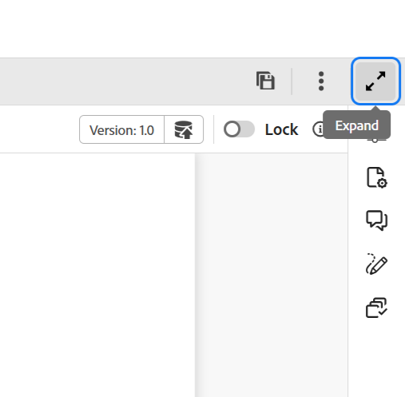

# Koptekstbalk in de Editor

De kopbalbar is de hoogste bar van de Redacteur die het embleem van Adobe Experience Manager (of verenigde Shell toont als u Verenigde Shell als uw Experience Manager Guides UI gebruikt). Wanneer u het logo selecteert, wordt u naar de Experience Manager-navigatiepagina geleid.

{align="left"}

Gebruik **breid** pictogram in de toolbar uit om de kopbalbar te verbergen en het inhoudsgebied te maximaliseren. Om de standaardmening te herstellen, de uitgezochte **Uitgang de uitgebreide mening**.

{width="350" align="left"}

**Bovenliggend onderwerp:**&#x200B;[&#x200B; Inleiding aan de Redacteur &#x200B;](web-editor.md)
