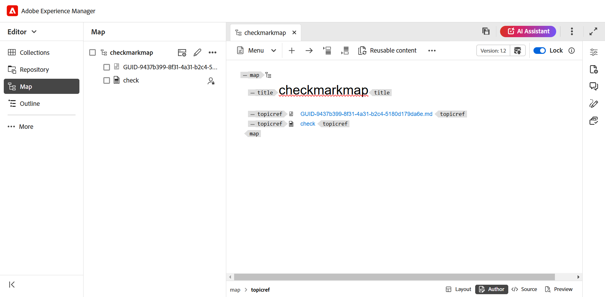

# De Editor starten {#id2056B0140HS}

U kunt de Editor starten op de volgende locaties:

- [Adobe Experience Manager Navigation-pagina](#adobe-experience-manager-navigation-page)
- [ADOBE EXPERIENCE MANAGER ASSETS UI](#adobe-experience-manager-assets-ui)
- [Kaartconsole](#map-console)

In de volgende secties vindt u informatie over de manier waarop u vanuit verschillende locaties toegang kunt krijgen tot de Editor en deze kunt starten.

## Adobe Experience Manager Navigation-pagina

Wanneer u zich aanmeldt bij Experience Manager, wordt de navigatiepagina weergegeven:

{width="800" align="left"}

Het selecteren van de **verbinding van Gidsen** neemt u aan de [ homepage van Adobe Experience Manager Guides ](./intro-home-page.md).

{width="800" align="left"}

Om de Redacteur te lanceren, ga naar de navigatiebar, en selecteer dan **Redacteur** van dropdown. De startpagina is standaard geselecteerd.

{width="350" align="left"}

Terwijl u de Editor hebt gestart zonder een bestand te selecteren, wordt een leeg Editor-scherm weergegeven. U kunt een dossier voor het uitgeven van Experience Manager **Bewaarplaats** of uw **Inzamelingen** openen.

{width="800" align="left"}

Alternatief, kunt u de Redacteur ook lanceren door de bestaande dossiers te openen huidig in de **Recente dossiers** widget en **Inzamelingen** widget van [ de ervaring van de Homepage van Adobe Experience Manager Guides ](./intro-home-page.md).

Als u terug wilt gaan naar de Experience Manager Navigation-pagina, selecteert u het Adobe Experience Manager-logo in de linkerbovenhoek van de bovenste koptekst.

## ADOBE EXPERIENCE MANAGER ASSETS UI

Een andere locatie waar u de Editor kunt starten, is de gebruikersinterface van Experience Manager Assets. U kunt een of meer onderwerpen selecteren en deze rechtstreeks openen in de Editor.

Voer de volgende stappen uit om een onderwerp te openen in de Editor:

1. In Assets UI, navigeer aan het onderwerp dat u wilt uitgeven.

   >[!NOTE]
   >
   > U kunt UUID van het onderwerp ook bekijken.

   {width="800" align="left"}

   >[!IMPORTANT]
   >
   > Zorg ervoor dat u de lees- en schrijfmachtigingen hebt voor de map die het onderwerp bevat dat u wilt bewerken.

1. Om een exclusief slot op het onderwerp te krijgen, selecteer het onderwerp en selecteer **Controle**.

   >[!IMPORTANT]
   >
   > Als uw beheerder **uitgeeft heeft gevormd onbruikbaar maken zonder de dossier** optie te sluiten, dan moet u het dossier controleren alvorens uit te geven. Als u het bestand niet uitcheckt, kunt u de bewerkingsoptie niet weergeven.

1. Sluit de wijze van de activaselectie en selecteer het onderwerp dat u wilt uitgeven.

   De voorvertoning van het onderwerp wordt weergegeven.

   U kunt de Editor openen vanuit de lijstweergave, de kaartweergave en de voorvertoningsmodus.

   >[!IMPORTANT]
   >
   > Als u veelvoudige onderwerpen voor het uitgeven wilt openen, selecteer de gewenste onderwerpen van Activa UI en selecteer **uitgeven**. Zorg ervoor dat er geen pop-upblokkering is ingeschakeld in uw browser. Anders wordt alleen het eerste onderwerp in de geselecteerde lijst geopend voor bewerking.

   {width="800" align="left"}

   Als u geen voorproef een onderwerp wilt en het in de Redacteur direct willen openen, dan uitgezocht **geef** pictogram in het snelle actiemenu van de kaartmening uit:

   {width="800" align="left"}

   Het onderwerp wordt geopend in de Editor.

   {width="800" align="left"}

U kunt ook een kaartbestand openen in de gebruikersinterface van Assets en de Editor starten om de onderwerpen in het kaartbestand te bewerken.

Voer de volgende stappen uit om een kaart te openen in de Editor:

1. In Assets UI, navigeer aan en selecteer het kaartdossier dat het onderwerp bevat u wilt uitgeven.
1. In de DITA kaartconsole, navigeer aan de **Onderwerpen** tabel. Er wordt een lijst met onderwerpen in het kaartbestand weergegeven.
1. Selecteer het onderwerpbestand dat u wilt bewerken.
1. Selecteer **uitgeven Onderwerp**.

   {width="800" align="left"}

1. Het onderwerp wordt geopend in de Editor.

   >[!IMPORTANT]
   >
   > Als uw beheerder **uitgeeft heeft gevormd onbruikbaar maken zonder de dossier** optie te sluiten, dan moet u het dossier controleren alvorens uit te geven. Als u het bestand niet uitcheckt, wordt het document in de editor geopend in de modus Alleen-lezen.

## Kaartconsole

Voer de volgende stappen uit om de Editor te openen vanuit de kaartconsole:

1. Open de startpagina en start de kaartconsole.

   {width="350" align="left"}

   Aangezien u de console van de Kaart zonder enig kaartdossier hebt gelanceerd, wordt een leeg scherm van de Console van de Kaart getoond. U kunt een kaartdossier van Experience Manager **Repository** of uw **Inzamelingen** ook openen.

   {width="500" align="left"}

1. Kies **Uitgezochte kaart** om een kaartdossier te openen dat de onderwerpen bevat die u in de Redacteur wilt uitgeven.
1. Selecteer het pad waar het kaartbestand zich bevindt. Het geselecteerde kaartbestand wordt toegevoegd aan de kaartconsole.
1. Navigeer aan het kaartdossier en selecteer **Open in redacteur** van dropdown.

   {width="800" align="left"}

   Het kaartbestand met de onderwerpen is geopend voor bewerking in de Editor.

   {width="800" align="left"}

**Bovenliggend onderwerp**: [ Inleiding aan de Redacteur ](web-editor.md)
