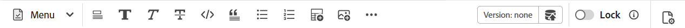

# Auteur Markdown-documenten van de Editor {#id223MIE0B079}

Markering is een eenvoudige opmaaktaal waarmee u opmaakelementen kunt toevoegen aan gewone tekstdocumenten. Adobe Experience Manager Guides biedt de functie voor het maken, schrijven en voorvertonen van een \(.md\)-onderwerp voor Markering in de Editor. U kunt de bestaande documenten van de Prijsverhoging ook uploaden en hen uitgeven in de Redacteur.

## Een vervolgkeuzemenu maken

Voer de volgende stappen uit om een onderwerp van de Prijsverhoging van de Redacteur tot stand te brengen:

1. In het paneel van de Bewaarplaats, selecteer , en selecteer dan **Onderwerp** van dropdown.
2. In het **Nieuwe onderwerp** dialoogvakje, verstrek de volgende details:

   {width="300" align="left"}

   * **Titel**: Verstrek een titel voor het onderwerp.
   * **Naam**: De dossier - naam wordt auto-gesuggereerd gebaseerd op de onderwerptitel. Als de beheerder automatische bestandsnamen heeft ingeschakeld op basis van de UUID-instelling, wordt het veld Naam niet weergegeven.
   * **Malplaatje**: Selecteer **Markering** van de dropdown lijst. Het malplaatje **Onderwerp** wordt geselecteerd door gebrek.
   * **Weg**: Doorblader de weg waar u het onderwerpdossier wilt bewaren. Standaard wordt het pad van de geselecteerde map in de opslagplaats weergegeven in het veld Pad.

   >[!NOTE]
   >
   > In het geval van een upgrade moet u de sjabloon Markering toevoegen aan het huidige mapprofiel dat wordt gebruikt. U kunt [ een nieuw prijsdalingsmalplaatje van de Redacteur ](./web-editor-features.md#templates) tot stand brengen of een bestaand malplaatje voor prijsdown authoring gebruiken. Voor details op hoe te om auteursmalplaatjes in Experience Manager Guides toe te voegen, mening [ vorm globale of omslag-vlakke profielen ](../cs-install-guide/conf-folder-level.md).
3. Selecteer **creeer**.

   Het onderwerp van de Prijsverhoging wordt gecreeerd bij de geselecteerde weg en is open voor het uitgeven.

   {width="650" align="left"}

>[!NOTE]
>
> U kunt ook een vervolgkeuzemenu voor een map maken in het deelvenster Opslag. Selecteer de omslag waarbinnen u een prijsverhogingsonderwerp wilt tot stand brengen en **Nieuw** selecteren, en dan **Onderwerp** van het menu van Opties selecteren. U kunt een prijsverhogingsonderwerp nu tot stand brengen door onderwerpdetails in **te verstrekken creeer onderwerp** dialoogdoos.

## Ken de eigenschappen van de Redacteur voor een Onderwerp van de Prijsverhoging

Deze sectie begeleidt u door de diverse eigenschappen die in de Redacteur voor het onderwerp van de Prijsverhoging creatie beschikbaar zijn. De ontwerpinterface is verdeeld in de volgende secties of gebieden:

* [Werkbalk](#toolbar)
* [Inhoudsbewerkingsgebied](#content-editing-area)
* [De modi Source, Naast elkaar en Voorvertoning](#source-side-by-side-and-preview-modes)
* [Rechterdeelvenster](#right-panel)

<!--
### Tab bar 

The tab bar features the file tabs of the topics or maps that are currently opened in the Editor along with other file-level options. 

Features available in the tab bar are explained as follows:

 {width="550" align="left"}

* **Topic tab**: Displays the currently opened topics in a tab. By default, you can view the file titles in the tab. As you hover over a file, you can view the file title and the file path as a tooltip.

    >![NOTE]
    >
    > As an administrator, you can also choose to view the list of files by filenames in the tabs. View [User preferences](./intro-home-page.md#user-preferences) for details.
* **Save all**: Saves the changes you have made in all opened topics. If you have multiple topics opened in the Editor, selecting **Save all** or pressing `Crtl+S` shortcut keys saves all documents in one click. You do not have to individually save each document.
* **AI Assistant**: [AI-powered Smart Help](./ai-based-smart-help.md) feature that helps you find relevant content from the Adobe Experience Manager Guides Documentation.
* **More actions**: Allows you to navigate to the **Assets UI**. As an administrator, you also get an option to navigate to the **Settings** page. Learn how to work with [settings](./web-editor-features.md#main-toolbar) or editor settings. 
* **Expand view**: Allows you to expand the page view using the **Expand** icon. In this view, the header bar is hidden, maximizing the content space. To return to the standard view, use the **Exit the expanded view** icon.

-->

### Werkbalk

De werkbalk bevindt zich vlak onder de tabbalk. De functies in de werkbalk worden als volgt uitgelegd:

{align="left"}

| Functies | Beschrijving |
|----------------|----------------|
| Handelingen bewerken | Verleent toegang tot diverse document het uitgeven eigenschappen met inbegrip van **Besnoeiing**  , **ongedaan maken**  , **opnieuw**  , **Exemplaar**  , **Schrapping**  , en **Vondst en vervangt**   . U kunt tot de beschikbare opties van **toegang hebben** dropdown van het Menu. |
| Opties voor tekstopmaak | Verleent toegang tot diverse tekst het formatteren opties met inbegrip van **Koppen**  , **Vet**  , **Cursief**  , **Doorhalen**  , **Code**  , en **citaat van het Blok**   . |
| Opties voor het invoegen van inhoud | Verstrekt opties om a **Genummerde lijst** op te nemen  , **Geordende lijst**  , **Lijst**  , **Beeld** , **Kruisverwijzing**  , en **Symbool**   in een document.   **Nota**: U kunt beelden en andere dossiers in de redacteur van de Prijsverhoging ook slepen en laten vallen. Bestanden worden toegevoegd als kruisverwijzingskoppelingen, terwijl afbeeldingen worden weergegeven als standaardelementen voor afbeeldingen. |
| Versiehistorie | Hiermee kunt u versies van markeringsbestanden maken en de geschiedenis van wijzigingen weergeven. U kunt verschillende versies vergelijken en terugkeren naar vorige versies indien nodig. De de geschiedenisoptie van de Versie is aanwezig in **&#x200B;**&#x200B;dropdown van het Menu. |
| Opslaan als nieuwe versie | Slaat de veranderingen op die in het onderwerp worden aangebracht en leidt ook tot een nieuwe versie van het onderwerp. Als u aan een nieuw gecreeerd onderwerp werkt, wordt de versieinformatie getoond als niets. |
| Vergrendelen/ontgrendelen | Hiermee vergrendelt of ontgrendelt u het huidige bestand. Door een bestand te vergrendelen hebt u exclusief schrijftoegang tot het bestand. Hierdoor kunnen andere gebruikers het bestand niet bewerken. Ontgrendel het bestand als u wilt dat anderen bewerkingstoegang hebben. Als beheerder, krijgt u ook toegang tot de **Grijsmacht ontgrendelt** eigenschap die u toestaat om het dossier te ontgrendelen dat door iemand anders wordt gesloten. |

>[!NOTE]
>
> De **de geschiedeniseigenschap van de Versie** en de eigenschappen die onder het uitgeven acties, tekst het formatteren, en inhoudstoevoeging worden vermeld kunnen van zowel **Source** en **zij aan zij** meningen van het prijsbenedenonderwerp worden betreden.

### Inhoudsbewerkingsgebied

In het bewerkingsgebied voor inhoud wordt de bron Markering van het onderwerp weergegeven, waar u alle inhoud bewerkt. In de weergave Naast elkaar wordt dit gebied gesplitst in twee secties: de bronweergave voor markeringen aan de linkerkant en de voorvertoning aan de rechterkant. U kunt veelvoudige onderwerpen hebben die tezelfdertijd worden geopend, die in hun respectieve lusjes worden getoond.

### De modi Source, Naast elkaar en Voorvertoning

Voor het ontwerpen van markeringen ondersteunt de Editor drie verschillende weergavemodi voor het maken en opmaken van inhoud:

{align="left"}

* Source
* Naast elkaar
* Voorvertoning

**Source**

Dit is de mening van de prijsbenedencode van de Redacteur. U kunt markeringsonderwerpen uitgeven zoals u in om het even welke regelmatige prijsdalingsredacteur zou doen. In de Source-weergave kunt u onder andere een revisie van het document opslaan, koppen invoegen, tabel invoegen, afbeelding invoegen.

Gebruik deze weergave als u alleen de onbewerkte markering wilt schrijven en bewerken zonder de gerenderde uitvoer weer te geven.

**zij aan zij**

In deze modus wordt de Editor in twee deelvensters gesplitst:

* Het deelvenster Source waarin het markeringsonderwerp wordt weergegeven dat u bewerkt.
* Het paneel van de Voorproef dat de teruggegeven output van het markeringsonderwerp in echt toont - tijd.

{width="550" align="left"}

Gebruik deze mening als u de teruggegeven output in echt wilt bekijken - tijd aangezien u prijsbenedenonderwerpen uitgeeft.

**Voorproef**

Als u een markeringsonderwerp opent in de modus Voorvertoning, ziet u hoe een onderwerp wordt weergegeven wanneer een gebruiker het in zijn browser bekijkt. In deze weergave worden alle bewerkingsfuncties verwijderd van de werkbalk. Nochtans, kunt u tot **nog toegang hebben sparen als nieuwe versies**, **Slot/ontgrendelt** eigenschappen in de toolbar, en de **eigenschappen van het Dossier** eigenschap in het juiste paneel.

### Rechterdeelvenster

In het rechterdeelvenster hebt u toegang tot het deelvenster Eigenschappen **Bestand.

De bestandseigenschappen hebben de volgende twee secties:

**Algemeen**

In het gedeelte Algemeen hebt u toegang tot de volgende functies:

* **Filename**: Toont filename van het geselecteerde onderwerp.
* **identiteitskaart**: Toont identiteitskaart van het geselecteerde onderwerp.
* **Taal**: Toont de taal van het onderwerp. Deze wordt ingesteld vanuit het taalveld op de eigenschappenpagina.
* **creeerde op**: De datum en de tijd van vertoningen waarop het onderwerp werd gecreeerd.
* **Gewijzigd op**: De datum en de tijd van vertoningen waarop het onderwerp werd gewijzigd.
* **Vergrendeld door**: Toont de gebruiker die het onderwerp uitcontroleerde.
* **de staat van het Document**: U kunt de documentstaat van het momenteel geopende onderwerp selecteren en bijwerken. Voor meer details, mening [ de Staat van het Document ](./web-editor-document-states.md).
* **Markeringen**: Dit zijn de meta-gegevensmarkeringen van het onderwerp. Deze worden ingesteld vanuit het tagveld op de eigenschappenpagina. U kunt deze typen of selecteren in het vervolgkeuzemenu. De tags worden weergegeven onder de vervolgkeuzelijst. Als u een tag wilt verwijderen, selecteert u het kruispictogram naast de tag.
* **geef meer eigenschappen** uit: U kunt meer eigenschappen van de pagina van dossiereigenschappen uitgeven.

**Verwijzingen**

In het gedeelte Verwijzingen hebt u toegang tot de volgende functies:

* **Gebruikt in**: Gebruikt in verwijzingen maakt een lijst van de documenten waar het huidige dossier wordt bedoeld of gebruikt.
* **Uitgaande verbindingen**: De Uitgaande verbindingen maken een lijst van de documenten die in het huidige document worden bedoeld.

>[!NOTE]
>
> Alle Gebruikte binnen en Uitgaande verbindingsverwijzingen zijn hyperlinked aan de documenten. U kunt de gekoppelde documenten gemakkelijk openen en bewerken.

## Beperkingen van functies

De volgende Experience Manager Guides-functies zijn momenteel niet van toepassing voor het ontwerpen van markeringen:

1. Controleren
2. Samenvoegen
3. AI-assistent
4. Wijzigingen bijhouden

**Bovenliggend onderwerp:**&#x200B;[ Inleiding aan de Redacteur ](web-editor.md)
