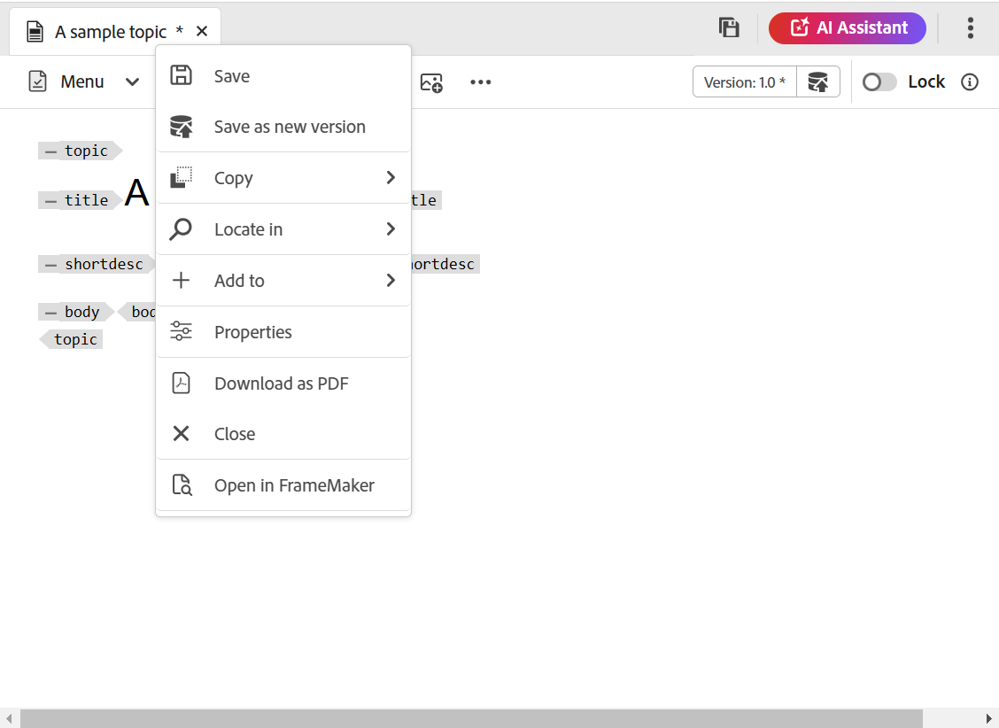
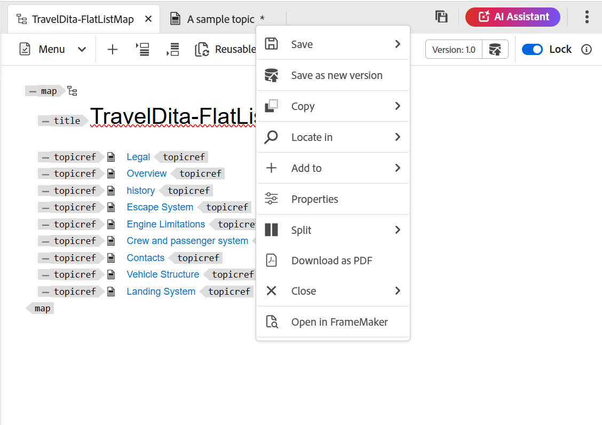
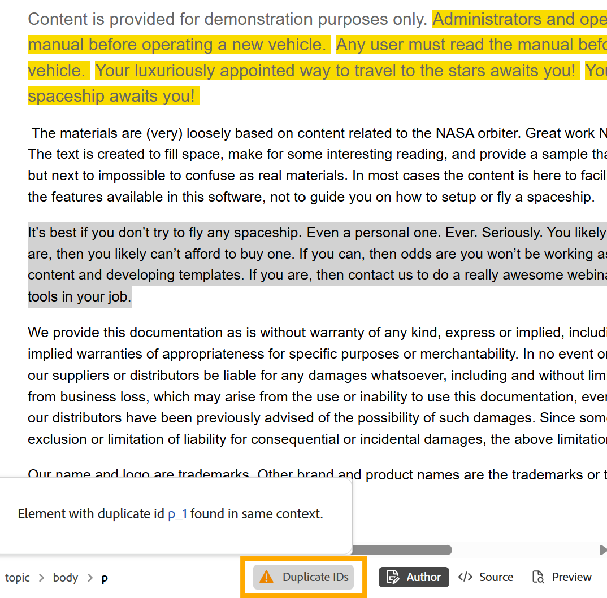
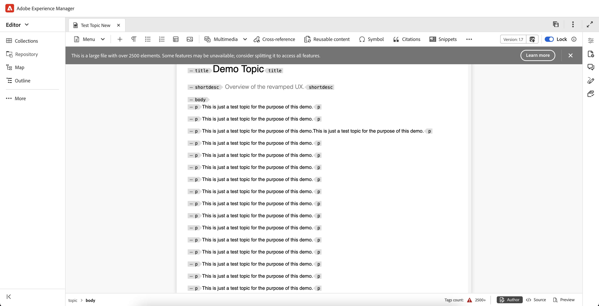

# Extra functies in de Editor {#id2056B0B0YPF}

In de Editor kunt u een aantal andere nuttige functies gebruiken:

## Contextmenufuncties op het tabblad van een bestand

Wanneer u een bestand opent in de Editor, kunt u verschillende handelingen uitvoeren in het contextmenu. U kunt verschillende opties bekijken afhankelijk van of u een mediabestand, één DITA-bestand of meerdere bestanden opent.

**dossier van Media**

De volgende functies vindt u in het contextmenu van het tabblad van een geopend mediabestand:

{width="300" align="left"}

**Enig DITA- dossier**

De volgende functies vindt u in het contextmenu van het tabblad van een geopend bestand:

{width="400" align="left"}

**Veelvoudige dossiers**

Wanneer u meerdere bestanden hebt geopend, vindt u meer opties in het contextmenu:

{width="550" align="left"}

De verschillende opties in het contextmenu worden hieronder uitgelegd:

***sparen***: U kunt van de volgende opties kiezen:

- **sparen**: Om een dossier te bewaren zonder een nieuwe versie te creëren, uitgezocht **sparen**. Wanneer u een nieuw onderwerp creeert, wordt een versie-minder werkend exemplaar van het onderwerp gecreeerd in DAM. Wanneer u uw document opslaat, wordt de werkkopie van uw document bijgewerkt in DAM. Het doen van eenvoudig sparen op deze versie leidt niet tot een nieuwe versie van een onderwerp. Als uw onderwerp onder overzicht is, geeft het bewaren van een onderwerp uw recensenten geen toegang tot uw veranderde onderwerpinhoud.

- **sparen allen**: Als er veelvoudige documenten zijn die in de Redacteur worden geopend, dan krijgt u ook een optie om **Alle** geopende documenten te bewaren.

***sparen als Nieuwe Versie***

Om een nieuwe versie van het dossier tot stand te brengen, uitgezocht **sparen als Nieuwe Versie**. Voor meer details over **sparen** en **sparen als Nieuwe Versie**, mening [ Toolbar in de Redacteur ](web-editor-toolbar.md).

***Exemplaar***: U kunt van de volgende opties kiezen:

- **UUID van het Exemplaar**: Om UUID van het momenteel actieve dossier aan het Klembord te kopiëren, uitgezochte **Exemplaar \> het Exemplaar UUID**.
- **Weg van het Exemplaar**: Om de volledige weg van het momenteel actieve dossier aan het Klembord te kopiëren, uitgezochte **Exemplaar \> Weg van het Exemplaar**.

***plaats binnen***: U kunt van de volgende opties kiezen:

- **Kaart**: Als u een grote kaart DITA hebt geopend en de nauwkeurige plaats van een dossier in de kaart wilt vinden, dan **plaats in \> Kaart**. Wanneer u de optie Zoeken op kaart selecteert, wordt het bestand \(vanwaar de optie wordt aangeroepen\) in de kaarthiërarchie geplaatst en gemarkeerd. Als u deze functie wilt gebruiken, moet u het kaartbestand openen in de Editor. Als de Kaartweergave verborgen is, wordt bij het aanroepen van deze functie de Kaartweergave weergegeven en wordt het bestand gemarkeerd in de kaarthiërarchie.

- **Ontdekkingsreiziger**: Gelijkaardig om in Kaart te vinden, **plaats in \> Ontdekkingsreiziger** toont de plaats van het dossier in de Ontdekkingsreiziger \ (of DAM \). De Explorer-weergave wordt geopend en het geselecteerde bestand wordt gemarkeerd in de Verkenner. Als het bestand zich in een map bevindt, wordt die map uitgevouwen om de locatie van het geselecteerde bestand in de Verkenner weer te geven.

  >[!NOTE]
  >
  >Van versie 2025.11.0, **wordt de Bewaarplaats van 0} {anders genoemd aan** Ontdekkingsreiziger **.** Voor installatie op locatie blijft de opslagruimte beschikbaar tot de release van Experience Manager Guides 5.1.

***voeg aan*** toe: U kunt van de volgende opties kiezen:

- **Inzamelingen**: Om het geselecteerde dossier aan inzamelingen toe te voegen, uitgezocht **voeg aan \> Inzamelingen** toe. Voor meer details, bekijk de **de eigenschapbeschrijving van Inzamelingen** in de [ Linkerpaneel ](web-editor-left-panel.md) sectie.

- **Herbruikbare inhoud**: Om het geselecteerde dossier aan de herbruikbare inhoudslijst te kopiëren, uitgezocht **voeg aan \> Herbruikbare inhoud** toe. Voor meer details, bekijk de **Herbruikbare inhoud** eigenschapbeschrijving in de [ Linkerpaneel ](web-editor-left-panel.md) sectie.

***Eigenschappen***

Om de AEM eigenschappen pagina van het geselecteerde dossier te bekijken, selecteer **Eigenschappen**.

***Gesplitst***: U kunt van de volgende opties kiezen:

**Omhoog, Omlaag, Linker, of Juist**

Door gebrek, staat de Redacteur u toe om één onderwerp tegelijkertijd te bekijken. U kunt bijvoorbeeld twee of meer onderwerpen tegelijk bekijken. Door het scherm van de editor te splitsen, kunt u meerdere onderwerpen tegelijk bekijken. Bijvoorbeeld, als u twee onderwerpen hebt - A en B geopend in de redacteur. Het met de rechtermuisknop klikken op onderwerp B en het kiezen van **Splitst \> omhoog** verdeelt het redacteursvenster in twee delen. Onderwerp B wordt getoond in de hogere helft en Onderwerp A wordt getoond in de bodemhelft. Op dezelfde manier kunt u het scherm ook horizontaal verdelen door **Splitsen \> Linkerzijde** of **Splitsen \> Juist** te selecteren. U kunt uw documenten van het ene scherm naar het andere verplaatsen door de bestandtab te slepen en neer te zetten op het scherm waar u deze wilt plaatsen. U kunt de tabvolgorde van bestanden ook wijzigen door ze naar wens te slepen en te verplaatsen.

<!--------------------------------------------

***Quick Generate***

Generate the output for the selected file. Output can be generated only for files that are a part of an output preset. For more details, view [Article-based publishing from the Web Editor](web-editor-article-publishing.md#id218CK0U019I).

--->

***dicht***: U kunt van de volgende opties kiezen:

**dicht**, **sluit anderen**, of **sluit allen**

Als u het dossier wilt sluiten waarvan u het contextmenu aanhaalde, dan selecteren **dicht \> dicht**. Gebruik **dicht \> sluit anderen** om al ander geopend dossier behalve het momenteel actieve dossier te sluiten. Om alle open dossiers te sluiten, selecteer **dicht \> sluit alle** optie van het contextmenu of u kunt ook verkiezen om de Redacteur te sluiten. Als er niet-opgeslagen bestanden in uw sessie staan, wordt u gevraagd deze bestanden op te slaan.

**Dossier sluit en sparen scenario&#39;s**

Wanneer u probeert om een dossier te sluiten dat in de Redacteur wordt geopend gebruikend **dicht** knoop op het lusje van het dossier of **dicht** optie in het menu van Opties, zet Experience Manager Guides u ertoe aan om uw uitgeeft te bewaren en een gesloten dossier te ontgrendelen.

De herinneringen zijn gebaseerd op de volgende configuraties die door uw beheerder worden geselecteerd:

- **Vraag om ontgrendelen op sluiting:** u wordt gegeven de optie om het dossier \ te ontgrendelen (die u \) hebt gesloten wanneer u de redacteur sluit.
- **Vraag om nieuwe versie op dichte**: U krijgt de optie om het dossier \ (die u uitgeeft \) als nieuwe versie op te slaan wanneer u de redacteur sluit.

Uw ervaring met het opslaan van bestanden is afhankelijk van de volgende drie scenario&#39;s, waar u zich bevindt:

- Geen wijzigingen aangebracht in de inhoud.
- De inhoud is bewerkt en de wijzigingen zijn opgeslagen.
- De inhoud is bewerkt, maar de wijzigingen zijn niet opgeslagen.

U kunt de volgende opties weergeven, afhankelijk van het feit of het bestand vergrendeld/ontgrendeld is en of de wijzigingen zijn opgeslagen of niet opgeslagen:

- **Ontgrendelen en Sluiten**: Het slot op het dossier wordt vrijgegeven, en het dossier wordt gesloten.
- **sparen als nieuwe versie**: Dit zal de veranderingen bewaren u in uw inhoud hebt aangebracht en tot een nieuwe versie van uw dossier leiden. U kunt ook labels en opmerkingen toevoegen voor de zojuist opgeslagen versie. Voor meer informatie over het bewaren van een nieuwe versie, mening [ sparen als nieuwe versie ](web-editor-toolbar.md#version-information-and-save-as-new-version).

- **ontgrendel het dossier**: Als u verkiest om een dossier te ontgrendelen, zal het de slot op uw dossier vrijgeven en de veranderingen worden bewaard in de huidige versie van het dossier.

  >[!NOTE]
  >
  > Als u de optie uitschakelt om het bestand te ontgrendelen, kunt u ook het bestand sluiten zonder de wijzigingen op te slaan.

  Een van de aanwijzingen wordt bijvoorbeeld weergegeven in de volgende schermafbeelding:

  {width="400" align="left"}

**Visuele aanwijzingen voor gebroken verwijzingen**

Als uw onderwerp gebroken verwijzingen of inhoudsverwijzingen bevat, worden zij getoond in rode teksten.

**Slimme exemplaar-deeg**

U kunt plakinhoud binnen en over onderwerpen gemakkelijk kopiëren. De bronelementstructuur wordt op de bestemming gehandhaafd. Als de gekopieerde inhoud inhoudsverwijzingen bevat, worden zelfs deze gekopieerd.

**Herinner me laatste doorbladerde plaats**

De Editor biedt een dialoogvenster voor het bladeren van slimme bestanden. De editor onthoudt de laatst gebruikte locatie terwijl een verwijzing of inhoud wordt ingevoegd. De eerste keer dat u het bladerdialoogvenster van het bestand ophaalt, gaat u naar de locatie waar het huidige document is opgeslagen. Dit doet u via Referentie invoegen of Inhoud hergebruiken invoegen. Als u in dezelfde sessie een andere referentie probeert in te voegen, navigeert het dialoogvenster automatisch naar de locatie vanwaar u de laatste referentie hebt ingevoegd.

>[!NOTE]
>
> In het geval van een afbeeldings-, audio- of videobestand bladert het dialoogvenster naar de standaardlocatie van het bestand en niet naar de laatst gebruikte locatie.

## Door bestanden en mappen in Experience Manager Guides bladeren

Experience Manager Guides verstrekt intuïtieve dialogen - **Uitgezochte dossier** en **Uitgezochte weg** - om u te helpen dossiers of omslagen binnen de inhoudsbewaarplaats doorbladeren en kiezen efficiënt.

>[!NOTE]
>
> De browser met bestands- en mappaden is in de release 2601 van Experience Manager Guides as a Cloud Service geïntroduceerd met een vernieuwde interface. De nieuwe interface is standaard ingeschakeld. Als u de bestaande interface zonder deze updates wilt blijven gebruiken, neemt u contact op met het team voor succes van de klant om deze nieuwe verbetering uit te schakelen.

### Bladeren door bestanden in Experience Manager Guides

Met de browser voor het bestandspad kunt u snel specifieke bestanden in de opslagplaats voor inhoud zoeken en selecteren. Deze functie is beschikbaar voor taken zoals het toevoegen van een onderwerp aan een kaart, het koppelen van een beeld of verwijzing, het creëren van herbruikbare inhoud, en meer.

{width="350" align="left"}

Wanneer u dossierbrowser lanceert, opent de **Uitgezochte dossier** dialoog. Deze dialoog omvat twee lusjes: **Bewaarplaats** en **Inzamelingen**. Standaard is het tabblad Opslagplaats geselecteerd.

{width="650" align="left"}

**Eigenschappen beschikbaar in het lusje van de Bewaarplaats voor dossier het doorbladeren**

**Tabellulaire mening van dossiers en omslagen**

Op het tabblad Opslagplaats krijgt u een tabelweergave van bestanden en mappen in de opslagplaats voor inhoud, zodat u gemakkelijker het juiste bestandspad kunt vinden. U kunt de broodkruimels bij de bovenkant en het omslagnavigatievenster op de linkerzijde ook gebruiken om door omslagen te bewegen.

{width="650" align="left"}

**Enige en veelvoudige dossierselectie**

Om een dossier te gebruiken, selecteer eenvoudig het dossier en kies **Uitgezocht**.

{width="650" align="left"}

In sommige gevallen kunt u ook meerdere bestanden selecteren in dit dialoogvenster van de padbrowser. Wanneer u bijvoorbeeld naar bestanden bladert voor herbruikbare inhoud, kunt u meerdere bestanden selecteren en deze onderdeel maken van de inhoud die u kunt gebruiken.

{width="650" align="left"}

Er zijn momenteel meerdere bestanden geselecteerd voor herbruikbare inhoud, onderwerpverwijzingen, Schematron, Uitvoervoorinstellingen (met DITAVAL) en Workfront.

>[!NOTE]
>
> Wanneer u bestanden selecteert in het dialoogvenster van de padbrowser, worden sommige mappen mogelijk uitgeschakeld weergegeven. Dit gedrag beperkt toegang tot specifieke dossiertypes om geldige selecties te verzekeren. Wanneer u bijvoorbeeld herbruikbare inhoud maakt, moeten alleen onderwerpbestanden en kaartbestanden worden gebruikt. Als u wilt voorkomen dat een ongeldig bestandstype wordt gebruikt, zoals een afbeelding, worden de bijbehorende bestanden niet weergegeven of blijven ze uitgeschakeld voor selectie in de padbrowser.

**Voorproef geselecteerde dossiers**

U kunt voorproef de dossiers u hebt geselecteerd gebruikend de **knoop van de Voorproef**, zoals hieronder getoond:

{width="650" align="left"}

De voorvertoning van het geselecteerde bestand wordt rechts weergegeven.

{width="650" align="left"}

Voor meerdere selecties wordt een voorvertoning van alle geselecteerde bestanden weergegeven in het deelvenster Voorbeeld, zodat u deze gemakkelijk kunt bekijken.

{width="650" align="left"}

U kunt **ook gebruiken verwijdert** pictogram om sommige dossiers van de Voorproef te deselecteren.

{width="650" align="left"}

**Onderzoek en filterervaring**

Wanneer u in bestanden in de opslagplaats bladert, kunt u naar bestanden zoeken op naam, titel of inhoud in het geselecteerde pad. U kunt om het even welke, twee, of alle drie criteria voor uw onderzoek gebruiken. Als geen van de criteria wordt geselecteerd, zullen de resultaten gemeenschappelijk zijn voor alle drie de criteria.

{width="650" align="left"}

Selecteer het **\ van het Filteronderzoek van de Filter 0} {(** het filterpictogram van het Onderzoek 

{align="left"}

U hebt de volgende opties om de bestanden te filteren en uw zoekopdracht te beperken:

- **Onderzoek in**: Selecteer de weg waar u de dossiers huidig in de Bewaarplaats wilt zoeken.

- **het type van Dossier**: Filter uw onderzoek dat op een specifiek dossiertype wordt gebaseerd. Beschikbare opties zijn: **Onderwerp**, **Kaart**, **DITAVAL**, **Beeld**, **Multimedia**, **Document**, en **anderen**.

  >[!NOTE]
  >
  > In sommige gevallen, wordt het **type van Dossier** filter pre-toegepast op specifiek(e) dossiertype(n) dat op de taak wordt gebaseerd en kan niet worden veranderd. Wanneer u bijvoorbeeld naar een afbeelding bladert, wordt het filter ingesteld om alleen afbeeldingsbestanden weer te geven en wanneer u herbruikbare inhoud maakt, worden alleen onderwerp- en kaartbestanden weergegeven. U kunt nog steeds andere filters aanpassen, zoals documentstatus, codes of datum die als laatste is gewijzigd, om de zoekresultaten te verfijnen.

- **de staat van het Document**: U kunt uw onderzoek filtreren dat op de huidige documentstaat van de dossiers wordt gebaseerd. De beschikbare filterwaarden worden gedefinieerd in het `repositoryFilters` -veld van `ui_config.json file` en zijn gekoppeld aan het mappenprofiel dat u momenteel gebruikt.

  Dit betekent:

   - Als u het Globale Profiel gebruikt, worden de filterwaarden die in het Globale profiel worden gevormd toegepast.
   - Als u een specifiek mapprofiel selecteert, worden de in dat profiel gedefinieerde filterwaarden opgehaald.

  De standaardfilterwaarden die beschikbaar zijn voor de documentstatus zijn: Concept, Bewerken, In-Review, Goedgekeurd, Reviewed en Done. Voor details bij het aanpassen van filterwaarden voor documentstaten, vormt de mening [ de filters van de documentstaat ](../cs-install-guide/config-doc-state-filters.md).

- **Vergrendeld door**: Toont een lijst van gebruikers. De lijst wordt gepagineerd en wordt asynchroon geladen, waarbij een beperkte set gebruikers tegelijk wordt weergegeven en meer wordt opgehaald terwijl u schuift of navigeert. Hierdoor worden de laadsnelheid en algemene prestaties verbeterd, vooral wanneer u met een groot aantal gebruikers werkt.

- **Laatst gewijzigd**: Inhoud van de filter die op wijzigingsdatum wordt gebaseerd. Selecteer een datumbereik in de kalender of kies een van de volgende tijdframeopties:
   - In vorige week
   - In vorige maand
   - In vorig jaar

- **Markeringen**: Inhoud van de filter die op markeringen wordt gebaseerd.

- **elementen DITA**: De inhoud van de filter die op diverse elementen wordt gebaseerd DITA.

Na het toepassen van alle vereiste filters, selecteert **** van de bodem-juiste hoek van het paneel van Filters van toepassing is.

**Eigenschappen beschikbaar in het lusje van Inzamelingen voor dossier het doorbladeren**

Het **lusje van Inzamelingen** verstrekt een gebogen mening van dossiers beschikbaar in uw Inzamelingen voor snelle toegang en hergebruik. In tegenstelling tot het tabblad Opslagplaats, dat de volledige maphiërarchie weergeeft, kunt u met Verzamelingen veelgebruikte onderwerpen, afbeeldingen en afbeeldingen selecteren zonder door meerdere mappen te navigeren.

Op het tabblad Verzamelingen kunt u:

- Gebruik de broodkruimels op de bovenkant en het omslagnavigatievenster op het recht om door uw Collections gemakkelijk te navigeren.

  
- Selecteer bestanden in een specifiek verzamelingspad en bekijk een voorvertoning hiervan in het rechterdeelvenster.

  

### Browsermappen in de opslagplaats

Het doorbladeren van omslagen die de **Uitgezochte omslag** dialoog gebruiken, concentreert zich bij het selecteren van de correcte omslagweg binnen de Bewaarplaats voor taken zoals het creëren van nieuwe onderwerpen of het specificeren van outputplaatsen voor gepubliceerde inhoud. Het biedt een duidelijke, structuurweergave van mappen, waardoor navigatie intuïtief wordt en ervoor wordt gezorgd dat inhoud op de juiste locatie wordt geplaatst.

{width="300" align="left"}

## Ondersteuning voor op artikelen gebaseerde publicaties

Van de Redacteur, kunt u de output voor één of meerdere onderwerpen, of de volledige kaart produceren DITA. U moet outputvoorinstellingen voor uw kaart creëren DITA en dan kunt u de output voor één of meerdere onderwerpen gemakkelijk produceren. Als u een paar onderwerpen in uw kaart hebt bijgewerkt, kunt u de output slechts voor die onderwerpen van de Redacteur ook produceren. Voor meer details, mening [ op artikel-gebaseerde het publiceren ](web-editor-article-publishing.md#id218CK0U019I).

## Ondersteuning voor opmaakdocumenten

In de Editor kunt u Markeringen gebruiken voor documenten \(.md\) samen met uw DITA-documenten. U kunt een document van de Prijsverhoging in de Redacteur gemakkelijk ontwerpen en voorproef en het ook toevoegen in uw kaartdossier door de DITA kaartredacteur. Voor meer details, bekijk [ documenten van de Prijsverhoging van de Auteur van de Redacteur ](web-editor-markdown-topic.md#).

## Steun voor DITA verklarende woordenlijstterm onderwerp

De Editor ondersteunt verklarende woordenlijsten die u kunt invoegen door `term` - of `abbreviated-form` -elementen toe te voegen.

## Werken met MathML-vergelijkingen

### MathML-vergelijkingen invoegen

Experience Manager Guides geeft u een out-of-the-box steun voor het opnemen van de vergelijkingen van MathML door integratie met [ toepassing van het Web MathType ](https://docs.wiris.com/en/mathtype/mathtype_web/intro). Om een vergelijking van MathML op te nemen, selecteer het **pictogram van het Element** en type mathml. Wanneer u mathml element van de lijst selecteert, wordt de **dialoog van MathML van het Tussenvoegsel** getoond:

{width="550" align="left"}

Gebruikend de de vergelijkingshulpmiddelen van MathML, creeer uw vergelijking en selecteer **Tussenvoegsel** om het aan uw document toe te voegen. De vergelijking wordt ingevoegd met een lichtgrijze achtergrond.

Op elk ogenblik kunt u een vergelijking bijwerken door op een bestaande vergelijking met de rechtermuisknop te klikken en **te selecteren geeft MathML** van het contextmenu uit.

### Validatie van vergelijkingen in de MathML-editor

Experience Manager Guides valideert MathML-vergelijkingen wanneer u een onderwerp opslaat dat ze bevat.
Als u een vergelijking invoegt met de MathML-editor, wordt de vergelijking rood gemarkeerd als er syntaxisproblemen zijn. U kunt dit corrigeren voordat u het invoegt. Als u geen veranderingen aanbrengt maar **uitgezocht Tussenvoegsel** selecteert, toont het een waarschuwing.

{width="400" align="left"}

Als u de vergelijking van MathML opneemt die een syntaxisfout bevat, komt een bevestigingsfout voor wanneer u probeert om het onderwerp op te slaan.

## Voetnoten invoegen

Voeg voetnoot in uw inhoud in met behulp van het element `fn` . In de ontwerpmodus wordt de voetnootwaarde inline weergegeven met de inhoud. Wanneer u echter van de modus Voorvertoning overschakelt of uw document publiceert, wordt de voetnoot aan het einde van het onderwerp weergegeven.

## Een element hernoemen of vervangen

De redacteur toont de broodkruimel van het element bij de bodem-linkerzijde van het onderwerp. Als u een element wilt omwisselen of vervangen door een ander element, kunt u dit doen via het contextmenu van de broodkruimel. U kunt `p` -element bijvoorbeeld omwisselen met `note` of een ander geldig element in de context.

{width="400" align="left"}

Klik op de broodkruimel met de rechtermuisknop op de naam van een element dat u wilt vervangen en selecteer vervolgens Naam van element wijzigen in het contextmenu. In het dialoogvenster Naam element wijzigen worden alle geldige elementen weergegeven die op de huidige locatie zijn toegestaan. Selecteer in het dialoogvenster Naam element wijzigen het element dat u wilt gebruiken. Het oorspronkelijke element wordt vervangen door het nieuwe element.

Naast het contextmenu van de broodkruimel, kan het anders noemen de dialoog van het Element ook van andere plaatsen worden betreden:

- Selecteer de elementnaam op de breadcrumb om de inhoud van het element te selecteren en klik met de rechtermuisknop op de geselecteerde inhoud om het contextmenu te openen.

- Schakel de weergave Codes in, selecteer de openingstag van een willekeurig element en klik met de rechtermuisknop op de geselecteerde inhoud om het contextmenu te openen.

- U kunt het dialoogvenster Naam van element wijzigen openen door het menu Opties van een element in het deelvenster Overzicht aan te roepen.

## Een element omsluiten en de omloop ervan opheffen

### Een element laten omlopen

- Door een element te laten omlopen, kunt u een elementtag toevoegen aan de geselecteerde tekst. U kunt de tekst naar elk onderliggend element laten lopen volgens de DITA-standaarden. Als u bijvoorbeeld tekst onder een `note` -element hebt, kunt u de tekst laten omlopen in een `p` -element.

- De **optie van het Element van de Omslag** is beschikbaar in het contextmenu van de broodkruimel van het onderwerp. Als u een element wilt laten omlopen, klikt u met de rechtermuisknop op het element en opent u het contextmenu. Selecteer het element van de **dialoog van het Element van de Omslag**. De tekst wordt weergegeven in het nieuwe element.

- U kunt de tekst of het element in de inhoud ook selecteren en dan de **optie van het Element van de Omslag** van het contextmenu selecteren.

### Een element opheffen

Als u een element loskoppelt, kunt u de elementtag verwijderen uit de geselecteerde tekst en deze samenvoegen met het bovenliggende element. Als u bijvoorbeeld een element `p` in een element `note` hebt, kunt u het element `p` opheffen om de tekst direct in het element `note` samen te voegen. De **optie van het Element van de Omslag** is beschikbaar in het contextmenu van de broodkruimel van het onderwerp. Om een element, met de rechtermuisknop aan te sluiten klik op het element om het contextmenu te openen, dan selecteer definitief **Element van de Terugloop** om het element te verwijderen en de tekst van het element met zijn ouderelement samen te voegen.

## Witruimte-verwerking voor DITA-elementen

In XML omvatten witruimten spaties, tabs, regeleinden en lege regels. Experience Manager Guides converteert meerdere overeenkomende witruimten naar één spatie. Zo kunt u de WYSIWYG-weergave van de Editor behouden.

>[!NOTE]
>
> In sommige elementen waar witruimten moeten worden behouden volgens de DITA-regels, blijven de verschillende witruimten die daaruit voortvloeien behouden. Bijvoorbeeld `<pre>` en `<codeblock>` -elementen.

## Regeleinden en inspringing behouden

DITA-elementen die regeleinde en spaties bevatten, worden ondersteund en weergegeven volgens hun definitie in de modus Auteur, Source of Voorvertoning en ook in de uiteindelijke gepubliceerde uitvoer. In de volgende schermafbeelding ziet u de inhoud binnen het element `msgblock` waarin de regeleinden en spaties \(inspringing\) zijn behouden:

{align="left"}

## Afhandeling van vaste spaties in de Editor

- U kunt vaste ruimten in uw document opnemen gebruikend het **Symobol**  pictogram of **Alt** + **de kortere wegsleutels van de Ruimte**.  Deze vaste spaties worden weergegeven als een indicator terwijl u een onderwerp bewerkt in de Editor. U kunt de vertoning van de vaste ruimten met **tonen niet-breekruimtemindicator op de auteurswijze** optie van de **Verschijning** tabel van [ de voorkeur van de Gebruiker ](./intro-home-page.md#user-preferences) uitzetten.

- Als u inhoud met een vaste ruimte van om het even welke externe bronnen in de **auteur** mening kopieert en kleeft, wordt de vaste ruimte omgezet in een ruimte.
Nochtans, als u inhoud met een vaste ruimte van de **auteur** mening kopieert en kleeft, wordt het bewaard.

## Element-id automatisch genereren

U kunt automatisch IDs voor de elementen in uw DITA onderwerp produceren. Deze IDs is uniek binnen een onderwerp DITA. Als u bijvoorbeeld id&#39;s voor een alinea-element genereert, zijn de id&#39;s p\_1, p2, p\_3 enzovoort. U kunt meerdere elementen selecteren en id&#39;s genereren voor elk geselecteerd element.

Ga als volgt te werk om automatisch een id voor een of meerdere elementen te genereren:

1. Open het onderwerp in de Redacteur.
1. Selecteer de inhoud waarop u id&#39;s wilt toewijzen.
1. Klik met de rechtermuisknop en selecteer **Generate IDs** van het contextmenu.

Alternatief kunt u in breadcrumb met de rechtermuisknop klikken en **selecteren produceert IDs**.

## Id&#39;s voor elementen in een kaart of onderwerp identificeren in de weergave Auteur

Als een bepaald onderwerp of een kaart elementen met dubbele IDs bevat, verschijnt a **Dubbele IDs** knoop bij de bodem-juiste hoek van het het uitgeven gebied van de Inhoud naast de meningen van de Redacteur.

{width="350" align="left"}

Het selecteren van **Dubbele IDs** opent een popover lijst van alle dubbele IDs. U kunt de weergegeven id selecteren in de pop-up om naar het bijbehorende element te navigeren en deze bij te werken met een unieke id.

>[!NOTE]
>
> De **Dubbele knoop IDs** is beschikbaar slechts in **Auteur** mening, en gelijkaardige element IDs wordt toegelaten over verschillende genestelde onderwerpen.

## Grote bestanden verwerken in de Editor

De belangrijkste kenmerken voor een betere afhandeling van grote bestanden zijn als volgt:

- Voor betere prestaties zijn bepaalde functies, zoals Ongedaan maken, Opnieuw, het deelvenster Omtrek en de vuile markering uitgeschakeld. Voor een optimale ervaring verdient het aanbeveling om onderwerpen in kleinere onderwerpen te verdelen.

- Bovenaan wordt een waarschuwingsbericht voor grote bestanden weergegeven, zoals in het onderstaande fragment wordt getoond. Dit alarm benadrukt het aantal elementen die op de waarde worden gebaseerd die in de **wordt gespecificeerd largeFileTagCount** parameter van het bestand uiconfig.json. Door gebrek, **largeFileTagCount** wordt geplaatst aan 2500.

{width="600" align="left"}

- Bovendien wordt het aantal tags weergegeven op de onderste balk van de interface. Als u de muisaanwijzer boven deze tellingswaarde voor tags plaatst, wordt knopinfo weergegeven. Selecterend **leer meer** lusje meer details over de behandeling van grote dossiers.

{width="600" align="left"}

- Het waarschuwingsbericht is alleen beschikbaar voor DITA-bestanden en is in alle weergaven zichtbaar: Auteur, Source en Layout.

**Bovenliggend onderwerp:**[ Inleiding aan de Redacteur ](web-editor.md)
