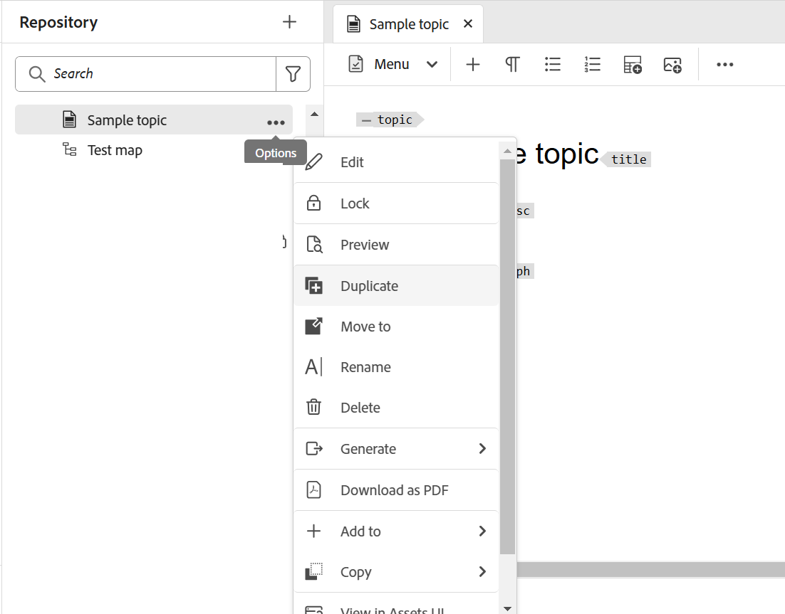
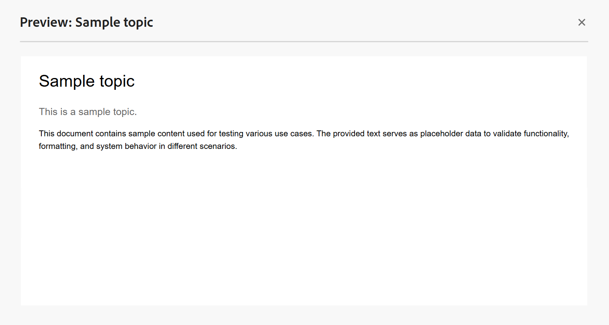

# Een voorvertoning van een onderwerp weergeven {#id1696II000QR}

Zodra een onderwerp wordt gecreeerd, produceert Adobe Experience Manager Guides een voorproef van het onderwerp. De modus Voorvertoning bevat verschillende functies die u kunt gebruiken om met uw document te werken.

Er zijn twee manieren om een voorvertoning van een onderwerp weer te geven in Experience Manager Guides:

- [Van de Editor](#preview-topics-from-the-editor)
- [Via de gebruikersinterface van Assets](#preview-topics-from-the-assets-ui)

## Onderwerpen voorvertonen vanuit de Editor

Voer de volgende stappen uit om een voorvertoning van een onderwerp weer te geven in de Editor:

1. Navigeer in het deelvenster Opslagplaats naar het onderwerp dat u wilt weergeven.
1. Beweeg over het onderwerp dat u **Voorproef** van het menu van Opties wilt voorproef en selecteren.

   {width="600" align="left"}

   De voorvertoning van het onderwerp wordt weergegeven.

   {align="left"}

**onderwerpen van de Voorproef van de wijze van de Voorproef**

Wanneer u een onderwerp in de Redacteur opent en op de **wijze van de Voorproef** schakelt, die in de bodem-juiste hoek van het inhoudsuitgevende gebied wordt gevestigd, kunt u een voorproef van het momenteel geopende onderwerp bekijken.

Voor meer details, mening [&#x200B; meningen van de Redacteur &#x200B;](./web-editor-views.md#preview).

## Voorvertoning van onderwerpen weergeven in de gebruikersinterface van Assets

Voer de volgende stappen uit om een voorvertoning van een onderwerp weer te geven:

1. In Assets UI, navigeer aan het onderwerp dat u wilt bekijken.
1. Selecteer het onderwerp dat u wilt weergeven.

   Een voorvertoning van het onderwerp wordt weergegeven in de gebruikersinterface van Assets.

   >[!NOTE]
   >
   > U kunt de versie van het actieve onderwerp of kaart DITA in de hoogste juiste hoek van de toolbar bekijken.

   >[!IMPORTANT]
   >
   > De positie van de volgende functies op de werkbalk Voorbeeld kan afwijken, afhankelijk van de installatie van uw Adobe Experience Manager-server. Sommige functies zijn mogelijk beschikbaar op de hoofdwerkbalk, terwijl andere functies beschikbaar zijn in het menu Meer.

## Functies beschikbaar in de gebruikersinterface van Assets voor voorvertoning

De volgende bewerkingen zijn beschikbaar op de werkbalk wanneer u de functie Voorvertoning in de gebruikersinterface van Assets gebruikt.

{align="left"}

**Eigenschappen**

Bekijk de eigenschappen van het geselecteerde onderwerp. Op basis van uw Adobe Experience Manager-versie kunt u eigenschappen weergeven zoals metagegevens, \(de\)activering, verwijzingen, documentstatus en meer plannen.

>[!NOTE]
>
> De titeleigenschap van een onderwerp wordt automatisch ingevuld via de tag `title` van het DITA-onderwerp of de DITA-kaart. Als u een wijziging in de titel aanbrengt via het eigenschappenvenster, gaat die wijziging verloren. Als u het titelbezit wilt bijwerken, zou u het moeten doen gebruikend de redacteur.

De pagina Eigenschappen bevat nuttige informatie over de verwijzingen, zoals waar een kaart of een onderwerp wordt gebruikt, of welke verwijzingen in een document zijn. De pagina van Eigenschappen maakt een lijst van twee soorten verwijzingen voor een document - **Gebruikt binnen** en **Uitgaande Verwijzingen**.

**Gebruikt in** verwijzingen maakt een lijst van de documenten waar het huidige dossier wordt bedoeld of gebruikt. De **Uitgaande Verwijzingen** maakt een lijst van de documenten die in huidig document worden bedoeld.

Het pictogram \ (+ \) in **Gebruikt in** verwijzingssectie staat u toe om naar boven te navigeren om te vinden waar dat onderwerp wordt gebruikt of wordt bedoeld.

{align="left"}

Het selecteren van het  pictogram naast een document toont de kaart of onderwerpdossiers waar dat document verder wordt verwezen.

**Voorwaardelijk het Filtreren \ (A/B \)**

Als uw onderwerp voorwaardelijke inhoud heeft, dan zult u het A/B pictogram op de toolbar bekijken. Als u dit pictogram selecteert, wordt er een pop-up geopend waarin u de inhoud kunt filteren op basis van de beschikbare voorwaarden in het onderwerp.

>[!NOTE]
>
> De voorwaardelijke inhoud wordt gemarkeerd met een lichte achtergrondkleur in de Editor.

{width="300" align="left"}

**geeft** uit

- Open het onderwerp voor het uitgeven in de Redacteur. De **geeft** optie uit zal niet beschikbaar zijn als uw beheerder **uitgeeft onbruikbaar heeft gemaakt zonder de dossier** optie te sluiten. Met de toegelaten optie, zult u **&#x200B;**&#x200B;optie uitgeven slechts na het sluiten van een onderwerpdossier bekijken.

**Zeer belangrijke Resolutie**

- Als u een sleutelruimtedossier voor het onderwerp wilt gebruiken, selecteer het Zeer belangrijke pictogram van de Resolutie. Vervolgens kunt u een sleutelruimte kiezen in het pop-upmenu Hoofdresolutie.

**Source**

- Open de XML-broncode van een bestand. U kunt de onderliggende XML-code van een kaart, onderwerp of DITAVAL-bestand weergeven door het bestand te openen in de modus Voorbeeld en het Source-pictogram te selecteren. In het pop-upvenster XML Source wordt de XML-broncode weergegeven. U kunt een specifieke code van het dossier selecteren of `Ctrl` + `a` drukken om de volledige inhoud te selecteren.

  >[!NOTE]
  >
  > Als u de broncodeweergave van een DITA-kaartbestand wilt ophalen, selecteert u het bestand in de gebruikersinterface van Assets en selecteert u Source.

  {align="left"}

**Verbinding UUID van het Aandeel**

- Experience Manager Guides staat u toe om de op UUID-Gebaseerde verbindingen voor kaarten DITA, onderwerpen, en beelddossiers van de volgende plaatsen te delen:

   - ASSETS UI
   - DITA-kaartconsole
   - Onderwerp of voorvertoning van afbeelding

Een nieuwe optie **de Verbinding van UUID van het Aandeel** wordt getoond in de toolbar van de bovengenoemde gebieden. Het volgende screenshot toont de **optie van de Verbinding van UUID van het Aandeel UUID** op de wijze van de Voorproef van een onderwerp:

{align="left"}

In de UI Asset is deze optie zichtbaar wanneer u een bestand selecteert. In de modus Voorbeeld is deze optie standaard beschikbaar op de hoofdwerkbalk. In een DITA kaartconsole, is deze optie zichtbaar in de Output vooraf instelt sectie.

Nadat u de URL hebt gekopieerd, kunt u deze delen met andere gebruikers, zodat zij rechtstreeks toegang hebben tot het bestand. Deze koppeling blijft ook geldig wanneer het bestand naar een andere locatie in de opslagplaats wordt verplaatst. De enige keer dat de koppeling mislukt, wordt het bestand verwijderd uit de opslagplaats.

Als u de koppeling deelt vanuit de DITA-kaartconsole of de voorvertoningsmodus van een bestand, heeft de gebruiker de koppeling doorgevoerd in dezelfde weergave van het bestand. Wanneer u echter de koppeling van een kaartbestand deelt vanuit de Assets-gebruikersinterface, wordt de gebruiker doorgestuurd naar de console van de kaart. Op dezelfde manier wordt voor een onderwerp of beelddossier, de voorproef van het dossier getoond.

>[!IMPORTANT]
>
> De verbinding kan niet als verwijzingsverbinding in ander onderwerp worden gebruikt, geeft het slechts directe toegang tot het dossier in de bewaarplaats. De koppeling blijft ook geldig zolang het bestand beschikbaar is in de opslagplaats. Zelfs als het bestand naar een andere locatie in de opslagplaats wordt verplaatst, blijft de koppeling geldig. De koppeling mislukt alleen wanneer het bestand uit de opslagplaats wordt verwijderd.

**Controle/Controle**

- Hiermee schakelt u de functies Uitchecken en Inchecken in of uit. Wanneer een bestand is uitgecheckt, krijgt de huidige gebruiker exclusieve schrijfmachtigingen voor het bestand. Een uitgecheckt bestand kan worden geopend in de Editor voor bewerking. Nadat u de vereiste wijziging hebt aangebracht, selecteert u het pictogram Inchecken om het bestand op te slaan in DAM.

Wanneer u een onderwerp uitcheckt, wordt de status van het bestand weergegeven als uitgecheckt in de kaartweergave en in de lijstweergave.

Bestand uitgecheckt in de kaartweergave:

{width="300" align="left"}

Bestand uitgecheckt in de lijstweergave:

{width="550" align="left"}

Als de Uitgecheckte kolom niet zichtbaar is, de uitgezochte **Montages van de Mening** onder **Mening van de Lijst** en selecteert de **Uitgecheckte** status in **vormen de dialoog van Kolommen**.

{align="left"}

>[!TIP]
>
> U kunt de sectie Versioning van inhoud weergeven in de handleiding Beste werkwijzen voor tips en trucs voor het werken met het uitchecken en inchecken van bestanden.

**Web-based versieverschil**

- Als uw onderwerp sommige veranderingen heeft ondergaan, kunt u gemakkelijk de veranderingen ontdekken die in verschillende versies van dat onderwerp worden aangebracht. Om veranderingen in verschillende versies van een onderwerp te weten te komen:

  >[!IMPORTANT]
  >
  > De methode die in de volgende procedure wordt beschreven is slechts van toepassing op DITA- dossiers. Voor niet-DITA-bestanden gebruikt u de tijdlijnweergave om versies te maken of een bestaande versie van een bestand te herstellen.

   1. Open het onderwerp in de modus Voorbeeld.

   1. In het linkerspoor, selecteer **Geschiedenis van de Versie** en selecteer een versie.

      {align="left"}

   1. Van de vermelde versies, selecteer die u als basisversie wilt gebruiken en **Versie van de Voorproef** selecteren. De voorvertoning van de geselecteerde versie wordt weergegeven in het venster Versievoorvertoning.

   1. Van **toon Diff** lijst, selecteer de versie waarmee u de basisversie wilt vergelijken.

      {align="left"}

      De gewijzigde inhoud wordt gemarkeerd in de voorvertoning van het onderwerp. Met groen gemarkeerde inhoud geeft u de nieuw toegevoegde inhoud aan en rode inhoud is de verwijderde inhoud.

      {align="left"}

## Vertakking, terugkeren en volgende versies

- In een typisch auteursmilieu, zou u een nieuwe tak van een onderwerp moeten tot stand brengen om aan een specifieke versie te behandelen. Enkel als een ander systeem van het versiebeheer, staat Experience Manager Guides u toe om een tak van een bestaande versie van een onderwerp tot stand te brengen, of aan een oudere versie van een onderwerp terug te keren. Met de functies voor versiebeheer die Experience Manager Guides biedt, kunt u de volgende taken uitvoeren:

   - Creeer een tak van een bestaande versie van een onderwerp
   - Volgende versies maken in een nieuwe vertakking
   - Terugkeren naar een specifieke versie van een onderwerp

  In de volgende afbeelding ziet u het typische vertakkings- en volgende versiesysteem:

  {width="550" align="center"}

  Voor elk nieuw onderwerp wordt de eerste versie genummerd als 1.0. Daarna, wordt elke nieuwe versie van het onderwerp bewaard met een stijgende aantal zoals 1.1, 1.2, etc. Zodra u een tak van een onderwerp creeert, wordt een nieuwe tak gecreeerd die het versieaantal nemen van waar de tak wordt gecreeerd en .0 aan het eind van de versie toevoegt. Zoals aangetoond in de illustratie, wordt een nieuwe tak gecreeerd van versie 1.1 van een onderwerp. De nieuwe tak is versioned als 1.1.0. Daarna, telkens als u een nieuwe versie van het onderwerp in deze tak opslaat, krijgt het een stijgende versieaantal zoals 1.1.1, 1.1.2, etc.

  Net als vertakking kunt u ook de huidige of werkversie terugzetten naar elke versie in de opslagplaats. Om aan een versie terug te keren, selecteer eenvoudig de gewenste versie van het onderwerp en selecteer **Terugkeren aan Deze Versie** in het **paneel van de Geschiedenis van de Versie**.

  Voer de volgende stappen uit om een tak tot stand te brengen, aan een versie terug te keren, en verdere versies van een onderwerp te handhaven:

  >[!IMPORTANT]
  >
  > De methode die in de volgende procedure wordt beschreven is slechts van toepassing op DITA- dossiers. Voor niet-DITA-bestanden gebruikt u de tijdlijnweergave om versies te maken of een bestaande versie van een bestand te herstellen.

   1. Open het onderwerp in Assets UI.

      >[!NOTE]
      >
      > U kunt het onderwerp op de wijze van de Voorproef ook openen en met Stap 3 te werk gaan.

   1. Selecteer het onderwerp waarvoor u een tak wilt tot stand brengen.

   1. In het linkerspoor, uitgezochte **Geschiedenis van de Versie**.

      >[!NOTE]
      >
      > Een lijst van versies beschikbaar voor het geselecteerde onderwerp wordt getoond. Elke versie bevat timestamp, gebruikersnaam, versiecommentaar, en [&#x200B; etiket &#x200B;](web-editor-use-label.md#) informatie.

   1. Selecteer een versie van waar u een vertakking wilt maken. In de volgende schermafbeelding is versie 1.2 geselecteerd voor het maken van een vertakking.

      {width="300" align="left"}

      >[!NOTE]
      >
      > De huidige versie van een onderwerp bevat *\ (Huidige \)* vermeld naast het versieaantal.

   1. Selecteer **terugkeren aan deze Versie**.

      Er verschijnt een bericht waarin u wordt gevraagd het maken van een nieuwe vertakking te bevestigen.

   1. *\ (Facultatief \)* in de berichtherinnering, krijgt u een optie om **te selecteren sparen het Huidige Werkexemplaar als Nieuwe Versie**. De volgende twee acties zijn mogelijk op basis van de selectie van deze optie:

      - Als u deze optie selecteert, wordt een vertakking gemaakt van versie 1.1. En, wordt een nieuwe versie van het onderwerp ook gecreeerd van het huidige werkende exemplaar van het onderwerp en bewaard als volgende versie - 1.4.

        {width="300" align="left"}

        Versie 1.2 wordt uw huidige het werk exemplaar van het onderwerp. Elke versie die na deze bewerking wordt opgeslagen, wordt onder de nieuwe vertakking 1.1 gemaakt. Bijvoorbeeld, zal de verdere versie van een nieuw onderwerp in deze tak als 1.2.0 worden bewaard.

        {width="300" align="left"}

      - Als u deze optie niet selecteert, dan wordt geen nieuwe versie van het huidige werkende exemplaar van het onderwerp gecreeerd. Een nieuwe tak wordt gecreeerd van versie 1.2 van het onderwerp. Om het even welke verdere versie van het onderwerp wordt bewaard onder 1.2 tak als 1.2.0, 1.2.1, etc.

        {width="300" align="left"}

   1. Selecteer **O.K.**.

  Een nieuwe tak wordt gecreeerd van de geselecteerde versie van het onderwerp. Het bovenstaande proces is ook van toepassing voor het terugkeren naar een specifieke versie van een onderwerp. Het terugkeren naar een specifieke versie betekent technisch dat u een nieuwe tak van de geselecteerde versie creeert en die versie het huidige werkende exemplaar van het onderwerp maakt. U kunt de geschiedenis van dossiers ook bekijken die in het rapport van de Geschiedenis van de Versie zijn teruggekeerd. Voor meer details over dit rapport, mening [&#x200B; het Teruggedraaide rapport van de dossierversie &#x200B;](reports-reverted-file-version-history.md#).

**Bovenliggend onderwerp:**&#x200B;[&#x200B; creeer en voorproef onderwerpen &#x200B;](create-preview-topics.md)
