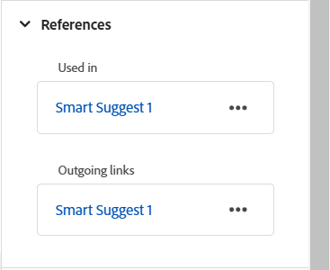

# Rechterdeelvenster in de Editor

Het rechterdeelvenster bevat informatie over het momenteel geselecteerde document.

>[!NOTE]
>
> U kunt het formaat van het rechterdeelvenster wijzigen. Als u het formaat van het deelvenster wilt wijzigen, plaatst u de cursor op de deelvenstergrens, verandert de cursor in een dubbele pijl, selecteert en sleept u om het formaat van het deelvenster te wijzigen.

In het rechterdeelvenster hebt u toegang tot de volgende functies:

- [Eigenschappen van inhoud](#content-properties)
- [Bestandseigenschappen](#file-properties)
- [Controleren](#review)
- [Wijzigingen bijhouden](#track-changes)
- [Schematron](#schematron)

## Eigenschappen van inhoud

U kunt tot de **eigenschappen van de Inhoud** eigenschap toegang hebben door het **eigenschappen van de Inhoud** pictogram in het juiste paneel te selecteren. Het **eigenschappen van de Inhoud** paneel bevat informatie over het type van momenteel geselecteerd element in het document en zijn attributen.

**Type**: U kunt de markeringen van de volledige hiërarchie voor de huidige markering van dropdown bekijken en selecteren.

**Attributen**: Het **&#x200B;**&#x200B;dropdown paneel van Attributen &lbrace;is beschikbaar in Lay-out, Auteur, en de meningen van Source. U kunt de kenmerken eenvoudig toevoegen, bewerken of verwijderen.

    
 Stappen om kenmerken toe te voegen 

1. Selecteer **toevoegen**.

   {width="300" align="left"}

1. In het **dropdown paneel van Attributen** &lbrace;, selecteer de attributen van de dropdown lijst en specificeer de waarde van een attribuut.  Dan selecteer **toevoegen**.

   {width="300" align="left"}

1. Om de attributen uit te geven, over het te bewegen en **te selecteren geef** .

1. Om de attributen te schrappen, over het te bewegen en **te selecteren schrap** .

>[!NOTE]
>
> Zelfs als uw onderwerp inhoud waarnaar wordt verwezen bevat, kunt u er kenmerken aan toevoegen via het deelvenster Eigenschappen.

Als uw beheerder een profiel voor attributen heeft gecreeerd, dan zult u die attributen samen met hun gevormde waarden krijgen. Gebruikend het paneel van inhoudseigenschappen, kunt u die attributen kiezen en hen toewijzen aan relevante inhoud in uw onderwerp. Op deze manier kunt u ook voorwaardelijke inhoud maken, die u vervolgens kunt gebruiken om voorwaardelijke uitvoer te maken. Voor meer informatie over het produceren van output die voorwaardelijke voorinstellingen gebruiken, stelt de voorwaarde van het menings&lbrace;[&#x200B; vooraf in.](generate-output-use-condition-presets.md#)

## Bestandseigenschappen

U geeft de eigenschappen van het geselecteerde bestand weer door het pictogram Bestandseigenschappen in het rechterdeelvenster te selecteren. De functie Bestandseigenschappen is beschikbaar in alle vier de modi of weergaven: Layout, Auteur, Source en Voorvertoning.

De eigenschappen File hebben de volgende twee secties:

**Algemeen**

In het gedeelte Algemeen hebt u toegang tot de volgende functies:

{width="300" align="left"}

- **Naam van het Dossier**: Toont filename van het geselecteerde onderwerp. De bestandsnaam is gekoppeld aan de eigenschappenpagina van het geselecteerde bestand.
- **identiteitskaart**: Toont identiteitskaart van het geselecteerde onderwerp.
- **Aantal van Word**: Toont het totale aantal woorden in het overeenkomstige onderwerp DITA. Woorden gescheiden door spaties worden geteld als afzonderlijke woorden. De telling wordt verfrist telkens als u sparen veranderingen in het onderwerp. Voor kruisverwijzingen wordt alleen de weergavetekst in de telling opgenomen, terwijl toetsen worden uitgesloten.

  >[!NOTE]
  >
  > De **tellings van Word** eigenschap wordt geïntroduceerd in de 2026.01.0 versie van Experience Manager Guides as a Cloud Service. Om het even welke nieuwe onderwerpen DITA u na bevordering aan deze versie creeert zal automatisch de berekende woordtelling in het Juiste paneel hebben. Voor bestaande onderwerpen, [&#x200B; wordt de opwerking van de activa &#x200B;](./asset-processor.md) vereist.

- **Markeringen**: Dit zijn de meta-gegevensmarkeringen van het onderwerp. Deze worden ingesteld vanuit het tagveld op de eigenschappenpagina. U kunt deze typen of selecteren in het vervolgkeuzemenu.  De tags worden weergegeven onder de vervolgkeuzelijst. Als u een tag wilt verwijderen, selecteert u het kruispictogram naast de tag.
- **geef meer eigenschappen** uit: U kunt meer eigenschappen (voor dossiers uitgeven die niet in **Gelezen slechts** wijze) van de de eigenschappen van het Dossier pagina zijn.

  >[!NOTE]
  >
  > Om het even welke toevoeging, schrapping, of wijziging van meta-gegevenseigenschappen (of gebrek of douane), zal de [&#x200B; werkende exemplaarindicator &#x200B;](./web-editor-edit-topics.md#working-copy-indicator) op de documentversie teweegbrengen.

- **Taal**: Toont de taal van het onderwerp. Deze wordt ingesteld vanuit het taalveld op de eigenschappenpagina.
- **creeerde op**: De datum en de tijd van vertoningen waarop het onderwerp werd gecreeerd.
- **Gewijzigd op**: Toont de datum en de tijd waarop het onderwerp werd gewijzigd.
- **die door** wordt vergrendeld: Toont de gebruiker die het onderwerp sloot.
- **de staat van het Document**: U kunt de documentstaat van het momenteel geopende onderwerp selecteren en bijwerken. Voor meer details, mening [&#x200B; de Staat van het Document &#x200B;](web-editor-document-states.md#).

>[!NOTE]
>
> U kunt de kenmerkwaarden van de verschillende velden in de bestandseigenschappen naar het klembord kopiëren.

**Verwijzingen**

In het gedeelte Verwijzingen hebt u toegang tot de volgende functies:

{width="300" align="left"}

- **Gebruikt in**: Gebruikt in verwijzingen maakt een lijst van de documenten waar het huidige dossier wordt bedoeld of gebruikt.
- **Uitgaande verbindingen:** de Uitgaande verbindingen maken een lijst van de documenten die in het huidige document worden bedoeld.

Standaard kunt u de bestanden op titels weergeven. Terwijl u de cursor op een bestand plaatst, kunt u de bestandstitel en het bestandspad weergeven als knopinfo.

>[!NOTE]
>
> Als beheerder kunt u de lijst met bestanden ook weergeven op bestandsnamen in de Editor. Selecteer de **optie van de Naam van het 0&rbrace; Dossier {van de** 3} sectie van de de vertoningsconfiguratie van de dossiers van de Redacteur in **voorkeur van de Gebruiker**.**&#x200B;**

>[!NOTE]
>
> Alle Gebruikt binnen en Uitgaande verwijzingen zijn hyperlinked aan de documenten. U kunt de gekoppelde documenten gemakkelijk openen en bewerken.

Naast het openen van dossiers, kunt u vele acties ook uitvoeren gebruikend het **menu van Opties** in de sectie van Verwijzingen. Enkele acties die u kunt uitvoeren zijn Bewerken, Voorvertoning, UUID kopiëren, Pad kopiëren, Toevoegen aan verzamelingen, Eigenschappen.

## Controleren

Als u het pictogram Revisie selecteert, wordt het revisievenster geopend waarin u een revisietaak kunt selecteren voor het momenteel geopende document en opmerkingen kunt weergeven.

{width="300" align="left"}

Als u meerdere revisieprojecten hebt gemaakt, kunt u een van de vervolgkeuzelijsten selecteren en de revisieopmerkingen openen.

Met het deelvenster Review kunt u reacties op de opmerkingen over het onderwerp weergeven en posten. U kunt de opmerkingen een voor een accepteren of afwijzen.

>[!NOTE]
>
> Het commentaarvakje en het antwoordvakje steunen multi-line ingangen en staan gebruikers toe om het uit te breiden zoals nodig voor het verstrekken van uitvoerige commentaren evenals gedetailleerd antwoord op de commentaren. U kunt **Verschuiving** gebruiken + **gaat** binnen om naar de volgende lijn te gaan terwijl het schrijven van de commentaren of de antwoorden.

Voor meer informatie, bekijk [&#x200B; de revisiecommentaren van het Adres &#x200B;](review-address-review-comments.md#).

## Wijzigingen bijhouden

Met de functie Bijgehouden wijzigingen in het rechterdeelvenster kunt u de informatie weergeven van alle updates die in een document zijn gemaakt. U kunt ook zoeken naar specifieke updates van het document.

>[!NOTE]
>
> De geleide veranderingseigenschap toont alle updates die gebruikend de Enable/Disable eigenschap van de Veranderingen van het Spoor van de [&#x200B; bar van het Lusje &#x200B;](./web-editor-tab-bar.md) zijn gevolgd.

## Schematron

&quot;Schematron&quot; verwijst naar een op regels gebaseerde validatietaal die wordt gebruikt om tests voor een XML-bestand te definiëren. De Editor ondersteunt Schematron-bestanden. U kunt de Schematron-bestanden importeren en deze ook bewerken in de Editor. Met behulp van een Schematron-bestand kunt u bepaalde regels definiëren en deze vervolgens valideren voor een DITA-onderwerp of een kaart.

Leer hoe te met de dossiers van Schematron in Experience Manager Guides te werken, verwijs naar [&#x200B; Steun voor dossiers Schematron &#x200B;](./support-schematron-file.md).

**Bovenliggend onderwerp:**&#x200B;[&#x200B; Inleiding aan de Redacteur &#x200B;](web-editor.md)
