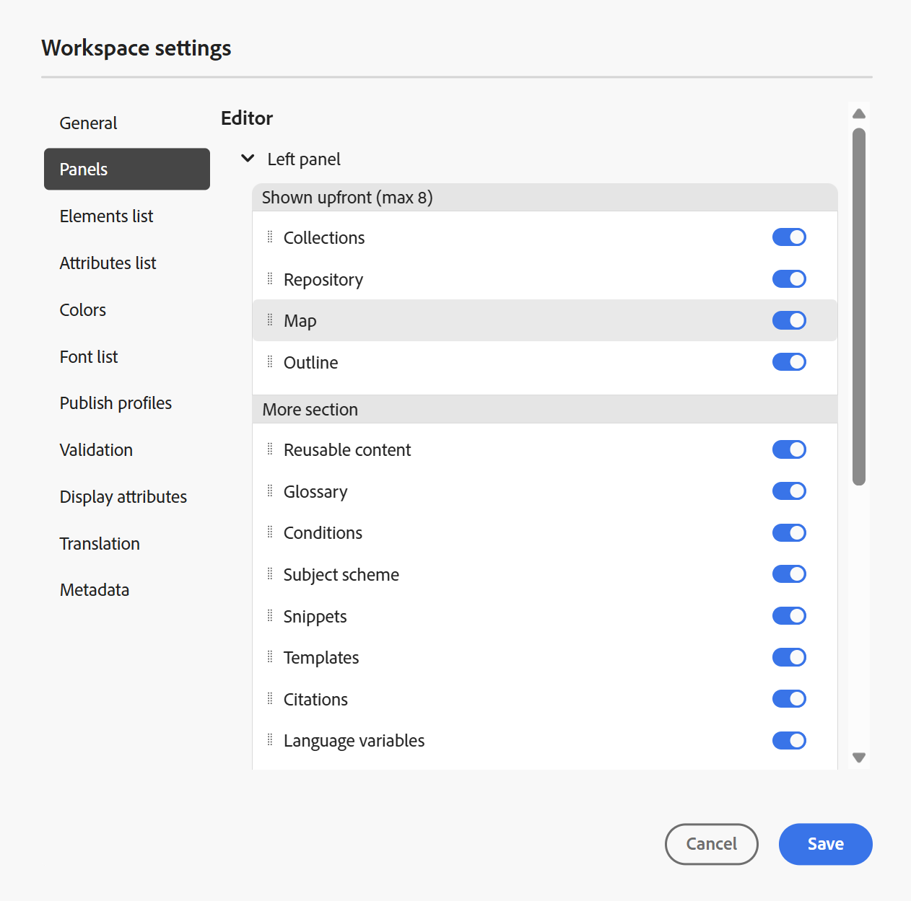
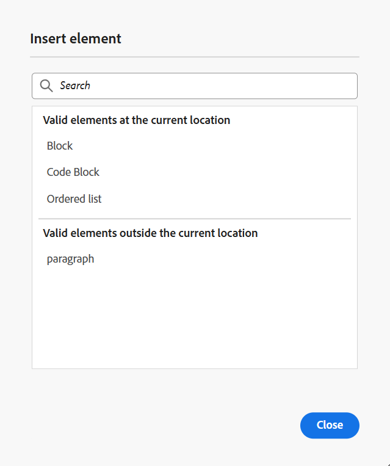

# Editor-instellingen

De **optie van Montages** huidig in de [ bar van het Lusje ](./web-editor-tab-bar.md) van de Redacteur is beschikbaar slechts voor beheerders en de beheerders van het omslagprofiel, en staat het vormen van de volgende montages toe:

- [Algemeen](#general)
- [Deelvensters](#panels)
- [Elements-lijst](#elements-list)
- [Lijst met kenmerken](#attributes-list)
- [Kleuren](#colors)
- [Profielen publiceren](#publish-profiles)
- [Validatie](#validation)
- [Weergavekenmerken](#display-attributes)
- [Vertaling](#translation)
- [Metagegevens](#metadata)

>[!NOTE]
>
> Als u standaardinstellingen bijwerkt, moet u documenten opnieuw openen om de wijzigingen van kracht te laten worden.

## Algemeen

Met de algemene instellingen kunt u het woordenboek configureren dat u wilt gebruiken met de Editor. Dit lusje bevat vier secties: **controle van de Spel**, **Voorwaarde**, **Authoring**, en **Bevelingen**.

{width="650" align="left"}

- **controle van de Spel**: Er zijn twee opties - **de spellingcontrole van AEM** en **Browser spellingcontrole**. Standaard gebruikt de editor de functie voor spellingcontrole in de browser, waarbij de spellingcontrole wordt uitgevoerd met behulp van het ingebouwde woordenboek van de browser. U kunt overschakelen naar de spellingcontrole van AEM om het Adobe Experience Manager-woordenboek te gebruiken. Dit kan ook worden aangepast om uw aangepaste woordenlijst toe te voegen. Voor meer informatie over het aanpassen van het woordenboek van AEM, de mening [ past de sectie van het standaardwoordenboek van AEM ](../cs-install-guide/customize-aem-custom-dictionary.md) in installeert en vormt Adobe Experience Manager Guides as a Cloud Service aan.

- **Voorwaarde**

   - **benadruk voorwaardelijke tekst in de mening van de Auteur**: Selecteer dit om de voorwaardelijke tekst in de auteursmening te benadrukken. De voorwaardelijke inhoud wordt gemarkeerd met de kleur die voor de voorwaarde is gedefinieerd.

   - **Valideer met voorwaardenattributen**: Selecteer dit om de bevestiging van de waarden toe te staan die voor de attributen worden bepaald. Hierdoor kunt u geen onjuiste waarde toevoegen.

   - **toon sleutel met de titel in het Onderwerppaneel van het Regeling**: Selecteer dit om de sleutels samen met titels in de onderwerpregeling te tonen. Als u deze optie niet selecteert, worden alleen de titels weergegeven. Hier worden bijvoorbeeld de toetsen &#39;os&#39;, &#39;publiek&#39; en &#39;ander&#39; ook samen met titels weergegeven.

     {width="550" align="left"}

   - **toon onderwerpregeling in het paneel van Voorwaarden**: selecteer dit om een onderwerpregeling in het voorwaardenpaneel te bekijken. Als u deze optie uitschakelt, worden de gedefinieerde voorwaarden weergegeven in het deelvenster Voorwaarden.

- **Authoring**

   - **laat Vervangen toe allen**: Selecteer dit om **te bekijken vervangen allen** pictogram in **Vondst en vervang** paneel.

- **Bevelingen**

  Wijzig de stijl van de citaten. Kies de citaatstijl van drop-down u in uw project wilt gebruiken. Voor meer details, mening [ de citaatstijlen van de Verandering ](./web-editor-apply-citations.md#change-citation-style).

- **AI Medewerker**
Selecteer dit om de [ AI Medewerker ](./ai-assistant.md) eigenschap in Experience Manager Guides toe te laten. Hef de selectie op om de functie uit te schakelen.

## Deelvensters

Deze instelling bepaalt de deelvensters die worden weergegeven in de deelvensters links en rechts in de Editor en de kaartconsole. U kunt de knop in- of uitschakelen om het gewenste deelvenster weer te geven of te verbergen.

{width="650" align="left"}

U kunt ook de volgorde definiëren waarin de functies in deelvensters worden weergegeven. Als u de standaardvolgorde van de beschikbare functies in de deelvensters wilt wijzigen, selecteert u de stippelbalken om de tabbladen met functies naar de gewenste locatie te slepen. Een eigenschap kan ook van de **Meer** sectie aan de belangrijkste sectie van een paneel worden bewogen, en vice versa zoals per het vereiste. Als de functies eenmaal opnieuw zijn geordend, staan deze in dezelfde volgorde in het rechter- en linkerdeelvenster.

{width="650" align="left"}

U kunt maximaal acht deelvensters tegelijk weergeven. Wijzigingen die u aanbrengt in de deelvensterinstellingen worden direct toegepast.

>[!NOTE]
>
> Als er een aangepast deelvenster is geconfigureerd, wordt dit ook weergegeven in de lijst met deelvensters. U kunt schakelen tussen het weergeven of verbergen van het aangepaste deelvenster.

## Elements-lijst

Als beheerder kunt u de lijst met elementen beheren die een auteur in een bestand kan invoegen en ook de weergavenaam voor het element definiëren. Met de instelling voor de Elements-lijst kunt u de naam van het element opgeven volgens de DITA-specificaties en een label dat u wilt gebruiken in plaats van de door DITA gedefinieerde elementnaam:

{width="650" align="left"}

In de bovenstaande schermafbeelding heeft het element `p` een label Alinea gekregen en krijgt `codeblock` een label Codeblok samen met enkele andere elementen. Als u het **Gebruik slechts boven elementen** optie selecteert, dan slechts zullen de geldige elementen \ (op huidig toevoegingspunt \) van deze lijst in het **het element van het Tussenvoegsel** dialoogvakje worden getoond.

In het volgende schermafbeelding worden slechts 3 van de 4 geconfigureerde elementen van de vorige schermafbeelding in de huidige context getoond:

{width="300" align="left"}

## Lijst met kenmerken

Net als in de lijst met elementen kunt u de lijst met kenmerken en hun weergavenamen bepalen die in de lijst met kenmerken van een element moeten worden weergegeven. In het volgende schermschot, slechts zijn 3 attributen gevormd om in de de attributenlijst van een element te worden getoond:

{width="650" align="left"}

Met deze instelling kunt u bij het toevoegen van een kenmerk aan een element alleen de lijst weergeven met kenmerken die in de lijst zijn geconfigureerd.

{width="300" align="left"}

## Kleuren

Toont een lijst van pre-gevormde achtergrondkleuren voor **Voorwaarden**. Gebruikers kunnen een achtergrondkleur selecteren wanneer zij een voorwaarde op een onderwerp toepassen. Als beheerder kunt u ook aangepaste achtergrondkleuren maken en aan de lijst toevoegen. Om een nieuwe kleur toe te voegen, ga de gewenste naam op het **gebied van de Naam van de Kleur** in, kies een douanekleur, en selecteer **+** pictogram. De aangepaste kleur wordt aan het einde van de kleurlijst weergegeven.

## Profielen publiceren

Dit bevat de Profielen die kunnen worden gebruikt om de **output van de Kennisbank** te publiceren. U kunt een nieuw profiel voor een doelkennisbasis tot stand brengen. Bijvoorbeeld Salesforce of ServiceNow.

**creeer een profiel van Salesforce**

**Eerste vereisten**

- Maak een verbonden app voor Salesforce. Voor meer details, verwijs naar [ laat OAuth Montages voor API Integratie ](https://help.salesforce.com/s/articleView?id=sf.connected_app_create_api_integration.htm&amp;type=5) toe.

- Zorg tijdens het configureren van de verbonden app voor het volgende:

   - Geef de callback op.

     `URL: http://<server name>:<port>/bin/dxml/thirdparty/callback/salesforce`

   - Selecteer de volgende OAuth-bereiken:
      - Volledige toegang (volledig)
      - Selecteer Gebruikersgegevens beheren via API&#39;s (api)

     Zodra app wordt gevormd, verstrekt Salesforce a **Consumentensleutel** en **Geheime consument**. Hiermee kunt u het Salesforce-profiel maken.

   - Om een profiel van Salesforce tot stand te brengen, selecteer de **Salesforce** Kennisbank van het **type van Server** dropdown. Voer een profielnaam in. In de **Plaats URL**, ga de consumentenplaats in u zou gebruiken om de output te publiceren en dan de **Consumentensleutel** toe te voegen en **Geheime consument** die door de de consumentenplaats van Salesforce wordt verstrekt. Dan, **bevestigt** en **sparen** het pas gecreëerde profiel.

     {width="550" align="left"}

     >[!NOTE]
     >
     >Gebruik Apache HTTP Components Proxy Configuration in AEM om een proxy voor Salesforce in Experience Manager Guides te configureren. Leer hoe te [ volmacht voor de Controleur van de Verbinding van AEM ](https://helpx.adobe.com/experience-manager/kb/How-to-configure-proxy-for-the-AEM-Link-Checker-AEM.html) vormen.

**creeer een profiel ServiceNow**

**Eerste vereisten**

Vorm de server ServiceNow om de activa te uploaden.

- Verbind met de **** server ServiceNow.
- Navigeer aan **Eigenschappen van het Systeem** > **Veiligheid**.
- Schakel de volgende optie uit:

  **Dit bezit moet worden geplaatst om MIME type te activeren controlerend voor uploads (Alle versies Eureka en omhoog). Schakelt mime-validatie (true) of uit (false) voor de bestandsbijlagen. De uitbreidingen van het dossier die via glide.gehechtheid.extensions worden gevormd zullen op MIME type tijdens upload worden gecontroleerd.**

- Selecteer **sparen**.

  Zodra u app hebt gevormd, creeer het **ServiceNow** profiel.

- Om een profiel tot stand te brengen, selecteer de Kennisbank ServiceNow van het **type van Server** dropdown. Ga een profiel **Naam** in. In **ServiceNow URL**, ga de consumentenplaats in u voor het publiceren van de output zou gebruiken en dan de **Gebruikersnaam** en **Wachtwoord** toevoegde die} door de plaats van de consument ServiceNow wordt verstrekt. Dan, **bevestigt** en **sparen** het pas gecreëerde profiel.

  {width="550" align="left"}

  Nadat u bevestigt, kunt u het Publish Profiel in de outputvoorinstellingen van een Kaart selecteren DITA en het gebruiken om de output aan de **Salesforce** of **** server te produceren ServiceNow die u hebt gekozen.

  Leer meer over de [ vooraf ingestelde output van de Kennisbank ](../user-guide/generate-output-knowledge-base.md).

## Validatie

Dit tabblad bevat opties voor het configureren van de Schematron-validaties in de Editor. U kunt de volgende functies inschakelen:

- **de bevestigingscontrole van de Looppas alvorens het dossier** op te slaan: Selecteer dit om de bevestigingen in werking te stellen Schematron gebruikend het geselecteerde dossier van het Schema vóór om het even welke sparen verrichting. U kunt een Schematron-bestand toevoegen door het pictogram + te selecteren. De geselecteerde Schematron-bestanden worden weergegeven.

  >[!NOTE]
  >
  > Het geselecteerde schemabestand of de geselecteerde schemabestanden blijven aanwezig voor het geselecteerde mapprofiel.

  {width="550" align="left"}

  Hiermee voorkomt u dat gebruikers een bestand opslaan dat een regel verbreekt die is gedefinieerd in de geselecteerde Schema-bestanden. Als u deze optie niet selecteert, wordt het bestand niet gevalideerd voordat de wijzigingen worden opgeslagen.

- **staat alle gebruikers toe om schemadossiers in bevestigingspaneel toe te voegen**: Selecteer dit om de gebruikers toe te staan om het even welk dossier van het Schema in het paneel van de Bevestiging van de Redacteur toe te voegen. Dit staat de gebruikers toe om dossiers Schematron toe te voegen en dan de onderwerpen tegen het dossier van Schematron te bevestigen. Als dit niet wordt geselecteerd, is de optie om schematroondossier **toe te voegen Schematroebestand** knoop niet beschikbaar aan de gebruikers in het **paneel van de Bevestiging** van de Redacteur.

## Weergavekenmerken

Net als in de lijst Kenmerken kunt u de lijst met kenmerken instellen die in de lijst met kenmerken van een element moet worden weergegeven. Door gebrek, zijn vier **attributen van de Vertoning** — publiek, platform, product, en steunen gevormd om in de attributenlijst van een element worden getoond. U kunt een vertoningsattribuut ook toevoegen gebruikend **** pictogram op de bovenkant toevoegen. U kunt om het even welke vertoningsattributen ook schrappen gebruikend het **pictogram van de Schrapping**.

De kenmerken die voor een element zijn gedefinieerd, worden weergegeven in de layoutweergave en in de contourweergave.

{width="550" align="left"}

## Vertaling

Dit lusje bevat de opties om taalgroepen tot stand te brengen, de bronetiketten aan de doelversie te verspreiden, en het vertaalproject schoon te maken.

{width="550" align="left"}

- **Groepen van de Taal**: Als beheerder, kunt u een groep talen tot stand brengen en hen gebruiken als reeks om de inhoud te vertalen.

  Voer de volgende stappen uit om een nieuwe taalgroep te maken:

   1. Selecteer **toevoegen**.
   1. Voer de naam van de taalgroep in. Elke taal moet een unieke naam hebben. U kunt een fout weergeven als het naamveld leeg is of als de naam niet uniek is.
   1. Selecteer de talen in het vervolgkeuzemenu. U kunt meerdere talen selecteren.

      Typ de eerste paar tekens van de taal of de taalcode om de gewenste talen te filteren. Typ bijvoorbeeld &#39;en&#39; om alle talen te filteren die &#39;en&#39; bevatten aan het begin van hun naam of code.

   1. Selecteer het pictogram Gereed om de geselecteerde talen aan de groep toe te voegen. De talen worden weergegeven. Wanneer u drie of meer talen toevoegt, **toon meer** optie wordt getoond. U kunt **selecteren toont meer** om alle talen te bekijken huidig in de groep.

      >[!TIP]
      >
      > Knevel **tonen meer** aan **tonen minder** en bekijken slechts een paar talen.

   1. Beweeg over de talen in een groep om  uit of schrap  de taalgroepen schrappen.
   1. Sparen de **Montages**.

      >[!NOTE]
      >
      >Als gebruiker, kunt u de taalgroepen bekijken die aan uw omslagprofiel worden gevormd.

- **verspreidt bronversielabels aan de doelversie**: Selecteer deze optie om het etiket van de brondossierversie tot het vertaalde dossier over te gaan. Deze optie is standaard uitgeschakeld.
- **Schoonmaak van het Vertaalproject na voltooiing**: Selecteer deze optie om de vertaalprojecten te vormen om na de vertaling worden onbruikbaar gemaakt of automatisch worden geschrapt. Door gebrek, **niets** wordt geselecteerd, zodat het project na vertaling bestaat.

  U kunt de vertaalprojecten onbruikbaar maken als u hen later wilt gebruiken. Als u een project verwijdert, worden alle bestanden en mappen in het project permanent verwijderd.

## Metagegevens

U kunt de versiemetagegevens van het onderwerp en hun waarden controleren die in het **de geschiedenisdialoogvakje van de Versie** moeten worden getoond.  Geef in het pad naar de metagegevens de locatie op van de knooppunten waaruit u de metagegevens wilt kiezen. U kunt ook een aangepaste naam voor de metagegevens definiëren als label. De standaardeigenschappen zijn Titel, Documentstatus en Labels.

De metagegevens kunnen worden gekozen uit elke eigenschap onder het knooppunt `/jcr:content` van het element, zodat u het pad van de eigenschap kunt toevoegen als het pad naar metagegevens.

Er wordt een fout weergegeven als het pad naar de metagegevens leeg is. Als u het label leeg laat, wordt het laatste element als label gekozen.

{width="550" align="left"}

*vorm de meta-gegevens voor het **de dialoogvakje van de Geschiedenis van de Versie**.*

U kunt ook de volgorde definiëren waarin deze metagegevenstags worden weergegeven. Als u de standaardvolgorde van deze tags wilt wijzigen, selecteert u de stippelbalken om de tags naar de gewenste locatie te slepen.
De meta-gegevensetiketten verschijnen in de zelfde opeenvolging in het **de geschiedenisdialoogvakje van de Versie** van de Redacteur.

**Bovenliggend onderwerp:**[ Inleiding aan de Redacteur ](web-editor.md)
