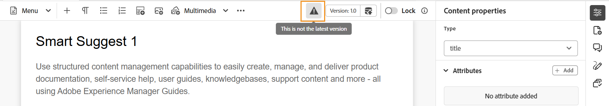
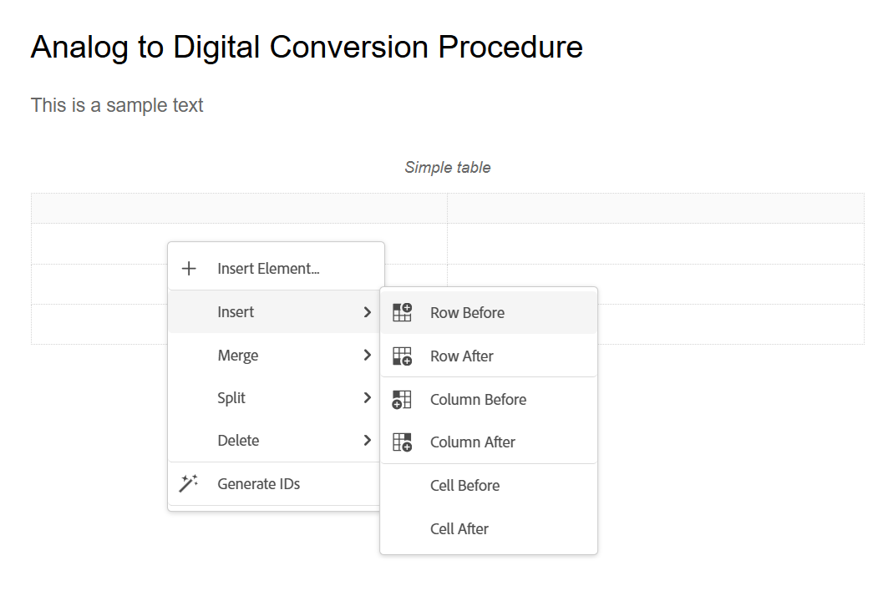
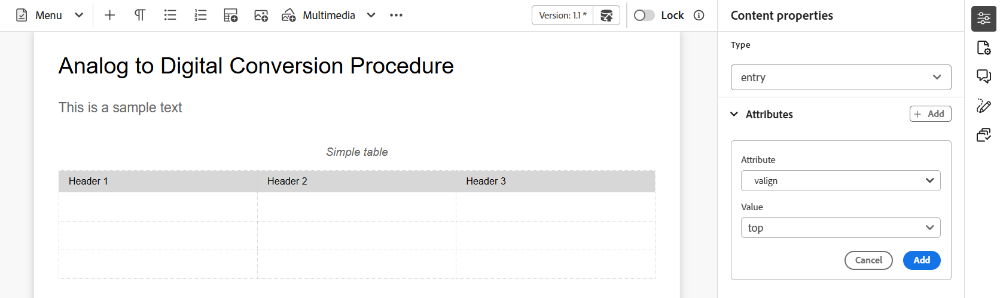
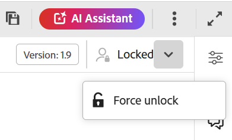

# Werkbalk in de Editor

De werkbalk verschijnt wanneer u een onderwerp of kaart opent voor bewerking in de Editor. De werkbalk bevat de volgende functies:

- [Vervolgkeuzelijst Menu](#menu-dropdown)
- [Opties voor het invoegen van inhoud](#content-insertion-options)
- [Versiegegevens en knop Opslaan als nieuwe versie](#version-information-and-save-as-new-version)
- [Vergrendelen/ontgrendelen](#lockunlock)

>[!NOTE]
>
> De bovenstaande functies zijn alleen van toepassing op onderwerpbestanden. Als u met een kaartbestand werkt, worden op basis van de huidige Kaartweergave verschillende opties op de werkbalk weergegeven. Leer over de opties van de de redacteurstoolbar van de Kaart in het [ de redacteurseigenschappen van de Kaart ](./map-editor-advanced-map-editor.md) document.

## Vervolgkeuzelijst Menu

Het vervolgkeuzemenu Menu biedt toegang tot de bewerkingsacties, Zoeken en vervangen, Versiegeschiedenis, Versielabel, Samenvoegen, Revisietaak maken, Wijzigingen bijhouden en de functie Codes.

Hieronder wordt een gedetailleerde uitleg gegeven van deze kenmerken:

**het Uitgeven acties**

Wanneer het uitgeven van een onderwerp in de Redacteur, toegang tot de diverse het uitgeven acties zoals **Besnoeiing** of ***CTRL*** + ***X***, **Exemplaar** of ***CTRL*** + ***C***, **ongedaan maken** of ***CTRL*** + ***Z.***, **opnieuw** of ***CTRL*** + ***Y*** en **Schrapping** aanwezig in het drop-down van het Menu.

**Vondst en vervangt**

De **Vondst en vervangt** eigenschap is beschikbaar in Auteur en de meningswijzen van Source. Als deze optie is ingeschakeld, wordt de tekstbalk Zoeken en vervangen onder aan het bewerkingsgebied voor onderwerpen weergegeven. U kunt de kortere wegsleutels gebruiken **CTRL** + **F** om de Vondst aan te halen en bar te vervangen.

{align="left"}

Gebruikend het montagespictogram \ ( \), kunt u **negeren geval** en **het Hele woord slechts** onderzoeksopties van een knevel voorzien. Om het case-insensitive onderzoek uit te voeren, zet \ (of selecteer \) **geval** optie negeren. Anders, als u het case-sensitive onderzoek wilt uitvoeren, draai \ (of schrap \) **negeren geval** optie. U kunt ook een heel woord zoeken.

Het onderzoek is onmiddellijk, zo betekent het dat aangezien u de onderzoeksuitdrukking of het woord in het **Vondst** gebied typt, de termijn onmiddellijk wordt gezocht en in het onderwerp geselecteerd. Op dezelfde manier voor het vervangen van een tekst in uw onderwerp, ga de onderzoekstermijn en zijn vervanging op de respectieve gebieden in en selecteer **vervangen** of **vervangen allen** knoop.

In de mening van Source, is de **Vondst en vervangt** eigenschap uiterst nuttig voor het zoeken naar een specifiek element of een attribuut. Als u bijvoorbeeld de waarde van het kenmerk `@product` wilt vervangen, kunt u dit gemakkelijk doen vanuit de Source-weergave. In de weergave Auteur kunt u niet zoeken op basis van een kenmerk of element. Nochtans, moet u voorzichtigheid gebruiken terwijl het gebruiken van **vervangen Al** eigenschap, aangezien het de code van XML zou kunnen beschrijven.

**de geschiedenis van de Versie**

De **geschiedeniseigenschap van de Versie** in de Redacteur staat u toe om de beschikbare versies van uw DITA- dossiers te controleren, hen te vergelijken, en aan om het even welke versie van de Redacteur terug te keren zelf. U kunt de inhoud en metagegevens van de huidige versie (die ook een werkkopie kan zijn) vergelijken met elke vorige versie van hetzelfde bestand. U kunt ook de labels en opmerkingen voor de vergeleken versies weergeven.

>[!NOTE]
>
> De de geschiedenisopties van de Versie verschijnen slechts als er veranderingen worden aangebracht in de eerste versie van het onderwerp of de kaart.

    
 Stappen om tot de geschiedenis van de Versie toegang te hebben 

1. Open een onderwerp in de Redacteur.
1. Selecteer **geschiedenis van de Versie** van **** dropdown van het Menu.

   Het **de dialoogvakje van de Geschiedenis van de Versie** verschijnt.

   {width="550" align="left"}

   *Voorproef de veranderingen in de verschillende versies van een onderwerp.*

1. Kies een versie van het onderwerp dat u wilt vergelijken of terugkeren aan in **vergelijken met** dropdown lijst.

   >[!NOTE]
   >
   > Als er op een versie labels zijn toegepast, worden deze ook tussen haakjes en het versienummer weergegeven.

1. Laat de **etiketten en commentaren van de Mening** optie toe om de etiketten en de commentaren te bekijken die op de huidige en de vergeleken versies worden toegepast.
1. U kunt de volgende informatie in het **de geschiedenisdialoog van de Versie** ook bekijken:

   **Voorproef** tabel: De onlangs toegevoegde inhoud is in groene doopvont, en de geschrapte inhoud is in rode doopvont.

   **Meta-gegevens** tabel: De onlangs toegevoegde meta-gegevens is in groene doopvont, en de geschrapte meta-gegevens is in rode doopvont.

   {width="550" align="left"}

   *vergelijk de meta-gegevens van verschillende versies in de geschiedenis van de Versie.*

   >[!NOTE]
   >
   > Uw systeembeheerder kan de meta-gegevens veranderen die van het lusje van Meta-gegevens in de **Montages** moeten worden getoond. Voor details, verwijs naar **Meer acties** sectie van de [ bar van het Lusje ](#tab-bar).

   U kunt ook de gebruikers- en tijdgegevens weergeven van de huidige en de vergeleken versie.

   Zodra u een versie van de drop-down lijst kiest, wordt **terugkeren aan geselecteerde versie** optie ter beschikking gesteld. Het voorproefvenster toont de verschillen tussen de huidige versie en de geselecteerde versie van het onderwerp.

1. Selecteer **terugkeren aan geselecteerde versie** om uw het werk exemplaar met de geselecteerde versie van het onderwerp terug te keren.

   Het dialoogvenster Versie herstellen wordt geopend.

   {width="550" align="left"}

1. \ (*Facultatieve* \) verstrek een reden om aan een vroegere versie terug te keren. U kunt ook een nieuwe versie maken van de actieve werkkopie van het onderwerp.

1. Selecteer **bevestigen**.

   De werkkopie van het bestand wordt teruggezet naar de geselecteerde versie. Als u ervoor kiest een nieuwe versie van de momenteel actieve werkkopie te maken, wordt ook een nieuwe versie van het bestand gemaakt met alle werkwijzigingen.

   Wanneer u terugkeert naar een eerdere versie, wordt een visuele aanwijzing getoond die erop wijst dat de versie u momenteel werkt aan niet de recentste versie is.

   {align="left"}

**de etiketten van de Versie**

Met labels kunt u het werkgebied identificeren waarin een bepaald onderwerp zich in de DDLC \(Levenscyclus voor documentontwikkeling\) bevindt. Wanneer u bijvoorbeeld aan een onderwerp werkt, kunt u het label &quot;Goedgekeurd&quot; instellen. Zodra een onderwerp wordt gepubliceerd en ter beschikking gesteld aan klanten, kunt u &quot;Vrijgegeven&quot;etiket aan dat onderwerp toewijzen.

Met Experience Manager Guides kunt u labels opgeven in een tekstindeling met vrije vorm of een set vooraf gedefinieerde labels gebruiken. Met het aangepaste label kan elke auteur in het systeem naar keuze een label opgeven. Dit geeft flexibiliteit, maar het introduceert inconsistente labels in het systeem. Om dit probleem te verhelpen, kunnen beheerders een set vooraf gedefinieerde labels configureren. Voor meer informatie over het vormen van vooraf bepaalde etiketten, vormt de mening *en past de Redacteur van het Web van XML* in toe installeert en vormt Adobe Experience Manager Guides as a Cloud Service.

Deze labels worden in de vorm van een vervolgkeuzelijst weergegeven aan auteurs, waar ze een label moeten opgeven. Dit zorgt ervoor dat alleen vooraf gedefinieerde, consistente labels in het systeem worden gebruikt.

Er zijn verschillende methodes waardoor u etiketten op uw onderwerpen kunt toepassen - ](web-editor-use-label.md) paneel van de geschiedenis van de 1} Versie in Assets UI, [ Basislijnen ](/help/product-guide/user-guide/generate-output-use-baseline-for-publishing.md) UI, en de Redacteur. [ Met de functie Versielabel in de Editor kunnen auteurs snel en eenvoudig labels toewijzen aan hun onderwerpen.

    
 Stappen om etiketten aan uw onderwerp van de Redacteur toe te voegen 

1. Open een onderwerp in de Redacteur.

1. Selecteer **de etiketten van de Versie** van het drop-down Menu.

   Het dialoogvenster Versielabelbeheer wordt weergegeven.

   {width="650" align="left"}

   Het dialoogvenster Versielabelbeheer is opgedeeld in twee delen. Het linkerdeelvenster bevat een lijst met versies die beschikbaar zijn voor het onderwerp, samen met de vervolgkeuzelijst met labels \(of een tekstvak waarin een label\ wordt ingevoerd) en het rechterdeelvenster met een voorvertoning van het onderwerp.

1. Selecteer een versie waarop u labels wilt toepassen.

   Wanneer u een verschillende versie van het onderwerp van de versielijst kiest, dan toont het voorproefpaneel de veranderingen tussen de huidige versie en de geselecteerde versie van het onderwerp

   >[!NOTE]
   >
   > Als een label al op een versie is toegepast, wordt het naast het versienummer weergegeven in de vervolgkeuzelijst en onder de lijst Selecteer versie. U kunt een bestaand etiket verwijderen door \ (**x** te selecteren \) pictogram naast het etiket.

1. Als de beheerder een lijst met labels heeft gedefinieerd, wordt een vervolgkeuzelijst met de labels weergegeven waaruit u de labels kunt kiezen die u wilt toepassen. U kunt meerdere labels selecteren in de vervolgkeuzelijst.

   Anders, wordt u getoond een tekstvakje, waar u de etiketten kunt ingaan die u aan uw onderwerp wilt toevoegen.

   >[!NOTE]
   >
   > U kunt niet het zelfde etiket op veelvoudige versies van een onderwerp toepassen. Als u probeert om een bestaand etiket te associëren, dan krijgt u een optie om het uit de bestaande versie te verwijderen en het op de geselecteerde versie van het onderwerp toe te passen.

1. Selecteer **toevoegen Etiket**.

1. In het Apply de bevestigingsbericht van het Etiket, selecteer het **etiket van de Beweging (indien gebruikt op een andere versie)** optie om etiketten van een bestaande versie aan de geselecteerde versie te bewegen. Als u deze optie niet selecteert en er etiketten zijn die aan een verschillende versie van het onderwerp worden toegewezen, dan worden zij niet verplaatst naar de geselecteerde versie van het onderwerp. Dergelijke labels worden genegeerd in het labeltoepassingsproces.

**Fusie**

Wanneer u in een multi-auteurmilieu werkt, wordt het moeilijk om te volgen welke veranderingen de andere auteurs in een onderwerp of een kaart hebben aangebracht. Met de functie Samenvoegen hebt u meer controle over het weergeven van de wijzigingen, maar ook over de wijzigingen die in de meest recente versie van het document blijven staan.

    
 Onderwerpbestanden samenvoegen 

Voer de volgende stappen uit om wijzigingen in een onderwerp samen te voegen:

1. Open een onderwerp in de Redacteur.

1. Selecteer **Samenvoegen**.

   Het dialoogvenster Samenvoegen wordt weergegeven.

   {width="550" align="left"}

1. *\(Optioneel\)* U kunt ook bladeren en een nieuw dossier van één of andere andere plaats in uw bewaarplaats selecteren.

1. Selecteer een versie van het bestand waarmee u de huidige versie van het bestand wilt vergelijken.

1. Kies bij Opties de volgende opties:

   - **de veranderingen van het Spoor van geselecteerde versie**: Deze optie toont alle inhoudsupdates in de vorm van bijgehouden veranderingen. Vervolgens kunt u kiezen of u de wijzigingen in het document een voor een wilt accepteren of wilt negeren, of in één keer.

   - **keert aan geselecteerde versie** terug: Deze optie keert de huidige versie van het document aan de geselecteerde versie terug. Met deze optie kunt u niet bepalen welke inhoud wordt geaccepteerd of geweigerd.

1. Selecteer **Gereed**.

1. Als u het **Spoor van geselecteerde versie** optie selecteerde, dan worden alle veranderingen van de geselecteerde versie getoond in de Getraceerde veranderingseigenschap van het juiste paneel.

   U kunt ervoor kiezen alle opmerkingen in het deelvenster Bijgehouden wijzigingen te accepteren of te negeren, of afzonderlijke opmerkingen te accepteren of te negeren.

    
 Kaartbestanden samenvoegen 

Voer de volgende stappen uit om wijzigingen in een kaartbestand samen te voegen:

1. Open een kaart in de Editor.

1. Selecteer **Samenvoegen**.

   Het dialoogvenster Samenvoegen wordt geopend.

   {width="550" align="left"}

1. *\(Optioneel\)* U kunt ook bladeren en een nieuw dossier van één of andere andere plaats in uw bewaarplaats selecteren.

1. Selecteer een versie van het bestand waarmee u de huidige versie van het bestand wilt vergelijken.

1. Kies bij Opties de volgende opties:

   - **de veranderingen van het Spoor van geselecteerde versie**: Deze optie toont alle inhoudsupdates in de vorm van spoorveranderingen. Vervolgens kunt u kiezen of u de wijzigingen in het document een voor een wilt accepteren of wilt negeren, of in één keer.

   - **keert aan geselecteerde versie** terug: Deze optie keert de huidige versie van het document aan de geselecteerde versie terug. Met deze optie kunt u niet bepalen welke inhoud wordt geaccepteerd of geweigerd.

1. Selecteer **Gereed**.

1. Als u de **veranderingen van het Spoor van geselecteerde versie** optie selecteerde, dan worden alle veranderingen van de geselecteerde versie getoond in het Bijgehouden paneel van veranderingen \ (op het recht \).

   U kunt ervoor kiezen om alle wijzigingen te accepteren of te negeren in het deelvenster Bijgehouden wijzigingen of om afzonderlijke wijzigingen in het kaartbestand te accepteren of te negeren.

**creeer overzichtstaak**

U kunt [ een overzichtstaak ](./review-send-topics-for-review.md) van het huidige onderwerp of kaartdossier direct van de Redacteur tot stand brengen. Open het dossier waarvoor u de overzichtstaak wilt tot stand brengen en **selecteren creeert overzichtstaak** van dropdown van het Menu om het proces van de overzichtsverwezenlijking in werking te stellen.

**de veranderingen van het Spoor**

U kunt alle updates die op een document zijn aangebracht bijhouden door de modus Wijzigingen bijhouden in te schakelen. Nadat u wijzigingen in de track hebt ingeschakeld, worden alle invoegingen en verwijderingen vastgelegd in het document. Alle verwijderde inhoud wordt gemarkeerd met Doorhalen en alle invoegingen worden gemarkeerd in groene tekst. Bovendien krijgt u ook de veranderingsbars bij de rand van de onderwerppagina. Ook hier wordt een rode balk weergegeven voor verwijderde inhoud en een groene balk voor toegevoegde inhoud. Als er een toevoeging en schrapping op de zelfde lijn is, dan zowel worden de groene als de rode bars getoond.

In de volgende schermafbeelding wordt de verwijderde en ingevoegde inhoud samen met de wijzigingsbalken gemarkeerd:

{width="650" align="left"}

Doorgaans kunnen wijzigingen in een document worden bijgehouden bij collegiale toetsing. U kunt wijzigingen bijhouden inschakelen en uw document delen voor revisie. De revisor brengt vervolgens wijzigingen aan met de functie Wijzigingen bijhouden ingeschakeld. Wanneer u het document ontvangt, hebt u een mechanisme nodig om de voorgestelde updates samen met een handige manier te bekijken om wijzigingen te accepteren of te negeren.

Experience Manager Guides biedt de functie Bijgehouden wijzigingen die informatie bevat over de updates die in het document zijn aangebracht. De functie Bijgehouden wijzigingen biedt informatie over welke updates zijn uitgevoerd, wie deze heeft gemaakt en op welk moment. Met de functie Bijgehouden wijzigingen kunt u de voorgestelde updates in het document ook gemakkelijk accepteren of negeren.

Om tot de eigenschap toegang te hebben, selecteer het **pictogram van het Spoor verandert** in het juiste paneel.

{width="300" align="left"}

Als u een bijgehouden wijziging selecteert, wordt de gewijzigde inhoud in het document geselecteerd. U kunt een wijziging accepteren door het pictogram Wijziging accepteren te selecteren of deze te negeren door Wijzigen negeren te selecteren.

Als u alle veranderingen met één enkele klik wilt goedkeuren of verwerpen, selecteert **goedkeurt alle veranderingen** of **verwerpt alle veranderingen**.

>[!NOTE]
>
> In de modus Voorvertoning kunt u het document met of zonder de gewijzigde markeringen van de inhoud weergeven. Voor meer details, bekijk de [ wijze van de Voorproef ](web-editor-views.md#preview-mode-id19AAGL00163).

**Markeringen**

De **eigenschap van Markeringen** in de Redacteur is een knevelknoop die de zichtbaarheid van elementen DITA controleert. Als deze optie is ingeschakeld, worden structuurcodes binnen de inhoud weergegeven, zodat u de onderliggende DITA-elementen beter kunt weergeven en beheren. Als deze optie is uitgeschakeld, verbergt de editor deze tags, zodat de ontwerpomgeving schoner en gerichter wordt.

In de volgende schermafbeelding ziet u een document waarvoor de weergave Codes is ingeschakeld:

{width="650" align="left"}

De volgende bewerkingen kunnen worden uitgevoerd in een document met codes:

- **selecteer een element**: Selecteer de het openen of het sluiten markering van een element om zijn inhoud te selecteren.

- **breid of doen ineenstorten markeringen** uit: selecteer + of - teken in een markering om het uit te breiden of samen te vouwen.

- **Gebruik het contextmenu**: Het contextmenu verstrekt opties om, het geselecteerde element te snijden te kopiëren of te kleven. U kunt ook een element voor of na het geselecteerde element invoegen. Met de andere opties kunt u een id genereren of het deelvenster Eigenschappen openen voor het geselecteerde element.

- **belemmering-en-dalingselementen**: Selecteer de markering van een element en belemmering-en-daling het gemakkelijk op uw document. Als de neerzetlocatie een geldige locatie is waar het element is toegestaan, wordt het element op de neergezette locatie geplaatst.

>[!NOTE]
>
> Als een gebruiker de weergave Codes in de Editor inschakelt, blijft deze zelfs tijdens de sessies ingeschakeld. Dit betekent dat u de mening van Markeringen niet moet opnieuw toelaten om tot het later toegang te hebben. De standaardwaarde voor de weergave Codes van een nieuwe gebruikerssessie wordt bepaald door de eigenschap `tagsView` in het `ui\_config.json` -bestand. Voor meer details, bekijk [ standaardwaarde voor de sectie van de Mening van Markeringen ](../cs-install-guide/configure-default-value-tags-view.md) in installeer en vorm Adobe Experience Manager Guides as a Cloud Service.

## Opties voor het invoegen van inhoud

**Element** - 

Hiermee voegt u een geldig element in op de huidige of volgende geldige locatie. U kunt de toetsenbordkortere weg ***ook gebruiken Alt*** + ***gaat*** binnen om de de dialoogdoos van het Element te openen. Bijvoorbeeld, uitgeeft u een paragraaf, dan in het **de dialoogvakje van het Element**, verschijnt een lijst van elementen die in de paragraaf kunnen worden opgenomen. Selecteer het element dat u wilt invoegen. U kunt het toetsenbord gebruiken om door de lijst van elementen te scrollen en ***te drukken gaat*** binnen om het vereiste element op te nemen.

U kunt twee typen geldige elementen weergeven:

- **Geldige elementen bij de huidige plaats**: De lijst toont de elementen die u bij de huidige cursorplaats zelf kunt opnemen.

- **Geldige elementen buiten de huidige plaats**: De lijst toont de elementen die u na om het even welke ouders voor het huidige element binnen de elementenhiërarchie kunt opnemen.

Als u zich bijvoorbeeld binnen het inline `<b>` -element bevindt, kunt u op de huidige locatie elementen zoals `<u>` , `<xref>` en `<i>` invoegen. U kunt daarentegen elementen zoals `<table>` en `<topic>` buiten de huidige locatie invoegen.

U kunt ook een teken of tekenreeks typen in het zoekvak en zoeken naar de elementen die ermee beginnen.

{width="300" align="left"}

*ga &quot;t&quot;aan onderzoek naar alle geldige elementen in die met &quot;t&quot;beginnen.*

Als u in een blokelement werkt zoals een `note` , gebruikt u het pictogram Element invoegen om een nieuw element in te voegen na het `note` -element. In het volgende scherm is een notitie-element ingevoegd in het p \(alinea\)-element:

{align="left"}

Als u op Enter drukt in het notitie-element, wordt een nieuwe alinea gemaakt in het notitie-element zelf. Om een nieuw element buiten nota op te nemen, selecteer het p element \ (die in het schermafbeelding \) in de elementenbroodkruimel wordt benadrukt en selecteer dan het pictogram van het Element of druk ***Alt*** + ***gaat*** binnen om de het elementendialoogdoos van het Tussenvoegsel te openen. Selecteer vervolgens het gewenste element en druk op Enter om het geselecteerde element in te voegen na het notitie-element.

U kunt ook een element tussen twee elementen toevoegen wanneer er een knipperende blokcursor verschijnt.

{width="300" align="left"}

Als u bijvoorbeeld aan een DITA-onderwerp werkt en de blokcursor knippert tussen de korte beschrijving en de hoofdtekst, kunt u `prolog` -element toevoegen en vervolgens copyright, auteur en andere details toevoegen.

Een andere manier om een nieuw element in te voeren is door het contextmenu te gebruiken. Klik met de rechtermuisknop op een willekeurige plaats in het document om het contextmenu aan te roepen. Van dit menu kies **het Element van het Tussenvoegsel** om het **element van het Tussenvoegsel** dialoogvakje te tonen en het element te kiezen dat u wilt opnemen.

{width="300" align="left"}

**Paragraaf** - 

Voeg alinea-element in op de huidige of volgende geldige locatie.

**Bulleted lijst** - 

Hiermee maakt u een lijst met opsommingstekens op de huidige of volgende geldige locatie. Als u in een lijst met opsommingstekens staat en dit pictogram selecteert, wordt het item omgezet in een normale alinea.

**Genummerde lijst** - 

Hiermee maakt u een genummerde lijst op de huidige of volgende geldige locatie. Als u op een genummerde lijst staat en dit pictogram selecteert, wordt het item omgezet in een normale alinea.

>[!NOTE]
>
>U kunt de **Gesplitste lijst** optie van het contextmenu van een lijstpunt ook selecteren om de huidige lijst te verdelen en met een nieuwe lijst op het zelfde niveau te beginnen.

**Lijst** - 

Hiermee voegt u een tabel in op de huidige of volgende geldige locatie. Selecteer het pictogram Tabel om het dialoogvenster Eenvoudige tabel invoegen te openen.

{width="550" align="left"}

>[!NOTE]
>
> U kunt een lijst van MS Word of Excel ook kopiëren en het kleven in het het onderwerpdossier van Experience Manager Guides. De gekopieerde tabel wordt geplakt als `<simpletable>` of `<tgroup>` , afhankelijk van de instellingen die zijn geconfigureerd in de configuratie van de XML-editor. Voor meer details, vormt de mening [ de vertoning van gekleefde lijsten ](../cs-install-guide/conf-pasted-tables.md).

U kunt opgeven hoeveel rijen en kolommen in de tabel moeten worden opgenomen. Als u de eerste rij als lijstkopbal wilt houden, selecteer de **Reeks eerste rij als kopbal** optie. Als u een titel aan uw tabel wilt toevoegen, voert u deze in het veld Titel in.

Nadat een tabel is ingevoegd, kunt u de tabel wijzigen met het contextmenu.

{width="550" align="left"}

Met behulp van het contextmenu van de tabel kunt u:

- Cellen, rijen of kolommen invoegen

- Cellen samenvoegen in de richtingen naar rechts en omlaag

- Cellen horizontaal of verticaal splitsen

- Cellen, rijen of kolommen verwijderen

- Id&#39;s genereren

    
 Kenmerken definiëren voor meerdere cellen, hele rijen of kolommen in een tabel 

U kunt ook kenmerken definiëren voor meerdere cellen, hele rijen of kolommen in een tabel. Als u bijvoorbeeld een tabelcel wilt uitlijnen, sleept u en selecteert u de gewenste cel. In het paneel van Eigenschappen van de Inhoud (op het recht), verandert het bezit **Type** in **ingang**.

1. In de **sectie van Attributen**, uitgezocht **+ voeg** toe.
1. Selecteer het `@valign` attribuut van de **2} dropdown lijst van Attributen {.**
1. Selecteer in de vervolgkeuzelijst Waarde de gewenste tekstuitlijning die u wilt toepassen op de geselecteerde tabelcellen.
1. Selecteer **toevoegen.**

{align="left"}

**Beeld** - 

Hiermee voegt u een afbeelding in op de huidige of volgende geldige locatie. Selecteer het pictogram Afbeelding om het dialoogvenster Afbeelding invoegen te openen en zoek en selecteer de afbeelding die u wilt invoegen.

>[!NOTE]
>
> U kunt ook een afbeelding toevoegen door deze van uw lokale systeem naar uw artikel te slepen. In dit geval, wordt het beelddossier toegevoegd gebruikend **uploadt Assets** werkschema.  Voor meer details, bekijk **uploadt Assets** werkschema in de [ Linkerpaneel ](#left-panel) sectie.

{width="300" align="left"}

In het dialoogvenster Afbeelding invoegen kunt u een afbeelding/figuurtitel en Alternatieve tekst voor de afbeelding toevoegen.

>[!NOTE]
>
> Wanneer u een afbeelding invoegt en een alternatieve tekst voor dezelfde afbeelding opgeeft, wordt deze binnen het element `<alt>` toegevoegd in overeenstemming met de meest recente DITA-standaarden. Het gebruik van het kenmerk `@alt` voor alternatieve tekst is afgekeurd, maar wordt wel ondersteund in eerdere DITA-versies.

Gebruikend de **Uitgezochte optie van het Dossier**, kunt u naar het vereiste beelddossier door dossiernaam zoeken. U kunt de zoekresultaten ook filteren op Pad \(om in te zoeken\), Verzamelingen, Bestandstype en Labels. Zodra u het vereiste beelddossier hebt gevonden, selecteer het dossier en kies **Uitgezocht** om het beeld in uw document op te nemen. U kunt verschillende indelingen van afbeeldingsbestanden invoegen, zoals `.png` , `.svg` , `.gif` , `.jpg` , `.eps` , `.ai` , `.psd` en meer.

Nadat u een afbeelding hebt ingevoegd, kunt u de hoogte, breedte, plaatsing en kenmerken wijzigen in het deelvenster Eigenschappen voor inhoud. Selecteer het afbeeldingsbestand en breng wijzigingen aan in het deelvenster Eigenschappen voor inhoud in het rechterdeelvenster.

{align="left"}

In het veld Source wordt de UUID van het ingevoegde afbeeldingsbestand weergegeven. U kunt het volledige pad van het ingevoegde afbeeldingsbestand vinden door de muisaanwijzer boven het Source-veld te plaatsen. Het pad wordt weergegeven in de knopinfo.

U kunt het formaat van een afbeelding wijzigen door de waarde Hoogte of Breedte voor het afbeeldingsbestand op te geven. De hoogte-breedteverhouding van de afbeelding wordt automatisch behouden. Desgewenst kunt u ook de hoogte-breedteverhouding van het afbeeldingsbestand niet behouden door het vergrendelingspictogram \(van Hoogte-breedteverhouding behouden\) te selecteren en de waarden voor Hoogte en Breedte in te voeren.

U kunt de instelling Placement voor de afbeelding ook opgeven als Inline of Onderbreking. Als u ervoor kiest om de plaatsingsoptie Onderbreking te gebruiken, kunt u kiezen waar u de afbeelding wilt uitlijnen (Links, Midden of Rechts).

U kunt andere eigenschappen voor een beelddossier ook toevoegen door de vereiste eigenschappen op het **gebied van Attributen** te selecteren.

>[!NOTE]
>
>U kunt ook klikbare gebieden \(afbeelding met hyperlinks\) in uw afbeelding definiëren. Voor meer details, bekijk het **Tussenvoegsel/geef de eigenschapbeschrijving van de Kaart van het Beeld** in de [ Linkerpaneel ](web-editor-features.md#left-panel) sectie uit.

**Contextmenu voor beeld of media dossiers**

U kunt ook bepaalde veelvoorkomende bewerkingen voor afbeeldingen en mediabestanden uitvoeren met het contextmenu. Klik met de rechtermuisknop op een willekeurige plaats in de afbeelding om het contextmenu aan te roepen.

Het contextmenu bevat opties voor het knippen, kopiëren of plakken van de afbeelding of media. U kunt een element invoegen voor of na het geselecteerde element. U kunt een element ook een andere naam geven of de naam ervan opheffen. U kunt de geselecteerde afbeelding of media zoeken in de opslagplaats of de voorvertoning van het bestand bekijken in de gebruikersinterface van Assets.

Met de andere opties in het contextmenu kunt u een pad kopiëren, een afbeelding met hyperlinks bewerken, de naam van het element wijzigen, een fragment maken of id&#39;s voor het geselecteerde element genereren.

**Tussenvoegsel/geef de Kaart van het Beeld uit**

Hiermee voegt u een afbeelding met hyperlinks in de geselecteerde afbeelding. Een afbeelding met klikbare gebieden die aan onderwerpen of webpagina&#39;s zijn gekoppeld, wordt een afbeelding met hyperlinks genoemd.

Selecteer een afbeelding in het huidige onderwerp en selecteer het pictogram Afbeeldingskaart invoegen/bewerken om het dialoogvenster Afbeeldingskaart invoegen te openen.

{width="650" align="left"}

Kies de voorkeursvormrechthoek , Cirkel  of Veelhoek  om een gebied boven een afbeelding te definiëren dat u als koppeling wilt gebruiken. Nadat u een gebied hebt gedefinieerd, wordt het dialoogvenster Referentie weergegeven waarin u de koppeling naar interne of externe inhoud moet opgeven:

{width="650" align="left"}

Als gebieden elkaar overlappen, kunt u de vorm naar voren halen of terugsturen door op het desbetreffende pictogram op de werkbalk te klikken. U kunt een gebied ook verwijderen door het te selecteren en het pictogram van de Schrapping te klikken. Als u dubbelklikt op een gebied, wordt het dialoogvenster Referentie geopend waarin u de doelkoppeling kunt wijzigen. Zodra u de vereiste gebieden op uw beeld hebt duidelijk, sparen de veranderingen door **Gedaan** te selecteren.

**Multimedia**

Hiermee voegt u verschillende typen multimediabestanden in. Selecteer het vervolgkeuzepictogram Multimedia en kies het type bestand dat u wilt invoegen. De ondersteunde multimedia-indelingen zijn:

- Audiobestand
- Videobestand
- YouTube
- Vimeo

Als u de optie Audio- of Video-bestand selecteert, wordt de dataweergave weergegeven waarin u door het gewenste bestand kunt bladeren en dit kunt selecteren. Als u YouTube of Vimeo kiest, wordt het dialoogvenster Multimedia invoegen weergegeven. Plak de koppeling van het videobestand in het veld Webkoppeling en selecteer Invoegen om de video toe te voegen op de huidige of volgende geldige locatie in het document.

>[!NOTE]
>
> Wanneer u een YouTube-videokoppeling toevoegt, moet u de tekenreeks `watch?v=` vervangen door `embed` in de URL. Als u bijvoorbeeld een YouTube-videokoppeling wilt toevoegen: `https://www.youtube.com/**watch?v**=WlIKQOrmZcs` , moet u deze toevoegen als: `https://www.youtube.com/**embed/**WlIKQOrmZcs` . Deze wijziging zorgt ervoor dat de video wordt ingesloten in de AEM-site en PDF-uitvoer.

U kunt het audio- of videobestand ook toevoegen via het dialoogvenster Multimedia invoegen. Selecteer de optie Audio-/videobestand en selecteer vervolgens het bladerpictogram om de weergave in de repository te starten. Selecteer het audio of videodossier van de bewaarplaats en selecteer **Uitgezochte** om de verbinding van het dossier op het Audio/Video gebied van het Dossier toe te voegen. Als u een videobestand kiest, wordt ook een voorvertoning van het bestand weergegeven in het voorvertoningsgebied. U kunt het videobestand afspelen om de voorvertoning weer te geven.

{width="650" align="left"}

**Verwijzing van de Kruisverwijzing**

Referenties van het type invoegen: Content Reference, Content Key Reference, Key Reference, File Reference, Web Link of Email Link.

Selecteer het **Uitgezochte Dossier** pictogram \ (voor de Verwijzing van de Inhoud en de Verwijzing van het Dossier \) of **Uitgezochte het pictogram van de Kaart van de Wortel \ (voor de Belangrijkste Verwijzing van de Inhoud en Zeer belangrijke Verwijzing \) en selecteer het gewenste dossier of de inhoud om met te verbinden.**

{width="650" align="left"}

Er wordt een koppeling van de geselecteerde verwijzing toegevoegd aan het document. In het contextmenu op de koppeling hebt u de volgende opties:

- **het Element van het Tussenvoegsel**: Toont een lijst van geldige elementen die u bij de bepaalde context kunt opnemen.
- **het Exemplaar UUID**: Kopieert UUID van de opgenomen verwijzing.
- **Weg van het Exemplaar**: Kopieert de volledige weg van de opgenomen verwijzing.
- **produceer IDs**: Produceert unieke identiteitskaart voor de opgenomen verwijzing.

U kunt ook zoeken met de UUID van het bestand waarnaar u wilt verwijzen. Voer bij de koppelingen Inhoud en Sleutelverwijzing de UUID in van het bestand waarnaar u een koppeling wilt maken. Het bestand wordt dan automatisch doorzocht en weergegeven in de sectie Voorbeeld. Wanneer u de UUID van het bestand opgeeft, hoeft u niet expliciet de bestandsextensie voor .xml-bestanden te vermelden. De extensie .xml wordt automatisch toegevoegd aan de UUID.

{width="650" align="left"}

Als uw beheerder de optie UUIDs in *XMLEditorConfig* heeft toegelaten, dan zult u UUID van de referenced inhoud in het **3} bezit van de Verbinding {bekijken.**

{align="left"}

>[!NOTE]
>
> Als **UUIDs** optie toelaat niet wordt toegelaten, dan wordt de relatieve weg van de referenced inhoud getoond.

>[!IMPORTANT]
>
> Alhoewel de relatieve weg van de referenced inhoud in het **bezit van de Verbinding** wordt getoond, intern wordt de verbinding gecreeerd gebruikend UUID van de referenced inhoud.

>[!TIP]
>
> Bekijk de sectie Referenties in de gids met aanbevolen procedures voor beste werkwijzen rond het verwijzen naar inhoud.

**Onderzoek van de Filter**

U kunt zoeken naar tekst in de bestanden die aanwezig zijn op het geselecteerde pad van de AEM-opslagplaats. &#39;Algemeen&#39; wordt bijvoorbeeld gezocht in de onderstaande screenshot. U kunt de zoekopdracht ook verkleinen met behulp van verbeterde filters. U kunt alle DITA- Dossiers zoals Onderwerpen DITA en Kaarten DITA aanwezig op de geselecteerde weg zoeken.

U kunt zoeken naar niet-DITA-bestanden zoals afbeeldingsbestanden, multimedia en documenten in het geselecteerde pad. U kunt ook zoeken naar specifieke waarden in de kenmerken van DITA-elementen. U kunt ook zoeken naar bestanden die door de opgegeven gebruiker zijn uitgecheckt.

{width="650" align="left"}

>[!NOTE]
>
> Uw systeembeheerder kan de tekstfilters ook vormen en andere filters tonen of verbergen. Voor meer details, mening *vorm tekstfilters* sectie in installeer en vorm Adobe Experience Manager Guides as a Cloud Service.

De lijst met gefilterde bestanden die de gezochte tekst bevatten, wordt weergegeven. In het bovenstaande scherm worden bijvoorbeeld de bestanden met de tekst &#39;algemeen&#39; weergegeven. U kunt ook een voorvertoning van de inhoud van het bestand weergeven.

**Herbruikbare Inhoud** - 

Inhoud in andere documenten in uw project opnieuw gebruiken. U kunt inhoud opnemen door rechtstreeks met de inhoud in een dossier te verbinden of door een zeer belangrijke verwijzing te gebruiken, de mening [ lost zeer belangrijke verwijzingen ](map-editor-other-features.md#id176GD01H05Z) op. Wanneer u het pictogram Herbruikbare inhoud selecteert, wordt het dialoogvenster Inhoud opnieuw gebruiken weergegeven:

{width="650" align="left"}

Selecteer in het dialoogvenster Inhoud opnieuw gebruiken het DITA-bestand voor bestandsverwijzingen of het DITA-kaartbestand dat de toetsverwijzingen bevat. Als deze optie is geselecteerd, worden het onderwerp of de belangrijkste verwijzingen weergegeven in het dialoogvenster. U kunt identiteitskaart/sleutel van het onderwerp selecteren dat u **Gedaan** wilt opnemen en selecteren om de inhoud binnen uw onderwerp op te nemen.

Als u Content Reference wilt invoegen, kunt u ook de UUID van het bestand invoeren. De herbruikbare inhoud van dat bestand wordt vermeld in de sectie Voorbeeld.

Op basis van de instelling voor het invoegen van koppelingen kunt u de UUID van de ingevoegde inhoud of het relatieve pad bekijken in het deelvenster Eigenschappen of de codeweergave van Source. De koppeling wordt altijd gemaakt met de UUID van de inhoud waarnaar wordt verwezen. De mening *vormt op UUID-Gebaseerde verbindingen* in installeert en vormt Adobe Experience Manager Guides as a Cloud Service.

>[!NOTE]
>
> Om inhoud vóór of na de waarnaar wordt verwezen inhoud toe te voegen, gebruik *Alt* + *Linker* Pijl of Alt+ *Juiste* sleutels van de Pijl om de curseur naar de gewenste plaats te bewegen.

U kunt de doorverwezen inhoud binnen het onderwerp ook inbedden door op de doorverwezen inhoud met de rechtermuisknop te klikken en **te kiezen vervangt Verwijzing met Inhoud** van het contextmenu.

**Symbool** - 

Hiermee voegt u speciale tekens in het onderwerp in. Selecteer het pictogram Symbool om het dialoogvenster Speciaal teken invoegen te openen.

>[!NOTE]
>
> Experience Manager Guides biedt beweegbare en aanpasbare dialoogvensters. Dialoogvensters met twee kruislijnen in de rechterbenedenhoek kunnen worden vergroot of verkleind. De kruislijnen in het dialoogvenster Speciaal teken worden hieronder weergegeven.

{width="350" align="left"}

In het dialoogvenster Speciaal teken invoegen kunt u zoeken naar een speciaal teken met de naam ervan. Alle speciale tekens worden in verschillende categorieën opgeslagen. Gebruik de Uitgezochte drop-down lijst van de Categorie en selecteer een categorie. De speciale tekens die beschikbaar zijn in de geselecteerde categorie worden weergegeven. U kunt met de pijltoetsen door de lijst met speciale tekens navigeren of het gewenste teken selecteren dat u wilt invoegen. De naam en de hexadecimale code van het geselecteerde speciale teken worden onder de lijst weergegeven. Selecteer **Tussenvoegsel** om het geselecteerde karakter in uw document op te nemen.

**Sleutelwoord** - 

Trefwoord invoegen dat is gedefinieerd in uw DITA-kaart. Selecteer de optie Trefwoord om het dialoogvenster Toetsverwijzing te openen.

{width="550" align="left"}

De trefwoorden worden in alfabetische volgorde weergegeven en u kunt ook naar trefwoorden zoeken door een zoektekenreeks te typen in het vak Zoeken. Het zoekresultaat retourneert de trefwoorden met de tekenreeks in ID of Value. De trefwoorden die in de DITA-kaart zijn gedefinieerd, worden in dit dialoogvenster weergegeven. Kies het sleutelwoord dat u **Tussenvoegsel** wilt opnemen en selecteren.

U kunt de kenmerken van het ingevoegde trefwoord ook wijzigen door met de rechtermuisknop op het trefwoord te klikken en de optie Kenmerken te selecteren. Het dialoogvenster **Kenmerken voor trefwoord wordt geopend:

{width="550" align="left"}

U kunt de kenmerken van het trefwoord wijzigen of een nieuw kenmerk aan het trefwoord toevoegen.

**Fragmenten** - 

Voeg een fragment in op de huidige of volgende geldige locatie. Deze functie werkt alleen als in uw systeem fragmenten zijn gedefinieerd. Voor meer informatie over het toevoegen van een fragment, bekijk de **eigenschapbeschrijving van het Fragment** {in de [ Linkerpaneel ](./web-editor-left-panel.md) sectie.

Wanneer u de optie Fragmenten selecteert, wordt de catalogus Fragment invoegen weergegeven. De catalogus is contextgevoelig, wat aangeeft dat de fragmenten alleen worden weergegeven als ze op de huidige locatie zijn toegestaan.

In het volgende voorbeeld worden twee vooraf geconfigureerde fragmenten getoond - Waarschuwing en Fout die op de huidige locatie in het document kunnen worden ingevoegd.

{width="300" align="left"}

Wanneer u een fragment in de lijst kiest, wordt het ingevoegd op de huidige of volgende geldige locatie in het document. In de volgende schermafbeelding ziet u het fragment Error dat in het document is ingevoegd:

{width="400" align="left"}

**Bevelingen** - 

Maak uitnodigingen en voeg deze toe aan uw inhoud. Leer hoe te [ aanhalingstekens in uw inhoud ](./web-editor-apply-citations.md) toevoegen en beheren.

**gegevens van de Vraag** - 

Maak verbinding met uw gegevensbron en gebruik de gegevens om inhoud te maken. Leer hoe te [ gegevens van uw gegevensbron ](./web-editor-content-snippet.md) gebruiken.

## Versiegegevens en Opslaan als nieuwe versie

De **informatie van de Versie &amp; sparen als nieuwe versie** eigenschap combineert versie het volgen en inhoud het opslaan in één enkele functionaliteit.

- De informatie van de versie toont de huidige versie van het onderwerp of de kaart. Naast het versienummer wordt een sterretje (*) weergegeven om niet-opgeslagen wijzigingen aan te geven.

  Het versieaantal verandert met elke nieuwe versie die voor het onderwerp of kaartdossier wordt gecreeerd. Als u aan een pas gecreeerd document werkt, wordt de versieinformatie getoond als **niets**.

  {align="left"}

- **sparen als nieuwe versie** is een knoop die de veranderingen bewaart u in uw onderwerp hebt aangebracht en ook tot een nieuwe versie van uw onderwerp leidt.

  {align="left"}

Wanneer u verkiest om een onderwerp of kaart te bewaren gebruikend **sparen als nieuwe versie**, verschijnt de volgende dialoogdoos:

{width="300" align="left"}

Ga commentaren en versielabels in om de veranderingen te identificeren en **te selecteren sparen** om een nieuwe versie van uw dossier tot stand te brengen.

Wanneer u **kiest sparen als nieuwe versie** optie, wordt de eerste versie van het onderwerp gecreeerd in DAM, die ook de momenteel actieve versie van uw onderwerp wordt. Later, als u aan een oudere versie van het onderwerp terugkeert, dan wordt dat uw huidige actieve versie van het onderwerp.

Als uw beheerder pre-gevormde versielabels heeft, dan zult u die etiketten in een drop-down lijst bekijken. U kunt een label kiezen in de lijst met beschikbare labels en het document opslaan.

{width="300" align="left"}

Wanneer u een onderwerp opslaat, kunt u een opmerking toevoegen die de wijzigingen opgeeft die u in het onderwerp hebt aangebracht. Deze opmerking wordt getoond in de Geschiedenis van de Versie van het onderwerp.

Als uw onderwerp wordt gecontroleerd, zullen uw recensenten een bericht krijgen die zeggen dat een nieuwere versie van het onderwerp beschikbaar is. Ze hebben eenvoudig toegang tot de nieuwste revisie van uw document en kunnen de nieuwste versie van uw onderwerp blijven bekijken.

Wanneer u de aanwijzer boven de titel van een onderwerp plaatst, ziet u de bestandstitel, het bestandspad en het versienummer.

{align="left"}

>[!NOTE]
>
> Zodra een versie van uw onderwerp beschikbaar is, kunt u etiketten aan uw onderwerp ook toevoegen. Deze labels kunnen vervolgens worden gebruikt om een basislijn te maken voor het publiceren van een specifieke versie van uw document. Voor meer informatie over het gebruiken van etiketten in uw onderwerpen, mening [ de etiketten van het Gebruik ](web-editor-use-label.md#).

## Vergrendelen/ontgrendelen

Hiermee vergrendelt of ontgrendelt u het huidige bestand. Door een bestand te vergrendelen hebt u exclusief schrijftoegang tot het bestand. Hierdoor kunnen andere gebruikers het bestand niet bewerken. Ontgrendel het bestand als u wilt dat anderen bewerkingstoegang hebben. Wanneer het bestand wordt ontgrendeld, worden de wijzigingen opgeslagen in de huidige versie van het bestand.

{align="left"}

Als u in de Kaartweergave werkt en de bovenliggende kaart uitvouwt, kunt u met één klik alle bestanden op de kaart vergrendelen. Vouw gewoon het bovenliggende kaartbestand uit en selecteer het bovenliggende bestand. Dit betekent dat u alle bestanden in de kaart selecteert. Dan kunt u **Slot**  selecteren om het slot op alle dossiers binnen de kaart te krijgen.

In het deelvenster Opslag worden de vergrendelde bestanden weergegeven met een vergrendelingspictogram. Wanneer u de muisaanwijzer boven dit vergrendelingspictogram houdt, wordt de aanduiding Vergrendeld door u/gebruikersnaam als knopinfo weergegeven.

{width="350" align="left"}

Als een bestand is vergrendeld door een andere gebruiker en u de muisaanwijzer boven het vergrendelingspictogram in de opslagplaats houdt, wordt de naam weergegeven van de gebruiker die het bestand heeft vergrendeld. In dit geval, opent het dossier op read-only wijze, met **read-only toegang** die naast de versieinformatie wordt getoond.

Als beheerder, krijgt u ook toegang tot de **Grijsmacht ontgrendelt** eigenschap die u toestaat om het dossier te ontgrendelen dat door andere gebruikers wordt gesloten. Met deze functie hebt u toegang tot de bewerkingsrechten voor een bestand dat is vergrendeld door andere gebruikers.

{width="350" align="left"}
**Bovenliggend onderwerp:**[ Inleiding aan de Redacteur ](web-editor.md)
