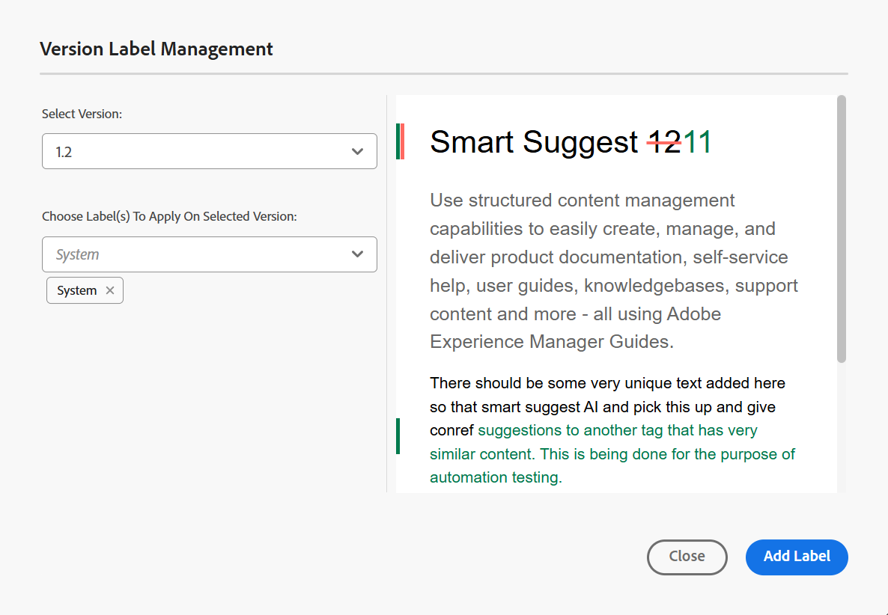
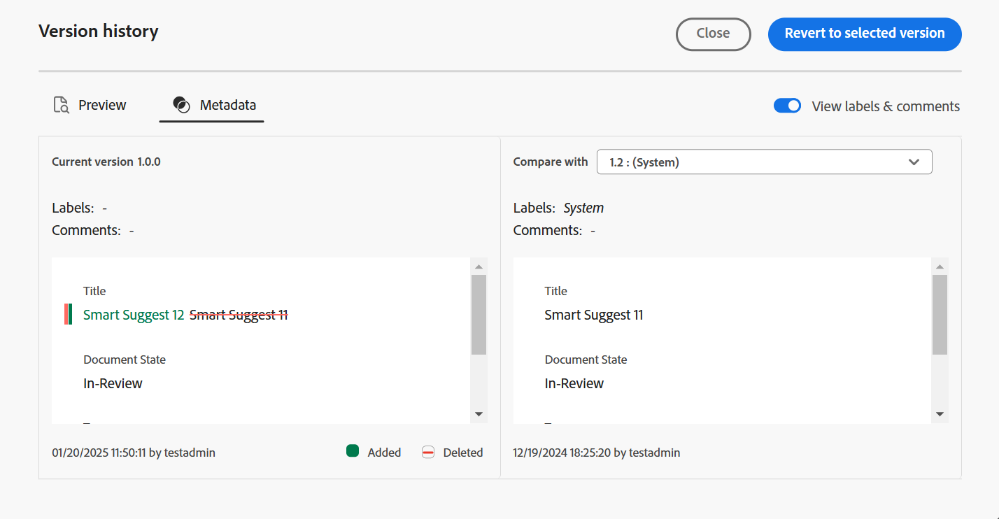

# Labels gebruiken {#id164JBG0M0T1}

Met Adobe Experience Manager Guides kunt u labels toevoegen aan verschillende versies van een bestand. U kunt deze labels gebruiken om de versie op te geven die u wilt opnemen in een basislijn voor publicatie. Voor meer informatie over het gebruiken van etiketten om een basislijn tot stand te brengen, mening [&#x200B; Werk met Basislijn &#x200B;](generate-output-use-baseline-for-publishing.md#).

Bijvoorbeeld, als u *versie 1.0* van een onderwerp in *versie 1.0* en *versie 1.1* van het zelfde onderwerp in *versie 2.0* wilt gebruiken, kunt u *versie 1.0* etiket op *versie 1.0* en *versie 2.0 toevoegen. 13&rbrace; etiket op* versie 1.1 *.*

Nadat u de labels hebt toegevoegd, kunt u een basislijn maken en opgeven welke versie van het onderwerp moet worden opgenomen voor publicatie met die basislijn. Als u wilt zien welke versie in een basislijn moet worden opgenomen of uitgesloten, gebruikt u de optie Versiehistorie.

## Een label toevoegen vanuit de Editor

Voer de volgende stappen uit om een etiket aan uw onderwerp van de Redacteur toe te voegen:

1. Navigeer in het deelvenster Opslagplaats naar een onderwerp en open het in de Editor.
1. Selecteer **etiket van de Versie** van **&#x200B;**&#x200B;dropdown van het Menu.

   {width="400" align="left"}

   Het **dialoog van het Beheer van het Etiket van de Versie 0&rbrace; wordt getoond.**

1. In de **dialoog van het Beheer van het Etiket van de Versie**, selecteer een versie waar u een etiket wilt toevoegen.
1. Selecteer een etiket voor de geselecteerde versie en selecteer **toevoegen Etiket**.

   {width="650" align="left"}

   >[!NOTE]
   >
   > U kunt niet het zelfde etiket aan de verschillende versies van een onderwerp toevoegen. Nochtans, kunt u veelvoudige etiketten aan de zelfde versie van een onderwerp toevoegen.
1. Bevestig dat u de labels in de bevestigingsprompt wilt toepassen.

   De etiketten worden getoond in de Geschiedenis van de Versie van het geselecteerde onderwerp.

   {width="650" align="left"}

   >[!NOTE]
   >
   > Gebruikend een basislijn, kunt u een etiket aan veelvoudige onderwerpen toevoegen. Voor meer informatie over het toevoegen van etiketten die basislijn gebruiken, voegt de mening [&#x200B; etiketten aan een Basislijn &#x200B;](generate-output-use-baseline-for-publishing.md#id184KD0T305Z) toe.

Om een versielabel van een onderwerp te schrappen, gebruik **verwijdert** pictogram dat tegen elk etiket wordt verstrekt dat in de dialoog van het Beheer van het Etiket van de Versie wordt toegevoegd.

{align="left"}

## Werken met labels uit de gebruikersinterface van Assets

U kunt labels ook toevoegen aan een onderwerp en ze indien nodig verwijderen uit de gebruikersinterface van Assets.

Voer de volgende stappen uit om een etiket aan uw onderwerp van Assets UI toe te voegen:

1. In Assets UI, selecteer een onderwerp, en open het.
1. Selecteer het linkerspoorselecteurspictogram en selecteer **Geschiedenis van de Versie**.
1. Selecteer in het vervolgkeuzemenu Versiegeschiedenis een versie waaraan u een label wilt toevoegen.
1. Voer een label in voor de geselecteerde versie en druk op Enter. Bijvoorbeeld, *2.6 Versie*.

   >[!NOTE]
   >
   > U kunt niet het zelfde etiket aan de verschillende versies van een onderwerp toevoegen. Nochtans, kunt u veelvoudige etiketten aan de zelfde versie van een onderwerp toevoegen.

   De etiketten worden getoond in de Geschiedenis van de Versie van het geselecteerde onderwerp. De volgende schermafbeelding toont de etiketten *x.x Versie* en *Gids van de Gebruiker* toegevoegd aan de benadrukte versie van het onderwerp.

   {width="300" align="left"}

>[!NOTE]
>
> Gebruikend een basislijn, kunt u een etiket aan veelvoudige onderwerpen toevoegen. Voor meer informatie over het toevoegen van etiketten die basislijn gebruiken, voegt de mening [&#x200B; etiketten aan een Basislijn &#x200B;](generate-output-use-baseline-for-publishing.md#id184KD0T305Z) toe.

Om een versielabel van een onderwerp te schrappen, gebruik **schrapping** knoop die tegen elk etiket in het paneel van de Geschiedenis van de Versie wordt verstrekt.

{width="300" align="left"}

**Bovenliggend onderwerp:**&#x200B;[&#x200B; Inleiding aan Redacteur &#x200B;](web-editor.md)
