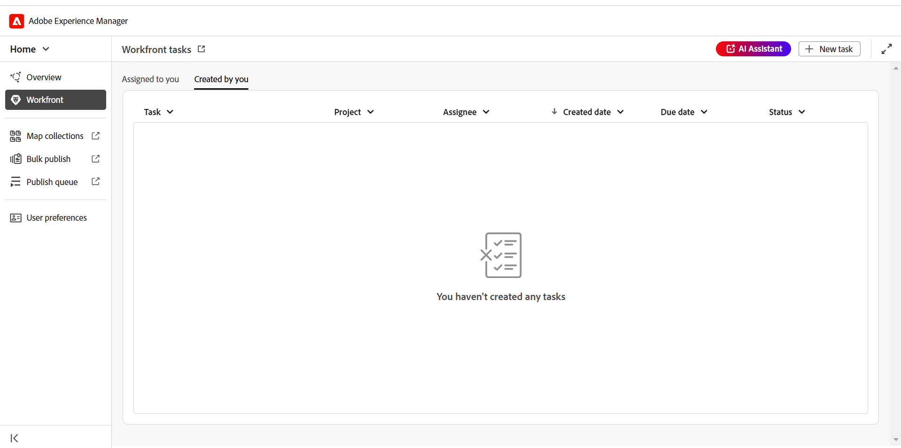
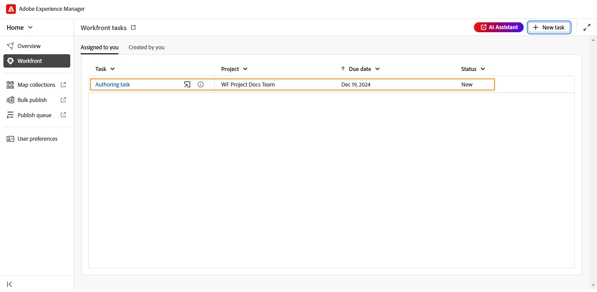

# Workfront-integratie

Adobe Workfront is een op de cloud gebaseerde oplossing voor werkbeheer die teams en organisaties helpt hun werk efficiënt te plannen, te volgen en te beheren. Dankzij de integratie tussen Experience Manager Guides en Adobe Workfront hebt u toegang tot robuuste functies voor projectbeheer, bovenop de Experience Manager Guides Core CCMS-mogelijkheden, zodat u taken efficiënt kunt plannen, toewijzen en volgen.

Met deze integratie kunt u rechtstreeks vanuit Experience Manager Guides Adobe Workfront-taken maken en beheren. Als auteur kunt u bijvoorbeeld rechtstreeks in de Experience Manager Guides-interface een revisietaak maken (met een of meer toegevoegde DITA-onderwerpen of -kaarten) en deze toewijzen aan een revisor. Als controleur kunt u werken aan toegewezen taken in de gebruikersinterface van Experience Manager Guides Review en deze terugsturen naar de auteur met opmerkingen. Op dezelfde manier kunt u een publicatie- en vertaaltaak maken en deze vervolgens toewijzen aan de gebruikers die eraan moeten werken.

De integratie biedt u ook de mogelijkheid om uw werkrijen te controleren, zodat u geordend blijft en bovenop al uw taken (toegewezen taken).

**Zeer belangrijke eigenschappen**

Met de integratie van Experience Manager Guides en Adobe Workfront kunt u:

* Plan, wijs, en spoor de vooruitgang van individuele taken en projecten zonder het steunen van veelvoudige, niet geïntegreerde hulpmiddelen toe.
* U kunt alle Experience Manager Guides-workflows efficiënter beheren, waaronder het ontwerpen, reviseren, publiceren en vertalen van inhoud.
* Ontvang e-mailmeldingen van Adobe Workfront wanneer nieuwe taken worden toegewezen. Voor meer details, overzicht van de menings[ Berichten ](https://experienceleague.adobe.com/nl/docs/workfront/using/basics/use-notifications/wf-notifications).
* De gezondheid van het project controleren met het intuïtieve dashboard van Adobe Workfront, dat inzicht in projectprestaties in real time biedt.

  Om over Adobe Workfront te leren robuuste die projectbeheermogelijkheden voor projectmanagers in Experience Manager Guides worden toegelaten, mening [ Plan een projectoverzicht ](https://experienceleague.adobe.com/nl/docs/workfront/using/manage-work/projects/plan-a-project/plan-project).

## Aan de slag

Zodra gevormd en toegelaten door uw beheerder, kunnen de taken van Adobe Workfront van de [ homepage van Experience Manager Guides ](./intro-home-page.md) worden betreden.

Voer de volgende stappen uit om toegang te krijgen tot uw Adobe Workfront-taken:

1. Logboek in Experience Manager Guides en open de **pagina van het Huis**.
2. In het linkerpaneel, uitgezochte **Workfront**.

   De **de taken van Workfront** pagina wordt getoond.

   {align="left"}
3. Selecteer **Teken binnen**.

   U wordt omgeleid naar de Adobe Workfront-aanmeldpagina.
4. Teken binnen gebruikend het zelfde e-mailadres zoals gebruikt in Experience Manager Guides, en selecteer dan **toegang** verlenen om de toepassing toegang tot uw rekening van Adobe Workfront te laten.

   U wordt automatisch opnieuw gericht aan de **de taken van Workfront** pagina op Experience Manager Guides.

   {align="left"}

## Functies beschikbaar op de pagina Workfront-taken

De volgende functies zijn beschikbaar op de pagina Workfront-taken:

* [ Nieuwe taak ](#create-workfront-tasks): Staat u toe om de taken van Adobe Workfront recht van de interface van Experience Manager Guides tot stand te brengen.
* [ toegewezen aan u ](#managing-tasks-assigned-to-you): Maakt een lijst van alle taken die aan u en nog actief worden toegewezen.
* [ die door u ](#managing-tasks-created-by-you) wordt gecreeerd: Maakt een lijst van alle taken die u hebt gecreeerd en nog actief bent.

Op de pagina Workfront-taken staat ook een pictogram voor het uitlijnen van koppelingen  . Als dit pictogram is geselecteerd, gaat u naar de Adobe Workfront-projectpagina. Hier kunt u taakdetails weergeven, opmerkingen bekijken, opmerkingen toevoegen en andere functies gebruiken op basis van de machtigingen die aan uw Adobe Workfront-account zijn toegewezen.

Voor meer details, mening [ Overzicht van het Project, de Taak, en de data van de Uitgave in Workfront ](https://experienceleague.adobe.com/nl/docs/workfront/using/basics/navigate/definitions-pti-dates).

### Workfront-taken maken

U kunt de taken van Adobe Workfront van de interface van Experience Manager Guides direct tot stand brengen gebruikend de **Nieuwe taak** knoop aanwezig op de de taakpagina van Workfront.

Voer de volgende stappen uit om een nieuwe Adobe Workfront-taak te maken:

1. Voor de de takenpagina van Workfront, uitgezochte **Nieuwe taak**.

   **creeer taak** dialoogdoos wordt getoond.

   {align="left"}
2. In het **Algemene** lusje, ga de volgende taakdetails in:

   * **Type van Taak**: Selecteer het taaktype dat u wilt tot stand brengen. De beschikbare opties zijn: **Authoring**, **het herzien**, **het Publiceren**, en **Vertaling**.
   * **Project**: Selecteer het project waarin u de taak wilt tot stand brengen.
   * **naam van de Taak**: Ga een beschrijvende naam voor de taak in.
   * **Beschrijving**: Ga een korte beschrijving van de taak in.
   * **Verwacht op**: Plaats de vervaldatum voor taakvoltooiing.
   * **Ontvanger**: Selecteer een ontvanger voor de taak.
3. In het **Assets** lusje, uitgezocht **voeg** toe om activa aan deze taak toe te voegen.

   {align="left"}

   Het **Uitgezochte weg** dialoog wordt getoond. Selecteer een pad naar het gewenste element. U kunt meerdere elementen toevoegen door de geldige paden te selecteren in de padbrowser. De geselecteerde paden blijven behouden, zodat u ze gemakkelijk kunt bekijken of wijzigen wanneer u het dialoogvenster opnieuw opent.

   * Voor creatie, het publiceren, en vertaaltaken, wordt u ertoe aangezet om de plaats van het vereiste dossier in het **Uitgezochte weg** dialoogvakje te selecteren. Het geselecteerde dossier (een onderwerp voor creatie en kaart voor het publiceren en vertaling) wordt toegevoegd aan de taak zodra **creeert** knoop wordt geselecteerd.

     {align="left"}

   * Voor overzichtstaken, wordt u eerst ertoe aangezet om het type van Activa (Kaart of Onderwerpen) te selecteren, en dan worden de geselecteerde dossiers getoond als volgt:

     {align="left"}

     *Toevoegend onderwerpen aan een overzichtstaak*

     {align="left"}

     *Toevoegend kaarten aan een overzichtstaak*

     U kunt de volgende acties gebruiken om uw selectie te wijzigen voordat u deze ter controle verzendt:

      * Hef de selectie van bepaalde onderwerpen in de lijst op.
      * Filter de onderwerpenlijst op documentstaat wordt gebaseerd die.
      * Bewerk of plaats de versie van geselecteerde onderwerpen aan **Laatste versie**, **Versie op basis van data**, en **Basislijn** (slechts beschikbaar voor kaarten) zoals per de behoefte.

     Voor meer details, verzendt de mening [ onderwerpen voor overzicht ](./review-send-topics-for-review.md).

   >[!NOTE]
   >
   > Het toevoegen van activa aan een taak verleent de toewijzen snelle toegang tot een onderwerp, kaart of een ander dossier zij moeten werken aan. Voor ontwerp-, publicatie- en vertaaltaken is het toevoegen van een element optioneel, maar kan het handig zijn om workflows te stroomlijnen. Voor revisietaken is het echter verplicht een element toe te voegen.

4. Selecteer **creeer**.

Een nieuwe taak wordt gecreeerd en onder **vermeld die door u** tabel wordt gecreeerd.

>[!NOTE]
>
> Als projectmanager kunt u deze nieuwe taak in uw Adobe Workfront dashboard samen met andere belangrijke taakdetails bekijken. Voor meer details, begrijpen de mening [ dashboards ](https://experienceleague.adobe.com/nl/docs/workfront/using/reporting/dashboards/understand-dashboards/understand-dashboards).

### Taken beheren die door u zijn gemaakt

Alle taken die u hebt gecreeerd en nog actief bent worden getoond in **die door u** wordt gecreeerd tabel op de de takenpagina van Workfront, die u zeer belangrijke taakdetails zoals projectnaam, toewijsstukken, de datum van de taakverwezenlijking, de datum van de taakvoltooiing, en taakstatus geven.

{align="left"}

De volgende opties zijn beschikbaar wanneer u de muisaanwijzer op een taak plaatst die zich op het tabblad Gemaakt door u bevindt:

**Open** - 

Hiermee kunt u de taak openen. Afhankelijk van het type van de taak, zal het in de Redacteur, de console van de Kaart, of het Overzicht UI openen.

**geef** uit - 

Hiermee kunt u taakdetails bewerken die tijdens het maken van de taak zijn toegevoegd. Alle velden zijn bewerkbaar, behalve Taaktype en Project. U kunt alleen taken bewerken die door u zijn gemaakt. Toegewezen taken kunnen niet worden bewerkt.

Ook kunt u elementen toevoegen of verwijderen wanneer u een ontwerp-, publicatie- of vertaaltaak bewerkt. Voor een revisietaak kunt u echter alleen de versie wijzigen van de elementen die ter controle zijn verzonden.

**de details van de Taak** - 

Toont de taakinformatie, met inbegrip van details ingegaan tijdens taakverwezenlijking, taakstatus, en om het even welke toegevoegde activa.

### Taken beheren die aan u zijn toegewezen

Alle taken die aan u worden toegewezen en nog actief worden getoond in **Toegewezen aan u** lusje op de de takenpagina van Workfront, die u zeer belangrijke taakdetails zoals projectnaam, wijzers, datum, en taakstatus geven.

{align="left"}

De volgende opties zijn beschikbaar wanneer u de muisaanwijzer op een taak plaatst die op het tabblad Toegewezen staat:

**Open** - 

Hiermee kunt u de taak openen. Afhankelijk van het type van de taak, zal het in de Redacteur, de console van de Kaart, of het Overzicht UI openen.

**de details van de Taak** - 

Toont de taakinformatie, met inbegrip van details ingegaan tijdens taakverwezenlijking, taakstatus, en om het even welke toegevoegde activa.

{align="left"}

#### Toegang tot toegewezen taken van de sectie van het Overzicht

U kunt tot uw toegewezen taken van Adobe Workfront van de [ sectie van het Overzicht ](./intro-home-page.md#overview) ook toegang hebben. De sectie Overzicht bevat, indien geselecteerd, verschillende widgets die u helpen gefocust en geordend te blijven.

**Uw taken** is één dergelijke widget waar een lijst van de taken van Adobe Workfront (die aan u worden toegewezen en nog actief zijn) samen met de belangrijkste taakdetails met inbegrip van naam van de taak, het bijbehorende project, de datum, en de huidige status wordt getoond.

{align="left"}

Gelijkaardig aan het Toegewezen aan u lusje, verstrekt Uw taken widget ook opties aan **Open** en mening **de details van de Taak** wanneer u over een taak beweegt.

De widget biedt u ook opties voor het sorteren en vergroten of verkleinen van kolommen voor een aangepaste weergave. Als u het sorteren op een kolom wilt toepassen, selecteert u de kolomkop en worden de opties in een lijst weergegeven. Als u de breedte van een kolom wilt aanpassen, plaatst u de aanwijzer boven de scheidingslijn van de kolom in de koptekst en sleept u om de breedte te wijzigen.

>[!NOTE]
>
> Wanneer u niet in uw Experience Manager Guides-interface bent, ontvangt u een e-mailbericht van Adobe Workfront voor een nieuwe taak die u hebt toegewezen. U kunt deze taken uitchecken door u aan te melden bij uw Experience Manager Guides-exemplaar en de toegewezen taken te openen.

## Werken met toegewezen taken van Adobe Workfront

Er zijn vier typen Adobe Workfront-taken die u kunt maken en toewijzen of die u vervolgens kunt uitvoeren wanneer u deze toewijst aan Experience Manager Guides:

1. [Ontwerptaken](#authoring-tasks)
2. [Taken controleren](#review-tasks)
3. [Vertaaltaken](#translation-tasks)
4. [Publicatietaken](#publishing-tasks)

In de volgende secties vindt u een gedetailleerd proces voor het werken aan toegewezen Adobe Workfront-taken.

### Ontwerptaken

Voer de volgende stappen uit om aan een ontwerptaak te werken:

1. Heb toegang tot de taak of van de [ sectie van het Overzicht ](#accessing-assigned-tasks-from-overview-section) of [ toevertrouwd aan u ](#managing-tasks-assigned-to-you) tabel.

   {align="left"}

   *Authoring taak in Toegewezen aan u lusje*

   {align="left"}

   *Authoring taak in Uw taken widget*
2. Houd de muisaanwijzer boven de taak die u wilt uitvoeren en selecteer    om het te openen. U kunt de taak ook openen door gewoon de taak te selecteren.

   Alle ontwerptaken worden geopend in de Editor.
3. Herzie de taakdetails in het **lusje van Details** en selecteer het **3&rbrace; dossier van Activa &lbrace;om het te openen.**

   {align="left"}

4. Maak vereiste uitgeeft en selecteer **Teken zoals gedaan**.
5. Schakelaar aan het **lusje van Commentaren** om een commentaar aan deze taak toe te voegen. Deze commentaren, die op taakniveau worden toegevoegd, zullen ook op het het projectdashboard van Adobe Workfront nadenken.

   >[!NOTE]
   >
   > Zodra de taak zoals gedaan duidelijk is, zal het uit zowel uw toegewezen takenlijst als de taakinitiatiefnemer **worden verwijderd die door u** takenlijst wordt gecreeerd.

### Taken controleren

Als controleur kunt u de Adobe Workfront-controletaken controleren die aan u zijn toegewezen.

Voer de volgende stappen uit om aan een overzichtstaak te werken die aan u wordt toegewezen.

1. Heb toegang tot de taak of van de [ sectie van het Overzicht ](#accessing-assigned-tasks-from-overview-section) of [ toevertrouwd aan u ](#managing-tasks-assigned-to-you) tabel.

   {align="left"}

   *taak van het Overzicht in Toegewezen aan u lusje*

   {align="left"}

   *Authoring taak in Uw taken widget*
2. Houd de muisaanwijzer boven de taak die u wilt uitvoeren en selecteer    om het te openen. U kunt de taak ook openen door gewoon de taak te selecteren.

   Voor recensenten, opent de overzichtstaak in **Overzicht UI**.

   {align="left"}

3. Voer de vereiste revisie uit. Voor details op hoe te om een onderwerp te herzien, bekijk [ overzichtsonderwerpen ](./review-topics.md).
4. Zodra de revisie volledig is, uitgezochte **Teken zoals gedaan**.
5. Schakelaar aan het **lusje van Commentaren** om een commentaar aan deze taak toe te voegen. Deze commentaren, die op taakniveau worden toegevoegd, zullen ook op het het projectdashboard van Adobe Workfront nadenken.

Het markeren van de taak zoals deze door de controleur is uitgevoerd, geeft niet aan dat de taak is voltooid. Alle revisietaken worden teruggestuurd naar de gebruiker die de taak heeft gemaakt (idealiter een auteur die om een revisie heeft gevraagd).

>[!NOTE]
>
> Als de taak is toegewezen aan meerdere revisoren, wordt deze pas opnieuw toegewezen aan de maker van de taak nadat alle revisoren de taak hebben gemarkeerd.

De taken van het overzicht worden opnieuw toegewezen aan de schepper/de auteurs voor overzicht opname, kunnen van [ Overzicht ](#accessing-assigned-tasks-from-overview-section) sectie of van [ worden betreden die aan u ](#managing-tasks-assigned-to-you) tabel wordt toegewezen.

{align="left"}

*taak van het Overzicht die terug aan auteurs* wordt toegewezen

Voor dergelijke taken, verandert de taakstaat voor de ontvanger in **Authoring** terwijl het taaktype als **Overzicht** blijft. Deze statuswijziging treedt op wanneer de revisie wordt voltooid door alle revisoren.

{align="left"}

Het selecteren van de taak of het open pictogram  opent de taak in de Redacteur waar de auteur [ revisiecommentaren van het adres ](../user-guide/review-address-review-comments.md) kan, de taak uitgeven door de versie van de onderwerpen bij te werken, en dan de taak terug aan recensent toe te wijzen indien nodig.

De auteur kan de taak ook uitgeven en het toewijzen aan een andere auteur, die de taak delegeert om de commentaren op te nemen. Om dit te doen, uitgezocht **geef** uit, verander de staat van de Taak aan **Authoring**, en selecteer dan **Toegewezen Verandering**. U kunt nu een toegewezen persoon in de lijst selecteren.

Dit proces vormt een ononderbroken cyclus, waar de taak zich tussen de auteur en de recensent heen en weer beweegt tot het volledig wordt voltooid. Zodra alle voorgestelde veranderingen worden opgenomen, kan de auteur de taak voltooien door **Teken te selecteren zoals gedaan**.

### Vertaaltaken

U kunt verschillende vertaalacties uitvoeren op Adobe Workfront-vertaaltaken die aan u zijn toegewezen.

Voer de volgende stappen uit om aan een vertaaltaak te werken:

1. Heb toegang tot de taak of van de [ sectie van het Overzicht ](#accessing-assigned-tasks-from-overview-section) of [ toevertrouwd aan u ](#managing-tasks-assigned-to-you) tabel.

   {align="left"}

   *Vertaal taak in Toegewezen aan u lusje*

   {align="left"}

   *de taak van de Vertaling in Uw taken widget*

2. Houd de muisaanwijzer boven de taak die u wilt uitvoeren en selecteer    om het in de **console van de Kaart** te openen. U kunt de taak ook openen door gewoon de taak te selecteren.
3. Controleer de taakdetails en het bestand dat u voor vertaling hebt toegevoegd.

   {align="left"}
4. Navigeer aan het **Vertaling** lusje voor de diverse vertaalopties. Leer hoe te [ inhoud ](../user-guide/translation.md) in Experience Manager Guides vertalen.
5. Voer de vereiste vertaling uit en selecteer **verzend voor vertaling**.
   {align="left"}
6. Navigeer aan de **sectie van Workfront** en selecteer **Teken zoals gedaan** om erop te wijzen dat de taak volledig is.
7. Schakelaar aan het **lusje van Commentaren** om een commentaar aan deze taak toe te voegen. Deze commentaren, die op taakniveau worden toegevoegd, zullen op het het projectdashboard van Adobe Workfront nadenken.

   >[!NOTE]
   >
   > Zodra de taak zoals gedaan duidelijk is, zal het uit zowel uw toegewezen takenlijst als de taakinitiatiefnemer **worden verwijderd die door u** takenlijst wordt gecreeerd.

### Publicatietaken

Als uitgever kunt u details bekijken en een publicatietaak publiceren die aan u is toegewezen.

Voer de volgende stappen uit om aan een het publiceren taak te werken:

1. Heb toegang tot de taak of van de [ sectie van het Overzicht ](#accessing-assigned-tasks-from-overview-section) of [ toevertrouwd aan u ](#managing-tasks-assigned-to-you) tabel.

   {align="left"}

   *het Publiceren taak in Toegewezen aan u lusje*

   {align="left"}

   *het Publiceren taak in Uw taken widget*
2. Houd de muisaanwijzer boven de taak die u wilt uitvoeren en selecteer    om het in de **console van de Kaart** te openen. U kunt de taak ook openen door gewoon de taak te selecteren.
3. Controleer de taakdetails en het bestand dat is toegevoegd voor publicatie.

   {align="left"}
4. Navigeer aan **vooraf instelt van de Output** en voer de het publiceren acties uit die worden vereist om de taak te publiceren. Voor meer details, bekijk [ Begrijpend de output stelt ](../user-guide/generate-output-understand-presets.md/) vooraf in.
5. Zodra het publiceren volledig is, navigeer aan de **sectie van Workfront** en selecteer **Teken zoals gedaan** om erop te wijzen dat de taak volledig is.
6. Schakelaar aan het **lusje van Commentaren** om een commentaar aan deze taak toe te voegen. Deze commentaren, die op taakniveau worden toegevoegd, zullen op het Workfront project dashboard nadenken.

   >[!NOTE]
   >
   > Zodra de taak zoals gedaan duidelijk is, zal het uit zowel uw toegewezen takenlijst als de taakinitiatiefnemer **worden verwijderd die door u** takenlijst wordt gecreeerd.
